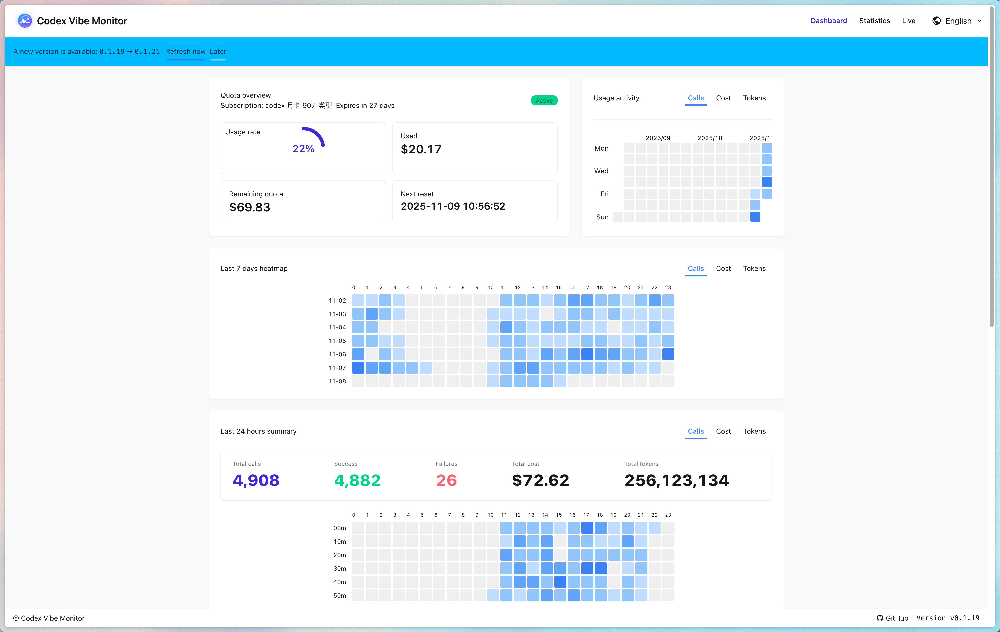

# Codex Vibe Monitor

[](https://github.com/IvanLi-CN/codex-vibe-monitor/actions/workflows/ci.yml)
[](https://github.com/IvanLi-CN/codex-vibe-monitor/tags)
[](https://github.com/IvanLi-CN/codex-vibe-monitor/pkgs/container/codex-vibe-monitor)


以 10 秒固定节奏抓取「Codex 调用记录/配额快照」，写入 SQLite，并通过 REST API 与 SSE 为前端仪表盘提供实时数据流；前端使用 Vite + React 渲染图表、表格与配额状态。

## 项目截图



## 特性

- 调度与并发：Tokio 定时器 + 信号量并发控制，60s 请求超时，智能选择连接复用或独立连接。
- 数据持久化：SQLx/SQLite，包含唯一性约束（`invoke_id` + `occurred_at`）。
- 多源统计：支持合并外部日统计源（无明细）与本地调用记录。
- 接口与事件：Axum 提供 REST API、SSE 推送；可选托管静态 SPA。
- 前端应用：DaisyUI/Tailwind 组件化 UI，实时图表与统计概览，SSE 自动更新。
- 容器镜像：多阶段 Dockerfile，产出轻量运行时；CI 自动推送 GHCR。

## 目录结构

```
├── Cargo.toml               # Rust 包与依赖
├── src/                     # 后端：调度/HTTP API/SSE/SQLite
├── web/                     # 前端：Vite + React + TypeScript
│   ├── src/                 # 组件、hooks 与 API 封装
│   └── vite.config.ts       # 60080 端口，代理 /api 与 /events
├── Dockerfile               # 多阶段构建（前后端）
└── .github/workflows/ci.yml # CI：Lint/Test/Build/Docker 推送
```

## 快速开始（本地开发）

1. 后端

```bash
cargo run
```

默认监听 `127.0.0.1:8080`。健康检查：`GET /health`。

优雅停机：按下 `Ctrl+C` 或发送 `SIGTERM` 将触发有序关闭 —— HTTP 服务器停止接受新连接，调度器停止新一轮轮询并等待在途任务完成后退出。

2. 前端（开发模式）

```bash
cd web
npm install
npm run dev -- --host 127.0.0.1 --port 60080
```

开发服务器默认代理到 `http://127.0.0.1:8080`，也可用 `VITE_BACKEND_PROXY` 覆盖。

### Codex（devctl + zellij）推荐启动方式

在 Codex 环境中，长驻开发服务建议使用 `devctl`（Zellij 后台 session），以便服务在 turn 边界后仍持续运行，并提供统一的 `status/logs/down` 管理入口。

一键方式（推荐）：

```bash
./scripts/start-backend.sh
./scripts/start-frontend.sh
./scripts/dev-status.sh

# stop
./scripts/stop-backend.sh
./scripts/stop-frontend.sh
```

日志默认落在：

- `.codex/logs/backend.log`
- `.codex/logs/frontend.log`

也可以使用 `devctl` 直接查看：

```bash
~/.codex/bin/devctl --root "$(pwd)" logs backend -n 200
~/.codex/bin/devctl --root "$(pwd)" logs frontend -n 200
```

## 配置

在仓库根目录创建 `.env.local`（已忽略提交），常用变量如下（括号内为默认值）：

```env
XY_BASE_URL=https://new.xychatai.com
OPENAI_UPSTREAM_BASE_URL=https://api.openai.com  # (可选，默认 https://api.openai.com/)
XY_VIBE_QUOTA_ENDPOINT=/frontend-api/vibe-code/quota
XY_SESSION_COOKIE_NAME=share-session
XY_SESSION_COOKIE_VALUE=<从浏览器开发者工具导出的 Cookie>
XY_DATABASE_PATH=codex_vibe_monitor.db         # (默认)
XY_POLL_INTERVAL_SECS=10                       # (10)
XY_REQUEST_TIMEOUT_SECS=60                     # (60)
OPENAI_PROXY_HANDSHAKE_TIMEOUT_SECS=300        # (300)
OPENAI_PROXY_MAX_REQUEST_BODY_BYTES=268435456  # (256MiB)
PROXY_RAW_MAX_BYTES=0                          # (0=unlimited, set >0 to cap)
PROXY_RAW_RETENTION_DAYS=7                     # (7)
PROXY_ENFORCE_STREAM_INCLUDE_USAGE=true        # (true)
PROXY_PRICING_CATALOG_PATH=config/model-pricing.json  # (config/model-pricing.json)
XY_LEGACY_POLL_ENABLED=false                   # (false，true 时启用 legacy 轮询写入)
XY_MAX_PARALLEL_POLLS=6                        # (6)
XY_SHARED_CONNECTION_PARALLELISM=2             # (2)
XY_HTTP_BIND=127.0.0.1:8080                    # (127.0.0.1:8080)
XY_LIST_LIMIT_MAX=200                          # (200)
XY_USER_AGENT=codex-vibe-monitor/0.2.0         # (自动)
XY_STATIC_DIR=web/dist                         # (存在时自动使用)
XY_SNAPSHOT_MIN_INTERVAL_SECS=300              # (300)

# CRS 日统计源（可选；未配置则禁用）
CRS_STATS_BASE_URL=https://claude-relay-service.nsngc.org
CRS_STATS_API_ID=<apiId>
CRS_STATS_PERIOD=daily                         # (daily)
CRS_STATS_POLL_INTERVAL_SECS=10                # (10，默认跟随 XY_POLL_INTERVAL_SECS)
```

`config/model-pricing.json` 默认提供模板（`models` 为空）。如需成本估算，请按实际模型补充每百万 token 单价。

上述大部分变量均可使用 CLI 覆盖，例如：

```bash
cargo run -- \
  --database-path /tmp/codex.db \
  --http-bind 127.0.0.1:38080 \
  --poll-interval-secs 5
```

## HTTP API 与 SSE

- 统计相关接口默认以代理采集记录（`source=proxy`）为主；启用 legacy 轮询（如 `XY_LEGACY_POLL_ENABLED=true`）后会合并旧来源增量。
- `GET /health`：健康检查，返回 `ok`。
- `GET /api/version`：返回 `{ backend, frontend }`。
- `GET /api/settings/proxy-models`：获取 `/v1/models` 劫持与上游合并开关状态。
- `PUT /api/settings/proxy-models`：更新 `/v1/models` 劫持与上游合并开关状态（全局持久化）。
- `GET /api/invocations?limit=&model=&status=`：最新记录列表（`limit` 上限由 `XY_LIST_LIMIT_MAX` 控制）。
- `GET /api/stats`：全量聚合统计。
- `GET /api/stats/summary?window=<all|current|1d|6h|30m>&limit=N`：窗口统计。
- `GET /api/stats/timeseries?range=1d&bucket=1h&settlement_hour=0`：时间序列（区间与桶宽支持 `m/h/d/mo`）。
- `GET /api/stats/perf`：代理链路阶段耗时统计（count/avg/P50/P90/P99/max）。
- `GET /api/quota/latest`：最近一次配额快照。
- `ANY /v1/*`：OpenAI 兼容反向代理（请求头/请求体/状态码/响应头/响应体透明透传，包含流式响应）；`GET /v1/models` 可按设置切换为预置列表或预置+上游实时合并。
- `GET /events`：SSE 推送，事件类型：
  - `{ type: "version", version }`
  - `{ type: "records", records: [...] }`
  - `{ type: "summary", window, summary }`
  - `{ type: "quota", snapshot }`

## Docker

部署到网关/反向代理（例如 Traefik）时，请先阅读部署与安全边界说明：[`docs/deployment.md`](docs/deployment.md)。

构建镜像：

```bash
docker build -t codex-vibe-monitor .
```

运行（持久化数据与注入认证信息）：

```bash
docker run --rm \
  -p 8080:8080 \
  -v $(pwd)/data:/srv/app/data \
  -e XY_BASE_URL=https://new.xychatai.com \
  -e XY_SESSION_COOKIE_NAME=share-session \
  -e XY_SESSION_COOKIE_VALUE=... \
  ghcr.io/ivanli-cn/codex-vibe-monitor:latest
```

容器内默认：`XY_DATABASE_PATH=/srv/app/data/codex_vibe_monitor.db`，`XY_HTTP_BIND=0.0.0.0:8080`，`XY_STATIC_DIR=/srv/app/web`。

## 验证与排查

- SQLite 检查：
  ```bash
  sqlite3 codex_vibe_monitor.db "SELECT invoke_id, occurred_at, status FROM codex_invocations ORDER BY occurred_at DESC LIMIT 5;"
  ```
- API 采样：
  ```bash
  curl "http://127.0.0.1:8080/api/invocations?limit=10"
  curl "http://127.0.0.1:8080/api/stats"
  curl "http://127.0.0.1:8080/api/quota/latest"
  ```
- SSE 观察：浏览器打开 `http://127.0.0.1:8080/events` 或使用 `curl`/`sse-cat`。

## CI / CD

- 工作流：
  - `.github/workflows/label-gate.yml`：PR 标签校验（发版意图 gate）。
  - `.github/workflows/ci.yml`：Lint/Test/Build；在 `main` 上按 PR 标签决定是否发版与发布产物。
- PR 发版意图（labels，必须且各 1 个）：
  - `type:patch` | `type:minor` | `type:major`：触发发版（semver bump）
  - `type:docs` | `type:skip`：不发版（不推镜像/不打 tag/不建 Release）
  - `channel:stable`：稳定版
  - `channel:rc`：预发行（prerelease）
- 版本与 tag 规则：
  - stable：`vX.Y.Z`（以“最大 stable tag”做基线按 type bump）
  - rc：`vX.Y.Z-rc.<sha7>`（不更新 `latest`）
- 镜像：推送至 GHCR `ghcr.io/ivanli-cn/codex-vibe-monitor`
  - stable：`${image}:vX.Y.Z` 与 `${image}:latest`
  - rc：`${image}:vX.Y.Z-rc.<sha7>`（仅该 tag）
  - 同步创建 GitHub Release（stable 为非 prerelease，rc 为 prerelease）

## 许可证

本项目使用 MIT 协议开源，详见 `LICENSE` 文件。

---

欢迎提 Issue/PR，一起把数据链路和可观测性打磨得更稳更顺！
