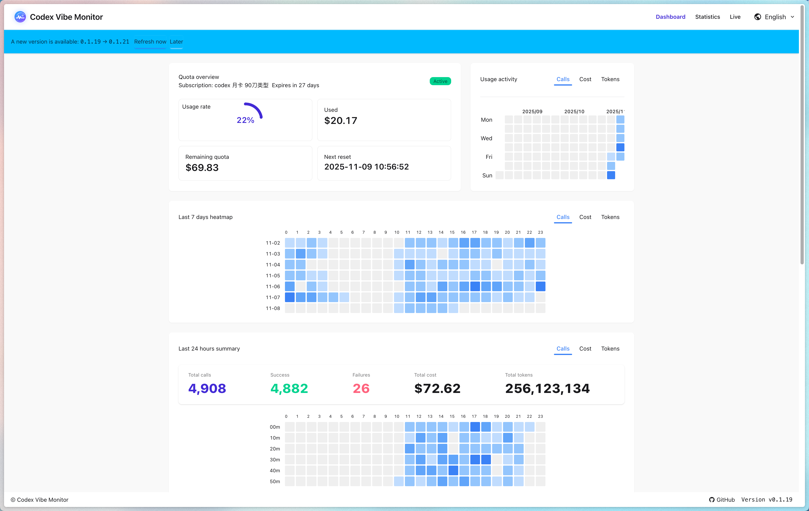

# Codex Vibe Monitor

[](https://github.com/IvanLi-CN/codex-vibe-monitor/actions/workflows/ci.yml)
[](https://github.com/IvanLi-CN/codex-vibe-monitor/tags)
[](https://github.com/IvanLi-CN/codex-vibe-monitor/pkgs/container/codex-vibe-monitor)


通过 OpenAI 兼容 `/v1/*` 代理捕获调用记录、可选轮询 CRS 日统计并写入 SQLite，再通过 REST API 与 SSE 为前端仪表盘提供实时/历史数据视图；历史 `xy` 记录与历史 quota snapshot 继续只读可查，但服务不再从 XYAI 上游抓取新数据。

## 项目截图



## 特性

- 调度与并发：Tokio 定时器驱动 CRS 日统计轮询，配合信号量并发控制、请求超时与连接复用策略。
- 数据持久化：SQLx/SQLite，包含唯一性约束（`invoke_id` + `occurred_at`）。
- 多源统计：支持合并外部日统计源（无明细）与本地调用记录。
- 接口与事件：Axum 提供 REST API、SSE 推送；可选托管静态 SPA。
- 前端应用：Tailwind + shadcn 风格组件化 UI，实时图表与统计概览，SSE 自动更新。
- 容器镜像：多阶段 Dockerfile，产出轻量运行时；CI 自动推送 GHCR。

## 目录结构

```
├── Cargo.toml               # Rust 包与依赖
├── src/                     # 后端：调度/HTTP API/SSE/SQLite
├── web/                     # 前端：Vite + React + TypeScript
│   ├── src/                 # 组件、hooks 与 API 封装
│   └── vite.config.ts       # 60080 端口，代理 /api 与 /events
├── Dockerfile               # 多阶段构建（前后端）
└── .github/workflows/ci.yml # CI：Lint/Test/Build/Docker 推送
```

## 快速开始（本地开发）

1. 后端

```bash
cargo run
```

默认监听 `127.0.0.1:8080`。`GET /health` 现在表示 readiness：核心初始化完成并开始监听后返回 `200 ok`，否则返回 `503 starting`。历史补数会在启动后后台有界执行，不再阻塞 readiness。

优雅停机：按下 `Ctrl+C` 或发送 `SIGTERM` 将触发有序关闭 —— HTTP 服务器停止接受新连接，调度器停止新一轮轮询并等待在途任务完成后退出。

2. 前端（开发模式）

```bash
cd web
npm install
npm run dev -- --host 127.0.0.1 --port 60080
```

开发服务器默认代理到 `http://127.0.0.1:8080`，也可用 `VITE_BACKEND_PROXY` 覆盖。

## 配置

在仓库根目录创建 `.env.local`（已忽略提交），常用变量如下（括号内为默认值）：

```env
OPENAI_UPSTREAM_BASE_URL=https://api.openai.com  # (可选，默认 https://api.openai.com/)
DATABASE_PATH=codex_vibe_monitor.db            # (默认)
XY_POLL_INTERVAL_SECS=10                       # (10；用于 CRS scheduler 基础节奏)
XY_REQUEST_TIMEOUT_SECS=60                     # (60)
OPENAI_PROXY_HANDSHAKE_TIMEOUT_SECS=300        # (300)
OPENAI_PROXY_REQUEST_READ_TIMEOUT_SECS=180     # (180，请求体读取总超时)
OPENAI_PROXY_MAX_REQUEST_BODY_BYTES=268435456  # (256MiB)
PROXY_RAW_DIR=proxy_raw_payloads                # (相对路径时锚定到 DATABASE_PATH 同级目录)
PROXY_RAW_MAX_BYTES=0                          # (0=unlimited, set >0 to cap)
PROXY_RAW_RETENTION_DAYS=7                     # (7)
PROXY_ENFORCE_STREAM_INCLUDE_USAGE=true        # (true)
PROXY_USAGE_BACKFILL_ON_STARTUP=true           # (兼容保留；当前历史补数改为后台有界执行，不再阻塞 /health)
FORWARD_PROXY_ALGO=v2                          # (v2，正向代理权重算法开关: v1|v2)
XY_MAX_PARALLEL_POLLS=6                        # (6)
XY_SHARED_CONNECTION_PARALLELISM=2             # (2)
XY_HTTP_BIND=127.0.0.1:8080                    # (127.0.0.1:8080)
XY_CORS_ALLOWED_ORIGINS=                        # (可选，逗号分隔，允许跨域 Origin 白名单)
XY_LIST_LIMIT_MAX=200                          # (200)
XY_USER_AGENT=codex-vibe-monitor/0.2.0         # (自动)
XY_STATIC_DIR=web/dist                         # (存在时自动使用)
XY_RETENTION_ENABLED=false                     # (false，需要显式开启后台保留任务)
XY_RETENTION_DRY_RUN=false                     # (false)
XY_RETENTION_INTERVAL_SECS=3600                # (3600)
XY_RETENTION_BATCH_ROWS=1000                   # (1000)
XY_ARCHIVE_DIR=archives                        # (archives，相对 DATABASE_PATH 同级目录解析)
XY_INVOCATION_SUCCESS_FULL_DAYS=30             # (30，上海自然日)
XY_INVOCATION_MAX_DAYS=90                      # (90，超窗后归档并清理主库)
XY_FORWARD_PROXY_ATTEMPTS_RETENTION_DAYS=30    # (30，上海自然日)
XY_STATS_SOURCE_SNAPSHOTS_RETENTION_DAYS=30    # (30，上海自然日)
XY_QUOTA_SNAPSHOT_FULL_DAYS=30                 # (30，上海自然日)
# 注意：XY_FORWARD_PROXY_ALGO 已移除，配置将直接失败，请改用 FORWARD_PROXY_ALGO

# CRS 日统计源（可选；未配置则禁用）
CRS_STATS_BASE_URL=https://claude-relay-service.nsngc.org
CRS_STATS_API_ID=<apiId>
CRS_STATS_PERIOD=daily                         # (daily)
CRS_STATS_POLL_INTERVAL_SECS=10                # (10，默认跟随 XY_POLL_INTERVAL_SECS)
```

价格配置已迁移到数据库持久化（可在 Web 设置页 `/settings` 在线编辑）；服务启动会自动写入默认模型价格模板。
成本估算默认采用“精确模型优先 + 日期后缀模型回退”（如 `gpt-5.2-2025-12-11 -> gpt-5.2`），历史 `cost IS NULL` 的成功代理记录会在启动后由后台任务按批次增量补算（仅回填空成本，不覆盖已有值）。

服务不再读取 XYAI 上游 cookie / base URL / quota endpoint；`/api/quota/latest` 仅返回数据库中已有的历史快照。

`XY_DATABASE_PATH` 已移除；若环境中仍保留该变量，服务会在启动时直接报错并提示迁移到 `DATABASE_PATH`。

上述大部分变量均可使用 CLI 覆盖，例如：

```bash
cargo run -- \
  --database-path /tmp/codex.db \
  --http-bind 127.0.0.1:38080 \
  --poll-interval-secs 5
```

## 数据分层保留与离线归档

- `codex_invocations` 的成功记录超过 30 个上海自然日后，会先把完整行写入对应月份的离线 archive，再把主库内的原始 payload / raw response / raw file 引用精简为 `structured_only`，但保留结构化统计字段用于在线排障。
- 任意调用记录超过 90 个上海自然日后，会先归档到 `XY_ARCHIVE_DIR/<table>/<yyyy>/<table>-<yyyy-mm>.sqlite.gz`；若 `XY_ARCHIVE_DIR` 使用相对路径，则实际位置位于 `<DATABASE_PATH 同级目录>/<XY_ARCHIVE_DIR 的值>/...`，写入 `archive_batches` 清单后，再从主库删除。
- `forward_proxy_attempts` 与 `stats_source_snapshots` 只保留最近 30 个上海自然日在线明细；更老数据同样执行“先归档、再清理”。
- `codex_quota_snapshots` 保留最近 30 天全量，更老日期在主库内压缩为“每个上海自然日最后一条”，被折叠掉的行进入离线归档。
- `stats_source_deltas` 长期在线保留；`/api/stats` 与 `GET /api/stats/summary?window=all` 通过“在线明细 + invocation_rollup_daily”保证长期 totals 不缩水。
- 原始 payload / preview / raw file 只保证短期排障；长期依赖离线 archive 中的 SQLite 归档行，超窗 raw file 本体不保证继续可用，现有 Web UI 不提供 archived 明细在线浏览；orphan sweep 只清理超过宽限期的未引用文件。

首次清理建议先做 dry-run：

```bash
cargo run -- --retention-run-once --retention-dry-run
```

确认数量与 archive 路径后，再在维护窗口执行真实清理：

```bash
cargo run -- --retention-run-once
```

## HTTP API 与 SSE

- 统计相关接口默认合并数据库中已有的历史 `xy`、当前 `proxy`，以及启用时的 `crs` 来源。
- `GET /health`：readiness 检查；核心初始化完成并开始监听后返回 `200 ok`，否则返回 `503 starting`。
- `GET /api/version`：返回 `{ backend, frontend }`。
- `GET /api/settings`：获取统一设置（`proxy + pricing`）。
- `PUT /api/settings/proxy`：更新 `/v1/models` 劫持与上游合并开关状态（全局持久化）。
- `PUT /api/settings/pricing`：更新价格目录（全量覆盖、全局持久化、实时生效于新请求成本估算）。
- `GET /api/invocations?limit=&model=&status=`：最新记录列表（`limit` 上限由 `XY_LIST_LIMIT_MAX` 控制）；每条记录额外返回 `detailLevel`、`detailPrunedAt`、`detailPruneReason`，用于标记在线明细是否仍完整。
- `GET /api/stats`：全量聚合统计；长期 totals 会合并在线明细与 `invocation_rollup_daily`。
- `GET /api/stats/summary?window=<all|current|1d|6h|30m>&limit=N`：窗口统计；`window=all` 会承接归档前回填的日汇总。
- `GET /api/stats/timeseries?range=1d&bucket=1h&settlement_hour=0`：时间序列（区间与桶宽支持 `m/h/d/mo`）。
- `GET /api/stats/perf`：代理链路阶段耗时统计（count/avg/P50/P90/P99/max）。
- `GET /api/quota/latest`：数据库中最近一次历史配额快照（服务不会再主动抓取新的 XYAI quota）。
- `ANY /v1/*`：OpenAI 兼容反向代理（请求头/请求体/状态码/响应头/响应体透明透传，包含流式响应）；`GET /v1/models` 可按设置切换为预置列表或预置+上游实时合并。
- `GET /events`：SSE 推送，事件类型：
  - `{ type: "version", version }`
  - `{ type: "records", records: [...] }`
  - `{ type: "summary", window, summary }`
  - `{ type: "quota", snapshot }`

## Docker

部署到网关/反向代理（例如 Traefik）时，请先阅读部署与安全边界说明：[`docs/deployment.md`](docs/deployment.md)。

构建镜像：

```bash
docker build -t codex-vibe-monitor .
```

运行（持久化数据；如需 CRS 或代理相关覆盖，可额外注入对应 env）：

```bash
docker run --rm \
  -p 8080:8080 \
  -v $(pwd)/data:/srv/app/data \
  ghcr.io/ivanli-cn/codex-vibe-monitor:latest
```

容器内默认：`DATABASE_PATH=/srv/app/data/codex_vibe_monitor.db`，`XY_HTTP_BIND=0.0.0.0:8080`，`XY_STATIC_DIR=/srv/app/web`，`PROXY_RAW_DIR=proxy_raw_payloads`（解析到 `/srv/app/data/proxy_raw_payloads`）。运行镜像已内置 `curl` 与镜像级 `HEALTHCHECK`，会探测 `http://127.0.0.1:8080/health`。

推荐在 Compose 中显式覆盖 healthcheck 参数，确保启动窗口内也能正确等待 readiness：

```yaml
services:
  ai-codex-vibe-monitor:
    image: ghcr.io/ivanli-cn/codex-vibe-monitor:latest
    healthcheck:
      test: ["CMD", "curl", "-fsS", "http://127.0.0.1:8080/health"]
      interval: 15s
      timeout: 5s
      retries: 6
      start_period: 60s
      start_interval: 5s
```

Traefik 部署默认依赖 Docker health 结果决定是否把流量送到容器；如果现场 Docker provider 显式开启了 `allowEmptyServices=true`，还需要额外配置 Traefik service-level active healthcheck，对 `/health` 做兜底探测。更完整的网关示例见 [`docs/deployment.md`](docs/deployment.md)。

GHCR 发布镜像默认提供多架构 manifest（`linux/amd64` + `linux/arm64`），`stable` 会同步更新 `${image}:latest`。

## 验证与排查

- SQLite 检查：
  ```bash
  sqlite3 codex_vibe_monitor.db "SELECT invoke_id, occurred_at, status FROM codex_invocations ORDER BY occurred_at DESC LIMIT 5;"
  ```
- API 采样：
  ```bash
  curl "http://127.0.0.1:8080/api/invocations?limit=10"
  curl "http://127.0.0.1:8080/api/stats"
  curl "http://127.0.0.1:8080/api/quota/latest"
  ```
- SSE 观察：浏览器打开 `http://127.0.0.1:8080/events` 或使用 `curl`/`sse-cat`。
- 代理失败分型（近 30 分钟）：
  ```bash
  sqlite3 codex_vibe_monitor.db \
    "SELECT json_extract(payload, '$.failureKind') AS kind, COUNT(*) \
     FROM codex_invocations \
     WHERE source='proxy' AND occurred_at >= datetime('now','-30 minutes','localtime') \
     GROUP BY kind ORDER BY COUNT(*) DESC;"
  ```
  常见 kind：`request_body_read_timeout`、`request_body_stream_error_client_closed`、`failed_contact_upstream`、`upstream_handshake_timeout`、`upstream_stream_error`。

## CI / CD

- 工作流：
  - `.github/workflows/label-gate.yml`：PR 标签校验（发版意图 gate）。
  - `.github/workflows/ci.yml`：Lint/Test/Build；在 `main` 上按 PR 标签决定是否发版与发布产物。
- PR 发版意图（labels，必须且各 1 个）：
  - `type:patch` | `type:minor` | `type:major`：触发发版（semver bump）
  - `type:docs` | `type:skip`：不发版（不推镜像/不打 tag/不建 Release）
  - `channel:stable`：稳定版
  - `channel:rc`：预发行（prerelease）
- 版本与 tag 规则：
  - stable：`vX.Y.Z`（以“最大 stable tag”做基线按 type bump）
  - rc：`vX.Y.Z-rc.<sha7>`（不更新 `latest`）
- 镜像：推送至 GHCR `ghcr.io/ivanli-cn/codex-vibe-monitor`
  - stable：`${image}:vX.Y.Z` 与 `${image}:latest`
  - rc：`${image}:vX.Y.Z-rc.<sha7>`（仅该 tag）
  - 发布前会分别对 `linux/amd64` 与 `linux/arm64` 做容器 smoke（`--help`、`xray version`、`/health`）；通过后再推送多架构 manifest
  - 推送后会校验版本 tag 的 manifest 必须同时包含 `linux/amd64` 与 `linux/arm64`
  - 同步创建 GitHub Release（stable 为非 prerelease，rc 为 prerelease）

## 许可证

本项目使用 MIT 协议开源，详见 `LICENSE` 文件。

---

欢迎提 Issue/PR，一起把数据链路和可观测性打磨得更稳更顺！
