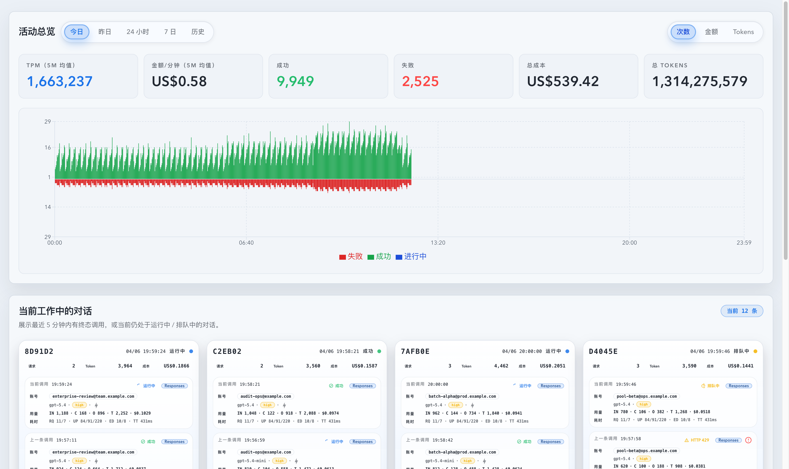
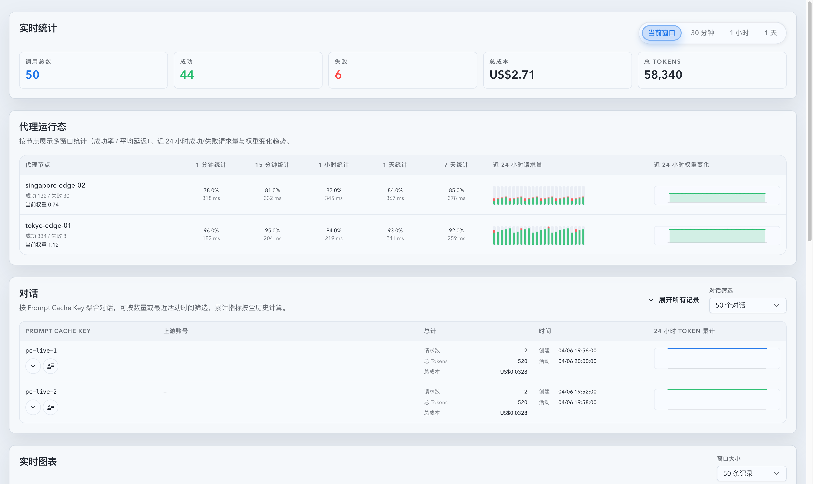
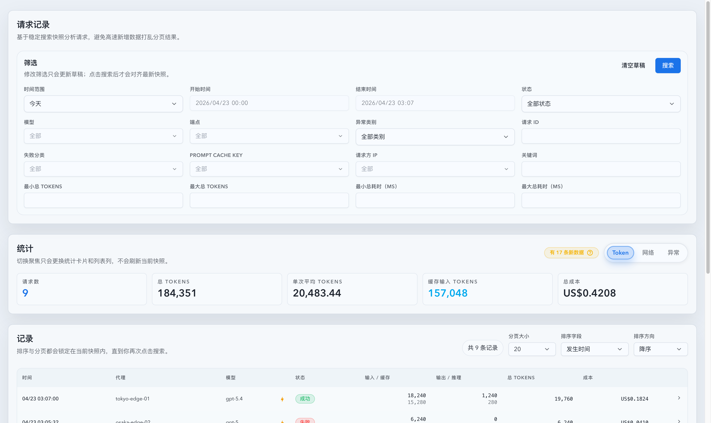
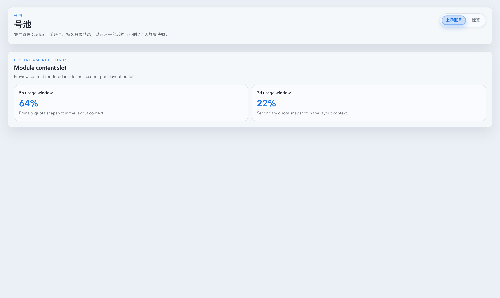

# Codex Vibe Monitor

[](https://github.com/IvanLi-CN/codex-vibe-monitor/actions/workflows/ci-main.yml)
[](https://github.com/IvanLi-CN/codex-vibe-monitor/actions/workflows/ci-pr.yml)
[](https://github.com/IvanLi-CN/codex-vibe-monitor/tags)
[](https://github.com/IvanLi-CN/codex-vibe-monitor/pkgs/container/codex-vibe-monitor)


Codex Vibe Monitor 是一套面向自部署的 **OpenAI 兼容代理观测工作台**。

它把 **`/v1/*` 流量接入、调用留证、实时 SSE、历史统计、请求排障、上游账号池、forward proxy 配置、价格目录维护、SQLite 持久化与归档** 收在同一个项目里。目标不是只做一个总览 dashboard，而是提供一套能 **看得到、查得到、调得动** 的运营与排障入口。

## 界面预览

以下截图基于当前 Storybook 稳定 mock 场景生成，覆盖项目最核心的四个界面。

### Dashboard：活动总览与工作中对话



### Live：代理运行态、对话聚合与实时记录



### Records：稳定搜索快照与请求分析



### Account Pool：上游账号与分组视图



## 当前交付的核心能力

### 1. OpenAI 兼容代理入口

- 统一承接 `/v1/*` 请求并记录调用证据
- 支持把代理流量写入 SQLite，保留后续统计与排障所需字段
- OAuth inline adapter 当前覆盖常用路由，包括：
  - `/v1/models`
  - `/v1/responses`
  - `/v1/responses/compact`
  - `/v1/chat/completions`

### 2. 实时与历史观测面板

- **Dashboard**：自然日总览、分钟级趋势、当前工作中对话
- **Live**：forward proxy 节点短窗口表现、实时记录流、Prompt Cache 对话聚合
- **Stats**：按时间窗查看趋势、成功/失败分布、错误统计、并行工作统计
- **Records**：基于稳定快照做筛选、排序、分页、详情排障

### 3. 请求留证与排障能力

- 请求列表、调用详情、响应体查看、pool attempts 明细
- 新数据计数、建议筛选项、失败分类与错误分布
- 可区分运行中 / 排队中 / 成功 / 失败 / 上游异常等状态
- 适合定位：
  - 首字超时
  - compact 路径异常
  - 上游拒绝
  - rate limit
  - forward proxy 退化
  - Prompt Cache 相关问题

### 4. Account Pool：上游账号池管理

- 统一管理 **OAuth** 与 **API Key** 上游账号
- 支持：
  - 单个 OAuth 登录
  - 批量 OAuth 创建
  - imported OAuth 校验与导入
  - OAuth relogin
  - mailbox session / login session 流程
  - bulk sync jobs 与事件流
- 界面支持：
  - 平铺 / 分组 / 网格视图
  - 标签管理
  - 分组设置
  - sticky keys
  - 5 小时 / 7 天额度窗口
  - 健康状态、启用状态、工作状态筛选

### 5. 运行期配置入口

- **Settings** 页面可在线维护：
  - 模型价格目录
  - forward proxy 配置
  - forward proxy 候选校验
  - external API keys
  - pool routing settings
- 价格与部分运行参数已落入数据库，不再全部依赖手改环境变量

### 6. SQLite 持久化、保留与归档

- SQLite 作为主存储
- 支持 retention、archive、raw payload 冷压缩
- `codex_invocations` 已支持不可变日分片归档
- 适合单机自部署、低运维复杂度的长期运行场景

### 7. 完整的开发与验收面

- React + Vite 应用
- Storybook 页面 / 组件证据
- public docs 站点 `docs-site/`
- 内部 UI 规范 `docs/ui/`
- Rust + Vitest + Storybook build 验证链路

## 页面地图

| 页面 | 作用 |
| --- | --- |
| `/dashboard` | 活动总览、今日/昨日/7日/历史趋势、工作中对话 |
| `/stats` | 时间窗统计、趋势图、成功/失败、错误分布、并行工作统计 |
| `/live` | 实时 summary、forward proxy 节点状态、实时记录流、Prompt Cache 对话 |
| `/records` | 稳定快照搜索、筛选、分页、详情、response body、pool attempts |
| `/account-pool/upstream-accounts` | 上游账号列表、配额窗口、分组与标签视图 |
| `/account-pool/upstream-accounts/new` | 新建 OAuth / API Key / 批量 OAuth / imported OAuth |
| `/account-pool/tags` | 标签管理与路由语义维护 |
| `/settings` | 价格目录、forward proxy、external API keys、运行配置入口 |

## 快速开始

### 路径 A：直接跑镜像

```bash
mkdir -p data

docker run -d \
  --name codex-vibe-monitor \
  -p 8080:8080 \
  -v "$(pwd)/data:/srv/app/data" \
  -e HTTP_BIND=0.0.0.0:8080 \
  -e DATABASE_PATH=/srv/app/data/codex_vibe_monitor.db \
  ghcr.io/ivanli-cn/codex-vibe-monitor:latest
```

检查 readiness：

```bash
curl -fsS http://127.0.0.1:8080/health
```

返回 `200 ok` 后再导入真实流量。

### 路径 B：本地开发

后端：

```bash
cargo run
```

前端：

```bash
cd web
bun install
bun run dev -- --host 127.0.0.1 --port 60080
```

Storybook：

```bash
cd web
bun run storybook
```

public docs：

```bash
cd docs-site
bun install
bun run dev
```

默认本地地址：

- Backend: `http://127.0.0.1:8080`
- App dev: `http://127.0.0.1:60080`
- docs-site: `http://127.0.0.1:60081`
- Storybook: `http://127.0.0.1:60082`

## 第一次部署最该先确认的配置

| 变量 | 作用 |
| --- | --- |
| `HTTP_BIND` | 服务监听地址 |
| `DATABASE_PATH` | SQLite 主库路径 |
| `OPENAI_UPSTREAM_BASE_URL` | OpenAI 兼容上游地址 |
| `UPSTREAM_ACCOUNTS_ENCRYPTION_SECRET` | Account Pool 写入与 OAuth 绑定所需密钥 |
| `RETENTION_ENABLED` | 是否启用后台保留任务 |
| `ARCHIVE_DIR` | 归档目录 |
| `PROXY_RAW_DIR` | 原始 payload 落盘目录 |

更完整的部署与配置说明请直接看：

- [docs-site / 快速开始](docs-site/docs/quick-start.md)
- [docs-site / 配置与运行](docs-site/docs/config.md)
- [docs-site / 自部署](docs-site/docs/deployment.md)
- [仓库部署说明](docs/deployment.md)

## 运行与部署注意事项

- `GET /health` 表示 **readiness**，未 ready 时会返回 `503 starting`
- 生产推荐 **只暴露网关，不直接暴露应用监听端口**
- 若要新增或修改 Account Pool 账号，`UPSTREAM_ACCOUNTS_ENCRYPTION_SECRET` 不是可选项
- 长期运行前应尽早决定：
  - 主库路径
  - 归档目录
  - raw payload 保留策略
  - retention 窗口

## 文档入口

### public docs

- `docs-site/docs/index.md`：公共文档入口
- `docs-site/docs/product.md`：项目定位与页面地图
- `docs-site/docs/quick-start.md`：最短启动路径
- `docs-site/docs/config.md`：配置与运行
- `docs-site/docs/deployment.md`：长期运行部署口径
- `docs-site/docs/development.md`：开发指南
- `docs-site/docs/storybook.mdx`：Storybook 入口

### 仓库内部文档

- `docs/deployment.md`：更深入的部署与安全边界
- `docs/ui/README.md`：内部 UI 规范入口
- `docs/specs/**`：规格与实现收敛记录
- `docs/solutions/**`：可复用工程经验

## 技术栈

- **Backend**：Rust、Axum、Tokio、SQLx、SQLite、SSE
- **Frontend**：React 19、Vite 7、TypeScript、Tailwind 风格 UI、Recharts
- **Docs / Review**：Rspress、Storybook 10
- **Tooling**：Bun、Vitest、Playwright、ESLint
- **Delivery**：Docker、GitHub Actions、GHCR、GitHub Pages

## 仓库结构

```text
.
├── src/                    # Rust 后端、代理、统计、SSE、SQLite、maintenance
├── web/                    # React 应用、页面、hooks、Storybook
├── docs-site/              # public docs 站点
├── docs/ui/                # 内部 UI 规范
├── docs/specs/             # 规格文档
├── docs/solutions/         # 经验沉淀
├── Dockerfile              # 多阶段镜像构建
└── .github/workflows/      # CI / Release / Pages
```

## 常用命令

后端：

```bash
cargo fmt
cargo check
cargo test
cargo run
```

前端：

```bash
cd web
bun install
bun run lint
bun run test
bun run build
bun run storybook
bun run storybook:build
```

docs-site：

```bash
cd docs-site
bun install
bun run dev
bun run build
```

## 适合什么场景

- 想自部署一套自己的 OpenAI 兼容代理观测台
- 想保留调用证据、成本、失败信息与历史趋势
- 想把代理入口、运营面板、账号池和排障入口放在一个项目里
- 想继续扩展自己的前端、后端、Storybook 与文档链路

## License

[MIT](LICENSE)
