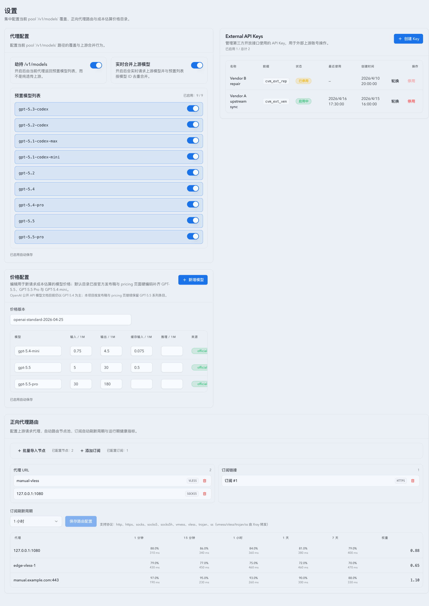

# 当前 pool `/v1/models` 路径级覆盖与 GPT-5.5 默认价格刷新（#47ran）

## 状态

- Status: 已实现，待 PR / CI / review-proof 收敛
- Created: 2026-04-25
- Last: 2026-04-25

## 背景 / 问题陈述

- `#mww8f` 移除了 Settings 页中的全局 `/v1/models` 覆盖设置，并把 `/api/settings/proxy` 下线；当前运行态只剩 forward proxy 与 pricing。
- 现网 `/v1/*` 已经完全切到 pool 路由语义，但主人确认原先丢失的是“对特定路径做覆盖响应”的能力，而不是恢复任何非 pool 的 legacy 直连反代路径。
- `#7272y` 只把默认模型与默认价格推进到 `gpt-5.4` / `gpt-5.4-pro`。截至 2026-04-25，OpenAI 官方发布稿与 pricing 页已出现 `GPT-5.5` / `GPT-5.5 Pro`，默认目录需要继续刷新。

## 目标 / 非目标

### Goals

- 恢复 `GET /api/settings` 的 `proxy` 配置块与 `PUT /api/settings/proxy` 写接口。
- 在当前 pool 请求链上恢复 `GET /v1/models` 的路径级覆盖：支持 preset-only、merge-upstream、merge-fallback。
- 默认 preset 列表追加 `gpt-5.5` / `gpt-5.5-pro`，同时保留历史 alias / 旧模型行。
- 默认 pricing catalog 升级到新的 repo-managed 版本，并补齐 `gpt-5.5` / `gpt-5.5-pro` / `gpt-5.4-mini`。
- Settings 页面重新提供 proxy 配置卡，并把 GPT-5.5 口径写进默认文案与 Storybook mock。

### Non-goals

- 不恢复任何无 pool route key 的 `/v1/*` 功能路径。
- 不恢复已废弃的全局 fast rewrite 运行时语义；legacy `fastModeRewriteMode` 仅保留兼容字段，不重新接回请求改写逻辑。
- 不接入在线自动同步 OpenAI pricing。

## 范围（Scope）

### In scope

- `src/app_state.rs`、`src/api/slices/error_distribution_and_sse.rs`、`src/maintenance/hourly_rollups.rs`：settings proxy 契约恢复。
- `src/proxy/dispatch.rs`：当前 pool `/v1/models` 路径级 hijack / merge / fallback。
- `src/main.rs`、`src/pricing.rs`、相关 Rust tests：默认 preset 与默认价格升级。
- `web/src/lib/api/**`、`web/src/hooks/useSettings.ts`、`web/src/pages/Settings.tsx`、`web/src/components/SettingsPage.stories.tsx`、`web/src/i18n/translations.ts`：Settings UI / Storybook / 文案恢复。
- `README.md`、`docs/deployment.md`：同步 current truth。

### Out of scope

- OAuth bridge / account pool 的其它 `/v1/*` 路径语义变更。
- 新增 GPT-5.5-mini / GPT-5.5-nano / GPT-5.5-chat-latest / GPT-5.5-codex 等未在当前官方 pricing 或 docs 明示的 model id。

## 功能与行为规格（Functional / Behavior Spec）

### `/api/settings`

- `GET /api/settings` 返回 `proxy + forwardProxy + pricing`。
- `proxy` 字段包含：
  - `hijackEnabled`
  - `mergeUpstreamEnabled`
  - `fastModeRewriteMode`（兼容字段，固定回 `disabled`）
  - `upstream429MaxRetries`
  - `models`
  - `enabledModels`
  - `defaultHijackEnabled`
- Settings 页仅暴露 hijack / merge / preset models；`upstream429MaxRetries` 保留为后端兼容字段，不再单独提供 UI 控件。
- `PUT /api/settings/proxy` 恢复可写；legacy `fastModeRewriteMode` 允许出现在 payload 中，但不再驱动运行时行为。
- `GET /api/settings/proxy-models` 继续保持 removed / 404 语义，不回滚旧接口。

### 当前 pool `GET /v1/models`

- 请求仍然必须先命中有效 pool route key。
- 若 `hijackEnabled=false`：继续当前 pool passthrough 行为。
- 若 `hijackEnabled=true` 且 `mergeUpstreamEnabled=false`：直接返回 preset payload。
- 若 `hijackEnabled=true` 且 `mergeUpstreamEnabled=true`：拉取上游 `/v1/models` JSON，与 preset 去重合并；失败则回退 preset payload，并继续打 `x-proxy-model-merge-upstream=failed`。
- 本恢复仅作用于当前 pool `/v1/models` 路径，不改变其它 pool `/v1/*` 请求。

### 默认模型与默认价格

- `PROXY_PRESET_MODEL_IDS` 追加 `gpt-5.5` / `gpt-5.5-pro`。
- 默认 pricing version 升级到 `openai-standard-2026-04-25`。
- 默认 / repo-managed pricing 补齐：
  - `gpt-5.5`: input `5.0`, cached input `0.5`, output `30.0`
  - `gpt-5.5-pro`: input `30.0`, output `180.0`
  - `gpt-5.4-mini`: input `0.75`, cached input `0.075`, output `4.5`
- 对旧的 repo-managed default version 执行 `INSERT OR IGNORE` 补齐，不覆盖 custom 行。
- 对旧的 repo-managed preset enabled list 执行一次性追加，不覆盖用户自定义 enabled list。

## 验收标准（Acceptance Criteria）

- Given 当前请求带有效 pool route key，When `GET /v1/models` 且 hijack 关闭，Then 继续返回 pool upstream 原始结果。
- Given 当前请求带有效 pool route key，When `GET /v1/models` 且 hijack 开启 / merge 关闭，Then 返回 preset-only payload。
- Given 当前请求带有效 pool route key，When `GET /v1/models` 且 hijack 开启 / merge 开启，Then merge success 时回 merged payload，merge 失败时回 preset fallback，并打 merge-status header。
- Given `GET /api/settings`，When Settings 页加载，Then 响应同时包含 `proxy`、`forwardProxy`、`pricing`。
- Given repo-managed default pricing / preset migrated state，When 启动加载，Then 新增 GPT-5.5 系列与 GPT-5.4 mini 会补齐，但 custom 覆盖不被回写。

## 文档更新（Docs to Update）

- `docs/specs/README.md`
- `README.md`
- `docs/deployment.md`

## Visual Evidence

- source_type: storybook_canvas
  target_program: mock-only
  capture_scope: viewport
  sensitive_exclusion: N/A
  submission_gate: pending-owner-approval
  story_id_or_title: Settings/SettingsPage/Default
  state: proxy-card-restored-with-gpt55-pricing
  evidence_note: 验证 Settings 页重新出现精简后的 proxy 配置卡（仅保留 hijack / merge / preset models），并且默认价格 mock 已包含 GPT-5.5 / GPT-5.5 Pro / GPT-5.4 mini。

## 参考（References）

- `#mww8f`（删除 proxy settings 与 legacy hijack 的基线）
- `#7272y`（GPT-5.4 默认价格与 preset 扩展基线）
- [Introducing GPT-5.5](https://openai.com/index/introducing-gpt-5-5/)
- [OpenAI API Pricing](https://openai.com/api/pricing/)
- [OpenAI API Models](https://developers.openai.com/api/docs/models)
