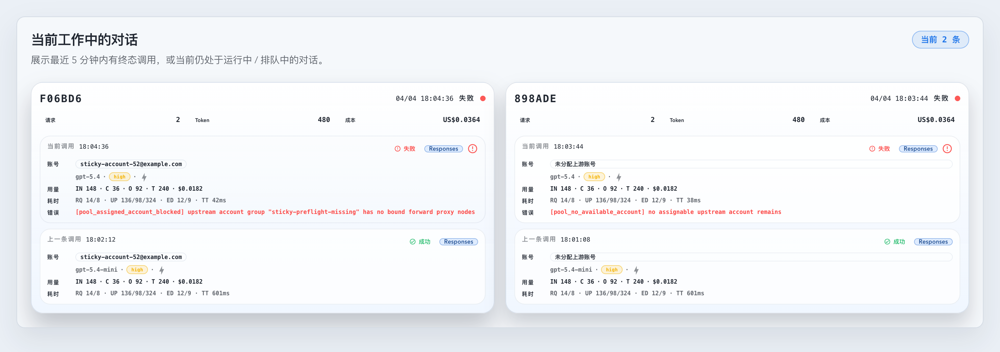

# pool `/v1/*` live 路由显式综合打分 follow-up（#5uxj8）

## 状态

- Status: 已实现，待 PR / CI / review-proof 收敛
- Created: 2026-04-18
- Last: 2026-04-18

## 背景

- `#6b9ra` 把 `nodeShuntEnabled` 定义成“节点即槽位”的独占分流模型，但 live 路由仍把“节点/槽位执行问题”混进了“账号是否被分配”的语义里。
- 当前 `/v1/*` live 路由依赖隐式比较器与分支拼装选择账号；当分组节点分流或组绑定阻塞时，失败常被折叠成 `pool_no_available_account + account=None`，导致 Invocation / Dashboard 只能显示“无账号上下文”。
- 主人要求明确改成：先定账号，再按当前 dispatch 可执行性综合打分；节点临时不可执行只能降权，不得直接取消账号被指派资格。

## 目标 / 非目标

### Goals

- 为 live 路由引入可解释的显式综合打分分解结构，统一表达：账号可指派性、优先级、容量 lane、dispatch 状态、稀缺度、负载与最终 tie-break。
- 让 fresh assignment 与 sticky/concrete owner 共用同一套 live 评分入口，而不是继续依赖 scattered comparator + 分支。
- 对 `nodeShuntEnabled` 分组，live 路由允许“已入号池但未占到节点槽位”的账号以降权方式继续参与 fresh assignment；只在真实硬阻断时失败。
- concrete owner / sticky owner 一旦被选中，后续 preflight / dispatch 硬失败必须保留 `upstreamAccountId` / `upstreamAccountName`，并落独立 failure kind。
- Invocation / Dashboard 中，只有真实无账号身份的记录才显示“未分配上游账号”；已保留账号身份的失败必须显示具体账号。

### Non-goals

- 本轮不把评分结构透出到号池账号列表 API / UI。
- 不引入新的持久化评分表，也不新增长期账号-节点绑定表。
- 不改变 sync / import / maintenance / post-create validation 的既有语义。
- 不引入 automatic/shared fallback 来绕过分组/节点边界。

## 范围

### In scope

- `src/upstream_accounts/routing/*`
  - live 账号候选显式评分
  - sticky/fresh 共用评分入口
  - node shunt live fallback / 降权语义
- `src/proxy/failover.rs`
  - concrete owner blocked 终态与 failure kind
- `src/proxy/request_entry.rs`
  - assigned-account blocked error builder
- `src/proxy/route_selection.rs`
  - live 前置解析对 assigned-account blocked 的 HTTP surface
- `web/src/lib/invocation.ts`
- `web/src/i18n/translations.ts`
- `web/src/components/InvocationTable*`
- `web/src/components/DashboardWorkingConversationsSection*`
- `docs/specs/README.md`

### Out of scope

- 号池账号列表对评分分量的展示。
- `nodeShuntEnabled` 的产品定义本身。
- forward-proxy runtime health 模型重做。

## 功能规格

### live 显式评分

- 新增内部 runtime score 结构：
  - `eligibility`: `Assignable | SoftDegraded | HardBlocked`
  - `routingPriorityRank`
  - `capacityLane`: `Primary | Overflow`
  - `dispatchState`: `ReadyOnOwnedNode | ReadyAfterMigration | RetryOriginalNode | HardBlocked`
  - `scarcityScore`
  - `effectiveLoad`
  - `lastSelectedAt`
  - `accountId`
- 排序必须走单一字典序入口：
  1. eligibility
  2. routing priority
  3. capacity lane
  4. dispatch state
  5. scarcity score
  6. effective load
  7. last selected
  8. account id

### node shunt live 语义

- `nodeShuntEnabled` 组在 live 路由中继续遵守“节点即槽位”的定义。
- 当账号已经占有节点槽位且节点当前仍可选时：`dispatchState=ReadyOnOwnedNode`。
- 当账号当前未占有节点槽位，但分组仍存在可选 bound node 时：允许 live 路由退化为当前分组的 `BoundGroup` scope 发起请求，`dispatchState=ReadyAfterMigration`，同时 `eligibility=SoftDegraded`。
- 当账号保留了具体节点槽位，但当前节点无法作为优先目标时：保留 `RetryOriginalNode` 语义位，用于后续更精细的 runtime health/slot 迁移扩展。
- 当分组缺失、boundProxyKeys 为空、或当前分组不存在任何可选 bound node 时：视为 `HardBlocked`。

### concrete owner / sticky owner

- sticky/concrete owner 若命中 `HardBlocked`，resolver 必须返回新的 `AssignedBlocked(account, message, failureKind)` 分支，而不是 `BlockedByPolicy + account=None`。
- `AssignedBlocked` 的账号上下文允许只用于终态持久化与 UI 展示；它不代表本轮一定已经拿到可发送的 dispatch target。
- 当 sticky rule 禁止 cut-out 且当前 sticky owner 被 preflight block 时，应优先保留该账号并终止，而不是退化成 generic no-account。

### failure kind / 展示语义

- `pool_no_available_account` 只保留给 fresh path 真正无 assignable account 的场景。
- 新增：
  - `pool_routing_blocked`
  - `pool_assigned_account_blocked`
- `pool_routing_blocked` 用于 fresh path 的 actionable routing/policy block，但无 concrete account identity。
- `pool_assigned_account_blocked` 用于 sticky/concrete owner 已确定、但 preflight/hard block 阻止 live dispatch 的终态；必须保留 `upstreamAccountId` / `upstreamAccountName`。
- 前端 `table.account.poolAccountUnavailable` 改成“未分配上游账号”，仅用于 payload 中真实无账号身份的记录。

## 验收标准

- Given live routing 候选集合，When resolver 选择 fresh candidate，Then 代码中能直接看到单一评分入口与各评分分量，而不是隐式 comparator + 分支散落决定顺序。
- Given node shunt 分组中存在未占槽但仍可经当前组 bound node 发请求的账号，When 更优账号不可用或被排除，Then fresh routing 仍会指派该账号，并把 dispatch 状态标为 soft-degraded，而不是直接返回 no-account。
- Given sticky/concrete owner 因 group/binding/preflight block 失败，When failover 结束，Then `PoolUpstreamError.account` 与 pool attempt terminal row 都保留具体账号身份，且 `failureKind=pool_assigned_account_blocked`。
- Given fresh path 只有 actionable routing block 且无 concrete owner，When 请求终止，Then failure kind 不得再写成 `pool_no_available_account`。
- Given Invocation / Dashboard 消费到带账号身份的 blocked failure，When 渲染账号列，Then 必须显示具体账号；只有真实无账号记录才显示“未分配上游账号”。

## 质量门槛

- `cargo check`
- `cargo test`
- `cd web && bunx vitest run src/components/InvocationTable.test.tsx src/components/DashboardWorkingConversationsSection.test.tsx src/hooks/useInvocations.test.tsx`
- `cd web && bun run build`
- 若 Storybook 可用：补齐/更新稳定 story 并产出视觉证据

## Visual Evidence

- source_type: storybook_canvas
  story_id_or_title: Dashboard/WorkingConversationsSection/AssignedAccountFailureSemantics
  state: current dashboard cards / assigned-account-blocked vs true no-account
  evidence_note: 验证当前 Dashboard 工作中对话卡片在 `pool_assigned_account_blocked` 时保留具体账号 `sticky-account-52@example.com`，而真正无账号身份的 `pool_no_available_account` 才显示“未分配上游账号”。

  

## 变更记录

- 2026-04-18: 创建 follow-up spec，冻结“live 先定账号、显式综合打分、node shunt 仅降权不拒派、concrete owner block 保留账号身份”的实现边界。
- 2026-04-18: 完成 live 显式评分、assigned-account blocked 持久化与 Invocation / Dashboard 失败语义修正；本地 `cargo test`、Vitest、Vite build 与 Storybook 视觉证据已通过。
