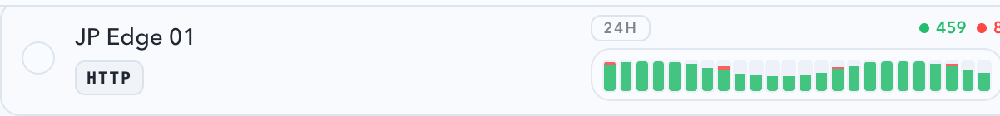

# 号池分组设置弹窗“绑定代理节点”目录加载与同步热修（#7gb5w）

## 状态

- Status: 已完成
- Created: 2026-04-12
- Last: 2026-04-12

## 背景 / 问题陈述

- 号池分组设置弹窗里的“绑定代理节点”区块，在真实线上会话里会先显示“当前没有可用的代理节点”，但设置页里同一批 forward-proxy 节点其实已经存在。
- 现象说明“未加载 / stale”与“真实空目录”被前端混淆，且 settings 保存 forward-proxy 后没有及时失效 account-pool 这侧的目录缓存。
- 用户期望是：弹窗首屏允许 loading，但不能误报空；同一 SPA 会话里 settings 刚保存的节点应该能同步到弹窗，无需 hard reload。

## 目标 / 非目标

### Goals

- 明确区分代理节点目录的 `missing/loading/ready-empty/ready-with-data` 状态，禁止再用初始空数组代表“未加载”。
- 分组设置弹窗在 catalog 未 ready 时只显示 loading 占位，不再提前渲染“当前没有可用的代理节点”。
- 打开分组设置弹窗时，若代理目录为 `missing/stale`，自动触发 silent refresh，数据返回后原地补全节点列表。
- Settings 保存 forward-proxy 成功后，向号池页广播失效事件，让同一 SPA 会话里的目录自动刷新。
- 为该弹窗补稳定 Storybook 场景、前端回归测试和视觉证据，作为 hotfix 验收来源。

### Non-goals

- 不修改 forward-proxy 路由算法、节点权重或惩罚策略。
- 不变更分组绑定 / 节点分流的后端业务语义。
- 不新增或修改公开 HTTP 契约字段。

## 范围（Scope）

### In scope

- `web/src/hooks/useUpstreamAccounts.ts`
- `web/src/hooks/useSettings.ts`
- `web/src/hooks/useSettings.test.tsx`
- `web/src/hooks/useUpstreamAccounts.test.tsx`
- `web/src/components/UpstreamAccountGroupNoteDialog.tsx`
- `web/src/components/UpstreamAccountGroupNoteDialog.test.tsx`
- `web/src/components/UpstreamAccountGroupNoteDialog.stories.tsx`
- `web/src/pages/account-pool/UpstreamAccountCreate.dialogs.tsx`
- `web/src/pages/account-pool/UpstreamAccountCreate.group-drafts.ts`
- `web/src/pages/account-pool/UpstreamAccountCreate.page-impl.tsx`
- `web/src/pages/account-pool/UpstreamAccounts.page-local-shared.tsx`
- `web/src/i18n/translations.ts`
- `docs/specs/README.md`

### Out of scope

- `src/**` 后端 forward-proxy runtime 组装逻辑
- 号池绑定节点的保存契约或数据库结构
- 非“绑定代理节点”区块的通用 skeleton 体系重构

## 需求（Requirements）

### MUST

- `useUpstreamAccounts` 必须导出代理节点目录 tri-state / freshness 信号，不能再让调用方把“未加载”误判为“空目录”。
- 分组设置弹窗在 catalog 为 `loading` / `missing` 时，必须显示 loading 占位，且不得出现空态文案。
- 当 catalog 真正完成加载且节点列表为空时，弹窗才允许显示“当前没有可用的代理节点”。
- 打开分组设置弹窗且 catalog 为 `missing` 或 `stale` 时，必须自动执行一次 silent refresh。
- Settings 成功保存 forward-proxy 后，必须触发 account-pool 目录失效事件，让同一会话里的弹窗能看到新节点。
- 已绑定但当前缺失 / 不可用的节点仍必须维持 existing missing/unavailable badge 行为，不能被 loading 逻辑吞掉。
- 为 tri-state、loading 占位、settings 同步链路补充前端回归测试。
- 为弹窗补至少 `loading`、`ready-with-nodes`、`ready-empty`、`settings-save-sync` 四个 Storybook 稳定场景。

### SHOULD

- loading 占位尽量复用现有组件与样式，不引入新的全局样式体系。
- 代理目录 freshness 透传到 page/context，避免各页面自己推断 `[]` 是否代表未加载。

## 接口契约（Interfaces & Contracts）

### Internal hook contract

- `useUpstreamAccounts` 新增 `forwardProxyCatalogState`：
  - `kind`: `deferred | loading | missing | ready-empty | ready-with-data`
  - `freshness`: `deferred | missing | fresh | stale`
  - `isPending: boolean`
  - `hasNodes: boolean`
- 公开返回的 `forwardProxyNodes` 仍保持数组，兼容现有 consumer；目录真相改由 `forwardProxyCatalogState` 表示。

### Event contract

- `useSettings.saveForwardProxy()` 成功后继续复用现有 `upstream-accounts:changed` 失效事件。
- 不新增对外 API；仅补足当前已存在事件链路的一致性。

## 验收标准（Acceptance Criteria）

- Given 真实存在可用代理节点，When 打开分组设置弹窗，Then 首屏允许出现 loading，但不得先出现“当前没有可用的代理节点”，且响应返回后节点列表会原地补全。
- Given catalog 真正返回空数组，When 弹窗渲染完成，Then 才显示空态文案。
- Given 同一浏览器会话里刚保存 forward-proxy 设置，When 不做 hard reload 再打开分组设置弹窗，Then 节点目录会自动同步到最新结果。
- Given 历史绑定了当前缺失 / 不可用的节点，When 弹窗渲染，Then 仍会展示 missing / unavailable badge，不因 loading tri-state 被吞掉。

## 非功能性验收 / 质量门槛（Quality Gates）

### Testing

- `cd web && bunx vitest run src/hooks/useSettings.test.tsx src/hooks/useUpstreamAccounts.test.tsx src/components/UpstreamAccountGroupNoteDialog.test.tsx`
- `cd web && bun run build`
- `cd web && bun run build-storybook`

### UI / Storybook

- 视觉证据来源：`storybook_docs`（若仓库最终对该 story 只能稳定走 canvas，则记录为 `storybook_canvas`）
- 必须先展示 loading 与 settings-save-sync 两类关键状态

## 文档更新（Docs to Update）

- `docs/specs/README.md`

## Plan assets

- Directory: `docs/specs/7gb5w-account-pool-bound-proxy-dialog-freshness/assets/`

## Visual Evidence

- source_type: storybook_canvas
  target_program: mock-only
  capture_scope: element
  sensitive_exclusion: N/A
  submission_gate: approved
  story_id_or_title: Account Pool/Components/Upstream Account Group Settings Dialog/LoadingProxyCatalog
  state: loading placeholder
  evidence_note: 验证 catalog 未 ready 时，弹窗显示 loading 占位而不是“当前没有可用的代理节点”。
  image:
  

- source_type: storybook_canvas
  target_program: mock-only
  capture_scope: element
  sensitive_exclusion: N/A
  submission_gate: approved
  story_id_or_title: Account Pool/Components/Upstream Account Group Settings Dialog/SettingsSaveSyncRefresh
  state: refreshed node option
  evidence_note: 验证 settings 保存后的 catalog 刷新会把节点原地补回，节点卡片出现 `JP Edge 01` 与 24h 趋势，不再停留在误空态。
  image:
  

## 实现里程碑（Milestones / Delivery checklist）

- [x] M1: 冻结 tri-state / freshness / settings invalidation 的实现方案与验收口径
- [x] M2: 落地 hook tri-state、dialog loading 占位与 stale 时 silent refresh
- [x] M3: 落地 settings 保存后的 `upstream-accounts:changed` 失效通知，并补 hook / dialog 回归测试
- [x] M4: Storybook 场景、浏览器验收与视觉证据落盘
- [x] M5: review-loop、PR 收敛到 merge-ready

## 方案概述（Approach, high-level）

- 保持 `/api/pool/upstream-accounts` 的 HTTP 响应不变，在 `useUpstreamAccounts` 内把代理目录状态从“裸数组”升级为“数组 + tri-state 真相源”。
- 页面层把 `forwardProxyCatalogState` 透传到分组设置弹窗，并在 `missing/stale` 时自动 silent refresh。
- `UpstreamAccountGroupNoteDialog` 改成 loading / empty / nodes 三分支渲染，避免首屏误报空目录。
- Settings 保存 forward-proxy 成功后复用现有 `upstream-accounts:changed` 事件，刷新 account-pool 目录缓存。

## 风险 / 假设 / 参考

- 风险：若线上真实问题来自后端 `/api/pool/upstream-accounts.forwardProxyNodes` 组装为空，本 hotfix 只能修复误空态与 stale，同步仍需后端 follow-up。
- 风险：page/context 透传新增字段可能影响旧测试 mock；需通过 targeted Vitest 与 build 收敛。
- 假设：线上主要问题是前端 loading/stale 误判，而不是 settings 页与 account-pool 使用不同真相源。

## 变更记录（Change log）

- 2026-04-12: 初始化 hotfix spec，锁定“未加载不等于空目录”“settings 保存后同会话自动同步”“Storybook 先行验收”三条主约束。
- 2026-04-12: 完成 hook tri-state、dialog loading 占位、弹窗 stale silent refresh、settings 保存失效通知与 targeted Vitest/build 验证。
- 2026-04-12: 根据 review-loop 收敛自动 silent refresh 的失败自旋问题，抽出共享 auto-refresh hook，并补回归测试与 Storybook 视觉证据。
- 2026-04-12: 主人批准截图随分支一起提交；分支已推送并创建 PR #335，当前停在 merge-ready。
