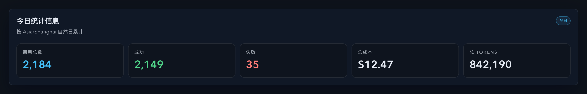
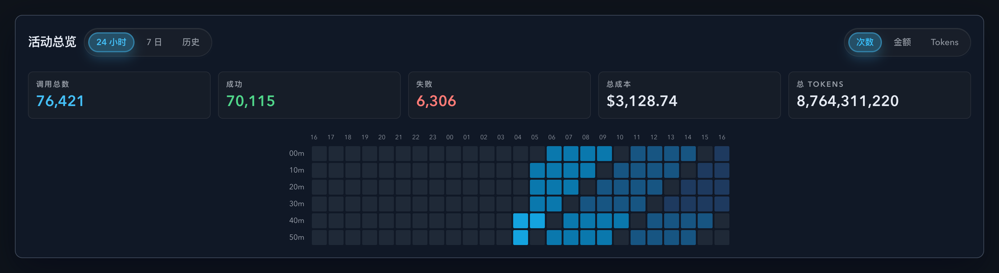

# Dashboard：把“历史”并入“活动总览”，并将“今日统计信息”改为单行 KPI（#7s4kw）

## 状态

- Status: 已实现，待 PR / CI / review-proof 收敛
- Created: 2026-04-07
- Last: 2026-04-07

## 背景 / 问题陈述

- Dashboard 当前把独立历史日历视图拆散在总览之外，导致总览信息被割裂，阅读路径不连贯。
- 主人已明确否定“桌面双栏合并”的方案，要求把历史视图收拢进 `活动总览`，并以单列切换视图呈现，不再保留独立卡片。
- `今日统计信息` 延续了来自 `#s8d2w` 的 Bento 风格，其中“调用总数”会独占一整行，已不符合当前希望的紧凑单行 KPI 诉求。

## 目标 / 非目标

### Goals

- Dashboard 顶部不再渲染独立 `UsageCalendar` 卡片，而是把“历史”合并进 `DashboardActivityOverview`。
- `活动总览` 左侧切换升级为 `24 小时 / 7 日 / 历史` 三段，内容区始终保持单列切换，不引入桌面双栏布局。
- 头部只保留一套 `次数 / 金额 / Tokens` 指标切换，三种视图共用同一交互入口，同时保留按视图记忆指标的行为。
- “历史”视图只显示半年级别的日历本体，不新增 KPI 行，也不再重复渲染内层标题/时区说明。
- `今日统计信息` 在桌面端以 5 个等宽 KPI tile 单行展示，不再保留 total tile 独占整行的结构。
- 补齐 Storybook、Vitest、Spec 与视觉证据，按 fast-track 收敛到 merge-ready。

### Non-goals

- 不修改 Rust 后端、`/api/stats/*`、SSE 协议或任何统计口径。
- 不保留独立历史卡，也不做左右分栏或嵌套 panel 的新布局实验。
- 不新增 localStorage、URL query 或其它持久化偏好。
- 不自动 merge 或执行 post-merge cleanup。

## 范围（Scope）

### In scope

- `web/src/pages/Dashboard.tsx`：移除顶部独立 `UsageCalendar`，保留 `TodayStatsOverview` + 合并后的 `DashboardActivityOverview`。
- `web/src/components/DashboardActivityOverview.tsx`：升级为三段切换单列视图，并统一托管 metric toggle。
- `web/src/components/UsageCalendar.tsx`：支持嵌入/受控模式，允许隐藏自带外壳与 metric toggle。
- `web/src/components/TodayStatsOverview.tsx`：重排为桌面端 5 列 KPI 单行。
- `web/src/components/*.stories.tsx`、相关 Vitest：补足稳定 Storybook 覆盖与行为回归。
- `docs/specs/README.md`：登记本 spec 并同步交付状态。

### Out of scope

- `src/` 下任意后端实现与数据库层。
- 新增半年 summary API 或其它后端派生聚合。
- 移动端强制单行布局；移动端仅要求不产生异常横向溢出。

## 验收标准（Acceptance Criteria）

- Given 打开 Dashboard，When 查看页面顶部，Then 不再存在独立的历史卡片。
- Given 查看 `活动总览` 头部，When 使用范围切换，Then 左侧显示 `24 小时 / 7 日 / 历史` 三段，内容区始终是单列切换视图，桌面端不得出现双栏结构。
- Given 切到“历史”，When 查看内容区，Then 仅显示半年级别的 history calendar，不显示 `StatsCards`/KPI 行，也不显示额外的“历史”标题或时区说明。
- Given 在三种范围下切换 `次数 / 金额 / Tokens`，When 来回切换范围，Then 每个范围仍保留各自上次选中的 metric。
- Given 查看 `今日统计信息`，When 处于桌面宽度，Then 5 个 KPI tile 单行排列，且不再有 total tile 独占整行。
- Given 运行前端验证命令，When 执行 `cd web && bun run test && bun run build && bun run build-storybook`，Then 命令通过。

## 非功能性验收 / 质量门槛（Quality Gates）

### Visual / UX

- `活动总览` 合并后不得引入新层级的重复 panel 外壳或桌面双栏阅读路径。
- 历史日历嵌入模式必须保留独立卡一致的配色语义与 tooltip 语义，但隐藏内层标题与时区说明，避免与总览上下文重复。
- `今日统计信息` 在桌面端保持高信息密度，同时在窄屏下允许回落换行，且无异常横向溢出。

### Testing

- Frontend targeted tests:
  - `cd web && bun run test -- src/components/DashboardActivityOverview.test.tsx src/components/UsageCalendar.test.tsx src/components/TodayStatsOverview.test.tsx src/pages/Dashboard.test.tsx`
- Storybook build:
  - `cd web && bun run build-storybook`

### Quality checks

- `cd web && bun run test`
- `cd web && bun run build`
- `cd web && bun run build-storybook`

## 文档更新（Docs to Update）

- `docs/specs/README.md`
- `docs/specs/7s4kw-dashboard-usage-activity-overview/SPEC.md`

## 实现里程碑（Milestones / Delivery checklist）

- [x] M1: 新建 follow-up spec 并登记 `docs/specs/README.md`。
- [x] M2: Dashboard 页面移除独立历史卡，改由活动总览承载三段切换。
- [x] M3: `UsageCalendar` 支持嵌入/受控模式；`TodayStatsOverview` 改为桌面单行 KPI。
- [x] M4: 补齐 Storybook stories / play 覆盖，并完成 Storybook build。
- [x] M5: 完成本地验证与视觉证据归档。
- [ ] M6: fast-track 推进到 PR merge-ready。

## 方案概述（Approach, high-level）

- 延续 `#dzbnx` 的共享总览卡思路，但把范围切换从二段扩展为三段，并将“历史”视作总览内部的第三个受控视图，而不是额外布局列。
- 历史日历从原来的 90 天升级为 `6mo` 半年范围，同时继续沿用日级 bucket 和当前自然日的本地增量补丁策略，避免把多月日历回退成频繁全量重拉。
- 将 `UsageCalendar` 抽成可嵌入、可受控 metric 的组件：独立模式继续自带 panel 与 metric toggle，嵌入模式则隐藏外壳与自带切换，复用总览头部的统一指标控件。
- `TodayStatsOverview` 不再突出单个 total tile，而是统一为 5 个等权 KPI，提升顶栏横向扫读效率，同时通过响应式栅格保留窄屏可读性。

## 风险 / 开放问题 / 假设（Risks, Open Questions, Assumptions）

- 风险：如果历史视图仍保留自带 metric toggle，会与总览头部形成重复控件；需要通过嵌入模式锁住该行为。
- 风险：半年日历列数增加后若仍沿用 90 天宽度假设，可能出现卡片内滚动或过宽留白；需要依赖现有 block-size 自适应与 Storybook 证据锁定。
- 风险：如果 TodayStats Storybook 仍使用窄容器，单行 KPI 效果会被错误地展示为多行，影响视觉验收。
- 假设：三段范围切换仍沿用 `SegmentedControl` 家族，文案和视觉 token 延续 `#h5k2r` 的全站统一样式。
- 假设：视觉证据将以 Storybook 为唯一来源，不截真实页面数据。

## 变更记录（Change log）

- 2026-04-07: 创建 follow-up spec，冻结“三段切换合并历史 + 今日 KPI 单行 + 不做双栏 + merge-ready 收口”的范围与验收标准。
- 2026-04-07: 已完成 Dashboard 页面合并、`UsageCalendar` 嵌入/受控模式、`TodayStatsOverview` 单行 KPI，以及相关 Vitest 回归新增。
- 2026-04-07: 历史视图文案从“使用活动”改为“历史”，并将多月日历范围从 `90d` 升级为 `6mo`，同时同步 Storybook、Vitest 与 E2E 夹具。
- 2026-04-07: 根据主人反馈，移除总览内嵌历史视图中的重复标题与时区说明，仅保留日历本体。
- 2026-04-07: 根据主人反馈继续收紧历史视图月份标签与热图之间的垂直间距，消除重叠并避免留白过大；最新 Storybook 视觉证据已归档。

## Visual Evidence

- Storybook canvas（dark theme）/ 今日统计信息桌面单行 KPI：

  

- Storybook canvas（dark theme）/ 活动总览 24 小时视图：

  

- Storybook canvas（dark theme）/ 活动总览 历史视图（半年 / 6mo）：

  
