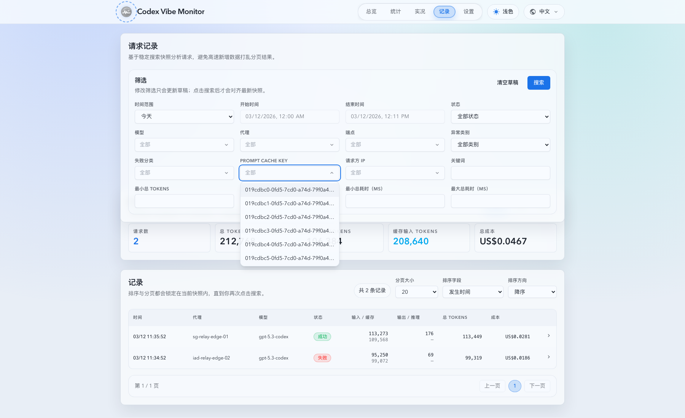

# 请求记录筛选下拉遮挡修复（#8pjnh）

## 状态

- Status: 已完成
- Created: 2026-03-12
- Last: 2026-03-12

## 背景 / 问题陈述

- `/#/records` 顶部筛选区的 `FilterableCombobox` 在展开 `Prompt Cache Key` 等建议下拉时，会被下方“统计”卡片盖住，导致列表底部无法点击或阅读。
- 根因已定位为 `web/src/index.css` 中 `.surface-panel` 使用了 `backdrop-filter`，从而让“筛选”和“统计”两个兄弟卡片分别形成独立 stacking context；筛选卡片内部的 `z-20` 只能在本卡片内生效，无法压过后续兄弟卡片。
- 问题仅影响前端层级渲染；`/api/invocations/suggestions`、筛选懒加载、键盘交互与请求记录 API 均保持正常。
- 若不修复，记录页会继续在真实数据量较大的场景下出现建议词无法选中的问题，直接影响排障效率。

## 目标 / 非目标

### Goals

- 修复 `/#/records` 顶部筛选下拉在桌面视口被“统计”卡片遮挡的问题。
- 保持 `FilterableCombobox` 组件公开接口与现有懒加载建议词交互不变。
- 为 Records 页补齐页面级层级回归测试与真实浏览器遮挡回归测试。
- 在 spec 中记录修复后的视觉证据，供 PR 直接引用。

### Non-goals

- 不改动 Rust 后端、SQLite、SSE 或 `/api/invocations*` 接口协议。
- 不做全局 body portal / overlay 基础设施重构。
- 不修改记录页筛选文案、字段顺序或摘要统计口径。

## 范围（Scope）

### In scope

- `web/src/pages/Records.tsx` 的筛选卡片层级提升逻辑与测试锚点。
- `web/src/pages/Records.test.tsx` 的层级状态回归断言。
- `web/tests/e2e/records-filter-overlay.spec.ts` 的真实浏览器遮挡断言。
- `docs/specs/README.md` 与当前 spec 的状态同步。

### Out of scope

- `web/src/components/ui/filterable-combobox.tsx` 的公开 props 或渲染方式重构。
- 其它页面的下拉组件行为统一改造。
- 后端查询、建议词生成或 records summary UI 改版。

## 需求（Requirements）

### MUST

- 任一筛选 combobox 打开时，筛选卡片必须整体提升到“统计”卡片之上，确保下拉列表完整显示且可交互。
- 关闭下拉后，筛选卡片必须恢复默认层级，不引入新的覆盖、穿透或滚动异常。
- `FilterableCombobox` 的输入、ArrowUp/ArrowDown、Enter、Escape、点击外部关闭与建议词懒加载逻辑必须保持现有语义。
- 回归测试必须覆盖页面层级状态与真实浏览器中“重叠区域 top-most element 属于 listbox”两个层面。

### SHOULD

- 使用稳定测试锚点而不是依赖样式类名或中文文案。
- 视觉证据优先直接来自 Records 页面修复后的浏览器截图。

## 功能与行为规格（Functional/Behavior Spec）

### Core flows

- Records 页维护 `activeSuggestionField` 时，任一建议词下拉打开即视为“筛选卡片抬层中”；该状态只影响首个筛选 `surface-panel`。
- 抬层实现仅发生在页面容器层，不改变 `FilterableCombobox` 内部绝对定位和 listbox 渲染结构。
- 统计卡片与记录列表卡片继续保持原有结构，只有筛选卡片在 dropdown 打开期间获得更高层级。

### Edge cases / errors

- 当建议词接口返回空列表时，空态 listbox 也必须压过统计卡片，避免同类遮挡再次出现。
- 当用户快速打开/关闭不同 combobox 时，页面层级状态必须跟随 `activeSuggestionField` 同步切换，不能卡在“常驻抬层”。
- 移动端或无重叠场景下不强制引入额外视觉变化，允许继续沿用默认布局。

## 接口契约（Interfaces & Contracts）

### 接口清单（Inventory）

| 接口（Name） | 类型（Kind） | 范围（Scope） | 变更（Change） | 契约文档（Contract Doc） | 负责人（Owner） | 使用方（Consumers） | 备注（Notes）        |
| ------------ | ------------ | ------------- | -------------- | ------------------------ | --------------- | ------------------- | -------------------- |
| None         | None         | internal      | None           | None                     | web             | Records page        | 不新增或修改公开接口 |

## 验收标准（Acceptance Criteria）

- Given 打开 `/#/records` 桌面页并展开 `Prompt Cache Key` 建议下拉，When 下拉区域与“统计”卡片发生重叠，Then 重叠区域的顶层元素属于 listbox 而不是 summary panel。
- Given 任一建议词 combobox 展开，When 检查筛选卡片容器，Then 容器进入抬层状态并带有稳定可测标记。
- Given 用户关闭下拉，When 再次检查筛选卡片容器，Then 抬层状态撤销，页面其余区域交互不变。
- Given 运行前端单测、E2E 与 build，When 执行本次热修相关命令，Then 全部通过且不引入新失败。

## 实现前置条件（Definition of Ready / Preconditions）

- 根因已确认来自兄弟 `surface-panel` stacking context，而非后端数据、父级 `overflow` 或 listbox 自身 `z-index` 配置错误。
- 页面级抬层策略已锁定为本次最小修复方案，不引入 portal 重构。
- Records 页现有 `activeSuggestionField` 状态足以作为单一抬层信号。

## 非功能性验收 / 质量门槛（Quality Gates）

### Testing

- Unit tests: `cd web && bun run test -- src/pages/Records.test.tsx`
- E2E tests: `cd web && bun run test:e2e -- records-filter-overlay.spec.ts`
- PR CI gate: `.github/workflows/ci.yml` runs `Front-end Tests` and `Records Overlay E2E`

### UI / Storybook (if applicable)

- Stories to add/update: None
- Visual regression baseline changes (if any): 补充 Records 页面修复后浏览器截图到 `./assets/`。

### Quality checks

- Build: `cd web && bun run build`

## 文档更新（Docs to Update）

- `docs/specs/README.md`: 新增 hotfix spec 索引并同步状态/备注。
- `docs/specs/8pjnh-records-filter-dropdown-overlap-fix/SPEC.md`: 持续记录实现、验证与 PR 视觉证据。

## 计划资产（Plan assets）

- Directory: `docs/specs/8pjnh-records-filter-dropdown-overlap-fix/assets/`
- In-plan references: ``
- PR visual evidence source: 使用 Records 页面修复后浏览器截图。

## Visual Evidence (PR)

本地 mock records 页面，注入测试用 overlap 样式后验证 dropdown 仍位于 summary panel 之上：

## 资产晋升（Asset promotion）

None

## 实现里程碑（Milestones / Delivery checklist）

- [x] M1: 为 Records 页筛选卡片增加基于 dropdown 打开状态的页面级抬层逻辑与稳定测试锚点。
- [x] M2: 为 Records 页补齐 Vitest 与 Playwright 遮挡回归。
- [x] M3: 完成本地测试、build 与浏览器视觉证据采集。
- [x] M4: 完成快车道提交、PR、checks 与 review-loop 收敛。

## 方案概述（Approach, high-level）

- 复用 `Records.tsx` 现有 `activeSuggestionField` 作为唯一状态源，只在页面层提升首个筛选卡片的 `z-index`，避免侵入 `FilterableCombobox`。
- 通过稳定 `data-testid` 与 `data-suggestions-open` 让单测直接断言层级状态，而不是把 Tailwind class 细节暴露成唯一契约。
- E2E 用真实浏览器的 `elementFromPoint` 判断重叠区域最上层节点，直接锁住这次 bug 的表现面。

## 风险 / 开放问题 / 假设（Risks, Open Questions, Assumptions）

- 风险：若后续其它 sibling panel 也引入显式 `z-index`，可能需要重新核对 Records 页局部层级策略。
- 风险：E2E 几何断言受亚像素影响，因此需保留少量容差。
- 需要决策的问题：None。
- 假设（需主人确认）：None。

## 变更记录（Change log）

- 2026-03-12: 创建 hotfix spec，冻结页面级抬层方案、回归范围与视觉证据要求。
- 2026-03-12: 已完成 Records 页层级热修、Vitest / Playwright / build 验证，并补充本地 mock overlap 视觉证据。
- 2026-03-12: PR #116 checks 全部成功，codex review loop 清零，无剩余阻塞项。
- 2026-03-12: 补充 1279px 非 xl 窄桌面断点的 Playwright 遮挡 smoke，降低 breakpoint 回归风险。
- 2026-03-12: 将 front-end Vitest 与 Records overlay Playwright 定点回归接入 CI gate，避免仅本地守护。

## 参考（References）

- `docs/specs/6whgx-records-stable-snapshot-analytics/SPEC.md`
- `web/src/pages/Records.tsx`
- `web/src/components/ui/filterable-combobox.tsx`
