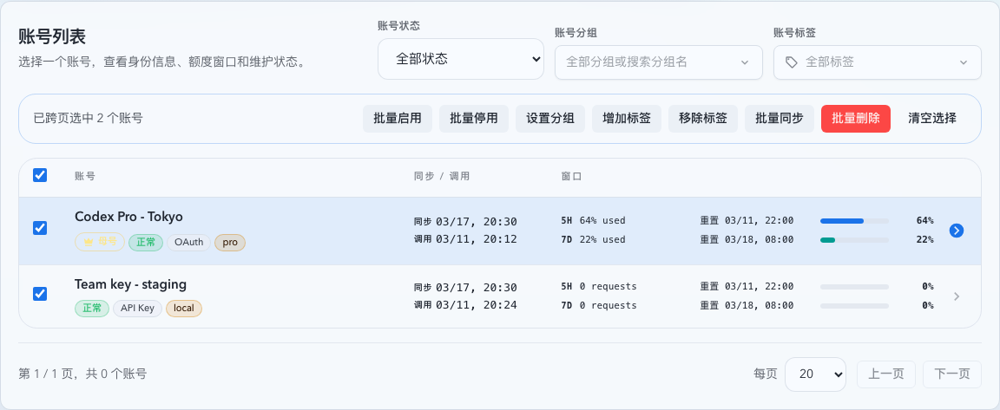
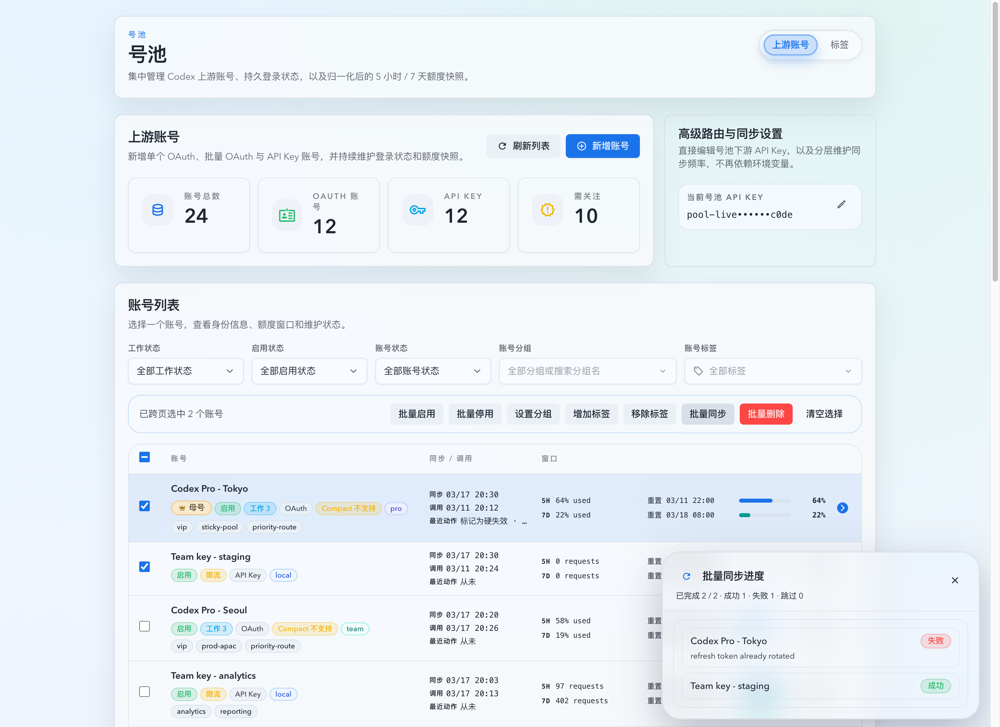
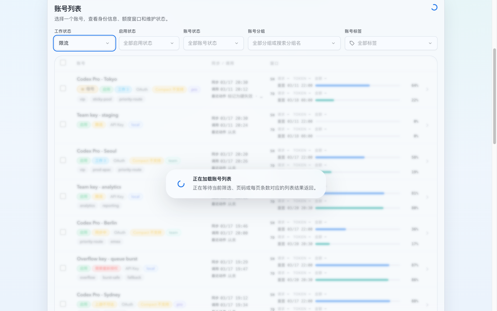
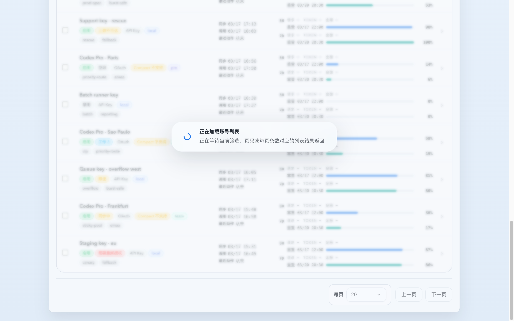
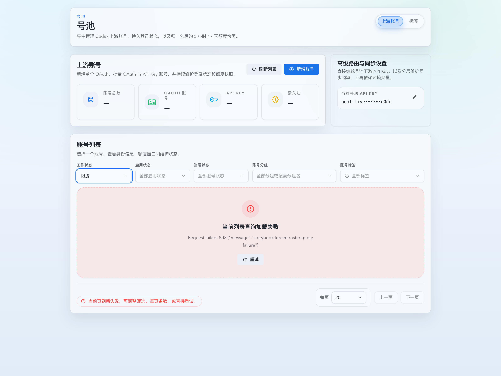

# 上游账号列表分页、跨页选择与批量操作（#enzf8）

## 状态

- Status: 已实现，待 PR / CI 收敛
- Created: 2026-03-22
- Last: 2026-04-02

## 背景 / 问题陈述

- 上游账号列表已经具备基础筛选与详情能力，但当前仍是一次性加载全部账号，账号数增长后会放大首屏负载，也不利于批量管理。
- 列表目前缺少跨页选择与成组操作，用户无法对几十到上百个账号执行统一启停、同步、删改分组或标签。
- 现有状态展示仍混合原始持久化状态与前端基于 `lastError` 的临时推断，badge、筛选项和 attention 统计容易出现口径漂移。
- 批量同步需要与已有单账号 actor 串行约束兼容，同时保持前端可见的实时进度，避免“点了没反馈”。
- 筛选、分页、`pageSize`、手动 refresh 与 `upstream-accounts:changed` 触发的列表刷新目前没有显式 freshness 生命周期；旧 query 成功/失败晚到时，会在新 query 已生效后继续把上一份 rows 或错误语义刷回页面。
- 现有页脚摘要与页码按钮会在 query 切换后的宽限窗口外继续复用旧列表数据，慢请求与失败请求场景下容易把 stale rows 冒充成“当前筛选结果”。

## 目标 / 非目标

### Goals

- 将 `GET /api/pool/upstream-accounts` 改为服务端分页，`pageSize` 仅支持 `20 / 50 / 100`，默认 `20`。
- 统一收口 7 个展示状态：`active`、`syncing`、`needs_reauth`、`upstream_unavailable`、`upstream_rejected`、`error_other`、`disabled`。
- 列表支持跨页选择、当前页全选和批量操作，分页切换时保留 `selectedIds`，筛选条件或 `pageSize` 变化时清空选择并回到第 1 页。
- 新增同步外批量动作：`delete`、`enable`、`disable`、`set_group`、`add_tags`、`remove_tags`，返回逐账号结果。
- 新增批量同步后台 job + SSE 进度流，前端可显示 snapshot、逐行结果和终态。
- 为列表 query 引入稳定 freshness 生命周期：筛选、分页、`pageSize`、手动 refresh 与外部 `upstream-accounts:changed` 都必须绑定到当前 query key；旧 query 的成功或失败都不能再覆盖当前列表语义。
- query 切换后最多保留旧表格 `600ms`；超过宽限后若当前 query 仍未完成，列表区必须进入绑定当前 query 的阻塞 loading：旧 rows 可作为冻结、置灰、不可交互的背景保留，以维持高度与滚动稳定；同时必须在表格内部、优先贴近当前视口中部显示半透明磨砂 loading 提示卡片，并同步隐藏旧分页摘要与旧跨页选择派生信息；分页控件保留在原位但只能按当前 query 的 loading 态禁用。
- 列表区进入阻塞 loading 后必须保持上一稳定渲染高度；仅在当前 query 加载完成后才允许恢复为自适应内容高度，避免列表面板跳塌。
- 当前 query 失败时，列表区必须显示与当前 query 绑定的 inline error + retry，而不是继续展示上一 query 的表格内容。

### Non-goals

- 不扩展数据库中原始 `status` 枚举。
- 不提供“选中当前全部筛选结果”的超集选择入口。
- 不把所有批量操作都改成后台 job。
- 不新增批量组备注编辑或新的账号详情能力。

## 范围（Scope）

### In scope

- `src/upstream_accounts/mod.rs`：列表分页、展示状态分类器、批量 mutation、批量同步 job 与 SSE 事件流。
- `src/main.rs`：批量操作与批量同步相关路由接线。
- `web/src/lib/api.ts`、`web/src/hooks/useUpstreamAccounts.ts`：分页查询参数、展示状态、批量操作与批量同步接口对接。
- `web/src/hooks/useUpstreamAccounts.ts`：列表 freshness/loading 元数据、query key 代次收口与 stale response 丢弃。
- `web/src/pages/account-pool/UpstreamAccounts.tsx`、`web/src/components/UpstreamAccountsTable.tsx`：状态筛选、跨页选择、批量工具条、分页 footer、批量对话框与同步进度展示。
- `web/src/i18n/translations.ts`、相关 Vitest / Storybook，以及 `docs/specs/README.md`。

### Out of scope

- 账号详情页的非批量交互重构。
- “当前筛选结果全选”服务端游标协议。
- 原始 `status` 的存储结构变更或历史数据迁移。

## 接口契约（Interfaces & Contracts）

### `GET /api/pool/upstream-accounts`

- 新增 query 参数：
  - `status`
  - `page`
  - `pageSize`
- `pageSize` 非法值统一回退到 `20`，有效值仅允许 `20 / 50 / 100`。
- 返回体新增：
  - `total`
  - `page`
  - `pageSize`
  - `metrics`
- 每个账号 summary 新增 `displayStatus`，用于列表 badge、筛选和顶部 attention 统计。
- 服务端分页语义继续固定为“先按当前筛选条件过滤，再对过滤结果切页”；本次 freshness 修复不改变现有 HTTP query 与响应字段。

### 列表 freshness / loading 生命周期

- 当前列表 query key 由 `status/displayStatus/enabled/workStatus/enableStatus/healthStatus/group/tag/page/pageSize` 等当前筛选分页参数稳定序列化得到；相同 query key 的 refresh / 外部 changed 事件只允许重刷该 key 对应的数据。
- `useUpstreamAccounts` 必须同时暴露：
  - 当前 query key
  - 最近一次已命中数据的 query key
  - `fresh | stale | missing | deferred` freshness
  - `idle | deferred | initial | switching | refreshing` loadingState
- 当 query key 改变时：
  - 旧 query 数据最多允许继续显示 `600ms`
  - 超时后若新 query 仍未完成，列表区进入阻塞 loading：旧 rows 可继续作为冻结、置灰、不可交互的背景保留；但旧 total / 旧 pageCount / 旧 selection 派生 UI 不得继续对外展示，分页控件只允许保留原位并进入禁用态
  - 阻塞 loading 生效后，列表区容器沿用上一稳定渲染高度；待当前 query 命中并完成加载后再释放高度约束
- 当 refresh 或外部 `upstream-accounts:changed` 在当前 query key 上重刷时：
  - 若当前 query 已有命中数据，可保留当前 rows 并标记为 refreshing
  - 若当前 query 尚未命中数据，则仍按 blocking loading / error 语义处理
- 任何不再匹配当前 query key 的 success / error 回包都必须被丢弃，不得回写当前页面的 rows、分页、错误提示或批量工具条状态。

### 展示状态分类

- 服务端统一派生 `displayStatus`，优先级如下：
  - `disabled`
  - `syncing`
  - `needs_reauth`
  - `upstream_unavailable`
  - `upstream_rejected`
  - `error_other`
  - `active`
- 前端不再基于 `lastError` 自行推断筛选键；仅保留 OAuth bridge legacy hint 的文案识别。

### 批量操作

- `POST /api/pool/upstream-accounts`
  - 请求体包含 `action` 与显式 `accountIds[]`。
  - 支持动作：`delete`、`enable`、`disable`、`set_group`、`add_tags`、`remove_tags`。
  - 返回逐账号结果：成功、失败或跳过原因彼此独立，不做整批回滚。

### 批量同步

- `POST /api/pool/upstream-accounts/bulk-sync-jobs`
  - 创建后台同步 job，只接受显式 `accountIds[]`。
  - 同一时间最多存在 1 个运行中的 job；若已有运行中 job，创建请求直接返回该 job 的当前 snapshot，不再新建任务。
- `GET /api/pool/upstream-accounts/bulk-sync-jobs/:jobId`
  - 返回当前 snapshot。
- `GET /api/pool/upstream-accounts/bulk-sync-jobs/:jobId/events`
  - SSE 事件至少包含：`snapshot`、`row`、`completed`、`failed`、`cancelled`。
- `DELETE /api/pool/upstream-accounts/bulk-sync-jobs/:jobId`
  - 取消尚未完成的 job。
- disabled 账号在批量同步中允许被标记为 `failed` 或 `skipped`，其它账号继续执行。

## 验收标准（Acceptance Criteria）

- Given 打开上游账号页，When 首次请求列表，Then 使用 `page=1&pageSize=20`，并能在界面切换为 `50` 或 `100`。
- Given 用户在第 1 页和第 2 页分别勾选账号，When 翻页往返，Then 已选数量持续累计且对应页的勾选状态保持不变。
- Given 已存在跨页选择，When 修改状态、分组、标签筛选或 `pageSize`，Then 选择立即清空且页码回到第 1 页。
- Given 用户切换状态筛选，When 查看列表 badge、筛选结果和顶部 attention 卡，Then 三者都基于同一 `displayStatus` 口径。
- Given 用户切换任一筛选、`pageSize` 或上一页/下一页，When 新 query 超过 `600ms` 仍未返回，Then 列表区必须切换到绑定当前 query 的阻塞 loading：旧 rows 只能以冻结、置灰、不可交互的背景保留，不能继续被当成当前 query 结果。
- Given query 宽限已结束且当前 query 仍未命中，When 页面重新渲染列表区，Then 分页摘要、空态与批量工具条都不得继续基于旧 query 的 `items/total/pageCount` 渲染误导信息；分页控件可保留在原位，但只能以当前 query 的禁用 loading 态展示。
- Given 旧 query 宽限已结束并进入阻塞 loading，When 用户仍停留在列表页，Then 列表区继续占用上一稳定渲染高度，不会在 loading 期间突然塌缩；待当前 query 成功返回后才恢复为按内容自适应高度。
- Given 用户停留在长列表底部分页区，When 慢分页切换进入阻塞 loading，Then 当前视口中部仍能看到表格内部的半透明磨砂 loading 提示卡片，且底部分页控件继续留在原位并被禁用，而不是整屏只剩空白内容。
- Given 存在多个并发 query，When 较早 query 在较晚 query 之后才成功或失败，Then 只有最后一个仍匹配当前 query key 的响应可以回写列表；较早 query 的 success / error 必须被丢弃。
- Given 当前 query 失败，When 页面进入错误态，Then 列表区显示与当前 query 绑定的 inline error + retry，且旧 query 表格内容不再继续保留在可见区。
- Given 用户点击手动 refresh，或外部发出 `upstream-accounts:changed` 事件，When 当前 query 仍处于某个筛选 / 分页组合，Then 重新请求继续尊重该 query key，而不是把不满足当前筛选的旧列表重新刷回页面。
- Given 用户执行批量启用、停用、删除、设置分组、加标签或减标签，When 请求完成，Then 返回逐账号成功/失败摘要且成功项不因单账号失败回滚。
- Given 用户发起批量同步，When job 运行中，Then 页面通过 SSE 持续收到 snapshot 与 row 进度，并在完成后刷新列表。
- Given 用户在批量同步创建请求尚未返回时连续点击，When 请求命中前后端限制，Then 只会保留 1 个运行中的同步 job，后续创建请求复用现有 job。
- Given 批量同步中包含 disabled 账号，When job 结束，Then disabled 账号被标记为失败或跳过原因，其余账号仍继续同步。
- Given 批量同步发出 `completed`、`failed` 或 `cancelled` 终态事件，When 前端接收 SSE 或重新读取 `GET /api/pool/upstream-accounts/bulk-sync-jobs/:jobId`，Then 两者暴露的 `snapshot.status` 必须一致且均为终态，而不是残留 `running`。
- Given 批量同步进入任一终态，When 页面重新渲染批量工具条，Then 除当前无关的其它批量按钮必须立即解锁，且不能因为终态 payload 内的陈旧 `running` 状态继续被禁用。
- Given 批量同步以 `completed` 结束且 `failed=0`、`skipped=0`，When 页面收到终态事件，Then 右下角同步进度气泡自动收起，同时仍会刷新账号列表。
- Given 批量同步以 `failed`、`cancelled` 结束，或 `completed` 但存在任一 `failed/skipped` 行，When 页面收到终态事件，Then 同步进度以悬浮气泡形式保持可见、展示终态结果，并允许用户手动点击“收起”关闭而不清空当前跨页选择。
- Given 用户在账号列表中查看或滚动内容，When 同步进度气泡出现，Then 它必须以浮层形式悬浮在视口右下角，不占用列表正文的文档流高度。

## 非功能性验收 / 质量门槛（Quality Gates）

### Testing

- Rust: `cargo test upstream_accounts -- --nocapture`
- Web: `cd web && bun x vitest run src/hooks/useUpstreamAccounts.test.tsx src/pages/account-pool/UpstreamAccounts.test.tsx src/components/UpstreamAccountsTable.test.tsx`
- Storybook: `cd web && bun run build-storybook`

### Quality checks

- Rust format/typecheck: `cargo fmt --check`、`cargo check`
- Web build: `cd web && bun run build`

## 实现里程碑（Milestones / Delivery checklist）

- [x] M1: 新建 spec，冻结分页参数、展示状态、选择清空规则与批量同步 job 契约。
- [x] M2: 后端列表接口补齐 `status/page/pageSize`、`displayStatus` 与分页返回字段。
- [x] M3: 后端新增批量 mutation 与批量同步 job/SSE。
- [x] M4: 前端落地状态筛选、跨页选择、批量工具条、分页 footer 与批量对话框。
- [x] M5: 补齐相关测试、更新 README 索引，并收敛到 merge-ready。
- [x] M6: 修正批量同步终态 `snapshot.status` 传播、前端终态解锁/收起逻辑与对应回归测试。
- [ ] M7: 完成终态面板 Storybook 视觉证据入库授权，并继续快车道 PR 收敛。
- [x] M8: 收口列表 query freshness：筛选/分页/`pageSize`/refresh/外部 changed 全部绑定当前 query key，旧 query 成功或失败都不再污染当前列表。
- [x] M9: 列表 query 宽限改为 `600ms` stale grace + blocking loading / current-query inline error，并补齐 Storybook 与 Vitest 回归。

## 风险 / 假设

- 假设：展示状态仅用于 UI 展示与筛选，底层持久化原始 `status` 继续保留现有语义。
- 假设：跨页选择仅在当前筛选集合内有效，任一筛选条件变更即清空。
- 风险：批量同步需要同时维护 actor 串行和 SSE 快照一致性，若 row 终态与 snapshot 聚合不同步，前端进度面板会出现闪烁或错误计数。
- 风险：批量标签增减依赖逐账号读取并更新标签集合，若结果摘要口径不清晰，容易让用户误判部分成功。
- 风险：终态 SSE 若继续复用未终态化的 snapshot，前端会把整批同步视为仍在运行，导致批量工具条误锁、进度卡片既不自动收起也无法手动关闭。
- 风险：视觉证据需要截图文件随分支提交；若主人不允许提交该图片，需要保留当前本地证据并在快车道阶段记录该阻断。
- 假设：顶部总览卡片可继续复用当前页面已有聚合口径；本次 freshness 阻塞范围以列表区、分页摘要、页码按钮、空态与批量工具条为准，不额外扩展到整页 skeleton 重构。

## Visual Evidence

- source_type: storybook_canvas
  target_program: mock-only
  capture_scope: element
  sensitive_exclusion: N/A
  submission_gate: approved
  story_id_or_title: Account Pool / Pages / Upstream Accounts / Operational
  state: bulk-selection-toolbar-and-pagination
  evidence_note: 验证账号列表面板已具备跨页批量工具条、账号状态筛选位，以及分页 footer 中的页码与每页条数控件；当前页勾选后会展示批量启用、停用、分组、标签、同步与删除入口。
  image:
  

- source_type: storybook_canvas
  target_program: mock-only
  capture_scope: browser-viewport
  sensitive_exclusion: N/A
  submission_gate: approved
  story_id_or_title: Account Pool / Pages / Upstream Accounts / List — Bulk Sync Failure Dismiss
  state: bulk-sync-terminal-failure
  evidence_note: 验证批量同步终态失败时，进度以右下角悬浮气泡展示，保留失败行与终态统计，批量工具条已解锁，并提供图标式“收起”按钮供手动关闭且不挤压列表正文。
  image:
  

- source_type: storybook_canvas
  target_program: mock-only
  capture_scope: browser-viewport
  sensitive_exclusion: N/A
  submission_gate: pending-owner-approval
  story_id_or_title: Account Pool / Pages / Upstream Accounts / List — Slow Filter Switch
  state: stale-grace-expired-filter-switch
  evidence_note: 验证切换 `工作状态=限流` 后，旧 query 超过 `600ms` 进入阻塞 loading；表格内部会在当前视口中部显示半透明磨砂 loading 提示卡片，旧 rows 仅以冻结置灰背景保留，分页摘要已隐藏，列表区域高度保持上一稳定尺寸。
  image:
  

- source_type: storybook_canvas
  target_program: mock-only
  capture_scope: browser-viewport
  sensitive_exclusion: N/A
  submission_gate: pending-owner-approval
  story_id_or_title: Account Pool / Pages / Upstream Accounts / List — Slow Page Switch
  state: stale-grace-expired-page-switch
  evidence_note: 验证长列表底部分页切换超出 `600ms` 宽限后，表格内部的半透明磨砂 loading 提示卡片会优先出现在当前视口中部，旧页 rows 冻结置灰保留高度，底部分页控件继续留在原位但禁用，旧页摘要不再继续误导为当前 query 结果。
  image:
  

- source_type: storybook_canvas
  target_program: mock-only
  capture_scope: browser-viewport
  sensitive_exclusion: N/A
  submission_gate: pending-owner-approval
  story_id_or_title: Account Pool / Pages / Upstream Accounts / List — Current Query Failure
  state: current-query-inline-error
  evidence_note: 验证当前 query 失败时，列表区以 inline error + retry 阻塞展示，旧表格内容不再继续保留在可见区，同时页脚控件仍按当前失败态原位展示。
  image:
  

## 变更记录（Change log）

- 2026-03-22: 创建 spec，冻结分页、展示状态、跨页选择、批量操作与批量同步的范围和契约。
- 2026-03-22: 完成后端列表分页、`displayStatus` 分类器、批量 mutation、批量同步 job/SSE，以及前端跨页选择、分页 footer、状态筛选和批量交互 UI。
- 2026-03-22: 本地验证通过 `cargo fmt --check`、`cargo check`、`cargo test upstream_accounts -- --nocapture`、`cd web && bun run build` 与定向 Vitest 回归，按 fast-track 收口到 merge-ready。
- 2026-03-26: 修正批量同步终态事件仍携带 `running snapshot.status` 的回归问题，前端改为按事件类型强制收敛终态、立即解锁批量工具条，并区分“全成功自动收起”与“非成功终态手动收起”。
- 2026-03-26: 补齐后端终态 SSE / snapshot 一致性测试、前端 EventSource 回归测试与 Storybook 终态场景；本地验证通过 `cargo test finish_bulk_sync_job_ -- --nocapture`、`cargo test bulk_upstream_account_sync_job -- --nocapture`、`cd web && bun run test -- src/pages/account-pool/UpstreamAccounts.test.tsx` 与 `cd web && bun run build-storybook`。
- 2026-03-26: 已生成并获主人确认的批量同步终态失败 mock-only Storybook 视觉证据，证据路径收敛为稳定资产文件并进入 spec `## Visual Evidence`。
- 2026-03-26: 根据最新交互反馈，将批量同步终态面板改为右下角悬浮气泡展示，避免占用账号列表正文文档流，并进一步把“收起”动作改成图标式按钮，补充对应的 Storybook / Vitest 断言。
- 2026-03-31: 为 `useUpstreamAccounts` 引入 query-key freshness / loading 状态机；筛选、分页、`pageSize`、手动 refresh 与外部 `upstream-accounts:changed` 全部绑定到当前 query key，旧 query 的 success / error 不再回写当前列表。
- 2026-03-31: 号池列表在 query 切换后新增 `600ms` stale grace；超时后列表区、分页摘要与页码按钮统一切到 blocking loading，当前 query 失败时改为 inline error + retry，不再保留上一 query 的旧表格内容。
- 2026-03-31: 补齐 Storybook 慢筛选切换 / 慢分页切换 / 当前 query 失败三组稳定场景，以及 `useUpstreamAccounts` / `UpstreamAccountsPage` / `UpstreamAccountsTable` 定向回归；本地验证通过 `cd web && bun x vitest run src/hooks/useUpstreamAccounts.test.tsx src/pages/account-pool/UpstreamAccounts.test.tsx src/components/UpstreamAccountsTable.test.tsx`、`cd web && bun run build` 与 `cd web && bun run build-storybook`。
- 2026-04-01: 根据最新交互反馈，阻塞 loading 期间冻结列表区上一稳定高度，待当前 query 加载完成后再恢复自适应内容高度，并补齐对应 Vitest 断言与慢筛选视觉证据更新。
- 2026-04-02: 根据最新长列表交互反馈，阻塞 loading 改为“冻结旧 rows + 置灰遮罩 + 表格内部居中半透明磨砂 loading 卡片 + 页脚分页控件原位禁用”组合反馈，避免长列表切页时视口空白或滚动跳动；同步更新 spec 契约与三张 Storybook 视觉证据。
