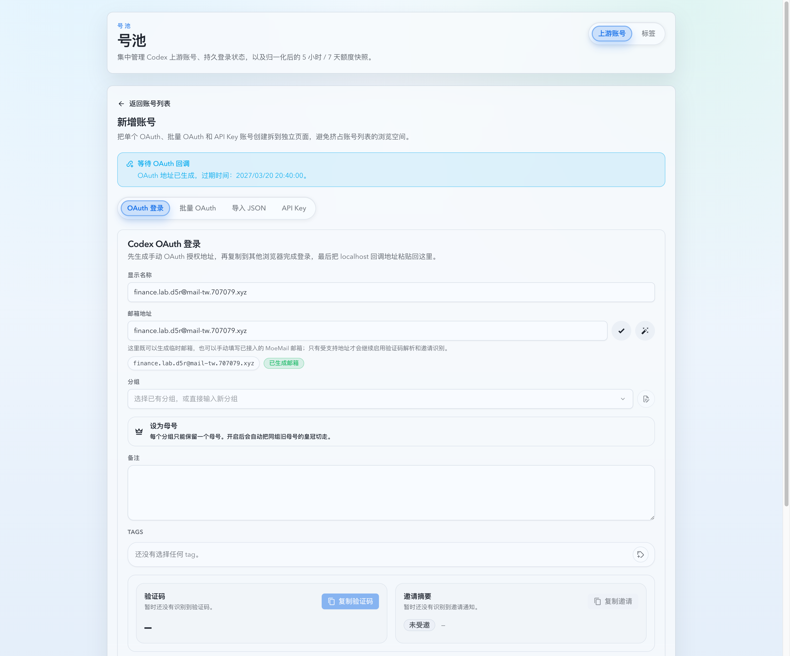
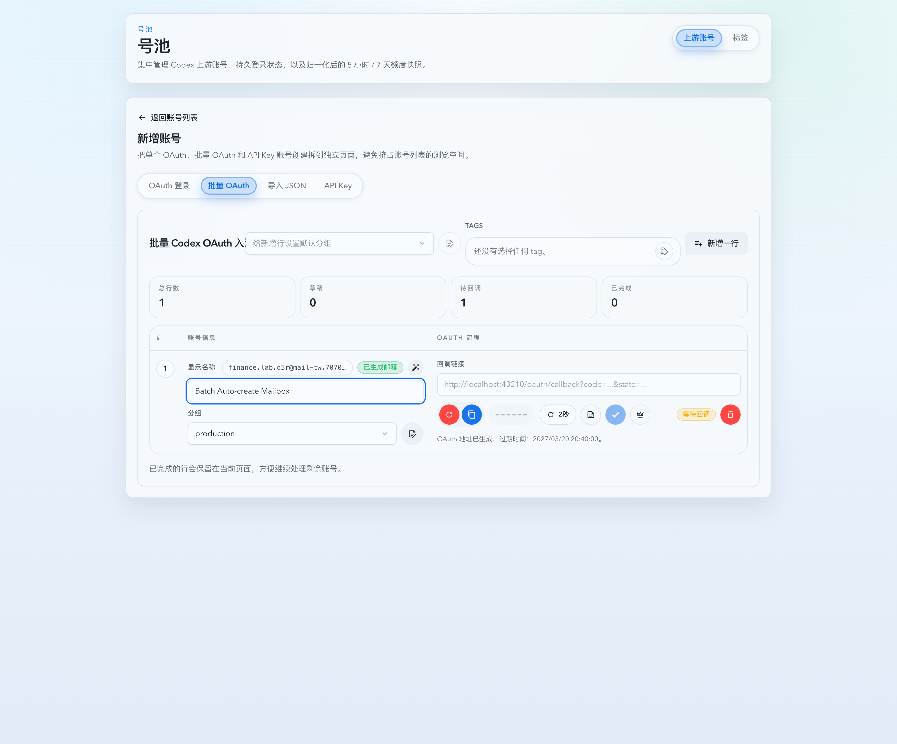

# OAuth 手动邮箱域名识别与缺失即创建（#fffqk）

## 状态

- Status: 已完成（PR #234）
- Created: 2026-03-25
- Last: 2026-03-25

## 背景

- 现有 `m7a9k` 已支持单账号 OAuth / reauth 手动附着 MoeMail 邮箱，但后端仍假设 MoeMail `/api/config` 的域名列表一定是“裸域名逗号串”。
- 真实配置会出现 `@domain`、大小写混写、甚至被误录成完整邮箱 token 的常见变体，导致 `finance.lab.d5r@mail-tw.707079.xyz` 这类已接入域名被误判成 `unsupported_domain`。
- 现有逻辑在支持域名下如果 `GET /api/emails` 没枚举到目标地址，会直接降级成 `not_readable`，没有主动补建邮箱，和运营期望不符。

## 目标 / 非目标

### Goals

- 为手动邮箱附着链路补齐 MoeMail 支持域名归一化，兼容裸域名、`@domain`、大小写混写与误带完整邮箱 token 的常见配置变体。
- 当手填邮箱域名受支持但当前 MoeMail 不存在该地址时，服务端主动按“请求 local-part + 请求 domain”补建邮箱，并返回可继续增强能力的邮箱会话。
- 将“手填但由系统补建”的邮箱会话明确落为 `generated` 生命周期，继续复用现有显式删除与过期清理的远端删除语义。
- 保持现有 HTTP / TS 契约、前端交互入口和不支持场景的非阻塞降级口径不变。

### Non-goals

- 不扩展到 MoeMail 之外的邮箱供应商，也不新增邮箱管理页。
- 不改变 `invalid_format / unsupported_domain / not_readable` 这组原因枚举。
- 不修改 OAuth begin / complete 的字段形状，也不新增前端专用补建标志位。

## 功能规格

### 后端 / 数据

- `src/upstream_accounts/mod.rs` 必须新增 MoeMail 域名归一化辅助逻辑，并统一用于 `/api/config` 的支持域名解析。
- `POST /api/pool/upstream-accounts/oauth/mailbox-sessions` 在手填地址路径下改为：
  - 格式校验；
  - 支持域名判定；
  - `GET /api/emails` 精确匹配现有邮箱；
  - 未命中时调用 `POST /api/emails/generate`，使用请求 local-part + 请求 domain 主动补建；
  - 仅当 MoeMail 返回地址与请求地址精确匹配时才接受结果。
- 手填但补建成功的邮箱会话必须写入 `mailbox_source=generated`；已存在且直接附着的邮箱继续使用 `attached`。
- `DELETE /api/pool/upstream-accounts/oauth/mailbox-sessions/:sessionId` 与过期清理都必须继续对这类补建邮箱执行 MoeMail 远端删除。

### 前端 / Storybook

- 单账号 OAuth 页面继续复用现有 UI；当手填地址是“系统补建成功”时，允许沿用当前 `Generated mailbox` 标识。
- Batch OAuth 邮箱气泡编辑也必须覆盖同一路径，确保行级手填地址在补建成功后仍可继续生成 OAuth URL。
- Storybook mock 必须区分“已存在地址 => attached”和“缺失地址 => generated”两种成功路径。

## 验收标准

- Given MoeMail 配置把 `mail-tw.707079.xyz` 记录成 `@MAIL-TW.707079.XYZ` 或完整邮箱 token，When 用户输入 `finance.lab.d5r@mail-tw.707079.xyz`，Then 接口返回 `supported=true`，不能误报 `unsupported_domain`。
- Given 该地址已存在于 MoeMail，When 用户附着该地址，Then 保持 `source=attached`，且不额外创建远端邮箱。
- Given 该地址域名受支持但当前不存在于 MoeMail，When 用户附着该地址，Then 服务端主动补建该精确地址、返回 `supported=true`，并允许后续验证码 / 邀请增强链路继续工作。
- Given 一个手填补建出来的邮箱会话被显式删除或因过期被清理，When 清理发生，Then 必须继续删除对应的 MoeMail 远端邮箱。

## 质量门槛

- `cargo check`
- `cargo test`
- `cd web && bun run test`
- `cd web && bun run build`
- Storybook 交互回归：单账号 OAuth 与 Batch OAuth 邮箱气泡编辑各验证 1 条“自动创建成功”路径

## Visual Evidence

- source_type: storybook_canvas
  target_program: mock-only
  capture_scope: browser-viewport
  sensitive_exclusion: N/A
  submission_gate: approved
  story_id_or_title: Account Pool/Pages/Upstream Account Create/OAuth — Manual Mailbox Auto Created
  state: manual mailbox auto-created
  evidence_note: 单账号 OAuth 手填 `finance.lab.d5r@mail-tw.707079.xyz` 后，页面显示生成邮箱标识并继续允许复制 OAuth 地址。
  PR: include
  image:
  

- source_type: storybook_canvas
  target_program: mock-only
  capture_scope: browser-viewport
  sensitive_exclusion: N/A
  submission_gate: approved
  story_id_or_title: Account Pool/Pages/Upstream Account Create/Batch OAuth — Mailbox Popover Auto Create
  state: batch mailbox popover auto-created
  evidence_note: Batch OAuth 邮箱气泡编辑把地址改成 `finance.lab.d5r@mail-tw.707079.xyz` 后，行内显示生成邮箱标识，并保持 OAuth 地址生成功能可用。
  PR: include
  image:
  

## 变更记录

- 2026-03-25: 新建 follow-up spec，冻结手动邮箱支持域名归一化、缺失即创建和 `generated` 生命周期清理语义。
- 2026-03-25: 完成 MoeMail 手动邮箱域名归一化、缺失即创建和 `generated` 生命周期清理回归，并补充单账号 / Batch OAuth 的 Storybook mock 视觉证据。
- 2026-03-25: PR #234 已建立，视觉证据提交授权已确认，review-loop clear 且远端 checks 全绿，快车道收口为 merge-ready。
