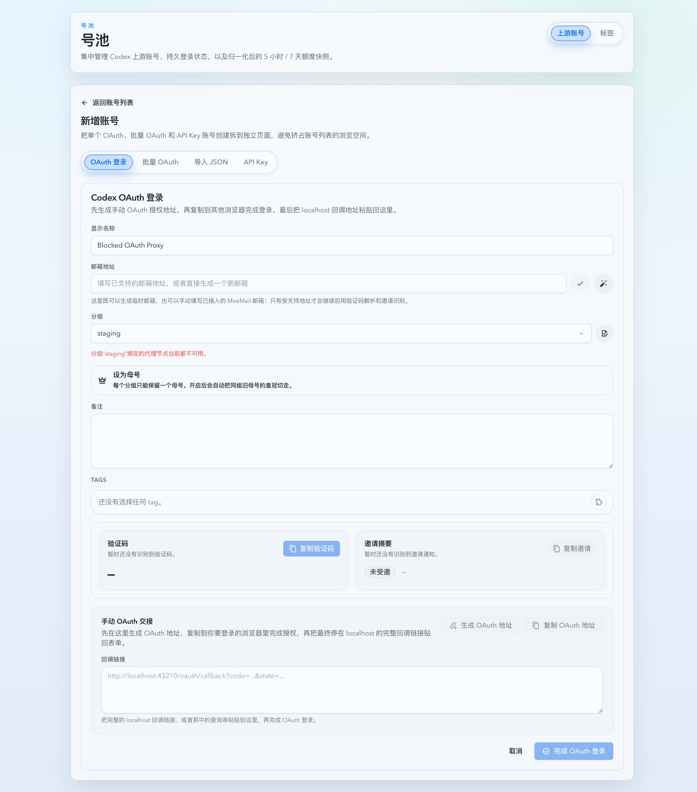
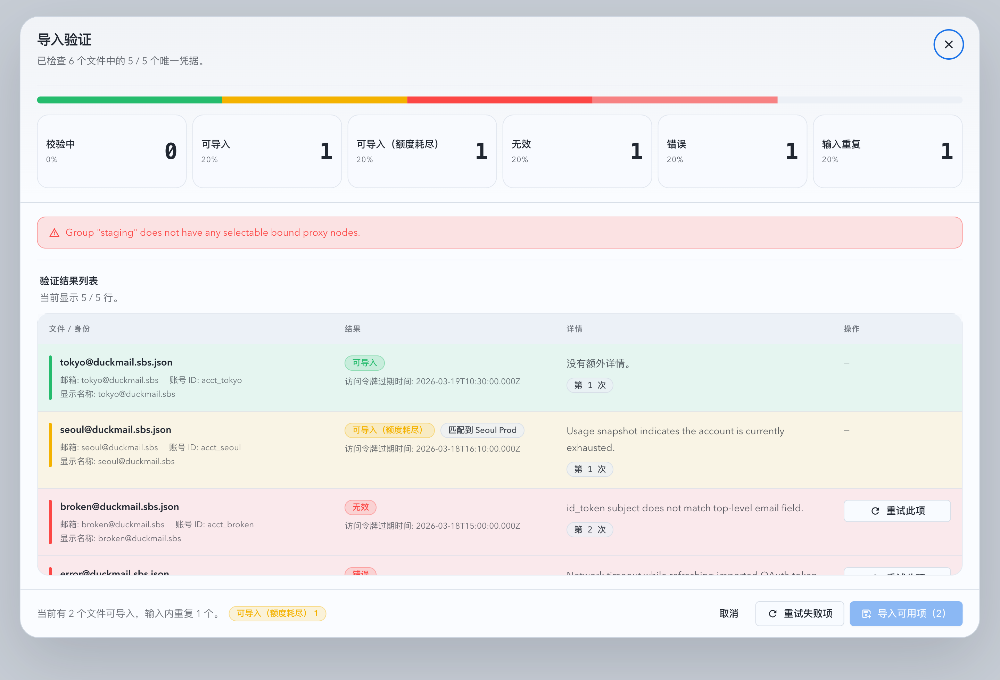

# 上游账号强制分组代理约束（#gp92q）

## 状态

- Status: 已完成
- Created: 2026-03-29
- Last: 2026-03-30

## 背景

- `#mww8f` 已把“已分组且已绑定节点”的账号上下文请求切到 forward proxy，但仍保留了两类宽松语义：
  - 账号缺少分组或分组缺少 `boundProxyKeys` 时，会退回 `Automatic`。
  - OAuth `token exchange / refresh` 与 imported OAuth validate 仍未统一进入分组代理约束。
- 新增账号页当前允许不选分组直接生成 OAuth URL、创建 API Key，导入验证也拿不到目标分组上下文，导致“新增账号必须选择一个分组，并严格复用分组绑定代理”的 invariant 无法闭合。
- 创建页对“新分组”的代理绑定目前只保存在前端草稿，后端待完成 OAuth session / 导入流程看不到这份绑定信息，因此无法在创建前执行硬校验。

## 目标

- 所有新增账号路径必须先确定目标分组；未选分组直接失败，并给出明确错误。
- 所有账号上下文请求都必须按“账号所属分组绑定的代理节点”发出；只要分组缺失、无绑定、或绑定集合当前无可用节点，都必须直接失败，不得回退 `Automatic`。
- OAuth `token exchange / refresh`、usage/manual sync/post-create sync/maintenance sync、imported OAuth validate/import、pool `/v1/*` live upstream request 全部纳入同一严格分组代理解析。
- 保留“新分组草稿”能力，但要把草稿 `boundProxyKeys` 一并带入 OAuth pending session、API Key create、导入验证/导入契约，确保创建前也能执行同一套硬校验。
- 邮箱 / MoeMail API 保持现状，不纳入分组代理强制范围。

## 非目标

- 不自动迁移历史未分组或未绑定代理的账号。
- 不新增空分组独立持久化接口，也不开放脱离账号/会话上下文的“草稿分组落库”。
- 不调整邮箱 API、自定义 temp mailbox 行为或 mailbox polling 节奏。

## 范围

### In scope

- `src/upstream_accounts/mod.rs`
  - 严格账号代理作用域解析与统一错误语义
  - OAuth session / API Key / imported OAuth validate/import 契约扩展
  - pending OAuth session 新增草稿 `boundProxyKeys` 持久化
  - OAuth exchange/refresh 改为走分组代理
- `src/main.rs`
  - pool `/v1/*` 账号上下文请求改为严格分组代理约束，不再允许账号缺组/缺绑定时退回 `Automatic`
- `web/src/pages/account-pool/UpstreamAccountCreate.tsx`
  - 单 OAuth、批量 OAuth、API Key、导入验证/导入的前端阻断、错误提示、草稿绑定透传
- `web/src/lib/api.ts`
  - 新增 `groupBoundProxyKeys` / validate-import `groupName` 契约
- `web/src/pages/account-pool/UpstreamAccountCreate.test.tsx`
- `web/src/components/UpstreamAccountCreatePage.oauth.stories.tsx`
- `web/src/components/UpstreamAccountCreatePage.batch-oauth.stories.tsx`

### Out of scope

- 账号列表/详情的视觉重构。
- 新增批量修复历史未分组账号的后端 job。
- MoeMail / mailbox session API 代理化。

## 功能规格

### 严格账号代理作用域

- 新增一个仅供“账号上下文请求”使用的严格解析层，输入至少包含：
  - `groupName`
  - `boundProxyKeys`
  - 可选的上下文来源描述（create oauth session / create api key / manual sync / oauth refresh / import validation / pool live request）
- 解析规则：
  - `groupName` 为空：返回明确 `group required` 配置错误。
  - `boundProxyKeys` 为空：返回明确 `bound proxy required` 配置错误。
  - `boundProxyKeys` 非空但当前 runtime 中没有任何 `selectable` 节点：返回明确 `no selectable bound proxy nodes` 配置错误。
  - 仅当三者满足后才允许构造 `ForwardProxyRouteScope::BoundGroup`。
- 该严格解析层不得复用 `ForwardProxyRouteScope::from_group_binding(...)` 当前的 permissive `Automatic` 回退语义。

### 新增账号与待完成会话契约

- `CreateOauthLoginSessionRequest` / `UpdateOauthLoginSessionRequest` 新增 `groupBoundProxyKeys?: string[]`。
- `CreateApiKeyAccountRequest`、`UpdateUpstreamAccountRequest` 中凡是允许改 `groupName` 的写路径，都新增 `groupBoundProxyKeys?: string[]`。
- `ValidateImportedOauthAccountsRequest`、validation-job 创建请求、`ImportValidatedOauthAccountsRequest` 新增：
  - `groupName`
  - `groupBoundProxyKeys?: string[]`
- 创建/更新规则：
  - 新增账号相关写入口在 `groupName` 缺失时直接返回 `400`。
  - 目标分组若是现有分组，后端以已保存的 group metadata 为主；传入的 `groupBoundProxyKeys` 仅用于现有 metadata 缺失时的兼容校验，不得悄悄覆盖现有分组绑定。
  - 目标分组若是尚未落库的新分组草稿，后端必须使用请求体中的 `groupBoundProxyKeys` 执行校验，并在首个账号/会话落地时一并保存到 group metadata。
- `pool_oauth_login_sessions` 新增 `group_bound_proxy_keys_json TEXT NOT NULL DEFAULT '[]'`，用于保存 pending OAuth session 对应的新分组草稿绑定。

### OAuth exchange / refresh

- `exchange_authorization_code` 与 `refresh_oauth_tokens` 改为支持“按账号/待创建账号分组代理”发请求。
- callback 路径在拿 token 前必须先根据 pending OAuth session 的 `groupName + groupBoundProxyKeys` 做严格校验；失败则 callback 终止并返回明确错误。
- OAuth 账号后续 refresh、usage snapshot、manual/post-create/maintenance sync 全部基于已落库账号的组信息走严格代理解析。

### Imported OAuth validate / import

- validate 与 validation-job 需要显式接收目标分组上下文。
- validate 阶段的 upstream probe 与 refresh 都必须走目标分组绑定代理；缺组/缺绑定时直接失败，不再用 `Automatic`。
- import 阶段沿用相同目标分组上下文；若是新分组草稿，首个写入时把 note + `boundProxyKeys` 一起原子保存到 group metadata。

### Pool live upstream request

- pool `/v1/*` 在选中账号后，账号上下文代理选择必须走严格解析：
  - 历史未分组账号 / 分组缺绑定 / 绑定节点全部不可用时，本次账号尝试直接失败。
  - 失败文案与 failure kind 要明确落在“group/bound proxy 配置错误”，不再泛化成 `failed to select forward proxy node`。

### 邮箱 API 排除

- 以下接口保持现状，不受本项影响：
  - mailbox session create
  - mailbox status refresh
  - mailbox session delete

## 验收标准

- Given 单 OAuth / 批量 OAuth / API Key / imported OAuth validate/import 未选分组，When 用户尝试生成 OAuth URL、创建账号、启动验证或导入，Then 前端阻断且后端返回明确 `group required` 错误。
- Given 目标分组无绑定代理、绑定集合为空、或绑定集合当前没有任何 `selectable` 节点，When 执行创建、验证、导入、sync、OAuth exchange/refresh、pool `/v1/*` 账号上下文请求，Then 直接失败，不得回退 `Automatic`。
- Given 目标分组是新分组草稿且草稿中已选择 `boundProxyKeys`，When 生成 OAuth URL、创建 API Key、运行导入验证或最终导入，Then 请求可通过，并在首个账号/会话落地时把 note + bindings 一起持久化到 group metadata。
- Given 历史账号仍未分组或未绑定代理，When 用户浏览列表/详情，Then 页面仍可读；When 用户触发账号上下文操作，Then 失败原因明确指向 group / bound proxy 配置问题。
- Given 邮箱相关 API，When 创建邮箱会话、轮询状态或删除邮箱，Then 行为保持不变。

## 质量门槛

- `cargo fmt`
- `cargo check`
- `cargo test`
- `cd web && bun run test`
- `cd web && bun run build`
- `cd web && bun run build-storybook`

## Visual Evidence

- source_type: storybook_canvas
  story_id_or_title: `account-pool-pages-upstream-account-create-oauth--blocked-by-unselectable-group-proxy`
  state: single oauth blocked by unavailable bound proxy
  evidence_note: 验证单 OAuth 在分组已选但绑定代理节点不可用时，会直接禁用生成 OAuth 地址，并给出明确的分组代理错误。

  

- source_type: storybook_canvas
  story_id_or_title: `account-pool-components-imported-oauth-validation-dialog--import-blocked-by-group-proxy`
  state: import validation blocked by unavailable bound proxy
  evidence_note: 验证导入校验结果弹窗会明确显示目标分组缺少可用绑定代理，且导入按钮保持禁用。

  

## 变更记录

- 2026-03-29: 创建 spec，冻结“新增账号必须选分组 + 所有账号上下文请求强制走分组绑定代理 + OAuth exchange/refresh 纳入代理”的实现边界。
- 2026-03-30: 完成前后端约束收口、Storybook 场景补齐与视觉证据回填，严格分组代理校验覆盖新增账号、导入验证与账号上下文请求。
