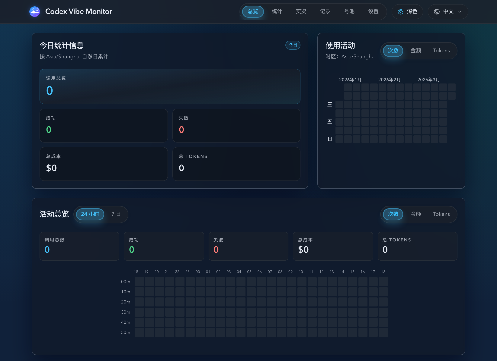
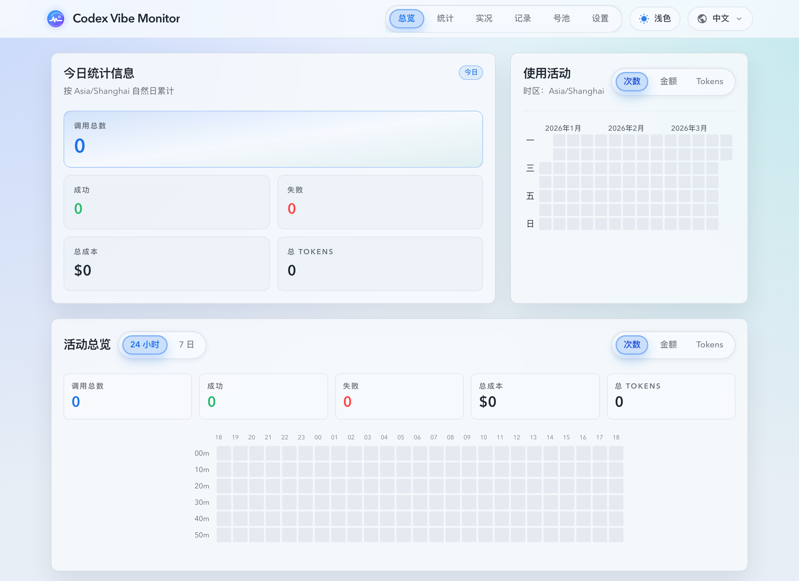

# 全站 segmented control family 统一与 Dashboard 样式修复（#h5k2r）

## 状态

- Status: 已完成（5/5）
- Created: 2026-03-24
- Last: 2026-03-24

## 背景 / 问题陈述

- 当前仓库里“看起来是同一类控件”的导航和分段切换实际上分成了三套实现：`segment-group/segment-button`、`app-nav-item/app-nav-item-active`，以及页面私有的额外 padding/font-weight 拼装。
- 主人明确指出截图中的 `①` 顶部导航与 `②` Dashboard 范围切换样式不对，而 `③` 的指标切换更接近预期；这暴露出视觉语言共享、但实现真相源已经分叉的问题。
- 如果继续让各页面手写 active/inactive 状态，后续 `Live`、`Records`、`Account Pool`、`UpstreamAccountCreate` 等页会继续出现“同类控件不同抬升、不同权重、不同 hover”的回归。

## 目标 / 非目标

### Goals

- 新增共享 `SegmentedControl` primitive family，统一容器胶囊、item hover、active 抬升、文字权重与 focus-visible 反馈。
- 让顶部导航和卡内切换都复用同一套 segmented control helper，只允许显式 `size` 差异，不再允许页面私有 active 样式分叉。
- 全量迁移当前现存分段切换调用点，并补 Storybook 与 Vitest 回归。
- 保持快车道终点为 merge-ready，不自动 merge。

### Non-goals

- 不改动 Rust backend、HTTP/SSE 契约、Dashboard 数据逻辑或路由结构。
- 不把主题切换与语言切换 `control-pill` 并入 segmented control family。
- 不在本轮重做卡片排版、信息架构或其它非分段控件视觉语言。

## 范围（Scope）

### In scope

- `web/src/components/ui/segmented-control.tsx`：新增 segmented control primitive、item 组件与路由 helper。
- `web/src/components/ui/segmented-control.stories.tsx`、`web/src/components/ui/segmented-control.test.tsx`、`web/src/components/AppLayout.test.tsx`：新增 story 与回归。
- `web/src/index.css`：收敛 segmented control family 的共享视觉 token。
- `web/src/components/AppLayout.tsx`、`DashboardActivityOverview.tsx`、`UsageCalendar.tsx`、`WeeklyHourlyHeatmap.tsx`、`Last24hTenMinuteHeatmap.tsx`、`web/src/pages/Live.tsx`、`Records.tsx`、`account-pool/AccountPoolLayout.tsx`、`account-pool/UpstreamAccountCreate.tsx`：迁移当前全部分段切换调用点。
- `docs/ui/components.md`、`docs/ui/patterns.md`、`docs/ui/storybook.md`、`docs/specs/README.md`。

### Out of scope

- `src/**` 后端代码、数据库结构、环境变量或 SSE 重连策略。
- `control-pill`、`SelectField`、combobox 或其它非 segmented control primitive。
- PR merge 与 post-merge cleanup。

## 接口契约（Interfaces & Contracts）

- `SegmentedControl`：
  - `size?: 'compact' | 'default' | 'nav'`
  - 透传 `className`、`role`、`aria-*`、`data-*` 到 group 容器。
- `SegmentedControlItem`：
  - `active?: boolean`
  - `size?: 'compact' | 'default' | 'nav'`
  - `asChild?: boolean`
  - 透传 `className`、`style`、`role`、`aria-*`、事件处理器到具体元素。
- `segmentedControlItemVariants(...)`：
  - 为路由驱动的 `NavLink` 暴露同一套 class helper，避免顶部导航回退成第二套 active/inactive 实现。
- 约束：
  - metric accent 颜色仍由业务组件通过 `style` 覆写，primitive 不感知 `totalCount/totalCost/totalTokens` 业务语义。
  - 生产代码不再直接使用 `segment-group`、`segment-button` 或 `app-nav-item` 作为真相源。

## 验收标准（Acceptance Criteria）

- Given 打开顶部导航、Dashboard 活动总览、UsageCalendar、Live、Records、Account Pool 和 UpstreamAccountCreate，When 查看 segmented control，Then 全部来自同一套 `SegmentedControl` family，而不是页面私有 class 组合。
- Given 查看 `①` 顶部导航与 `②` Dashboard 范围切换，When 对比 `③` 指标切换，Then 三者共享相同的圆角胶囊、轻边框、active 背景抬升、文字权重与 focus-visible 语言；若有差异，只能是显式 `size` 差异。
- Given Dashboard 活动总览，When 切换 `24 小时 / 7 日` 与 `次数 / 金额 / Tokens`，Then 现有范围切换、指标切换与“各范围独立记忆指标”的行为保持不变。
- Given 运行本轮前端验证命令，When 执行 `cd web && bun run test`、`cd web && bun run build`、`cd web && bun run build-storybook`，Then 全部通过。
- Given 进入快车道 PR 阶段，When latest PR checks 和 review-loop 收敛完成，Then 终态为 merge-ready 而不是 merged。

## 非功能性验收 / 质量门槛（Quality Gates）

### Testing

- `cd web && bun run test`
- 定向回归：`cd web && bun run test -- src/components/ui/segmented-control.test.tsx src/components/AppLayout.test.tsx src/pages/Dashboard.test.tsx src/pages/Live.test.tsx src/pages/Records.test.tsx src/components/WeeklyHourlyHeatmap.test.tsx`

### Quality checks

- `cd web && bun run build`
- `cd web && bun run build-storybook`

## 文档更新（Docs to Update）

- `docs/specs/README.md`
- `docs/specs/h5k2r-segmented-control-family/SPEC.md`
- `docs/ui/components.md`
- `docs/ui/patterns.md`
- `docs/ui/storybook.md`

## 视觉验收快照（Visual References）

- Directory: `docs/specs/h5k2r-segmented-control-family/assets/`
- 视图范围：裁剪到 header、顶部统计卡和活动总览，去掉下方大块空白，仅保留必要留白，便于对照 `① / ② / ③`。

## 实现里程碑（Milestones / Delivery checklist）

- [x] M1: 创建 spec，冻结 segmented control family 的接口、迁移范围与 fast-track merge-ready 收口标准。
- [x] M2: 新增 `SegmentedControl` primitive family，并把共享视觉 token 收敛到统一真相源。
- [x] M3: 完成顶部导航、Dashboard、UsageCalendar、Live、Records、Account Pool、UpstreamAccountCreate 的 segmented control 迁移。
- [x] M4: 新增 Storybook 与 Vitest 回归，并完成本地验证。
- [x] M5: 完成快车道提交、push、PR、review-loop 与远端 checks 收敛到 merge-ready。

## 方案概述（Approach, high-level）

- 用 `web/src/components/ui/segmented-control.tsx` 承接共享 primitive，并通过 `segmentedControlItemVariants` 为路由态导航保留同一份 style helper。
- 共享视觉基线继续落在 `web/src/index.css`，但只保留一套 `.segmented-control*` token，不再让导航和普通分段切换各自维护 active class。
- 页面迁移只替换渲染层与样式来源，不改状态流、接口请求或 metric accent 计算逻辑。
- Storybook 用单独 story 固化 compact/default/nav 三种典型形态；Vitest 则锁住 active state 与 Dashboard/Live/Records 既有交互不回退。

## 风险 / 开放问题 / 假设（Risks, Open Questions, Assumptions）

- 风险：顶部导航必须保持导航语义，不能因为统一视觉语言把 `NavLink` 伪装成 tab button。
- 风险：Dashboard 与 UsageCalendar 的 metric accent 依赖业务侧 inline style；若 primitive 抢走颜色职责，容易让指标语义回退。
- 风险：当前仓库已有多个 UI spec 与样式文档，本轮必须同步文档真相源，否则后续继续复制旧类名。
- 开放问题：无。
- 假设：`③` 指标切换是本轮视觉基线，`①` 与 `②` 向它收敛，而不是反向修改 `③`。

## 变更记录（Change log）

- 2026-03-24: 创建 spec，冻结 segmented control family 的范围、接口与 merge-ready 收口目标。
- 2026-03-24: 完成共享 primitive、现存调用点迁移、Storybook 新 story、Vitest 回归与本地 `bun run test` / `bun run build` / `bun run build-storybook` 验证。
- 2026-03-24: PR #220 完成 labels、远端 checks 与 `codex review --base origin/main` 收敛，快车道终态更新为 merge-ready。
- 2026-03-24: 根据截图复核修正深色主题 active 文本色，并补充深色 / 亮色裁剪验收图到 `./assets/`。

## 参考（References）

- `docs/specs/pqqpf-selectfield-simple-dropdown-rollout/SPEC.md`
- `docs/specs/dzbnx-dashboard-activity-overview-merge/SPEC.md`
- `docs/ui/components.md`
- `docs/ui/patterns.md`
