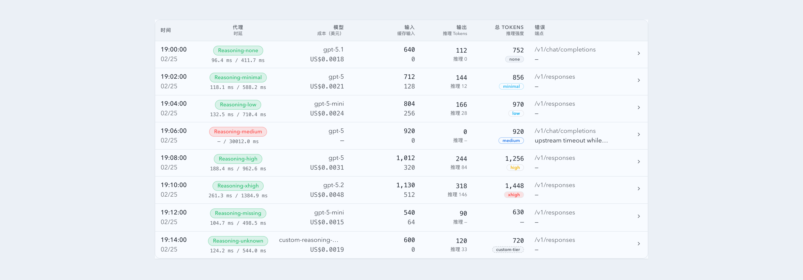

# InvocationTable 推理强度徽标色阶优化（#hbqe3）

## 状态

- Status: 已完成（4/4）
- Created: 2026-03-07
- Last: 2026-03-07

## 背景 / 问题陈述

- 当前 `InvocationTable` 的推理强度徽标只对 `high / medium / low` 做了粗粒度映射，其余状态大多退化成统一的灰色，视觉上难以看出强度梯度。
- 现有颜色同时混用了“状态色语义”和“强度语义”，例如 `medium` 与 `high` 的差异感不稳定，导致列表里不容易一眼判断推理负载级别。
- Storybook 已覆盖 `none / minimal / low / medium / high / xhigh / missing / unknown` 全部状态，但颜色体系没有随之升级。

## 目标 / 非目标

### Goals

- 为 `reasoningEffort` 建立稳定、可解释的颜色梯度，让同一列里的强度从弱到强可直观对比。
- 覆盖 `none / minimal / low / medium / high / xhigh / unknown / missing` 的显示规则，并保持亮色主题下可读。
- 同步更新 Storybook 文档与测试，防止后续回退到非渐进式颜色映射。

### Non-goals

- 不改后端字段、API、SSE 或数据库。
- 不调整 `reasoningTokens`、`outputTokens`、成本等数值口径。
- 不引入新的筛选器、排序或交互流程。

## 范围（Scope）

### In scope

- `web/src/components/InvocationTable.tsx` 推理强度徽标样式与映射。
- `web/src/components/InvocationTable.stories.tsx` Storybook 文档说明与视觉检查口径。
- `web/src/components/InvocationTable.test.tsx` 颜色映射相关渲染断言。

### Out of scope

- `src/**` Rust 后端
- 其它表格组件的 Badge 视觉体系

## 需求（Requirements）

### MUST

- `none / minimal / low / medium / high / xhigh` 必须拥有明确且递进的视觉层级。
- `unknown` 原始值必须与已知层级区分开，不能伪装成任一标准强度。
- `missing` 继续显示 `—`，不渲染成彩色徽标。
- 列表视图、移动卡片视图、展开详情视图必须共用同一套颜色语义。

### SHOULD

- Storybook Docs 需要说明新的颜色阶梯含义，方便主人快速核对。
- 测试应覆盖至少一个已知强度、一个未知强度与缺失值。

## 验收标准（Acceptance Criteria）

- Given `reasoningEffort=none|minimal|low|medium|high|xhigh`，When 列表渲染，Then 徽标颜色按从弱到强形成可辨识梯度，而不是多档落入同一灰色样式。
- Given `reasoningEffort=custom-tier`，When 列表与详情渲染，Then 仍显示原始文本，但使用“未知值”样式而非伪装成标准级别。
- Given `reasoningEffort` 缺失，When 组件渲染，Then 仍显示 `—`，且不产生多余徽标容器。
- Given Storybook `Reasoning Effort States`，When 主人查看所有状态，Then 能用文档与视觉结果一起确认颜色语义。

## 非功能性验收 / 质量门槛（Quality Gates）

### Testing

- `cd web && npm run test -- --run src/components/InvocationTable.test.tsx`
- `cd web && npm run build`

### UI / Storybook (if applicable)

- Stories to update: `InvocationTable.stories.tsx`
- Visual regression baseline changes (if any): None

## 文档更新（Docs to Update）

- `docs/specs/README.md`: 新增本 spec 索引。

## Visual Evidence (PR)

## 实现里程碑（Milestones / Delivery checklist）

- [x] M1: 冻结推理强度颜色梯度与未知值样式。
- [x] M2: 完成 InvocationTable 徽标渲染实现。
- [x] M3: 同步 Storybook 文档与测试。
- [x] M4: 快车道收敛到 PR/checks/review-loop。

## 风险 / 开放问题 / 假设（Risks, Open Questions, Assumptions）

- 风险：若直接复用通用 Badge 变体，可能再次与其它状态色语义耦合。
- 开放问题：None.
- 假设：本次主要面向亮色主题评审，沿用当前主题 token 即可满足可读性。
- 已验证：本地 `InvocationTable.test.tsx` 与 `build/build-storybook` 通过，颜色梯度在 Storybook `Reasoning Effort States` 可见。
- Review-loop：已修复两项实现风险（不受支持的 Tailwind opacity token、原型链键误判），当前无残留阻塞项。

## 变更记录（Change log）

- 2026-03-07: 初始化规格，锁定“推理强度颜色梯度优化 + Storybook/测试同步”范围。
- 2026-03-07: 完成徽标色阶实现与 Storybook 文档更新；已通过 `cd web && npm run test -- --run src/components/InvocationTable.test.tsx`、`cd web && npm run build`、`cd web && npm run build-storybook`。
- 2026-03-07: 快车道推进到 PR #94，并按 review-loop 修复 Tailwind opacity token 发射缺口与原型链键误命中问题；当前 checks 全绿。
- 2026-03-07: 根据主人确认补充 Storybook 视觉证据截图，并同步到 spec/PR 证据链。

## 参考（References）

- `docs/specs/rupn7-invocation-table-reasoning-effort/SPEC.md`
- `web/src/components/InvocationTable.stories.tsx`
