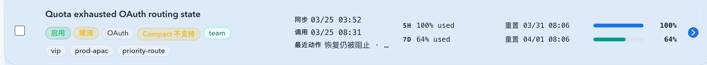
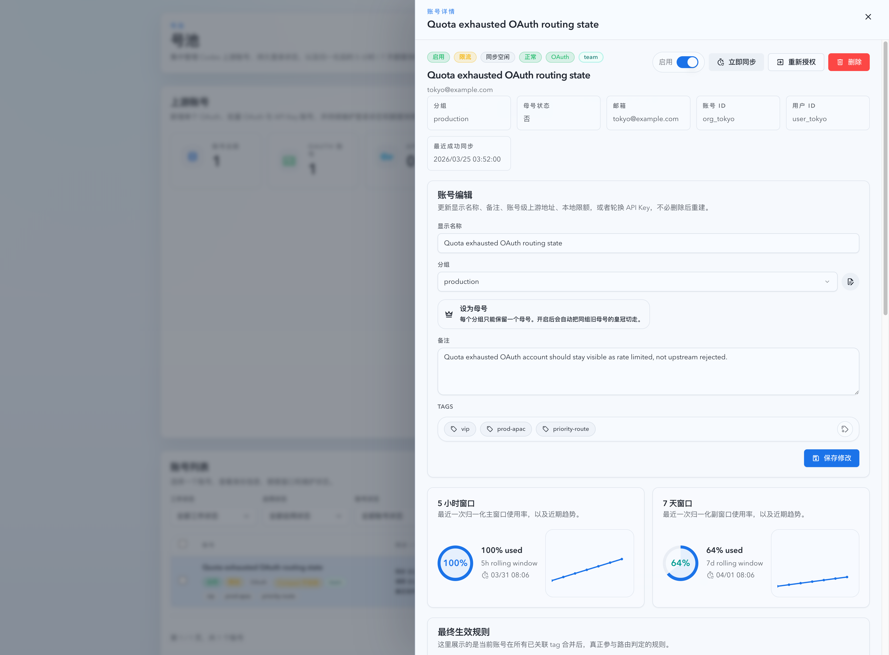
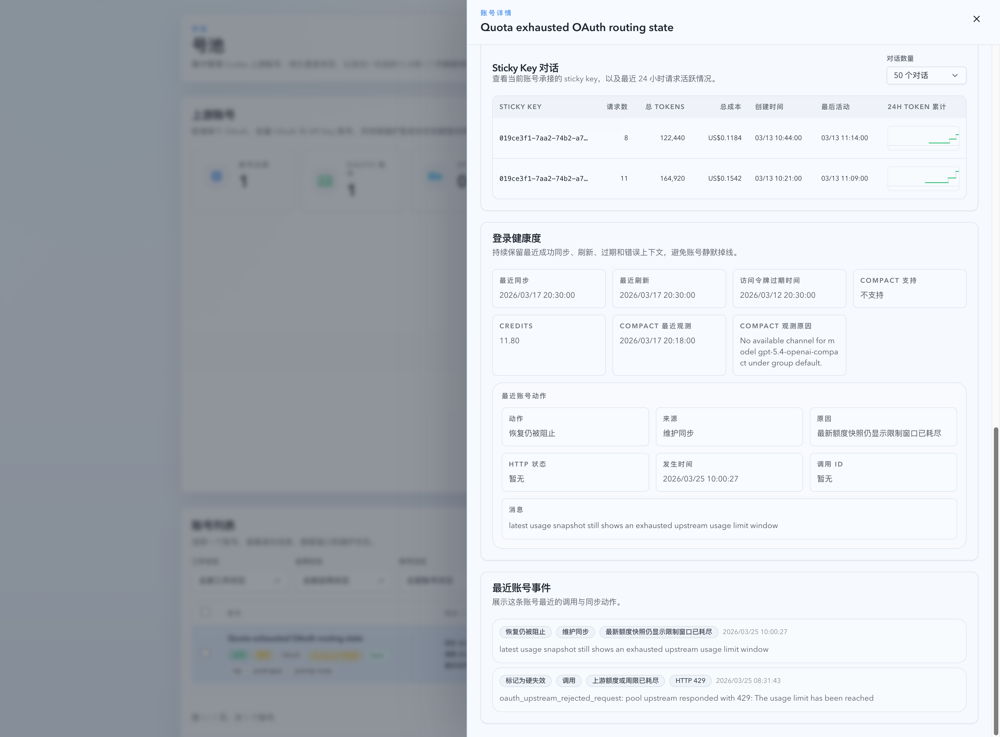

# OAuth 配额耗尽账号误标为上游拒绝修复（#js2gr）

## 状态

- Status: 已完成（PR #231）
- Created: 2026-03-25
- Last: 2026-03-25

## 背景 / 问题陈述

- 线上浏览器实测确认，账号 `oliviang.1j3cd@mail-tw.707079.xyz` 的最近失败链路是 `upstream_http_429_quota_exhausted`，最近动作是 `sync_recovery_blocked / quota_still_exhausted`，额度窗口也显示主窗口 `100%` 已耗尽。
- 该账号同时保留了 `lastError=oauth_upstream_rejected_request: ... 429: The usage limit has been reached`；现有服务端健康状态派生先匹配 `oauth_upstream_rejected_request`，导致 `healthStatus=upstream_rejected`、`displayStatus=upstream_rejected`，前端因此展示“上游拒绝”而不是“限流”。
- 当前 `workStatus` 只在 cooldown 生效时才会导出 `rate_limited`，quota-exhausted 终态没有 cooldown，因此会进一步退化成 `idle`，造成线上列表、详情和真实原因三者不一致。

## 目标 / 非目标

### Goals

- 让 `upstream_http_429` 与 `upstream_http_429_quota_exhausted` 统一走“限流语义”，避免再被 `oauth_upstream_rejected_request` 文案盖成 `upstream_rejected`。
- 在不改 API 形状的前提下，把 quota-exhausted 终态稳定导出为 `healthStatus=normal`、`displayStatus=active`、`workStatus=rate_limited`。
- 保留 `lastError`、`lastActionReasonCode`、`recentActions[].failureKind`、额度窗口与 reset 时间，前端继续只消费服务端派生字段。
- 用 Storybook 和浏览器验收固定“Quota exhausted OAuth row => 限流，不显示上游拒绝”的可视化结果。

### Non-goals

- 不新增新的状态枚举、数据库字段或 API 字段。
- 不在前端增加基于 `lastError` 文案的临时 heuristic。
- 不改动 `401/403`、missing scopes、bridge exchange error、reauth 的既有分类语义。

## 范围（Scope）

### In scope

- `src/upstream_accounts/mod.rs`
- `web/src/components/UpstreamAccountsPage.story-helpers.tsx`
- `web/src/components/UpstreamAccountsPage.list.stories.tsx`
- `web/src/components/UpstreamAccountsTable.test.tsx`
- `docs/specs/js2gr-oauth-quota-exhausted-rate-limit-status/SPEC.md`
- `docs/specs/README.md`

### Out of scope

- 账号详情抽屉的结构性改版
- 新的健康态或工作态 taxonomy
- 号池 resolver 的 quota-exhausted hard-stop 持久化策略

## 需求（Requirements）

### MUST

- 后端必须抽出统一的 rate-limit route-state helper，同时被 `healthStatus`、`displayStatus`、`workStatus` 三条派生路径复用。
- 当最近 route failure 属于 `upstream_http_429` 或 `upstream_http_429_quota_exhausted` 时，不得仅因 `lastError` 包含 `oauth_upstream_rejected_request` 就导出 `upstream_rejected`。
- 当最近动作原因属于 `upstream_http_429_rate_limit`、`upstream_http_429_quota_exhausted` 或 `quota_still_exhausted` 时，导出的工作态必须仍可落到 `rate_limited`。
- quota-exhausted 终态即使底层 `status=error`，列表与详情头部也必须导出 `displayStatus=active`、`healthStatus=normal`、`workStatus=rate_limited`。
- `401/403`、missing scopes、显式 reauth、bridge exchange error 仍必须继续导出 `upstream_rejected`、`needs_reauth` 或 `error_other`，不得被本次修复吞掉。
- Storybook 必须新增一个 OAuth quota-exhausted 场景，并在 `play` 里断言列表行显示 `限流`、不显示 `上游拒绝`，同时详情抽屉保留 `sync_recovery_blocked / quota_still_exhausted` 的最新动作文案。

### SHOULD

- 后端回归测试同时覆盖 summary 与 detail，避免只修列表不修详情。
- 视觉证据优先使用 mock-only Storybook，避免依赖线上真实账号截图。

## 验收标准（Acceptance Criteria）

- Given OAuth 账号最近一次 route failure 为 `upstream_http_429_quota_exhausted`，When 汇总接口导出该账号，Then `healthStatus=normal`、`displayStatus=active`、`workStatus=rate_limited`，而不是 `upstream_rejected / idle`。
- Given 同一账号的 `lastError` 仍为 `oauth_upstream_rejected_request: ... 429 ... usage limit has been reached`，When 详情接口导出该账号，Then 最近动作、最近错误与 recent actions 保持原值，同时头部状态与列表一致。
- Given 账号是 `401 missing scopes`、显式 invalidated token 或 bridge exchange failure，When 汇总接口导出该账号，Then 仍保持既有 `upstream_rejected`、`needs_reauth` 或 `error_other` 语义。
- Given Storybook quota-exhausted OAuth 场景，When 渲染账号列表并打开详情抽屉，Then 账号行显示 `限流` 徽章、详情头部显示正常健康态，不出现“上游拒绝”健康徽章，且详情内继续可见“恢复仍被阻止 / 最新额度快照仍显示限制窗口已耗尽”。

## 质量门槛（Quality Gates）

- `cargo test quota_exhausted_oauth_summary_and_detail_export_as_rate_limited -- --test-threads=1`
- `cargo test record_pool_route_http_failure_keeps_missing_scope_oauth_as_error -- --test-threads=1`
- `cargo test record_pool_route_http_failure_marks_explicit_invalidated_oauth_for_reauth -- --test-threads=1`
- `cd web && bun run test`
- Storybook mock-only 截图 + `chrome-devtools` smoke：确认列表行和详情头部都已显示“限流 / 正常”，而不是“上游拒绝”。

## 里程碑（Milestones）

- [x] M1: 创建 follow-up spec 并冻结导出语义、验证口径与视觉证据归档位置。
- [x] M2: 修正后端 `health/display/work` 派生逻辑并补齐回归测试。
- [x] M3: 更新 Storybook 场景与前端断言，固定 quota-exhausted OAuth 的显示结果。
- [x] M4: 完成本地验证、Storybook 截图与浏览器 smoke。
- [x] M5: 快车道收敛（review-loop clear、PR #231 建立、spec sync 与视觉证据已入库）。

## Visual Evidence

- source_type: storybook_canvas
  target_program: mock-only
  capture_scope: element
  sensitive_exclusion: N/A
  submission_gate: approved
  story_id_or_title: Account Pool/Pages/Upstream Accounts/List — Quota Exhausted OAuth
  state: roster row
  evidence_note: 列表行显示 `限流` 徽章与 `恢复仍被阻止` 最近动作，同时不再出现“上游拒绝”健康态。
  image:
  

- source_type: storybook_canvas
  target_program: mock-only
  capture_scope: browser-viewport
  sensitive_exclusion: N/A
  submission_gate: approved
  story_id_or_title: Account Pool/Pages/Upstream Accounts/List — Quota Exhausted OAuth
  state: detail header
  evidence_note: 详情头部与列表保持一致，显示 `启用 / 限流 / 同步空闲 / 正常`，不显示“上游拒绝”。
  image:
  

- source_type: storybook_canvas
  target_program: mock-only
  capture_scope: browser-viewport
  sensitive_exclusion: N/A
  submission_gate: approved
  story_id_or_title: Account Pool/Pages/Upstream Accounts/List — Quota Exhausted OAuth
  state: recent action
  evidence_note: 详情仍保留 `恢复仍被阻止 / 最新额度快照仍显示限制窗口已耗尽` 的 quota-exhausted 动作上下文。
  image:
  

## 风险 / 假设

- 假设 quota-exhausted 的 route failure 仍是前端“限流”语义的一部分，不需要新增 `hard_rate_limited` 等新状态。
- 风险：如果后端仍有其他路径单独根据 `lastError` 推导状态，可能出现列表与详情重新分叉，需要通过 summary/detail 双回归共同收口。
- 风险：视觉证据需要截图文件入库；若主人不允许提交截图文件，需要改为仅在对话中回传图片并在 spec 中记录阻断说明。

## 变更记录（Change log）

- 2026-03-25: 创建 follow-up spec，冻结 OAuth quota-exhausted 账号误标为“上游拒绝”的修复目标、验收标准与视觉证据位置。
- 2026-03-25: 完成后端状态派生修复、前端 Storybook 场景与测试回归，并补齐 Storybook mock-only 截图与 `chrome-devtools` smoke 证据。
- 2026-03-25: 快车道收敛到 PR #231，视觉证据已获主人批准并随分支提交，spec 状态切换为完成。
