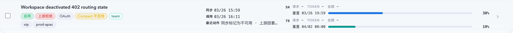
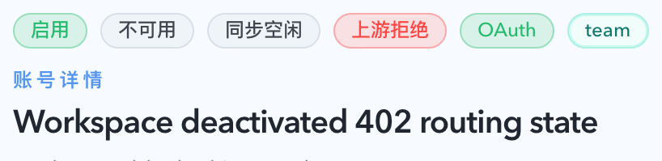
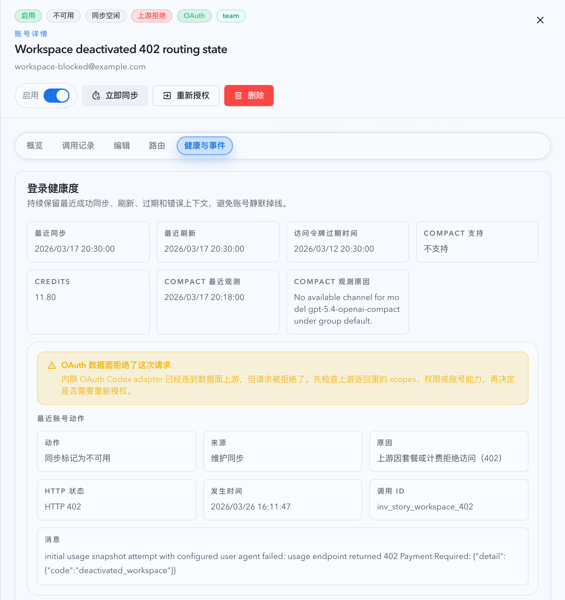

# 402 `deactivated_workspace` 账号状态改判为上游拒绝（#kfgvy）

## 状态

- Status: 已完成（5/5，PR #244）
- Created: 2026-03-26
- Last: 2026-04-08

## 背景 / 问题陈述

- 线上账号详情抽屉已经把最近动作原因结构化记录为 `upstream_http_402`，同时保留了 `HTTP 402` 与 `{"detail":{"code":"deactivated_workspace"}}` 原文。
- 当前账号健康态派生仍主要依赖 `lastError` 文本匹配；`is_upstream_rejected_error_message()` 只覆盖 `401/403`、`forbidden`、`unauthorized` 等语义，没有把结构化的 `upstream_http_402` 视为上游拒绝。
- 结果是同一条账号在 latest action / recent events 中已经明确是套餐或计费拒绝访问（402），但列表和详情头部却继续显示“其它异常”，造成运营判断口径不一致。
- 后续线上回归又暴露出第二层问题：当账号历史里残留旧的 quota / 429 route marker，而新的维护同步以 `sync_failed + upstream_http_402` 落库时，读模型仍可能先命中旧的 `rate_limited` 语义，导出成 `active + normal + rate_limited`。

## 目标 / 非目标

### Goals

- 将所有已持久化的 `upstream_http_402` 硬失效统一导出为 `healthStatus=upstream_rejected` 与 `displayStatus=upstream_rejected`。
- 同时覆盖 route-triggered 与 sync-triggered 两条 `402` 落库路径，不新增 API 字段。
- 保留 `lastError`、latest action、recent actions、`HTTP 402` 与 `deactivated_workspace` 原文，不在前端增加临时 heuristic。
- 用 Storybook 和浏览器验收固定“402 row/detail => 上游拒绝，不是其它异常”的视觉结果。

### Non-goals

- 不改变 `429 quota_exhausted` 的 `rate_limited` 语义。
- 不新增新的健康态、工作态或数据库状态列。
- 不重做 latest action / recent events 的结构或文案体系。

## 范围（Scope）

### In scope

- `src/upstream_accounts/mod.rs`
- `web/src/components/UpstreamAccountsPage.story-helpers.tsx`
- `web/src/components/UpstreamAccountsPage.list.stories.tsx`
- `web/src/components/UpstreamAccountsTable.test.tsx`
- `web/src/pages/account-pool/UpstreamAccounts.test.tsx`
- `docs/specs/kfgvy-upstream-http-402-upstream-rejected/SPEC.md`
- `docs/specs/README.md`

### Out of scope

- 429 / quota exhausted 的任何恢复门控调整
- 非账号池页面的状态展示调整
- 新的事件 API 或新的筛选参数

## 需求（Requirements）

### MUST

- 后端健康态派生必须优先消费结构化的 `lastActionReasonCode=upstream_http_402` 与 `lastRouteFailureKind=upstream_http_402`，而不是继续依赖脆弱的 `lastError` 文本匹配。
- 对于 `sync_failed + upstream_http_402`，即使账号历史里还残留旧的 quota / 429 route marker，读模型也必须优先导出 `upstream_rejected`，不得再回退成 `rate_limited`。
- `401/403`、explicit reauth、bridge legacy 错误与 `429 quota_exhausted` 的现有优先级不得被这次修复破坏。
- 对于 `402` 账号，列表行与详情头部必须显示“上游拒绝”；`workStatus` 必须保持 `unavailable`。
- latest action / recent events 必须继续展示 `HTTP 402`、原始 reason message 与 `deactivated_workspace` 上下文。
- Storybook 必须新增一个稳定的“旧 quota 历史 + 当前 402”场景，并在 `play` 里断言列表与详情头部都不再显示“其它异常 / 限流”。

### SHOULD

- 后端回归测试同时覆盖 summary 与 detail 导出。
- 前端回归测试同时覆盖表格 badge 与详情抽屉。

## 验收标准（Acceptance Criteria）

- Given 账号最近一次硬失效为 `upstream_http_402`，When summary/detail 导出，Then `healthStatus` 与 `displayStatus` 都是 `upstream_rejected`，不是 `error_other`。
- Given 账号历史里残留旧的 `429 quota_exhausted` route marker，When 新的维护同步记录 `sync_failed + upstream_http_402`，Then summary/detail 仍导出 `displayStatus=upstream_rejected`、`healthStatus=upstream_rejected`、`workStatus=unavailable`。
- Given 最近错误原文包含 `402 Payment Required` 与 `{"detail":{"code":"deactivated_workspace"}}`，When 详情抽屉打开，Then badge 显示“上游拒绝”，同时 latest action / recent events 继续保留 402 与原文。
- Given OAuth quota-exhausted `429`，When 同样的读模型运行，Then 它仍然显示 `healthStatus=normal`、`workStatus=rate_limited`。
- Given `401/403` 或 explicit reauth-only 场景，When 读模型运行，Then 现有 `upstream_rejected` / `needs_reauth` 语义保持不变。

## 质量门槛（Quality Gates）

- `cargo test route_triggered_402_summary_and_detail_export_as_upstream_rejected -- --test-threads=1`
- `cargo test sync_triggered_402_summary_and_detail_export_as_upstream_rejected -- --test-threads=1`
- `cargo test stale_quota_route_failure_does_not_hide_newer_sync_402_error -- --test-threads=1`
- `cargo test quota_exhausted_oauth_summary_and_detail_export_as_rate_limited -- --test-threads=1`
- `cd web && bun run test -- src/components/UpstreamAccountsTable.test.tsx src/pages/account-pool/UpstreamAccounts.test.tsx`
- Storybook mock-only 截图 + `chrome-devtools` smoke：确认“旧 quota 历史 + 当前 402”场景下，列表和详情头部显示“上游拒绝 / 不可用”，并保留 `deactivated_workspace` 文案。

## 里程碑（Milestones）

- [x] M1: 创建 follow-up spec 并冻结 `402 -> upstream_rejected` 的导出语义。
- [x] M2: 后端状态派生改为优先消费结构化 `402` 信号，并补齐 route/sync 双回归。
- [x] M3: 补齐 Storybook 402 场景与前端断言，固定列表/详情显示结果。
- [x] M4: 完成本地验证、Storybook 视觉证据与浏览器 smoke。
- [x] M5: 快车道收敛到 merge-ready PR，并回填 spec / README 状态。

## Visual Evidence

- source_type: storybook_canvas
  target_program: mock-only
  capture_scope: element
  sensitive_exclusion: N/A
  submission_gate: owner-approved-and-submitted
  story_id_or_title: Account Pool/Pages/Upstream Accounts/List — Upstream Rejected 402
  state: roster row
  evidence_note: 列表行显示 `上游拒绝` 与 `HTTP 402`，不再退回“其它异常”。
  image:
  

- source_type: storybook_canvas
  target_program: mock-only
  capture_scope: element
  sensitive_exclusion: N/A
  submission_gate: owner-approved-and-submitted
  story_id_or_title: Account Pool/Pages/Upstream Accounts/List — Upstream Rejected 402
  state: detail header
  evidence_note: 详情头部显示 `启用 / 不可用 / 同步空闲 / 上游拒绝`，证明旧 quota 历史不会再把当前 402 导回“限流”。
  image:
  

- source_type: storybook_canvas
  target_program: mock-only
  capture_scope: element
  sensitive_exclusion: N/A
  submission_gate: owner-approved-and-submitted
  story_id_or_title: Account Pool/Pages/Upstream Accounts/List — Upstream Rejected 402
  state: health and events
  evidence_note: 健康与事件页签同时保留当前 `HTTP 402 / upstream_http_402 / deactivated_workspace` 原文，以及更早的 `429 quota exhausted` 历史，不会再把当前展示误判成“限流”。
  image:
  

## 风险 / 假设

- 假设所有已持久化的 `upstream_http_402` 都应视为“上游拒绝”，而不是进一步细分成新的健康态。
- 风险：如果仍有其他路径只依赖 `lastError` 文本导出状态，可能出现列表与详情再次分叉，需要通过 summary/detail 双测试收口。

## 变更记录（Change log）

- 2026-03-26: 创建 follow-up spec，冻结 402 `deactivated_workspace` 账号应显示“上游拒绝”的修复范围与验收口径。
- 2026-03-26: 完成后端结构化 `402` 状态派生修复、route/sync 双回归、Storybook 402 场景、前端断言与本地视觉证据采集。
- 2026-03-26: 分支 `th/9t4zq-upstream-http-402-rejected` 已推送，PR #244 已创建并打上 `type:patch` / `channel:stable`，进入 merge-ready 状态。
- 2026-04-08: 回填 sync-classified hard-unavailable follow-up，要求旧 quota / 429 marker 不得再盖掉新的 `upstream_http_402`；Storybook 402 场景同步加入历史 quota 事件，固定“上游拒绝 + 不可用”的最终展示。
