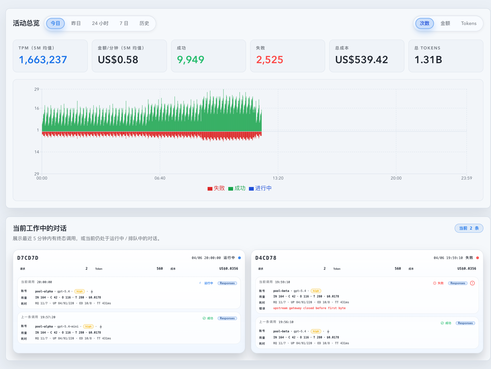
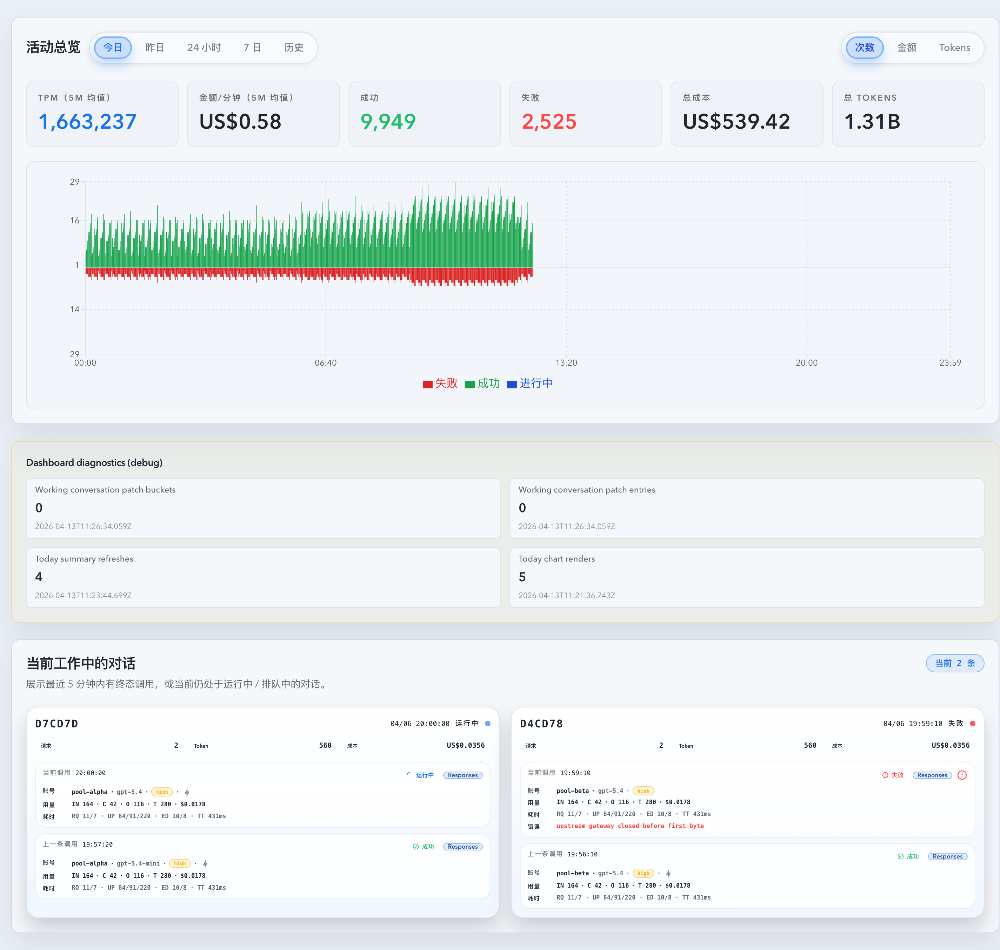

# Dashboard 长驻崩溃：working-conversations 泄露与 today 面板重渲染硬化（#kwmjr）

## 状态

- Status: 已实现，待 PR / CI / review-proof 收敛
- Created: 2026-04-13
- Last: 2026-04-13

## 背景 / 问题陈述

- `/dashboard` 长时间停留后会出现浏览器标签页崩溃，线上观测表现为 heap 大幅抖动、`summary?window=today` 高频回源，以及 working conversations 数据在 SSE patch 后持续滞留。
- 现有 `useDashboardWorkingConversations` 把 post-snapshot invocation patch 存在 `patchedPostSnapshotInvocationsRef`，但旧 `promptCacheKey` 退出当前工作集后没有被正确释放。
- 现有 `DashboardActivityOverview` 把 `today/yesterday` summary 与重型分钟图表绑在同一组件树中，`records` 事件触发的 summary 补拉会反复拍醒图表渲染。

## 目标 / 非目标

### Goals

- 修正 working conversations post-snapshot patch 缓存的生命周期，只保留当前工作集仍需要 patch 的 key。
- 为每个 prompt-cache conversation 的 invoke patch map 保持惰性创建，并通过 working-set prune 避免高 churn 下历史 key 长驻内存。
- 拆分 today 面板的 summary 与分钟图表渲染边界，使 summary-only 更新不再导致图表重渲染。
- 增加显式调试开关控制的 Dashboard 诊断面板，暴露 patch bucket/entry 数、today summary refresh 次数、today chart render 次数与最近更新时间。
- 补齐 Vitest、Storybook 与视觉证据，按 fast-track 收口到 merge-ready。

### Non-goals

- 不修改后端 API、数据库 schema、SSE payload 或路由合同。
- 不对 Dashboard 视觉布局做新的产品级重设计；调试面板默认关闭，仅用于排障。
- 不处理第三方图表库潜在的独立内存问题，除非本轮修复后仍有明确证据。

## 范围（Scope）

### In scope

- `web/src/hooks/useDashboardWorkingConversations.ts`
- `web/src/hooks/useStats.ts`
- `web/src/components/DashboardActivityOverview.tsx`
- `web/src/components/DashboardTodayActivityChart.tsx`
- `web/src/components/DashboardPerformanceDiagnostics.tsx`
- `web/src/lib/dashboardPerformanceDiagnostics.ts`
- `web/src/components/DashboardPage.stories.tsx`
- 相关 Vitest 与本 spec / `docs/specs/README.md`

### Out of scope

- 后端统计口径和接口 schema 调整
- Dashboard 其它卡片或抽屉的交互改版
- 非 Dashboard 页面的统一调试框架

## 验收标准（Acceptance Criteria）

- Given records 流中持续出现新的 `promptCacheKey` 或新的 post-snapshot invocation，When Dashboard 长时间停留，Then patch bucket/entry 数不会随着历史 key 单调增长，旧 key 在 authoritative refresh 后会被释放。
- Given working conversations 已加载多条卡片，When 某一条收到 post-snapshot `records` patch，Then 仅命中的 conversation 会建立 patch map，不相关已加载卡片不会惰性创建空 bucket。
- Given `today` 范围收到 `records` 事件并触发 summary 补拉，When timeseries 数据未变化，Then `DashboardTodayActivityChart` 的 render counter 不会因为 summary-only 更新继续上涨。
- Given 未开启调试开关，When 正常访问 Dashboard，Then 诊断面板不显示，也不会产生额外 UI 噪音。
- Given 显式开启 `dashboard.performanceDiagnostics.enabled.v1`，When 访问 Dashboard，Then 可读取 patch bucket/entry 数、today summary refresh 次数、today chart render 次数与最近更新时间。
- Given 执行 `cd web && bun run test && bun run build && bun run build-storybook`，When 当前分支验证，Then 命令通过。

## 实现概述（Approach, high-level）

- working conversations patch 缓存改成：
  - 仅在命中 conversation 的 post-snapshot patch 时惰性创建 bucket；
  - 不再为已加载但未命中的 conversation 预先创建空 bucket；
  - authoritative head refresh / loadMore / 本地 working-set prune 后统一按“当前保留 key + 本次 authoritative 刷新的 key”裁剪；
  - 调试开关开启时同步发布 patch bucket/entry 指标。
- `today/yesterday` 面板改成“timeseries parent + summary child + memoized chart child”结构，summary hook 的自身更新不再穿透到图表子树。
- `useSummary('today')` 在成功完成 HTTP 补拉时累计 summary refresh counter，`DashboardTodayActivityChart` 在每次真实 render commit 后累计 chart render counter。
- 调试能力通过 localStorage 开关显式启用，默认隐藏，仅在 Dashboard 页面上以 debug panel 展示。

## 验证记录（Validation）

- `cd /Users/ivan/.codex/worktrees/0e28/codex-vibe-monitor/web && bunx vitest run src/hooks/useDashboardWorkingConversations.test.tsx src/components/DashboardActivityOverview.test.tsx src/pages/Dashboard.test.tsx`
- `cd /Users/ivan/.codex/worktrees/0e28/codex-vibe-monitor/web && bun run build`
- `cd /Users/ivan/.codex/worktrees/0e28/codex-vibe-monitor/web && bun run build-storybook`

## Visual Evidence

- Storybook覆盖=通过
- 视觉证据目标源=storybook_canvas（mock-only）
- 证据绑定sha=`origin/main 同步后的当前交付头（2026-04-13 复验）`
- Validation:
  - `cd /Users/ivan/.codex/worktrees/0e28/codex-vibe-monitor/web && bunx vitest run src/hooks/useDashboardWorkingConversations.test.tsx src/components/DashboardActivityOverview.test.tsx src/pages/Dashboard.test.tsx`
  - `cd /Users/ivan/.codex/worktrees/0e28/codex-vibe-monitor/web && bun run build`
  - `cd /Users/ivan/.codex/worktrees/0e28/codex-vibe-monitor/web && bun run build-storybook`

- source_type: storybook_canvas
  target_program: mock-only
  capture_scope: browser-viewport
  sensitive_exclusion: N/A
  submission_gate: owner-approved
  story_id_or_title: `Pages/DashboardPage/Default`
  state: `default`
  evidence_note: 验证默认 Dashboard 页面在修复后维持原有可见布局，没有重新引入额外 today 独立卡，working conversations 与活动总览仍保持同页稳定展示。
  image:
  

- source_type: storybook_canvas
  target_program: mock-only
  capture_scope: browser-viewport
  sensitive_exclusion: N/A
  submission_gate: owner-approved
  story_id_or_title: `Pages/DashboardPage/LiveRefreshDiagnostics`
  state: `live-refresh-diagnostics`
  evidence_note: 验证显式 debug 开关开启后，Dashboard 诊断面板可读取 working-conversation patch 指标、today summary refresh 次数与 today chart render 次数；本轮 Storybook 受控场景下可见 summary refresh 已累计到 `4`、chart render 计数为 `5`，用于回归观察渲染边界是否被重复拍醒。
  image:
  
