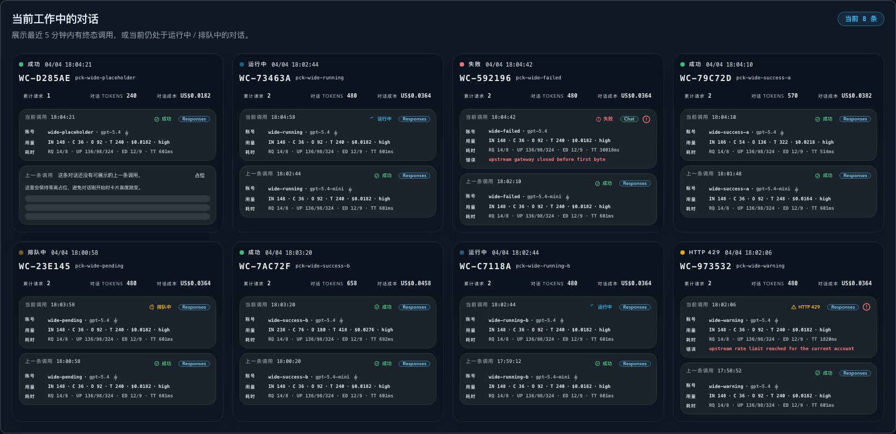
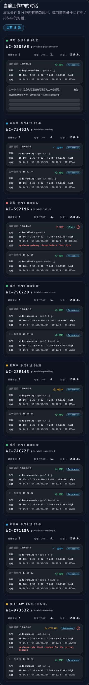
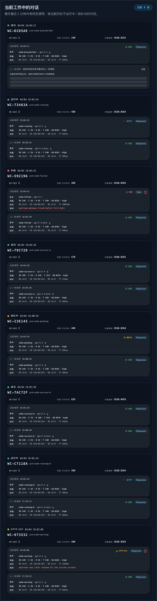
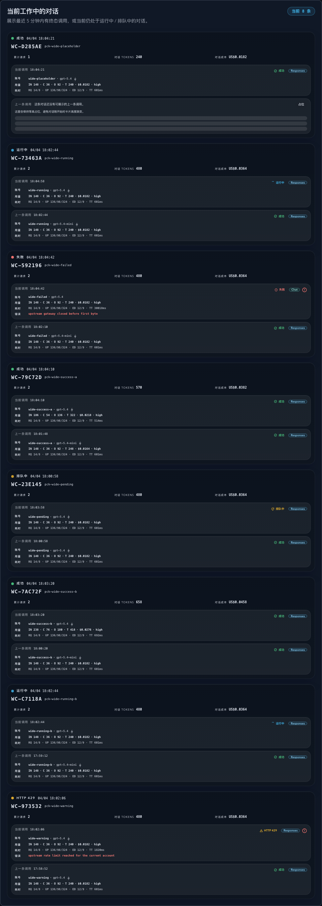
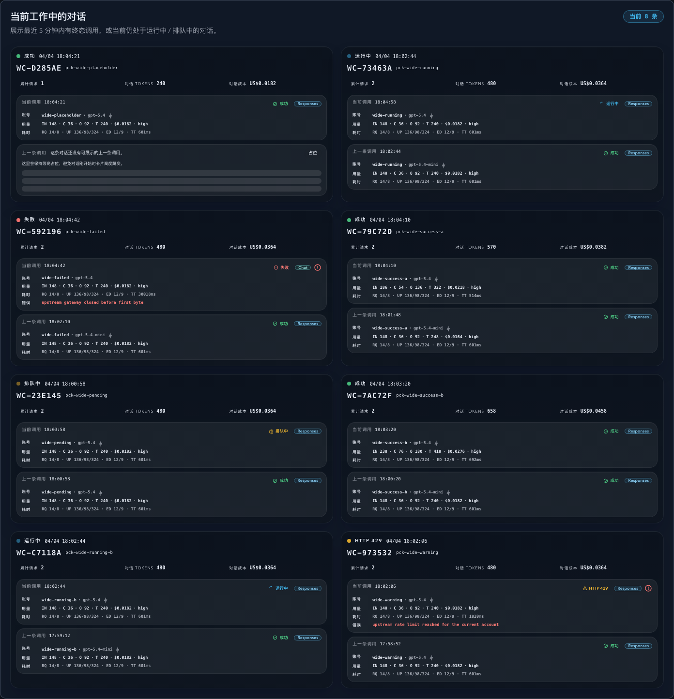
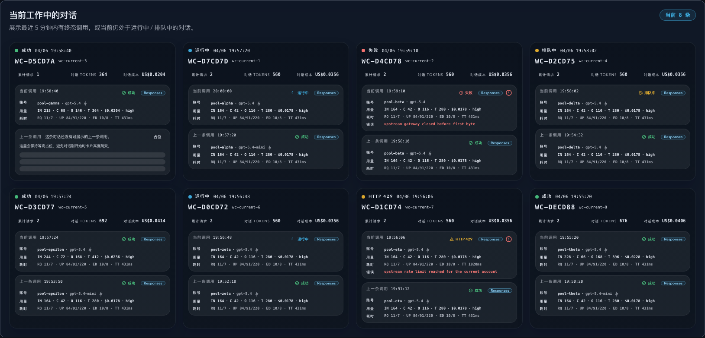
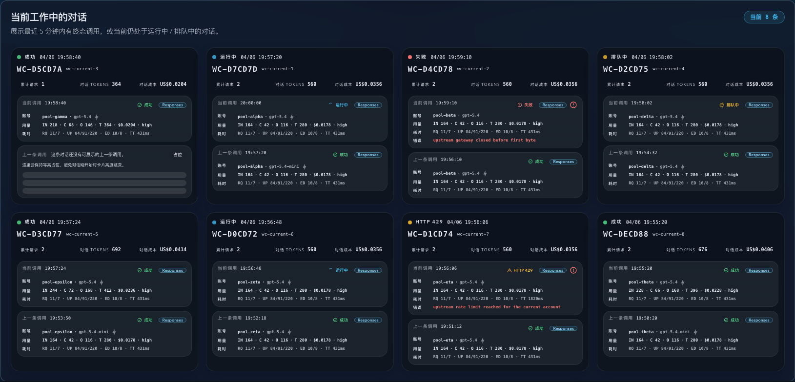

# Dashboard 工作中对话卡片：1660 宽屏四栏 follow-up（#mbnns）

## 状态

- Status: 已完成（6/6）
- Created: 2026-04-07
- Last: 2026-04-07

## 背景 / 问题陈述

- `#w3t3w` 已把 Dashboard 底部替换为“当前工作中的对话”卡片区，`#vn2e9` 又把全站壳层统一放宽到 `1660px`，因此工作中对话区在最宽桌面 tier 具备继续提升信息密度的空间。
- 现状在 `2xl (1536px)` 仍是 3 栏；若直接把现有 `2xl` 改成 4 栏，会把单卡压到约 `354px`，双槽调用摘要会过早拥挤。
- 本轮只希望在真正的最宽壳层（`>=1660px`）切到 4 栏，并保留 `1536..1659px` 的 3 栏表现。
- 自动化护栏也需要同步扩大：Storybook 要有稳定的宽屏四栏入口，Dashboard 实页 E2E 要把 `1440 / 1600 / 1660 / 1873` 的列数合同钉死。

## 目标 / 非目标

### Goals

- 把工作中对话卡片的响应式合同固定为：`<1280 = 1 栏`、`1280..1535 = 2 栏`、`1536..1659 = 3 栏`、`>=1660 = 4 栏`。
- 新增内部 `desktop1660` 断点，并与 Storybook 宽屏 viewport 对齐。
- 保持现有卡片信息层级、账号抽屉与调用抽屉交互不变，只允许最小密度修正。
- 用稳定 mock data 扩充 Storybook 组件级与页面级入口，让四栏布局能在同一页中真实复核。
- 新增 Dashboard 宽屏几何回归，确保首行卡片数、单卡宽度与页面级无横向滚动成立。

### Non-goals

- 不修改后端 API、hooks、SSE、mapper 数据口径或数据库结构。
- 不重做卡片信息架构，不引入 compact mode、字段删减或新的交互层级。
- 不调整全站 `1660px` 壳层真相源；该合同继续以 `#vn2e9` 为准。

## 范围（Scope）

### In scope

- `web/tailwind.config.js`：新增 `desktop1660` 响应式断点。
- `web/src/components/DashboardWorkingConversationsSection.tsx`：把卡片网格提升为 `1 / 2 / 3 / 4` 栏合同。
- `web/src/components/DashboardWorkingConversationsSection.stories.tsx`、`web/src/components/DashboardPage.stories.tsx`：补齐宽屏 mock 与页面级四栏入口。
- `web/tests/e2e/dashboard-working-conversations-layout.spec.ts`：新增 Dashboard 工作中对话区的宽屏布局回归。
- `docs/specs/README.md` 与本 spec：登记本轮 follow-up，并在视觉证据获批后写入 `## Visual Evidence`。

### Out of scope

- Dashboard 其它模块的信息架构重排。
- 非 Dashboard 页面与本轮四栏 follow-up 无关的全局 spacing / theme 清扫。
- PR merge / cleanup 之后的发布链路。

## 验收标准（Acceptance Criteria）

- Given 视口为 `390 / 768 / 1024`，When 查看工作中对话区，Then 卡片保持单列且无横向溢出。
- Given 视口为 `1280 / 1440`，When 查看工作中对话区，Then 首行稳定为 2 栏。
- Given 视口为 `1600`，When 查看工作中对话区，Then 首行稳定为 3 栏，不提前进入 4 栏。
- Given 视口为 `1660 / 1873`，When 查看工作中对话区，Then 首行稳定为 4 栏、第二行继续换行，单卡宽度维持可读。
- Given 点击卡片内账号名称或调用槽位，When 交互发生，Then 共享账号抽屉与调用详情抽屉行为不回退。
- Given 运行本轮相关验证，When 执行 targeted Vitest / build / Storybook build / Playwright，Then 宽屏四栏合同通过，或仅剩与本轮无关的既有阻断被明确记录。

## 非功能性验收 / 质量门槛（Quality Gates）

### Visual / UX

- 仅在 `desktop1660` 切换到 4 栏；`2xl` 仍保持 3 栏，避免中宽桌面过早压缩卡片内容。
- 卡片顶部序列号、3 个摘要指标、当前 / 上一条双槽、placeholder 等高语义必须完整保留。
- 四栏下卡片内容允许必要的截断与换行，但不得出现字段重叠、横向滚动或 slot 内容被裁切。
- 页面级横向滚动为 0；若其它 Dashboard 模块在宽屏 mock 下暴露轻微外溢，本轮只允许做维持页面合同所需的最小修正，不扩展成独立重构。

### Testing

- Frontend lint: `cd /Users/ivan/.codex/worktrees/9b79/codex-vibe-monitor/web && bun run lint`
- Frontend targeted Vitest: `cd /Users/ivan/.codex/worktrees/9b79/codex-vibe-monitor/web && bunx vitest run src/components/DashboardWorkingConversationsSection.test.tsx src/pages/Dashboard.test.tsx`
- Frontend build: `cd /Users/ivan/.codex/worktrees/9b79/codex-vibe-monitor/web && bun run build`
- Storybook build: `cd /Users/ivan/.codex/worktrees/9b79/codex-vibe-monitor/web && bun run build-storybook`
- E2E regression: `cd /Users/ivan/.codex/worktrees/9b79/codex-vibe-monitor/web && E2E_BASE_URL=http://127.0.0.1:<leased-port> bun run test:e2e -- tests/e2e/dashboard-working-conversations-layout.spec.ts tests/e2e/wide-shell-layout.spec.ts`

## 文档更新（Docs to Update）

- `docs/specs/README.md`
- `docs/specs/mbnns-dashboard-working-conversations-wide-4col/SPEC.md`

## 计划资产（Plan assets）

- Directory: `docs/specs/mbnns-dashboard-working-conversations-wide-4col/assets/`
- In-plan references: ``
- Visual evidence source: Storybook `desktop1660` + Dashboard 实页宽屏 smoke

## 实现里程碑（Milestones / Delivery checklist）

- [x] M1: 新建本 spec 并登记 `docs/specs/README.md`。
- [x] M2: 新增 `desktop1660` 断点并把工作中对话网格切到 `1 / 2 / 3 / 4` 栏合同。
- [x] M3: 补齐组件级与页面级 Storybook 宽屏 mock，使四栏能稳定复核。
- [x] M4: 新增 Dashboard 工作中对话宽屏 E2E 回归，并保持页面级无横向滚动合同。
- [x] M5: 完成 lint / targeted Vitest / build / Storybook build / E2E，并产出主人验收用视觉证据。
- [x] M6: 执行 review-loop，依据主人对截图资产的授权决定是否把视觉证据写回 spec 并推进到 PR merge-ready。

## 方案概述（Approach, high-level）

- 把四栏切换点锚定到新的 `desktop1660`，而不是复用 `2xl`，从而同时保住 `1536..1659px` 的 3 栏可读性与 `>=1660px` 的信息密度收益。
- Storybook 组件级 story 使用至少 8 张卡的稳定 mock，让首行 4 卡与第二行换行都能直接被审阅；页面级 story 同时扩展到足以真实经过四栏路径，避免只在孤立组件 story 上成立。
- E2E 通过 Dashboard 页面真实渲染去测量首行卡片数、行数、单卡宽度与页面级溢出；若回归暴露到其它 Dashboard 模块的轻微外溢，则优先修正真实溢出源，而不是放宽本轮卡片合同。

## 风险 / 开放问题 / 假设（Risks, Open Questions, Assumptions）

- 风险：若 `desktop1660` 只在 Storybook viewport 配置而未进入 Tailwind screens，组件 story 与真实页面会出现“假四栏”。
- 风险：若页面级无横向滚动断言被其它 Dashboard 模块的绝对定位标签干扰，测试会把无关问题误归因到卡片区；本轮优先修复真实溢出源，不用放宽断言掩盖问题。
- 假设：`1660px` 壳层合同已由 `#vn2e9` 固定，本轮只消费该合同，不再次改写全站容器。
- 假设：截图资产与 PR 图片引用的推送需要先拿到主人明确批准；未获批准时，本轮可以停在本地验证完成 / merge-proof ready。

## 变更记录（Change log）

- 2026-04-07: 新建 follow-up spec，冻结 `desktop1660` 四栏合同、Storybook 宽屏入口、Dashboard 页面级 E2E 护栏与截图授权边界。
- 2026-04-07: 本地实现已补齐 Tailwind `desktop1660` screen、工作中对话 `1 / 2 / 3 / 4` 栏合同、8 卡 Storybook mock、Dashboard 页面级宽屏 fixture 与 Playwright 列数回归；同时修正 Dashboard 日历月标签在宽屏 mock 下的 5px 页面级外溢，避免用放宽断言掩盖真实 overflow。
- 2026-04-07: 本地验证已完成 lint、targeted Vitest、frontend build、Storybook build、Dashboard 宽屏 E2E 与 review-loop；主人已确认视觉结果可继续，最终截图已写回 spec 并与本地实现一起推进到 PR merge-ready。

## Visual Evidence

- Storybook Canvas `dashboard-workingconversationssection--wide-desktop1660`，暗色主题，浏览器视口 `1660x1400`。验证工作中对话卡片在 `desktop1660` 断点下首行稳定为 4 栏，且当前 / 上一条双槽信息在四栏密度下保持完整可读。

  

- Storybook Canvas `dashboard-workingconversationssection--state-gallery`，暗色主题，浏览器视口 `390x1400`。验证移动宽度下工作中对话卡片保持单列，卡片正文没有因为新增宽屏 tier 出现早溢出或层级回退。

  

- Storybook Canvas `dashboard-workingconversationssection--state-gallery`，暗色主题，浏览器视口 `768x1400`。验证平板宽度下工作中对话卡片继续保持单列，摘要指标与双槽调用仍然完整可读。

  

- Storybook Canvas `dashboard-workingconversationssection--state-gallery`，暗色主题，浏览器视口 `1024x1400`。验证窄桌面宽度下工作中对话卡片仍保持单列，不会提前进入多列布局。

  

- Storybook Canvas `dashboard-workingconversationssection--state-gallery`，暗色主题，浏览器视口 `1440x1400`。验证 `desktop1660` 之前仍保持 2 栏，不会因为新增最宽 tier 而在 `1440px` 提前挤成 4 栏。

  

- Storybook Canvas `pages-dashboardpage--default`，暗色主题，浏览器视口 `1660x1400`。验证页面级 Dashboard story 真实经过四栏路径，而不是仅在孤立组件 story 中成立。

  

- 本地预览页 `/#/dashboard`，暗色主题，浏览器视口 `1873x1400`。验证真实 Dashboard 页面在更宽桌面下同样稳定为 4 栏，且页面根节点无横向滚动。

  

## 参考（References）

- `docs/specs/w3t3w-dashboard-working-conversations-cards/SPEC.md`
- `docs/specs/vn2e9-wide-shell-1660/SPEC.md`
- `web/src/components/DashboardWorkingConversationsSection.tsx`
- `web/src/components/DashboardWorkingConversationsSection.stories.tsx`
- `web/src/components/DashboardPage.stories.tsx`
- `web/tests/e2e/dashboard-working-conversations-layout.spec.ts`
