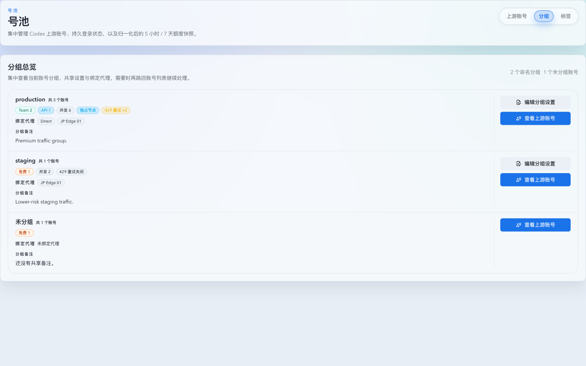
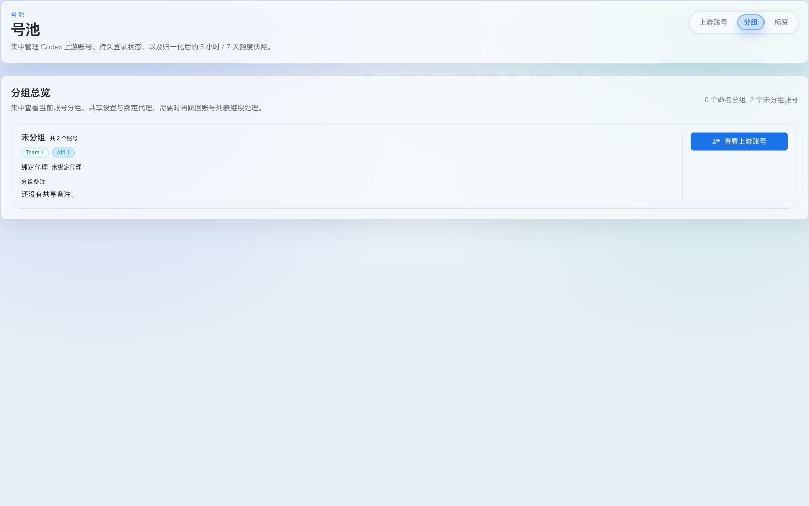
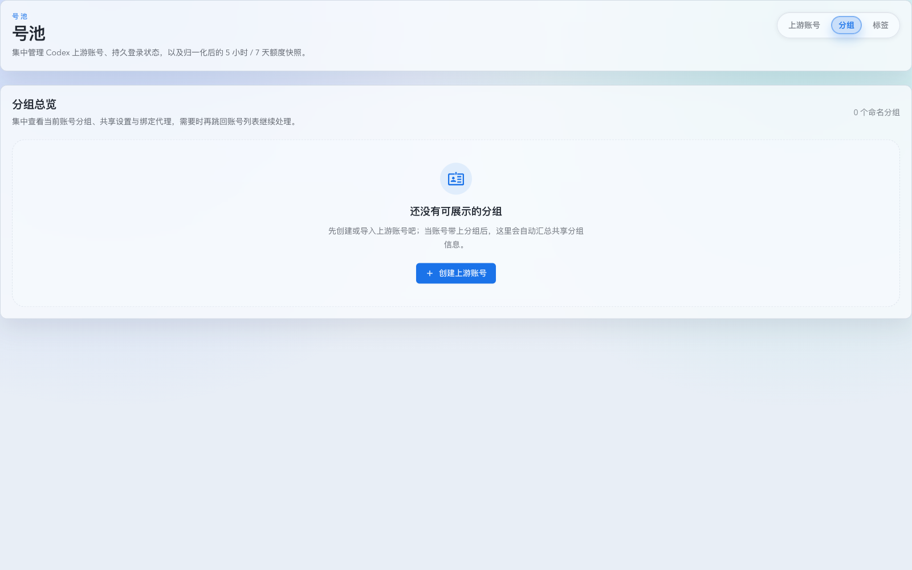

# 号池新增“分组”子页页签与分组总览页（#q8vxs）

## 背景 / 问题陈述

- 当前 `号池` 二级导航只有 `上游账号` 与 `标签` 两个入口；虽然账号页已经支持分组视图，但主人想看“按组聚合后的总览 + 设置入口”时，仍必须先进入账号页，再切视图、滚动和筛选。
- 现有 grouped roster 已经沉淀出分组聚合口径、套餐计数、绑定代理摘要与分组设置弹窗，但这些能力仍耦合在 `上游账号` 页面里，缺少一个更适合做“分组总览”的稳定入口。
- 账号页当前也没有一个一次性“从分组总览跳回账号页并自动命中某个分组筛选”的协议；从总览跳回明细时会丢失上下文。

## 目标 / 非目标

### Goals

- 在 `号池` 二级导航中新增第三个页签 `分组 / Groups`，路由固定为 `/account-pool/groups`。
- 新页面默认展示“分组总览 + 编辑入口”，不在该页直接展开组内账号明细。
- 复用当前账号池读接口、`groups[]`、`includeAll`、分组设置弹窗与 grouped roster 的聚合口径，不新增后端 schema 或新 endpoint；若需要精确回跳，只允许在现有列表接口上扩展可选查询语义。
- 每个命名分组列表项展示：
  - 组名
  - 账号数
  - 套餐计数 badge
  - 备注摘要
  - 绑定代理
  - 并发限制
  - `独占节点`
  - `429` 重试状态
  - `编辑分组设置`
  - `查看上游账号`
- 存在未分组账号时，页末保留一个 `未分组` 汇总列表项；该项只允许查看账号，不提供分组设置。
- 从分组页点击 `查看上游账号` 后，账号页会通过一次性 `location.state` 自动应用对应的命名分组/未分组筛选，并在首轮消费后清空 state。

### Non-goals

- 不替换或移除现有 `标签` 页签。
- 不新增“创建空分组”入口；仅展示已有账号引用到的命名分组，以及有成员时的 `未分组` 汇总。
- 不改造账号页既有 `平铺 / 分组 / 网格` 三种视图的语义或布局。
- 不新增 URL query 协议来长期保存“从分组页带过去的预设筛选”。

## 范围（Scope）

### In scope

- `web/src/pages/account-pool/AccountPoolLayout.tsx`
- `web/src/App.tsx`
- `web/src/pages/account-pool/Groups.tsx`
- `web/src/pages/account-pool/UpstreamAccounts.page-impl.tsx`
- `web/src/pages/account-pool/UpstreamAccounts.shared-types.ts`
- `web/src/components/UpstreamAccountsGroupedRoster.tsx`
- `src/upstream_accounts/core_runtime_types.rs`
- `src/upstream_accounts/crud_group_notes.rs`
- `src/upstream_accounts/sync_account_imports_tags.rs`
- 新增前端共享分组聚合/摘要组件
- 相关 i18n、Storybook、Vitest、README 与 docs-site 文档

### Out of scope

- 新的后端 endpoint、数据库表结构、账号写入协议
- 账号页明细卡、详情抽屉、标签页与创建页逻辑
- 任何新的“分组成员直接在分组页内编辑/批量操作”交互

## 接口契约（Interfaces & Contracts）

### 路由

- 新增 owner-facing route：`/account-pool/groups`
- `AccountPoolLayout` 二级导航顺序固定为：
  1. `上游账号`
  2. `分组`
  3. `标签`

### `UpstreamAccountsLocationState`

- 新增一次性状态字段：

```ts
presetGroupFilter?: {
  mode: "all" | "ungrouped" | "search" | "exact";
  query: string;
} | null;
```

- 语义：
  - 命名分组 => `{ mode: "exact", query: <groupName> }`
  - 未分组 => `{ mode: "ungrouped", query: "" }`
- 账号页首次消费后必须立即 `navigate(..., { replace: true, state: null })`，避免污染后续导航。
- 该一次性 handoff 不得覆盖常驻的账号页筛选持久化；刷新或后续直接进入账号页时，应恢复用户原本持久化的 group filter。

### 账号列表精确回跳查询

- 复用既有 `GET /api/pool/upstream-accounts` 列表接口。
- 为命名分组回跳新增可选 query：`groupExact=<groupName>`。
- 查询优先级：
  1. `groupUngrouped=true`
  2. `groupExact`
  3. `groupSearch`
- `groupExact` 使用 `TRIM(group_name) = TRIM(query)` 语义，仅忽略首尾空白，不做大小写折叠，避免 `prod` / `production` 的前缀误命中，也避免 `Prod` / `prod` 这类大小写不同的命名分组串组。

## 功能规格

### 分组总览页

- 页面使用 `useUpstreamAccounts({ includeAll: true }, { fallbackToFirstItem: false })` 获取数据。
- 分组统计口径复用 grouped roster 现有逻辑，统一：
  - 分组顺序
  - 未分组汇总规则
  - 套餐计数顺序
  - 绑定代理标签
  - 并发 / `独占节点` / `429` 状态
- 页面状态：
  - `loading`：展示分组页专属加载态
  - `error`：展示错误提示与 retry
  - `empty`：当没有命名分组且没有未分组账号时，展示“创建上游账号”空态
  - `ready`：展示命名分组列表 + 可选 `未分组` 列表项

### 分组列表

- 命名分组列表项显示：
  - 组名与账号数
  - 非零套餐计数 badge（`local` 不单独显示，API Key 账号统一以 `API` badge 表示）
  - 并发 badge（仅 > 0 时显示）
  - `独占节点` badge（仅 `nodeShuntEnabled=true` 时显示）
  - `429` 状态 badge（开启时附带最大重试次数）
  - 绑定代理 badge 列表
  - 备注摘要（空备注显示占位文案）
  - `编辑分组设置`
  - `查看上游账号`
- `编辑分组设置` 复用现有 `Group settings` 弹窗，并带入当前分组已有配置。
- `查看上游账号` 跳转到 `/account-pool/upstream-accounts`，并附带 `presetGroupFilter`。

### 未分组列表项

- 仅当存在未分组账号时显示，且固定排在命名分组列表项之后。
- 显示未分组账号的账号数、套餐计数、备注占位、代理占位。
- 不显示 `编辑分组设置`，仅显示 `查看上游账号`。

## 验收标准（Acceptance Criteria）

- Given 访问 `/account-pool/groups`，When 页面加载完成，Then 二级导航显示 `上游账号 / 分组 / 标签` 三个页签，且 `分组` 高亮。
- Given 页面存在命名分组，When 查看分组列表，Then 每个列表项都展示组名、账号数、套餐 badge、备注、绑定代理、并发、`独占节点` 与 `429` 状态。
- Given 点击命名分组的 `编辑分组设置`，When 弹窗打开，Then 直接复用现有分组设置弹窗并带入对应分组名与配置。
- Given 点击命名分组的 `查看上游账号`，When 跳转到账号页，Then 首轮自动命中对应 `group filter`，之后清空一次性 state。
- Given 存在未分组账号，When 查看分组页末尾，Then 可见 `未分组` 汇总列表项，且只有 `查看上游账号`。
- Given 没有命名分组且没有未分组账号，When 打开分组页，Then 渲染分组页专属空态，不复用标签页或账号页空态。

## 质量门槛（Quality Gates）

- `cd /Users/ivan/.codex/worktrees/8590/codex-vibe-monitor/web && bun run test`
- `cd /Users/ivan/.codex/worktrees/8590/codex-vibe-monitor/web && bun run build`
- `cd /Users/ivan/.codex/worktrees/8590/codex-vibe-monitor/web && bun run build-storybook`
- Storybook mock-only 视觉验证：覆盖分组页默认态、仅未分组态、空态，以及从分组页跳转到账号页的 preset filter 行为。

## 里程碑（Milestones）

- [x] M1: 新建增量 spec，冻结路由、列表信息密度、未分组处理与跳转语义。
- [x] M2: 抽取共享分组聚合 helper 与分组摘要组件，统一 grouped roster / groups page 口径。
- [x] M3: 落地 `/account-pool/groups` 页面、二级页签与 preset group filter state 协议。
- [x] M4: 补齐 i18n、Storybook、Vitest 与人类项目文档。
- [x] M5: 快车道收敛到 merge-ready。

## Visual Evidence

- source_type: storybook_canvas
  target_program: mock-only
  capture_scope: browser-viewport
  requested_viewport: 1600x1000
  viewport_strategy: devtools-emulate
  sensitive_exclusion: N/A
  submission_gate: pending-owner-approval
  story_id_or_title: Account Pool/Pages/Groups — Default
  state: named groups list + ungrouped summary row with groups tab active
  evidence_note: 验证号池二级导航新增 `分组` 页签、默认分组总览列表、命名分组的套餐/并发/独占节点/429 状态，以及 `未分组` 汇总列表项与回跳账号入口同时可见。



- source_type: storybook_canvas
  target_program: mock-only
  capture_scope: browser-viewport
  requested_viewport: 1600x1000
  viewport_strategy: devtools-emulate
  sensitive_exclusion: N/A
  submission_gate: pending-owner-approval
  story_id_or_title: Account Pool/Pages/Groups — Ungrouped Only
  state: ungrouped-only summary row
  evidence_note: 验证没有命名分组时页面仍会展示 `未分组` 汇总列表项，且该项只保留查看账号入口，不暴露分组设置按钮。



- source_type: storybook_canvas
  target_program: mock-only
  capture_scope: browser-viewport
  requested_viewport: 1600x1000
  viewport_strategy: devtools-emulate
  sensitive_exclusion: N/A
  submission_gate: pending-owner-approval
  story_id_or_title: Account Pool/Pages/Groups — Empty State
  state: empty groups overview
  evidence_note: 验证当没有命名分组也没有未分组账号时，页面会展示分组页专属空态与创建账号 CTA，而不是复用账号页或标签页空态。


