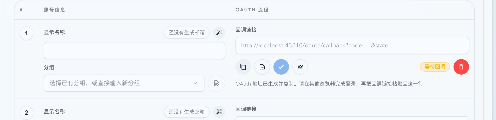
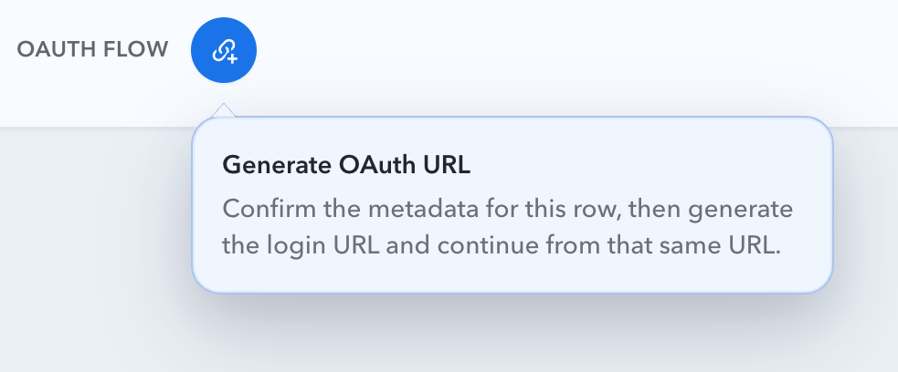

# 批量 OAuth 生成后自动复制（#r9v97）

## 状态

- Status: 已完成（5/5，PR #254）
- Created: 2026-03-27
- Last: 2026-03-28

## 背景

- `#ca7v4` 已把批量 OAuth 行的“生成 / 复制 / 重生成 / 手动复制降级”收敛到一个主按钮和同一个 bubble。
- 当前复制态点击已经会自动写入剪贴板；仍然缺一个细节：当这一行刚生成出新的 OAuth URL 时，用户还要再点一次复制，主动作链路少了最后一步。
- 这次 follow-up 只补“生成成功后自动复制”这个行为缺口，不调整单账号 OAuth 页面，也不改后端 session / refresh 契约。

## 目标 / 非目标

### Goals

- 批量 OAuth 行首次生成成功后，立即复制 `beginOauthLogin` 返回的 fresh `authUrl`。
- 批量 OAuth bubble 里的 `Regenerate OAuth URL` 也沿用同一自动复制语义。
- 复制失败时继续复用现有手动复制 bubble，且 bubble 内必须展示刚生成出来的 fresh URL。
- 成功反馈要明确区分“仅生成成功”和“已生成并复制”。

### Non-goals

- 不改单账号 OAuth 页面生成逻辑。
- 不修改现有 copy mode 的 stale-session 防护、metadata sync flush 或 `getLoginSession` 刷新逻辑。
- 不新增后端字段，不改 `beginOauthLogin / getLoginSession` 线协议。

## 功能规格

### 批量 OAuth 生成后的自动复制

- 当批量行点击主按钮进入生成路径，并且 `beginOauthLogin` 成功返回 `pending` session + `authUrl` 时，前端必须立刻调用现有 `copyText(..., { preferExecCommand: true })` 自动复制该 URL。
- 自动复制覆盖两个生成入口：
  - 首次主按钮 `Generate OAuth URL`
  - bubble 内 `Regenerate OAuth URL`
- 自动复制直接使用 `beginOauthLogin` 返回的 `authUrl`，不额外插入一次 `getLoginSession` 刷新。

### 成功 / 失败反馈

- 自动复制成功后，该行立即切换到 copy mode，并显示“已生成并复制”的行内反馈。
- 自动复制失败后：
  - 当前行仍保留新生成的 pending session；
  - 继续切换到 copy mode；
  - 打开现有手动复制 bubble；
  - bubble 内的文本必须是本次 fresh `authUrl`。

### 兼容与边界

- 现有 copy mode 点击逻辑保持不变，继续使用 metadata sync flush + stale-session 防护，避免复制过期 / completed / 不可重试失败后的旧 URL。
- 同一行若在前一次自动复制尚未返回时再次重生成，旧复制 promise 的结果不得回写或覆盖新 session 的提示、错误态与手动复制 bubble。
- 同一 `loginId` 的自动复制结果若在该行已经完成、失败、过期或失去 `authUrl` 后才返回，也不得再覆写当前行提示。
- 主按钮存在项目 bubble 提示时，不再额外挂原生 `title` 提示，避免同一悬浮动作出现两层提示。
- hover / 普通 focus 打开的 bubble 采用轻微延迟；右键、长按和键盘显式展开仍保持立即打开。
- 若用户在被动提示延迟到期前已经触发主按钮动作，挂起的被动提示必须被取消，不得在点击后再冒出陈旧 bubble。
- 单账号 OAuth 页面保持不变。
- 本次不新增新的 bubble、tooltip、状态源或 session 生命周期分支。

## 验收标准

- Given 批量行当前无有效 pending OAuth URL，When 点击主按钮生成，Then `beginOauthLogin` 成功后立刻复制返回的 `authUrl`，并切换到 copy mode。
- Given 用户在 bubble 中点击 `Regenerate OAuth URL`，When 新 URL 生成成功，Then 立即复制最新 URL，而不是只更新 session。
- Given 浏览器阻止自动复制，When fresh URL 生成成功但复制失败，Then 打开现有手动复制 bubble，并显示该 fresh URL 供手动复制。
- Given 同一行在前一次自动复制尚未返回时又生成了新的 OAuth URL，When 较旧的复制 promise 之后才完成，Then 页面仍保持最新 session 的提示与手动复制状态，不得被旧结果覆盖。
- Given 批量行已经处于 copy mode，When 点击主按钮复制，Then 继续沿用现有 stale-session 防护，不回退到直接复制缓存 URL。
- Given 单账号 OAuth 页面，When 生成 URL，Then 行为不变。

## 质量门槛

- `cd web && bunx vitest run src/pages/account-pool/UpstreamAccountCreate.test.tsx`
- `cd web && bun run build`
- `cd web && bun run build-storybook`
- Storybook 页面级场景覆盖“生成成功即自动复制”和“生成成功但复制失败时落到手动复制 bubble”。

## Visual Evidence

- source_type: storybook_canvas
  story_id_or_title: Account Pool/Pages/Upstream Account Create/Batch OAuth / Ready
  state: generated and copied
  evidence_note: 批量 OAuth 首行生成成功后立即切换为复制态，并给出“已生成并复制”的行内反馈。
  target_program: mock-only
  capture_scope: browser-viewport
  sensitive_exclusion: N/A
  submission_gate: approved
  image:
  

- source_type: storybook_canvas
  story_id_or_title: Account Pool/Pages/Upstream Account Create/Batch OAuth Action / Generate
  state: delayed project bubble
  evidence_note: 主按钮仅展示项目 bubble 提示，不再依赖原生黑底 tooltip；被动提示改为轻微延迟显示。
  target_program: mock-only
  capture_scope: browser-viewport
  sensitive_exclusion: N/A
  submission_gate: approved
  image:
  

## 实现备注

- 本项是 `#ca7v4` 的 follow-up，只补批量 OAuth 生成路径自动复制，不改已完成 spec 的原始目标边界。
- 优先复用现有 `batchManualCopyRowId`、手动复制 bubble、`copyText(...)` 与 copy mode 的提示文案结构，不新增第二套状态机。
