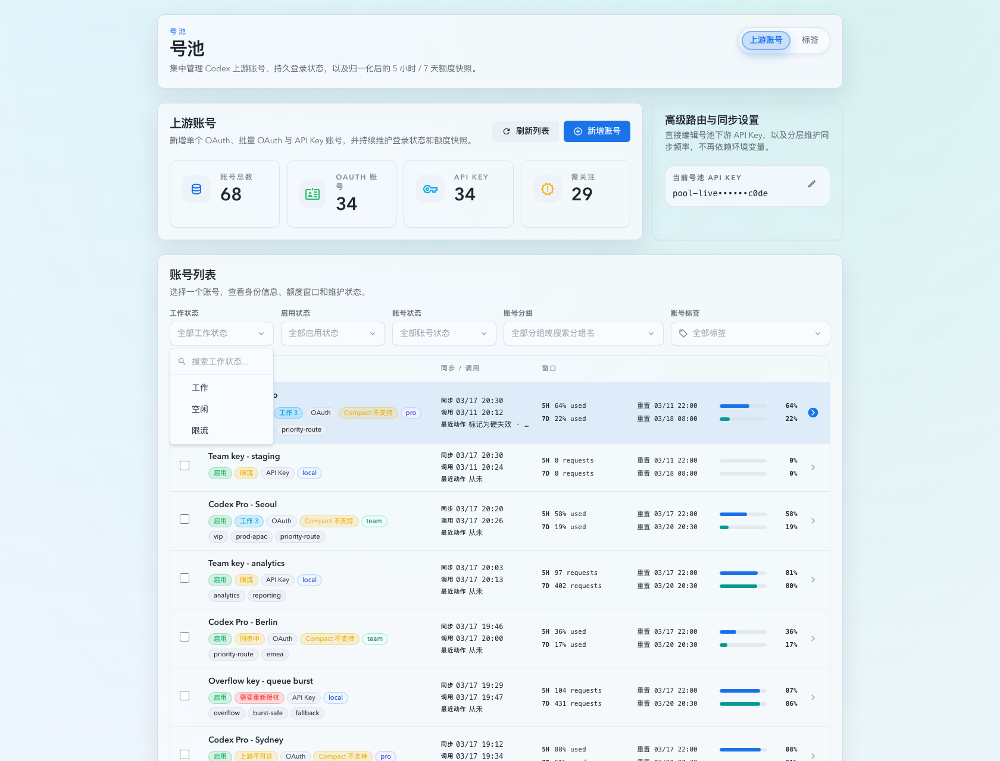
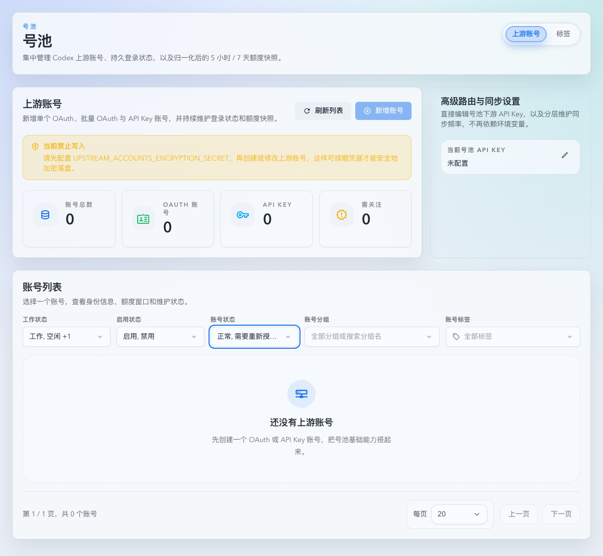

# 上游账号列表三组状态筛选改为多选（#s9k3m）

## 状态

- Status: 进行中
- Created: 2026-03-27
- Last: 2026-03-27

## 背景 / 问题陈述

- 当前账号列表的 `工作状态 / 启用状态 / 账号状态` 三组筛选仍是单选，下钻排查时必须反复切换单个状态，效率很差。
- 前端筛选控件与 `GET /api/pool/upstream-accounts` 都只接受单值，无法表达“同一维度内多个状态并集”的真实需求。
- 标签筛选已经具备稳定的多选交互，如果状态筛选继续停留在单选，列表顶部的筛选体验会割裂。

## 目标 / 非目标

### Goals

- 将 `工作状态 / 启用状态 / 账号状态` 统一改为多选筛选，交互复用现有标签筛选的 popover + checklist 模式。
- `GET /api/pool/upstream-accounts` 接受重复 query 参数 `workStatus|enableStatus|healthStatus`，同一维度内按 OR 匹配。
- 不同筛选维度之间、以及与分组/标签之间继续保持 AND 交集语义。
- 空选择等价于“全部…”，不发送对应 query 参数。

### Non-goals

- 不改变分组筛选与标签筛选的语义，`tagIds` 仍保持全匹配。
- 不新增数据库列、状态枚举或额外持久化。
- 不改账号详情抽屉、分页/批量选择、批量操作协议。

## 范围（Scope）

### In scope

- `web/src/components/MultiSelectFilterCombobox.tsx` 与相关 stories/tests：新增字符串选项多选筛选控件。
- `web/src/pages/account-pool/UpstreamAccounts.tsx`、`web/src/lib/api.ts`、`web/src/hooks/useUpstreamAccounts.ts`：前端筛选状态改为数组，序列化为重复 query 参数。
- `web/src/components/UpstreamAccountsPage.story-helpers.tsx`、`web/src/components/UpstreamAccountsPage.list.stories.tsx`：更新 Storybook mock filtering 与 page play coverage。
- `src/upstream_accounts/mod.rs`：列表 query 解析改为重复参数，服务端筛选改为同维度 OR。
- `docs/specs/g4ek6-account-pool-upstream-accounts/contracts/http-apis.md`：收口对外契约说明。

### Out of scope

- `status` legacy query 的删除或破坏性重定义。
- 账号详情页、创建页或其它非 roster 页面筛选交互。
- Storybook 之外的全新 demo 页面。

## 接口契约（Interfaces & Contracts）

### `GET /api/pool/upstream-accounts`

- `workStatus|enableStatus|healthStatus` 改为可重复 query 参数：
  - `workStatus=working&workStatus=rate_limited`
  - `enableStatus=enabled&enableStatus=disabled`
  - `healthStatus=normal&healthStatus=needs_reauth`
- 同一维度内任一值命中即返回；不同维度之间与 `groupSearch/groupUngrouped/tagIds` 仍按交集计算。
- `tagIds=...` 继续保持全匹配。
- 旧的单值 query 仍兼容，因为单值会按长度为 `1` 的重复参数序列处理。
- `status=...` legacy 参数继续保留，仍映射到拆分后的 `enableStatus/healthStatus/syncState`。

### 前端筛选状态

- `FetchUpstreamAccountsQuery.workStatus|enableStatus|healthStatus` 改为 `string[]`。
- 三组状态筛选都使用空数组表示“全部…”，不会再保留 `all` 哨兵值。
- 触发器文案规则：
  - 0 个选中：显示对应 “全部…”
  - 1 个选中：显示该状态名
  - 2 个选中：显示前两个状态名
  - 3+ 个选中：显示前两个状态名 + `+N`

## 验收标准（Acceptance Criteria）

- Given 同一维度选中多个状态，When 请求列表，Then 结果返回该维度任一状态命中的账号。
- Given 同时设置多个维度、分组或标签筛选，When 请求列表，Then 结果仍按各维度交集收口。
- Given 清空某个状态维度，When 再次请求列表，Then 不会发送该维度 query 参数，触发器显示“全部…”。
- Given 用户修改任一状态筛选、分组、标签或 `pageSize`，When 列表刷新，Then 页码回到 `1` 且跨页批量选择被清空。
- Given Storybook `StatusFilters` 场景，When 选中同一维度的多个状态，Then mock roster 会按 OR 语义显示对应账号。

## 非功能性验收 / 质量门槛（Quality Gates）

### Testing

- Rust: `cargo test upstream_accounts -- --nocapture`
- Web targeted: `cd web && ./node_modules/.bin/vitest run src/lib/api.test.ts src/hooks/useUpstreamAccounts.test.tsx src/pages/account-pool/UpstreamAccounts.test.tsx src/components/AccountTagFilterCombobox.test.tsx src/components/MultiSelectFilterCombobox.test.tsx`

### Quality checks

- Rust: `cargo check`
- Web: `cd web && bun run build`
- Storybook: `cd web && bun run build-storybook`

## Visual Evidence

- Storybook `Account Pool/Pages/Upstream Accounts/List / StatusFilters` 作为稳定 mock 证据源，确认筛选区与 roster 场景在 Storybook 静态构建中可稳定渲染。

- 本地预览 `http://127.0.0.1:30083/#/account-pool/upstream-accounts` smoke：在空数据页中依次选中三组状态的多个值，触发器摘要更新为 `工作, 空闲 +1`、`启用, 禁用`、`正常, 需要重新授...`；最后一次列表请求已确认发出重复 query 参数：
  - `workStatus=working&workStatus=idle&workStatus=rate_limited`
  - `enableStatus=enabled&enableStatus=disabled`
  - `healthStatus=normal&healthStatus=needs_reauth&healthStatus=upstream_unavailable`

## 变更记录（Change log）

- 2026-03-27：创建 follow-up spec，冻结三组状态筛选改为多选、重复 query 参数与同维度 OR 匹配的范围和契约。
- 2026-03-27：完成前后端多选筛选改造、定向测试、Storybook 构建与本地预览视觉证据落盘。
