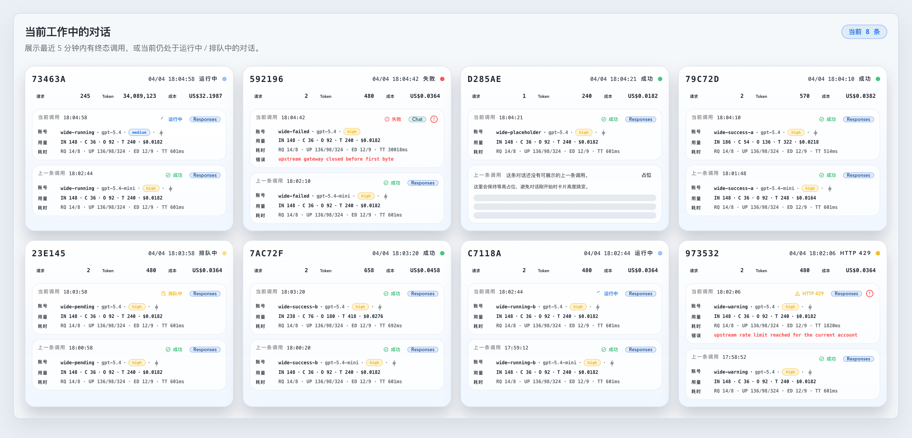
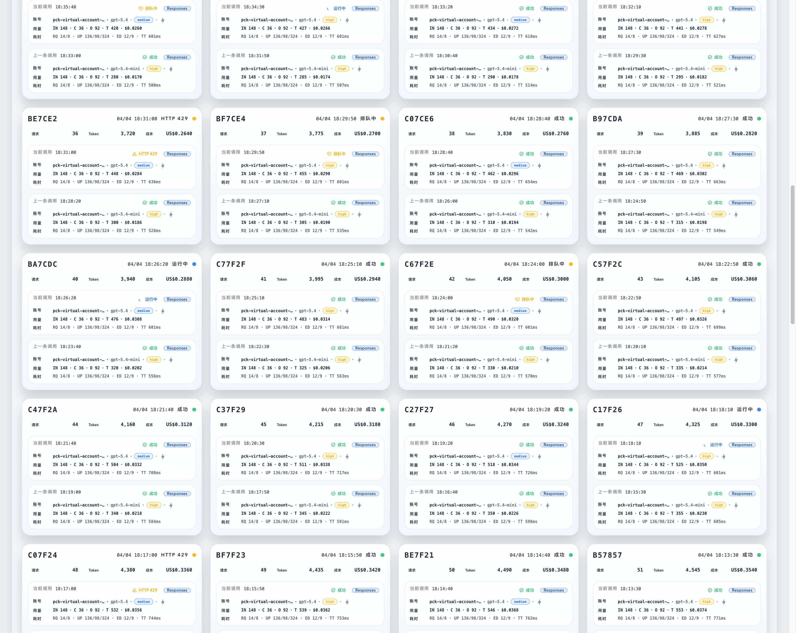
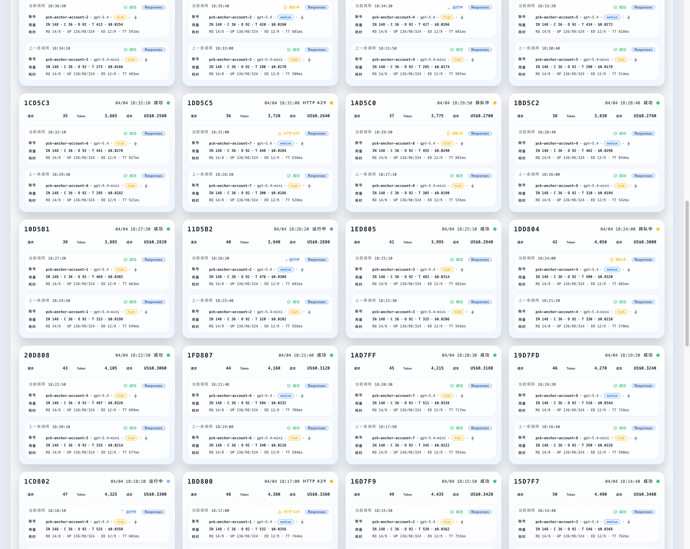
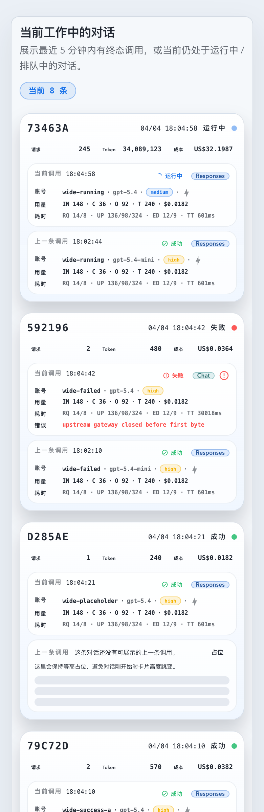

# Dashboard 工作中对话无限列表、虚拟滚动与增量同步（#suuez）

## 状态

- Status: 已完成
- Created: 2026-04-10
- Last: 2026-04-11

## 背景 / 问题陈述

- `#w3t3w` 已把 Dashboard 下半区改成“当前工作中的对话”卡片区，但前端仍额外裁到 `20` 条，后端 `activityMinutes=5` 路径也还保留隐式 `50` 条 cap，所以总览页实际上无法浏览完整工作集。
- 现有 Dashboard 数据层对 `/events` `records` 的处理仍偏整表思路：已加载项和未知新 key 之间没有清晰分流，滚动到中段后也容易停在过时工作集上。
- 卡片区已经演进到 `1 / 2 / 3 / 4` 栏响应式合同，下一步要把“加载完整工作集”与“DOM 只保留视口附近卡片”两件事一起做完，避免无限列表把页面直接拖死。
- 本轮 follow-up 继续复用现有通用接口与共享 `/events`，不新增 Dashboard 专用 route，也不再开第二条 working-conversations SSE 通道。
- 线上热修补充：`activityMinutes=5 + pagination + snapshotAt` 路径里，若当前小时 working rows 的 `cost` 全为 `NULL/0`，SQLite 会把 `total_cost` 聚合成 `INTEGER 0`；Rust 端此字段按 `f64` 解码，导致 Dashboard 偶发显示 `Request failed: 500 ... mismatched types ... total_cost`。

## 目标 / 非目标

### Goals

- 让 Dashboard 工作中对话区可浏览完整工作集，不再停在 `20` 条或 `50` 条上限。
- 为 `/api/stats/prompt-cache-conversations` 增加兼容分页与 `detail=compact` 紧凑载荷，让 Dashboard 可以按页拉取完整工作集而不拖上重载荷字段。
- Dashboard 前端改成“首屏分页 + 触底续页 + 页面级滚动驱动的按行虚拟化 + 局部 patch + 节流首屏 resync”的组合方案。
- 继续保留现有 `1 / 2 / 3 / 4` 栏响应式布局，同时保证头部插入新项时当前视口 anchor 不跳。
- 用 Storybook 稳定 mock 产出可复核的虚拟滚动 / 头插锚点补偿 / loading / empty / error / 移动端 / 1660 宽屏证据，并把最终图回填到本 spec 的 `## Visual Evidence`。
- 按 fast-track 收敛到 latest PR merge-ready，但不自动 merge / cleanup。

### Non-goals

- 不改 Live 页的 Prompt Cache 对话表或其它页面的 prompt-cache 展示逻辑。
- 不重写全局 `/events` payload schema，也不新增第二条 Dashboard 专属 SSE 通道。
- 不把工作中对话区改成 masonry / 双轴 grid 虚拟化；本轮固定为按行虚拟化。
- 不做与本轮需求无关的 Dashboard 其它区块重排。

## 范围（Scope）

### In scope

- 后端 `GET /api/stats/prompt-cache-conversations` 分页、cursor、snapshotAt、一致性与 `detail=compact|full` 扩展。
- 分页 working-conversations 聚合与 full-detail upstream account hydration 的 `total_cost` 数值类型热修，确保 `NULL cost` working rows 稳定返回 `REAL 0.0`。
- Dashboard 工作中对话 hook、mapper、section 组件、分页续页、SSE patch / reconnect resync / 本地过期剔除。
- `@tanstack/react-virtual` 页面级滚动驱动的按行虚拟化与视口外 DOM 剔除。
- `DashboardWorkingConversationsSection` Storybook、Vitest 与视觉证据。
- `docs/specs/README.md` 与本 spec 的进度、验证、视觉证据记录。

### Out of scope

- Live 页 UI 改版。
- 全局 SSE 基础设施重写。
- Dashboard 之外的 working-conversations 消费端改造。
- merge / cleanup 之后的发布链路。

## 接口 / 数据合同（API & UI Contract）

### Backend API

- `GET /api/stats/prompt-cache-conversations` 新增可选 query：
  - `pageSize`
  - `cursor`
  - `snapshotAt`
  - `detail=compact|full`
- 分页请求新增返回字段：
  - `snapshotAt`
  - `totalMatched`
  - `hasMore`
  - `nextCursor`
- 对话项新增稳定元数据：
  - `lastTerminalAt`
  - `lastInFlightAt`
  - `cursor`
- 兼容约束：
  - 旧调用方不传分页参数时继续走 legacy cap 与旧载荷。
  - Dashboard 新链路显式走 `activityMinutes=5 + detail=compact + pagination`。

### Frontend / UX

- 总览页工作中对话区支持无限滚动，滚动到底部按页续拉。
- DOM 只保留当前视口行与少量 overscan，对视口外卡片不继续挂载。
- `/events` `records`：
  - 已加载 key => 本地 patch 当前项；
  - 未加载 key => 节流触发首屏 compact page resync；
  - `open` => reconnect 后强制首屏 resync。
- 头部新项自动并入，但当前视口 anchor 通过滚动偏移补偿保持稳定，不得因为 prepend 直接把用户踹回顶部。
- 超出 5 分钟窗口且不再 in-flight 的已加载项，会在本地时钟推进或 resync 后尽快剔除。

## 验收标准（Acceptance Criteria）

- Given 当前工作中对话数 `>20`，When 打开 Dashboard 并持续下滚，Then 可以浏览完整工作集，且 DOM 只保留可见行与 overscan，而不是把所有卡片全挂在页面上。
- Given 当前工作中对话数 `>50`，When Dashboard 走分页 `activityMinutes=5` 请求，Then 可以继续翻页拿到后续工作集；旧非分页调用方行为不变。
- Given `activityMinutes=5 + pageSize + snapshotAt + detail=compact` 命中当前小时 `cost` 全为 `NULL` 的 working rows，When 请求 `GET /api/stats/prompt-cache-conversations`，Then 接口返回 `200` 且 `totalCost` 稳定序列化为 JSON number `0`/`0.0`，不会再抛 `total_cost` 解码 `500`。
- Given 同一路径切到 `detail=full`，When working rows 的 `cost` 全为 `NULL`，Then `recentInvocations` / `upstreamAccounts` 仍与 snapshot 边界一致，且 `conversation.totalCost` / `upstreamAccounts[].totalCost` 稳定为 `0.0`。
- Given 用户正滚在中段，When 新会话出现在列表头部或已加载卡片收到新 `records`，Then 当前视口 anchor 不跳；可见卡片即时更新，头部新项自动并入。
- Given 某已加载对话超出 5 分钟工作窗口且不再 in-flight，When 本地时钟推进或 reconnect / resync 发生，Then 该项会尽快从工作集剔除，不会长期停在过时状态。
- Given 高频 `records` 连续到达，When 观察 Dashboard 网络请求，Then working-conversations 不再每次都整表回源，只允许节流首屏 resync 与滚动触发的按页加载。

## 非功能性验收 / 质量门槛（Quality Gates）

### Performance / Data freshness

- `detail=compact` 必须避免带上 `last24hRequests`、`upstreamAccounts` 等重载荷。
- 分页工作集必须使用稳定 keyset 顺序：`createdAt DESC + promptCacheKey DESC`。
- 首屏 resync 与滚动续页共享 `snapshotAt` 会话一致性，避免跨页重叠或漏项。
- 滚动中收到新数据时，优先 patch 已加载项；对未知 key 仅做节流首屏刷新，不允许每个 `records` 都整表补拉。

### Testing

- Rust targeted: `cargo test prompt_cache_conversation`
- Rust full: `cargo test`
- Frontend targeted: `cd /Users/ivan/.codex/worktrees/468e/codex-vibe-monitor/web && bunx vitest run src/hooks/useDashboardWorkingConversations.test.tsx src/components/DashboardWorkingConversationsSection.test.tsx src/pages/Dashboard.test.tsx`
- Frontend build: `cd /Users/ivan/.codex/worktrees/468e/codex-vibe-monitor/web && bun run build`
- Storybook build: `cd /Users/ivan/.codex/worktrees/468e/codex-vibe-monitor/web && bun run storybook:build`

## 文档更新（Docs to Update）

- `docs/specs/README.md`
- `docs/specs/suuez-dashboard-working-conversations-virtual-scroll/SPEC.md`

## 计划资产（Plan assets）

- Directory: `docs/specs/suuez-dashboard-working-conversations-virtual-scroll/assets/`
- In-spec references: ``
- Visual evidence source: Storybook Canvas（优先）

## 实现里程碑（Milestones / Delivery checklist）

- [x] M1: 新建 follow-up spec，并在 `docs/specs/README.md` 登记本轮工作项。
- [x] M2: 扩展通用 prompt-cache conversations API，补齐分页 / cursor / snapshotAt / compact 合同与 Rust 回归。
- [x] M3: Dashboard 数据层改成分页无限列表，完成 SSE patch / head resync / 本地过期剔除，并接入页面级滚动驱动的按行虚拟化。
- [x] M4: 补齐 Storybook 大数据虚拟滚动、头插锚点补偿、loading / empty / error、mobile / 1660 宽屏入口，并生成视觉证据。
- [x] M5: 跑完 cargo + vitest + build + storybook build，确认请求节流与分页行为符合验收标准。
- [x] M6: 执行 fast-track review-loop，推到 latest PR merge-ready（不自动 merge / cleanup）。

## 方案概述（Approach, high-level）

- 后端继续复用现有 `prompt-cache-conversations` route，但把 Dashboard 需要的分页能力收拢到 `activityMinutes=5 + detail=compact` 新路径上，避免专门拆出一条 UI-only API。
- 前端 hook 以首屏 page 为真实工作集头部，续页只在触底时拉，已加载项优先本地 patch，未知 key 再触发节流 resync，这样能把实时性与请求量一起压住。
- 虚拟滚动固定走“按行”而不是卡片级绝对定位，并以页面滚动作为唯一纵向滚动真相源：保留现有 `1 / 2 / 3 / 4` 栏响应式合同，同时让 prepend 时的 anchor 补偿只需要围绕可见卡片 top delta 做处理。
- Storybook 用稳定 mock 去覆盖大数据列表、自动 prepend 锚点稳定、loading / empty / error、mobile / 1660 宽屏几组关键态，并把最终 owner-facing 截图写回本 spec。

## 风险 / 开放问题 / 假设（Risks, Open Questions, Assumptions）

- 风险：若 `snapshotAt` 与 cursor 分页的边界处理不稳，会在第二页以后出现重复 / 漏项；本轮已用稳定 keyset + Rust 回归护栏锁住。
- 风险：jsdom 下虚拟滚动天然不稳定；Vitest 需要用可控 virtualizer mock 或稳定容器几何来验证“DOM 只渲染子集”。
- 风险：如果 reconnect / unseen-key refresh 节流过强，滚动到中段后可能短时间停在过时列表；因此 `open` 与定时 poll 都要保留首屏 resync。
- 假设：Dashboard 之外的 Live 页和其它 prompt-cache 消费端本轮只需要兼容新接口，不要求 UI 同步改造。
- 假设：最终视觉证据可以直接来自 Storybook Canvas，无需真实线上截图。

## 变更记录（Change log）

- 2026-04-10: 新建 follow-up spec，冻结“无限列表 + 页面级滚动驱动的按行虚拟化 + compact 分页 API + SSE patch / resync + 头插锚点补偿 + merge-ready 收口”这组决策。
- 2026-04-10: 后端已落地 prompt-cache conversations 分页 / compact 合同与 Rust 回归；Dashboard hook / mapper / section 已切到分页无限列表、页面级滚动驱动的按行虚拟化与局部 patch 路径。
- 2026-04-10: 已新增 hook 级 Vitest 覆盖首屏 compact page、loadMore cursor/snapshotAt、loaded-key patch、unseen-key resync、reconnect resync 与本地 stale prune；组件级测试新增 DOM 子集渲染断言。
- 2026-04-10: Storybook 已补齐 loading / empty / error、mobile 390、wide 1660、virtualized large dataset 与 head-insert anchor compensation 入口；本地 `cargo test`、Dashboard 定向 Vitest、`bun run build`、`bun run storybook:build` 全部通过，视觉证据已落盘并获主人批准继续推进 PR 收敛。
- 2026-04-11: 修复分页 working-conversations 与 full-detail upstream account hydration 的 `total_cost` 数值聚合，把 `COALESCE/SUM` 统一锚到 `REAL 0.0`，并新增 `NULL cost` snapshot pagination Rust 回归，锁住 Dashboard 偶发 `500 total_cost mismatched types` 热修。
- 2026-04-11: Storybook 已刷新 loading / empty / error、mobile 390、wide 1660、virtualized large dataset 与 head-insert anchor compensation 入口，相关视觉证据继续归档在本 spec；本次 `total_cost` 热修复用该 spec，不新增额外视觉证据。

## Visual Evidence

- source_type: storybook_canvas
  target_program: mock-only
  capture_scope: browser-viewport
  sensitive_exclusion: N/A
  submission_gate: pending-owner-approval
  story_id_or_title: Dashboard/WorkingConversationsSection/WideDesktop1660
  state: wide-desktop-1660
  evidence_note: 验证 1660 宽屏下工作中对话区保持 `1 / 2 / 3 / 4` 响应式合同，并在总览页中稳定显示四栏卡片。
  PR: include
  image:
  

- source_type: storybook_canvas
  target_program: mock-only
  capture_scope: browser-viewport
  sensitive_exclusion: N/A
  submission_gate: pending-owner-approval
  story_id_or_title: Dashboard/WorkingConversationsSection/VirtualizedLargeDataset
  state: virtualized-large-dataset
  evidence_note: 验证大工作集场景下列表保持页面级滚动驱动的按行虚拟化，区块内部不出现独立滚动条，且视口外卡片不会全部挂进 DOM。
  PR: include
  image:
  

- source_type: storybook_canvas
  target_program: mock-only
  capture_scope: browser-viewport
  sensitive_exclusion: N/A
  submission_gate: pending-owner-approval
  story_id_or_title: Dashboard/WorkingConversationsSection/HeadInsertAnchorCompensation
  state: head-insert-anchor-compensation
  evidence_note: 验证滚动到中段后自动 prepend 新头部项时，当前视口 anchor 通过滚动偏移补偿保持稳定，不会把用户踹回顶部。
  image:
  

- source_type: storybook_canvas
  target_program: mock-only
  capture_scope: browser-viewport
  sensitive_exclusion: N/A
  submission_gate: pending-owner-approval
  story_id_or_title: Dashboard/WorkingConversationsSection/Mobile390
  state: mobile-390
  evidence_note: 验证 390px 移动端下工作中对话区退回单列布局，卡片头部与双槽内容层级仍保持可读。
  PR: include
  image:
  

## 参考（References）

- `docs/specs/w3t3w-dashboard-working-conversations-cards/SPEC.md`
- `docs/specs/r4m6v-dashboard-working-conversations-invocation-drawer/SPEC.md`
- `docs/specs/mbnns-dashboard-working-conversations-wide-4col/SPEC.md`
- `web/src/hooks/useDashboardWorkingConversations.ts`
- `web/src/components/DashboardWorkingConversationsSection.tsx`
- `web/src/components/DashboardWorkingConversationsSection.stories.tsx`
