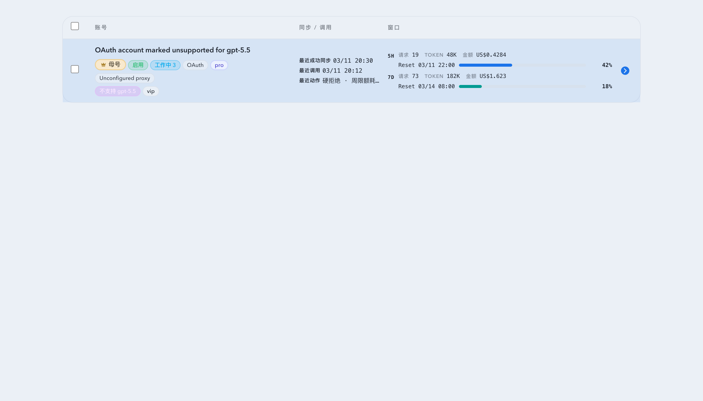

# GPT-5.5 Unsupported Account Tag

## Goal

When an upstream ChatGPT account rejects `gpt-5.5` with an unsupported-model error, the pool treats the error as recoverable and routes the request to another account that is not marked unsupported.

## Requirements

- Detect the upstream error shape `The 'gpt-5.5' model is not supported when using Codex with a ChatGPT account.` on pool calls.
- Automatically attach a protected system tag named `不支持 gpt-5.5` to the account that produced the error.
- Show the tag as a visible magenta badge with a tinted background in the upstream account roster.
- Support existing tag filtering by this system tag.
- Keep the tag entity non-deletable and non-editable.
- Allow operators to remove the tag from selected accounts through the existing bulk remove-tags action, so the accounts can be retried for future `gpt-5.5` traffic.
- During pool routing for `gpt-5.5`, skip accounts currently carrying the system tag.

## Visual Evidence

