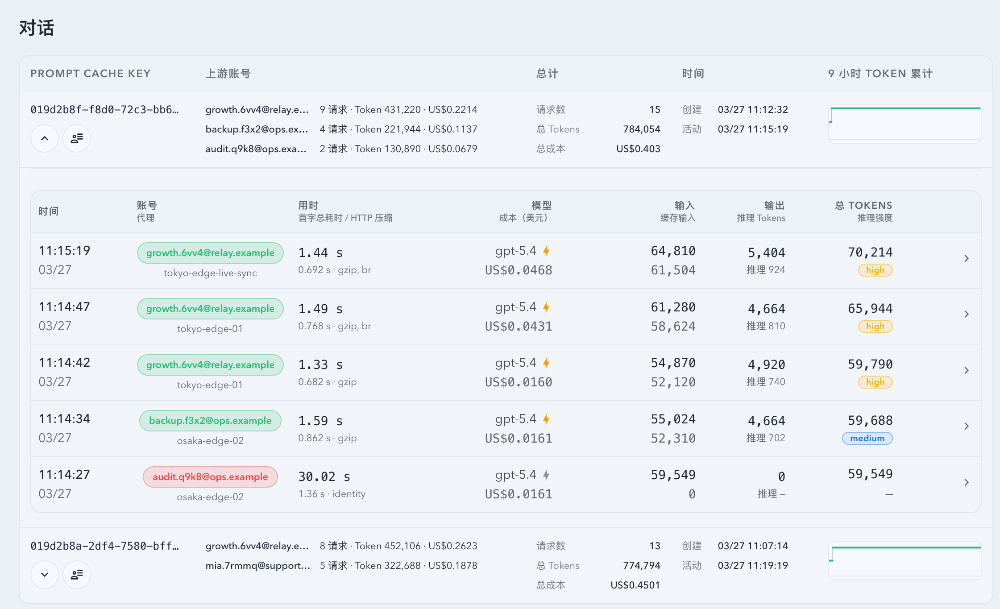

# Live Prompt Cache 调用记录同源实时同步（#v5qtm）

## 状态

- Status: 已实现，PR 收敛中
- Created: 2026-03-27
- Last: 2026-03-27

## 背景 / 问题陈述

- Live 页 `对话` 区块里的 Prompt Cache 行内 preview 与“全部调用记录”抽屉没有直接复用同页“最新记录”使用的 `/events` `records` 通道。
- 运行中的请求只存在于 SSE runtime snapshot，尚未落库前不会进入 `/api/stats/prompt-cache-conversations` 与 `/api/invocations`，导致 preview / drawer 看起来比同页“最新记录”慢一拍。
- Prompt Cache 对话接口带有 5 秒轻缓存，SSE 触发后的立即静默回源仍可能命中旧聚合，进一步放大“没有实时更新”的体感。

## 目标 / 非目标

### Goals

- 让 Prompt Cache 行内 preview 与打开中的历史抽屉直接消费 `/events` 的 `records` 通道，与同页“最新记录”保持同源实时。
- 抽出与“最新记录”一致的 invocation live-merge helper，统一 stable key、running -> final 替换优先级与字段 completeness 选择。
- 在代理记录落库后主动失效 Prompt Cache conversations 轻缓存，让 SSE 驱动的 HTTP resync 立即拿到新聚合。
- 保持现有 `count: 20 / 50 / 100` 与 `activityWindow: 1 / 3 / 6 / 12 / 24` 选择语义；live overlay 先参与排序 / 截断，再由权威 HTTP 收敛 totals 与 hidden count。

### Non-goals

- 不新增新的 HTTP route、SSE event type 或外部 schema。
- 不改 Records 页的信息架构与筛选模型。
- 不重算 Prompt Cache 聚合 totals 的统计口径。

## 范围（Scope）

### In scope

- `src/api/mod.rs`、`src/main.rs`、`src/tests/mod.rs`：Prompt Cache conversations cache invalidation 与回归测试。
- `web/src/lib/invocationLiveMerge.ts`、`web/src/lib/promptCacheLive.ts`：共享 live merge / overlay helper。
- `web/src/hooks/usePromptCacheConversations.ts` 与测试：Prompt Cache 行内 preview 接入 `records` SSE overlay 与节流 resync。
- `web/src/components/PromptCacheConversationTable.tsx`、测试与 Storybook：打开中的历史抽屉消费相同 `records` 通道，并在 final payload 到达时替换 running snapshot。
- `docs/specs/README.md` 与本 spec。

### Out of scope

- 新的 SSE 广播类型或专用 Prompt Cache live API。
- Prompt Cache 统计卡片、图表或筛选器信息架构重做。
- 自动 merge PR 或 post-merge cleanup。

## 接口契约（Interfaces & Contracts）

- `/events`
  - 继续复用现有 `records` payload；Prompt Cache 视图不得引入专用 SSE 事件。
  - 相同 invoke 的 running snapshot 与 final persisted row 必须按 stable key 合并，而不是渲染成两条。
- `GET /api/stats/prompt-cache-conversations`
  - HTTP schema 保持不变。
  - 对话 hook 可在前端临时 overlay `recentInvocations`、`last24hRequests` 与 `lastActivityAt`，随后由下一次权威回源收敛。
- `GET /api/invocations`
  - 历史抽屉继续复用现有分页接口；打开态允许叠加 live overlay，并在节流窗口或 SSE reconnect 后静默重拉完整 snapshot。

## 验收标准（Acceptance Criteria）

- Given Live 页 Prompt Cache 对话列表已加载，When matching `records` SSE 到达，Then 行内 preview 必须立即出现新记录，即使请求仍处于 `running` / `pending` 且尚未落库。
- Given Prompt Cache 历史抽屉处于打开状态，When matching `records` SSE 到达，Then 新记录必须立即 prepend 到抽屉顶部，并与同页“最新记录”保持同源。
- Given 同一 invoke 先收到 runtime snapshot、后收到 final persisted row，When preview 或抽屉重新渲染，Then 必须只保留一条记录，且展示 final record 的完整字段。
- Given 当前 Prompt Cache 选择模式为 `count` 或 `activityWindow`，When live overlay 插入新的对话或新记录，Then 当前排序 / 截断语义保持不变，后续 HTTP resync 负责收敛 hidden count 与权威 totals。
- Given Prompt Cache conversations 结果已命中 5 秒轻缓存，When 新代理记录成功落库，Then 下一次 Prompt Cache conversations 回源不得继续命中旧聚合。

## 非功能性验收 / 质量门槛（Quality Gates）

### Testing

- Rust: `cargo test prompt_cache_conversations_cache_ -- --nocapture`
- Web: `cd web && bun run test -- src/hooks/usePromptCacheConversations.test.tsx src/components/PromptCacheConversationTable.test.tsx src/pages/Live.test.tsx`
- Storybook: `cd web && bun run build-storybook`

### Visual Evidence

- 使用现有 `Monitoring/PromptCacheConversationTable` Storybook 入口补齐稳定 live-sync 场景。
- 视觉证据以 mock data / Storybook 为准，先在对话中回传给主人，再决定是否允许进入远端提交链路。

## Visual Evidence

- source_type: storybook_canvas
  target_program: mock-only
  capture_scope: element
  sensitive_exclusion: N/A
  submission_gate: owner-approved
  story_id_or_title: Monitoring/PromptCacheConversationTable / Live Sync Settled
  state: settled preview after live-sync convergence
  evidence_note: 验证 Prompt Cache 对话行在 SSE 合流后，行内 preview 会把最新完成请求顶到最前，并保持与 `InvocationTable` 一致的字段展示。
  image:
  
