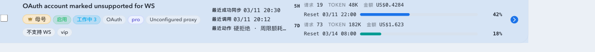
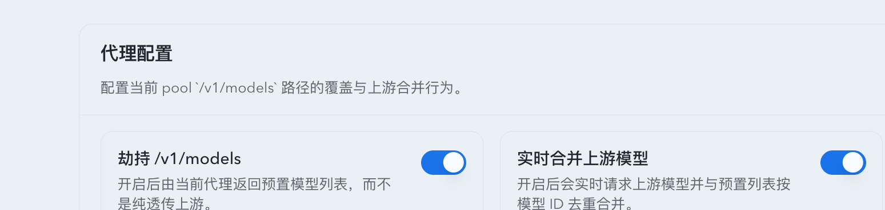
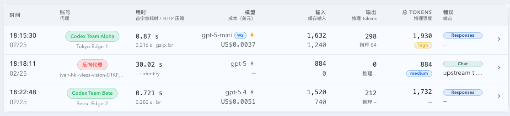
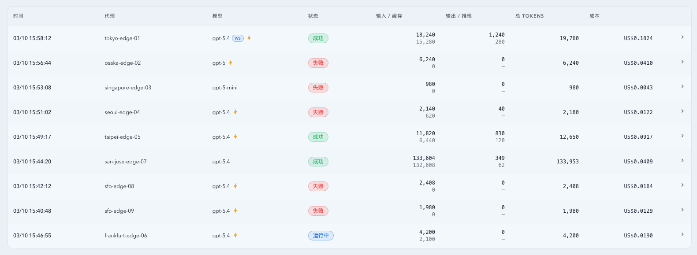
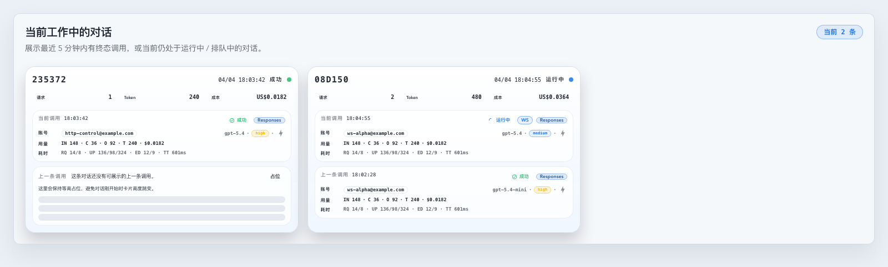

# OpenAI 兼容 WebSocket 代理（#w5s2x）

## 状态

- Status: active
- Created: 2026-05-04
- Last: 2026-05-04

## 背景 / 问题陈述

OpenAI Responses API 已公开 WebSocket mode，Codex 也已开始使用 WebSocket 承载多数 Responses API 流量。当前本服务的 OpenAI 兼容代理只处理 `/v1/*` HTTP 请求；若下游客户端切换为 WebSocket，本服务无法接入、路由到账号池或记录连接级状态。

## 目标 / 非目标

### Goals

- `/v1/*` 支持下游 WebSocket upgrade，并通过账号池选择上游账号。
- 提供两个全局配置开关，分别控制 downstream 是否允许 WebSocket、proxy-to-upstream 是否默认使用 WebSocket，避免部署后默认改变 `/v1/*` 的兼容协议面。
- 提供固定受保护系统 tag 标记“不支持 WS”的上游账号；带 tag 的账号默认走 HTTP，不参与 WS 上游候选选择。
- 将账号级 `upstreamBaseUrl` 的 `https/http` 映射为 `wss/ws`，再拼接原始 `/v1/*` path 与 query。
- WebSocket 帧透明双向转发，支持 text、binary、ping、pong、close。
- 对 OpenAI Responses WS 里已支持的 terminal usage 事件做 turn 级计费解析，并复用现有 `codex_invocations` / hourly rollup / cost 目录。
- 记录连接级 pool attempt，并在终态后广播现有 pool attempt 快照。
- 保持现有 `/events` SSE 监控通道不变。

### Non-goals

- 不把监控 UI 的 SSE 改成 WebSocket。
- v1 不做任意帧 usage/cost 深解析；仅对已知 terminal usage 事件做保守解析，解析失败时不做半字段计费。
- v1 不新增 SQLite schema；账号能力使用现有 protected system tag 机制承载。
- 已建立的 WebSocket 隧道中途断开后，v1 不做透明帧级换号或重放；服务端通过可重连 close 语义驱动 downstream 重新连接，下一条连接重新进入号池调度。
- 不承诺通用 OpenAI Responses WS ↔ HTTP 事件级语义转换；只有具备可验证事件映射与恢复语义后才进入后续版本。

## 范围

### In scope

- `/v1/*` downstream WebSocket upgrade 检测、鉴权与账号池路由。
- 透明上游 WebSocket 连接与帧中继。
- downstream upgrade 前的上游账号连接 failover：上游 WS 握手失败时，代理记录失败、释放 reservation、排除该账号并按号池逻辑继续尝试其他候选，直到连上一个上游或耗尽 distinct-account retry budget。
- downstream upgrade 后的上游连接失败契约：代理记录失败并主动发送 WebSocket close `1013`，reason 包含 `upstream_unavailable; retry`，利用客户端对 retryable close 的重连行为进入下一次号池调度。
- 上游账号 capability gate：`unsupported_transport:websocket` system tag 使账号退出 WS 候选；普通 HTTP 请求仍可使用该账号。
- 连接级 pool attempt 观测、reservation 释放与 SSE 广播。

### Out of scope

- Dashboard/Live 前端实时订阅协议。
- Responses API WS 事件语义解析与 token 计费。
- 非 pool route 的直连反代恢复。

## 接口契约

- Downstream: `GET /v1/*` 携带标准 WebSocket upgrade headers，且必须携带现有 pool route key。
- Downstream feature flag: 全局设置 `websocketEnabled=false` 时，WebSocket upgrade 返回 HTTP `503` JSON error；设置为 `true` 后才允许 downstream WS。`OPENAI_PROXY_WEBSOCKET_ENABLED` 只作为首次初始化默认值，普通 HTTP proxy 不受该开关影响。
- Upstream default flag: 全局设置 `upstreamWebsocketDefaultEnabled=false` 时，proxy 不主动连接上游 WS；设置为 `true` 后，downstream WS 请求才会尝试上游 WS。`OPENAI_PROXY_UPSTREAM_WEBSOCKET_DEFAULT_ENABLED` 只作为首次初始化默认值，普通 HTTP 请求仍走 HTTP，除非后续版本实现并启用可验证 HTTP→WS 事件桥接。
- Account capability tag: protected system tag `unsupported_transport:websocket` / `不支持 WS` 表示该账号不支持 upstream WS；WS 调度必须跳过该账号，HTTP 调度不跳过。
- Account auto-tagging: 上游 WS 握手若返回明确不支持 WS 的 HTTP 状态，代理必须自动给该账号补写 `unsupported_transport:websocket` / `不支持 WS`；网络 reset、timeout、502 等非确定性故障不得自动打该 tag。
- Upstream URL:
  - account/global upstream base `https://host/base` -> `wss://host/base/<original-path>?<query>`
  - account/global upstream base `http://host/base` -> `ws://host/base/<original-path>?<query>`
- Headers:
  - 转发安全端到端 headers；
  - 不转发 hop-by-hop/upgrade headers；
  - API key 账号覆盖 `Authorization` 为账号配置；
  - OAuth 账号使用 `Bearer <access_token>`。
- Usage:
  - 仅当上游 text 帧属于已知 terminal usage 事件且能完整解析 `response.usage` 时，才生成计费记录；
  - 不做半字段累加，不把 binary/ping/pong 计入 usage；
  - 成本和价格版本走现有 `estimate_proxy_cost_from_shared_catalog` / `codex_invocations` / hourly rollup 路径。
- Failure:
  - WebSocket support disabled：HTTP `503` JSON error，不建立上游连接。
  - pool route key 缺失或无效：HTTP `401` JSON error，和现有 HTTP proxy 行为一致。
  - 上游 URL 构造失败：HTTP `502` JSON error，记录失败且不重试该请求。
  - `upstreamWebsocketDefaultEnabled=false` 或所有候选都带 no-ws tag：WebSocket upgrade 返回 `503`，不建立不可靠隧道。
  - 单个上游 WS 连接或握手失败：记录 transport failure attempt，释放该账号 reservation，标记路由 transport failure，排除失败账号与 route key，并在同一个 downstream 请求内继续选择下一个账号。
  - 单个上游 WS 握手返回 403/404/405/426/501：除记录失败与继续切号外，还必须自动标记该账号 `不支持 WS`，使后续 WS 调度跳过该账号。
  - 所有可用候选耗尽或达到 distinct-account retry budget：返回最后一次可重试失败对应的 HTTP error，或返回 pool 不可用错误。
  - 已建立隧道后的上游异常、EOF 或在终态前主动 close：发送 downstream close `1013` / `upstream_unavailable; retry` 并记录终态；客户端重连后由服务端重新走 pool selection，失败账号的现有路由失败记录和降权逻辑参与下一次选择。

## 验收标准

- Given 无有效 pool route key，When 请求 `/v1/responses` WebSocket upgrade，Then 返回 `401`，不建立上游连接。
- Given 有效账号与 mock upstream WS，When downstream 发送 text/binary/ping/close，Then upstream 收到对应帧，且 upstream 响应帧被转发给 downstream。
- Given 第一个上游账号 WS 连接失败且池内还有候选，When downstream 发起 upgrade，Then 代理在 downstream upgrade 前记录失败并切到下一个账号；若下一个账号成功，downstream 得到正常 WebSocket 隧道而不是先断开再依赖客户端重连。
- Given 所有上游 WS 连接失败，When downstream 发起 upgrade，Then downstream 收到 HTTP error，所有失败账号的 pool reservation 被释放，attempt 记录为 transport failure。
- Given 已建立隧道后上游异常断开或在 `response.completed` 前主动 close，When downstream 等待下一帧，Then downstream 收到 close `1013` 且 reason 包含 `retry`，下一次连接重新进入号池调度。
- Given 账号带 `unsupported_transport:websocket` 系统 tag，When downstream 发起 WebSocket upgrade，Then 该账号不作为上游 WS 候选；When 普通 HTTP 请求路由，Then 该账号仍可作为 HTTP 候选。
- Given 未带 `unsupported_transport:websocket` 的账号在上游 WS 握手阶段返回 403/404/405/426/501，When 代理记录该失败，Then 自动补写 `不支持 WS` tag，且下一次 WS 调度跳过该账号；When 后续普通 HTTP 请求路由，Then 该账号仍可作为 HTTP 候选。
- Given 上游发出 `response.completed` 且包含完整 `response.usage`，When downstream 继续接收该 WS turn，Then 代理为该 turn 生成可计费 usage/cost 记录并进入既有 invocation 统计。
- Given 上游 usage JSON 缺字段或类型不对，When downstream 继续接收 WS，Then 代理保守地跳过该 event 的计费，不产生半字段成本。
- Given account `upstreamBaseUrl=https://example.test/base`，When 下游连接 `/v1/responses?model=x`，Then 上游目标为 `wss://example.test/base/v1/responses?model=x`。

## Assumptions

- WebSocket 连接为长连接交互，v1 只对 OpenAI Responses WS 已知 terminal usage 事件做保守计费；无法完整解析 usage 的帧不计费。
- 现有 pool route key 是 WebSocket 下游鉴权入口，不新增独立 WS token。
- 代理只能在 downstream WebSocket upgrade 前做同连接内可靠切换；upgrade 后的切换边界是 downstream retryable close + 客户端重连 + 服务端下一次 pool selection。该机制依赖客户端遵循 WebSocket 临时不可用 close 的重连策略，但不依赖服务端静默假设：服务端必须主动发出 `1013` 并记录失败账号。

## Visual Evidence

Storybook canvas 证据展示账号池列表中的受保护系统标签 `不支持 WS`，用于标记该账号不参与上游 WS 候选，但普通 HTTP 路由仍可使用。

Storybook canvas 证据展示设置页中的 WebSocket 全局开关。两个开关可保存并即时影响后续 `/v1/*` WebSocket 请求；环境变量只作为首次初始化默认值。

Storybook canvas 证据展示 WebSocket usage 调用在“最新记录”表的模型名后显示轻量 `WS` badge；非 WS 记录不显示协议标识。

Storybook canvas 证据展示 WebSocket usage 调用在“请求记录 / 记录”表的模型列内、模型名之后显示 `WS` badge，并保留 endpoint、成本和 token 信息的层级。

Storybook canvas 证据展示 WebSocket usage 调用在“当前工作中的对话” invocation slot 右上角操作区显示 `WS` badge，位置在状态之后、endpoint pill 之前。

