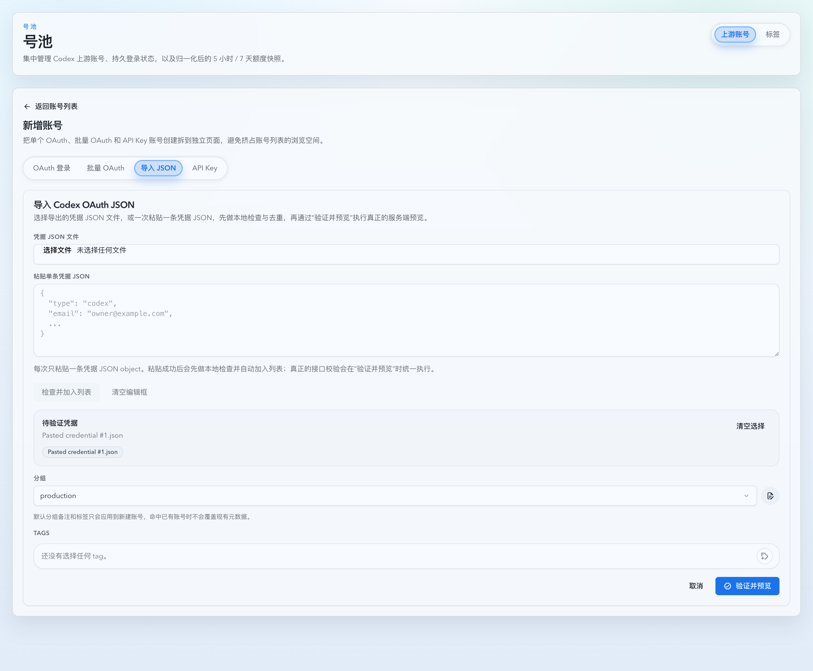
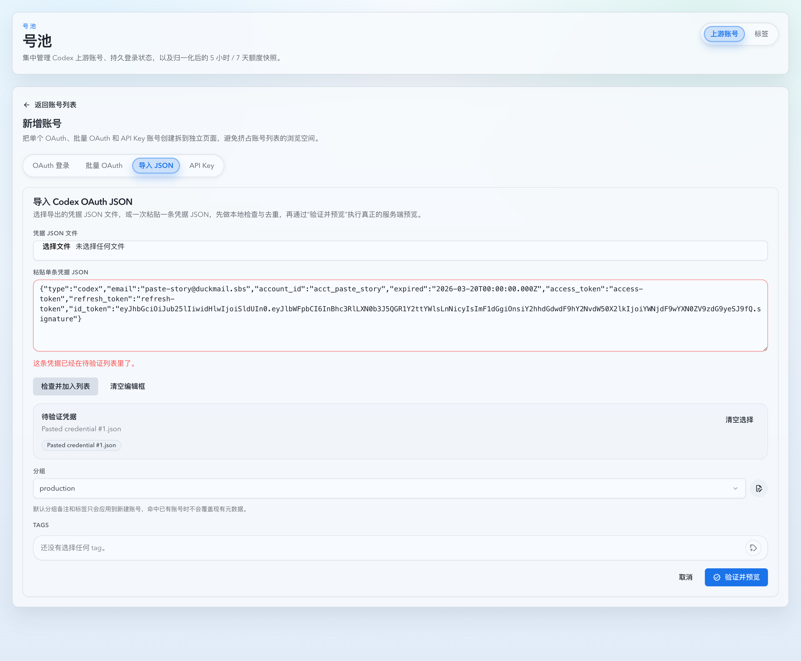

# OAuth 导入最小校验修复与单条粘贴入列（#w8seb）

## 状态

- Status: 已实现，待 PR / CI / review-proof 收敛
- Created: 2026-04-02
- Last: 2026-04-14

## 背景

- `cgz7s-oauth-token-json-import` 已经交付了 OAuth JSON 批量导入、任务式校验与复用缓存导入主链路，但它默认把导入 JSON 直接反序列化成强类型结构。
- 当前实现会把 `last_refresh`、`token_type` 这类未被导入成功条件真正消费的字段也限定成字符串；一旦历史导出里这些字段是数字、对象或数组，导入会在 schema 层提前失败，误伤成功率。
- 运营侧除了文件批量导入，还会在聊天或工单里逐条拿到 JSON 文本；现有页面虽然支持“粘贴一条 -> 预校验 -> 入列”，但预校验会在 paste / 选文件阶段直接触发接口，和“验证并预览”按钮的职责重叠。
- 当前导入页也缺少前端去重：同一账号可以在点击“验证并预览”前被重复塞进待处理列表，增加无效 preview 噪音。

## 目标 / 非目标

### Goals

- 只要求导入实际会用到的字段合法，未消费字段不再因为类型不符阻断导入。
- 保持现有导入 HTTP 契约、`validation-jobs + SSE` 批量校验流程与最终 import 主路径不变。
- 在导入页保留单条粘贴编辑框，但把文件选择与粘贴阶段收敛为“纯前端本地轻校验 + 入列”。
- `验证并预览` 成为唯一服务端校验入口；paste / file 阶段不再发 validate 请求。
- 在前端入列前按后端既有 match key 语义做去重：优先 `account_id`，缺失时回退归一化 `email`；保留首条，后续重复项直接拦截。
- 粘贴本地校验失败时保留当前这一条文本并允许编辑，再通过显式动作重新检查 / 加入列表。

### Non-goals

- 不新增后端路由，不修改 `/api/pool/upstream-accounts/oauth/imports/validate`、`validation-jobs`、`imports` 的请求/响应 shape。
- 不支持编辑框内批量数组、多条顶层 JSON、目录导入或“粘贴后直接完成最终导入”。
- 不新增需要服务端状态、探活或 usage 才能得出的新业务判断；本地校验只覆盖浏览器内可确定复现的契约子集。

## 范围（Scope）

### In scope

- imported OAuth 导入 tab 的文件选择、单条粘贴、本地轻校验、去重与列表入列交互。
- 导入页对应的 Vitest 回归与 Storybook 页面 stories。
- follow-up spec、索引与视觉证据记录。

### Out of scope

- OAuth 文件导入的任务式校验 / 导入缓存 / 分页结果弹窗结构本身。
- 任何新的数据库字段、账号元数据覆盖规则、分组 / tag 继承策略。
- 现有批量 OAuth、单账号 OAuth、API Key 创建路径。

## 需求（Requirements）

### MUST

- `type/email/account_id/access_token/refresh_token/id_token` 仍是导入成功的必要字段。
- `expired` 仍沿用现有规则：非空时必须是合法 RFC3339；空或缺失时按 `access_token.exp -> id_token.exp` 回退；`id_token` 与顶层 `email/account_id` mismatch 仍返回 invalid。
- `last_refresh` 和当前未消费的 `token_type` 出现非字符串值时，不得因为反序列化失败而阻断 normalize / validate / import。
- 粘贴编辑框一次只承载一条文本；新的 paste 必须替换旧 draft，而不是追加。
- 文件选择与粘贴阶段不得调用 `/oauth/imports/validate`、`validation-jobs` 或其他服务端校验接口。
- 粘贴内容若不是“恰好一个 JSON object”，前端必须直接 inline 拒绝。
- 本地轻校验至少覆盖：`type=codex`、必要字段非空、`expired` RFC3339 / exp fallback 可判定性、`id_token` 可解析且与顶层 `email/account_id` 一致。
- 粘贴自动本地检查只在 paste 写入 draft 后触发；手工编辑后改为显式“重新检查 / 加入列表”。
- 文件项与粘贴成功项共用同一个待验证列表；列表内重复项必须在前端被拦截，不得再进入“验证并预览”的输入集。
- `验证并预览` 继续复用现有批量 validate/import 主路径，成为首次服务端触点。

### SHOULD

- 已选列表文案应明确这些项还只是“待验证 / queued”，避免误导成已完成导入。
- 粘贴成功使用稳定伪文件名（如 `Pasted credential #n`）进入现有列表与后续结果弹窗。

## 功能与行为规格

### 后端最小校验

- imported OAuth JSON 的未消费字段改为“非阻断读取”：只要导入链路没有使用它们的值，就不应限制它们的 JSON 类型。
- 对于 `token_type`：
  - 若它是非空字符串，沿用现有归一化路径；
  - 若它不是字符串或为空，回退到现有默认 `Bearer`。
- 额外未知字段继续忽略，不新增 `deny_unknown_fields`。

### 文件与粘贴阶段的本地轻校验

- 导入页保留现有文件选择器，并新增单条粘贴编辑框。
- 用户 paste 一条 JSON 文本后：
  - 编辑框内容被整段替换为本次粘贴文本；
  - 前端先做本地轻校验与去重；
  - 通过后立即加入当前待验证列表并清空编辑框；
  - 若本地检查失败或命中重复，则保留文本与错误提示，允许继续编辑。
- 用户选择文件时：
  - 前端逐条读取文件内容并执行同一套本地轻校验；
  - 本地检查失败项与重复项直接跳过，并在列表附近给出可见反馈；
  - 通过项才进入待验证列表。
- 手工编辑后不做实时网络校验；用户点击显式按钮后再次执行同样的本地检查。

### 列表与批量主路径

- 文件选择与粘贴成功项都进入同一个 `importFiles` 列表。
- 列表入列前先按后端现有 match key 语义去重：`account_id.trim().toLowerCase()` 优先，缺失时回退 `email.trim().toLowerCase()`。
- 一旦列表变化，已有的批量校验结果视为过期；后续仍需走现有“验证并预览”弹窗重新生成批量结果。
- 导入结果弹窗、SSE 进度、批量 import 聚合逻辑不变。

## 验收标准

- Given 顶层必要字段都合法，但 `last_refresh` 是对象或数组、`token_type` 是数字，When 导入文件进入 normalize / validate，Then 不会再因这些未消费字段的类型失败。
- Given 用户粘贴一个合法的单条 OAuth JSON object，When 本地检查通过，Then 该条立即加入待验证列表，编辑框被清空，且这一步不发校验请求。
- Given 用户粘贴的内容不是单个 JSON object（如数组、多个顶层 JSON、拼接文本），When 粘贴发生，Then 前端直接 inline 拒绝且不发请求，编辑框保留这一次粘贴的文本。
- Given 本地检查失败（如 `id_token` 无法解析或和顶层字段不一致），When 页面展示结果，Then 编辑框保留当前这一条文本，用户可编辑后点击显式按钮重新检查。
- Given 当前列表里已存在某账号，When 用户再次通过文件或粘贴加入相同 `account_id/email` 的凭据，Then 前端保留首条、拦截后续重复项，并给出明确重复提示。
- Given 当前列表里同时存在文件项和粘贴成功项，When 点击“验证并预览”，Then 现有 `validation-jobs + SSE` 流程仍按统一列表运行，不回退文件导入主链路，且首次服务端校验只发生在此时。

## 质量门槛

- `cargo test`
- `cd web && bun run test`
- `cd web && bun run build`
- `cd web && bun run build-storybook`

## 实现里程碑

- [x] M1: 创建 follow-up spec 并登记索引，冻结“只校验已使用字段 + 单条粘贴预校验”边界。
- [x] M2: 放宽 imported OAuth 未消费字段反序列化，补 Rust 回归。
- [x] M3: 导入页接入单条粘贴编辑框，并把 paste / file 阶段收敛为本地轻校验 + 去重 + 入列。
- [x] M4: 补齐 Vitest / Storybook 覆盖，确保文件项与粘贴项共存、重复项被前端拦截，且“验证并预览”仍是唯一服务端校验入口。
- [ ] M5: 完成本地验证、视觉证据与快车道 PR 收敛。

## Visual Evidence

- Storybook 稳定页面已覆盖 imported OAuth 本地轻校验与去重后的关键界面状态。
- 关键证据图：
  - added：合法单条凭据经本地检查后进入待验证列表，`验证并预览` 成为下一步唯一服务端入口。
    
  - duplicate：重复凭据被前端拦截，编辑框保留当前文本，列表只保留首条待验证项。
    
- 相关原始截图保留在同目录 `assets/` 下，便于后续审计或重导出。

## 风险 / 假设

- 假设：粘贴入口只面向“一次一条凭据”，不需要支持编辑框内批量管理。
- 风险：如果继续把批量校验结果保留在列表变更后复用，容易出现“结果快照不包含新粘贴项”的错觉；因此列表变化时需要清空旧的批量结果状态。
- 假设：本地轻校验只覆盖浏览器内可确定复现的导入契约子集；任何需要服务端探活或任务态的判断都延后到“验证并预览”。

## 变更记录

- 2026-04-02：创建 follow-up spec，冻结“未消费字段非阻断 + 单条粘贴预校验并入现有导入列表”的范围与验收标准。
- 2026-04-02：完成后端最小校验修复、单条粘贴入列交互、Vitest / Storybook / Rust 回归与本地视觉证据，进入 PR 收敛。
- 2026-04-14：把导入页文件/粘贴阶段收敛为本地轻校验 + 去重 + 入列；`验证并预览` 成为唯一服务端校验入口，并补齐重复拦截的 Vitest / Storybook 覆盖。
