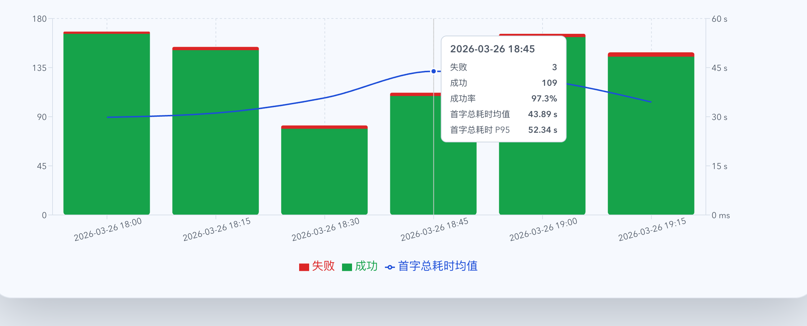

# 统计页成功/失败图改为首字总耗时 P95（#x2s4h）

## 状态

- Status: 已实现
- Created: 2026-03-26
- Last: 2026-03-26

## 背景 / 问题陈述

- 既有统计页“成功/失败次数”图来自 [#8dun3](../8dun3-stats-success-failure-ttfb/SPEC.md)，其延迟折线使用的是 `t_upstream_ttfb_ms` 的成功样本均值 / P95。
- 请求详情与记录表在 [#mj5nt](../mj5nt-live-running-elapsed-sse/SPEC.md) 之后已经明确区分“上游首字节”和“首字总耗时”，用户实际要看的是真正显示在表格中的“首字总耗时”。
- 当前图表、tooltip、右轴文案都把两种语义混成了“首字耗时”，会让图表与记录详情对不上。

## 目标 / 非目标

### Goals

- 将统计页“成功/失败次数”图的延迟指标族切换为“首字总耗时”。
- 固化“首字总耗时”的聚合口径为 `tReqReadMs + tReqParseMs + tUpstreamConnectMs + tUpstreamTtfbMs`。
- `/api/stats/timeseries` 新增 `firstResponseByteTotalSampleCount`、`firstResponseByteTotalAvgMs`、`firstResponseByteTotalP95Ms`，并保留旧 `firstByte*` 字段兼容。
- hourly rollup、历史回放、live-tail merge 与前端图表统一消费同一套新字段。
- 图表 tooltip / 图例 / 右轴文案统一改为“首字总耗时”，并按 `<1000 ms` 显示毫秒、`>=1000 ms` 显示秒。
- 为该图补稳定 Storybook 入口，作为视觉证据真相源。

### Non-goals

- 不删除或重定义已有 `firstByte*` 字段。
- 不改动请求详情表中的阶段耗时展示。
- 不扩展 P99 或增加新的统计页筛选器。

## 范围（Scope）

### In scope

- `src/stats/mod.rs`
- `src/api/mod.rs`
- `src/main.rs`
- `src/tests/mod.rs`
- `web/src/lib/api.ts`
- `web/src/lib/api.test.ts`
- `web/src/components/SuccessFailureChart.tsx`
- `web/src/components/SuccessFailureChart.test.tsx`
- `web/src/components/SuccessFailureChart.stories.tsx`
- `web/src/i18n/translations.ts`
- `docs/specs/README.md`

### Out of scope

- `records` 汇总卡片的 TTFB / Total 指标定义。
- 其它图表的延迟口径收敛。

## 接口与数据口径

- 单条记录“首字总耗时”定义：
  - `tReqReadMs + tReqParseMs + tUpstreamConnectMs + tUpstreamTtfbMs`
- 计样条件：
  - 四个阶段值都存在
  - `tReqReadMs`、`tReqParseMs`、`tUpstreamConnectMs` 必须是有限非负值
  - `tUpstreamTtfbMs` 必须是有限正值；`0 ms` 视为“未拿到首字”的哨兵值，不计入样本
  - 不要求最终 `status == success`；只要已经拿到首字且阶段完整，就计入样本
- `/api/stats/timeseries` 新增字段：
  - `firstResponseByteTotalSampleCount: number`
  - `firstResponseByteTotalAvgMs: number | null`
  - `firstResponseByteTotalP95Ms: number | null`
- 旧字段保持兼容：
  - `firstByteSampleCount`
  - `firstByteAvgMs`
  - `firstByteP95Ms`

## 验收标准（Acceptance Criteria）

- Given 一个 bucket 内存在完整四段耗时样本，When 请求 `/api/stats/timeseries`，Then 返回正确的 `firstResponseByteTotalAvgMs` 与 `firstResponseByteTotalP95Ms`。
- Given bucket 内记录缺失任一阶段耗时，When 请求 `/api/stats/timeseries`，Then 该记录不进入 `firstResponseByteTotal*` 样本。
- Given 某条请求最终失败但已拿到首字且四段耗时完整，When 请求 `/api/stats/timeseries`，Then 它会进入 `firstResponseByteTotal*` 样本。
- Given 同一响应跨越 archived hourly rollup 与 live tail，When 渲染统计图，Then 历史 bucket 与 live bucket 都返回正确的新字段。
- Given 打开统计页成功/失败图，When 悬浮任意 bucket，Then tooltip 显示“失败、成功、成功率、首字总耗时均值、首字总耗时 P95”。
- Given `firstResponseByteTotalAvgMs >= 1000`，When 图表渲染右轴或 tooltip，Then 延迟值以秒显示；否则以毫秒显示。

## 非功能性验收 / 质量门槛

### Testing

- `cargo test`
- `cd web && bun run test`
- `cd web && bun run build`
- `cd web && bun run storybook:build`

### UI / Storybook

- 新增稳定故事：`web/src/components/SuccessFailureChart.stories.tsx`
- 视觉证据来源：`Stats / SuccessFailureChart / FirstResponseByteTotalP95`

## 文档更新（Docs to Update）

- `docs/specs/README.md`

## Plan assets

- Directory: `docs/specs/x2s4h-stats-first-response-byte-total-p95/assets/`

## Visual Evidence

- source_type=storybook_canvas
- target_program=mock-only
- capture_scope=browser-viewport
- sensitive_exclusion=N/A
- story_id_or_title=`Stats/SuccessFailureChart/FirstResponseByteTotalP95`
- state=`tooltip pinned to 2026-03-26 18:45`
- evidence_note=稳定 Storybook canvas 证明统计图折线已切换为“首字总耗时均值”，右轴使用秒级显示，tooltip 同时展示 `43.89 s` 的均值与 `52.34 s` 的 P95。
- 

## 实现里程碑（Milestones / Delivery checklist）

- [x] M1: 新建 follow-up spec 并登记到 `docs/specs/README.md`。
- [x] M2: 后端 timeseries / hourly rollup 新增 `firstResponseByteTotal*` 聚合字段与回归测试。
- [x] M3: 前端图表切换为 `firstResponseByteTotal*` 并统一文案 / 格式。
- [x] M4: Storybook 入口、视觉证据与本地验证闭环。

## 风险 / 假设 / 参考

- 风险：历史 rollup 继续使用近似直方图，所以跨 rollup + exact 的 P95 仍是 histogram-based 近似值。
- 假设：CRS 等只有汇总无阶段耗时的数据源不参与这条延迟线。
- 参考：
  - [#8dun3](../8dun3-stats-success-failure-ttfb/SPEC.md)
  - [#mj5nt](../mj5nt-live-running-elapsed-sse/SPEC.md)
