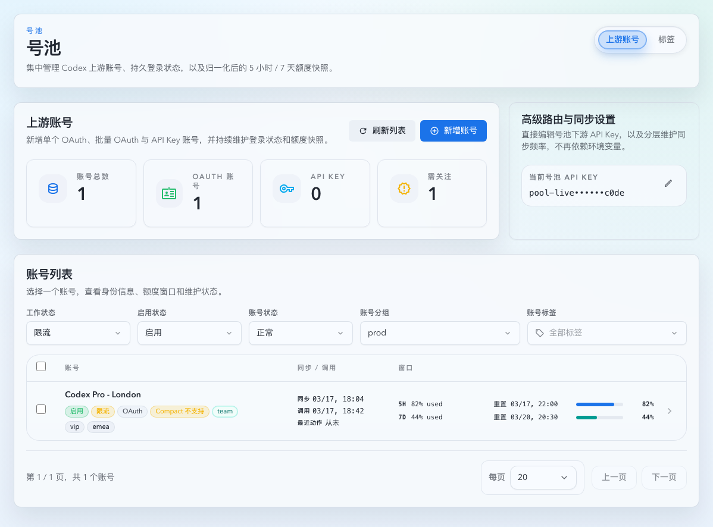

# 上游账号列表筛选前端持久化（#yxdy4）

## 状态

- Status: 已完成
- Created: 2026-03-29
- Last: 2026-03-29

## 背景 / 问题陈述

- `号池 -> 上游账号` 列表已经支持 `工作状态 / 启用状态 / 账号状态 / 账号分组 / 账号标签` 五类筛选，但这些选择只保存在当前页面内存中。
- 用户刷新页面、重新进入 `#/account-pool/upstream-accounts`，或切换语言后重新打开页面时，筛选会回退到默认空状态，需要重复配置。
- 现有 `分组` 筛选的真相源是展示字符串；如果直接把翻译文案落到本地存储，`未分组 / Ungrouped` 这类语义在多语言环境下会变脆弱。

## 目标 / 非目标

### Goals

- 让上游账号列表的五项筛选优先从浏览器 `localStorage` 恢复。
- 首屏恢复必须发生在第一次 `useUpstreamAccounts(accountListQuery)` 之前，避免先发默认请求再抖动到已记忆筛选。
- `分组` 筛选持久化必须保存语义化 payload，而不是翻译后的展示文本，保证跨语言恢复时仍能命中 `all / ungrouped / search` 语义。
- 对损坏 JSON、非法状态值、失效 tag id 或浏览器存储异常做静默降级，不影响页面加载。
- 补齐 `UpstreamAccounts.test.tsx` 和 Storybook 稳定场景，作为本次改动的自动化与视觉证据。

### Non-goals

- 不把筛选同步到 URL query/hash。
- 不记忆分页、每页条数、顶部页签、详情抽屉状态或批量选择。
- 不修改 `GET /api/pool/upstream-accounts` 的协议、`FetchUpstreamAccountsQuery` 类型或服务端筛选语义。
- 不扩展到其它页面的筛选持久化。

## 范围（Scope）

### In scope

- `web/src/pages/account-pool/UpstreamAccounts.tsx`：读取/写入本地记忆、语义化分组筛选状态、非法值回退。
- `web/src/pages/account-pool/UpstreamAccounts.test.tsx`：恢复、写回、坏数据回退、跨语言 `ungrouped` 与失效 tag id 清洗回归。
- `web/src/components/UpstreamAccountsPage.list.stories.tsx`：新增稳定的“首屏已恢复筛选” Storybook 场景。
- `docs/specs/README.md` 与当前 spec：记录交付状态与视觉证据。

### Out of scope

- 后端 API、SQLite、SSE、列表分页与批量工具栏逻辑。
- 账号详情抽屉、创建页或标签页的其它本地记忆。
- PR 正文内嵌截图策略变更。

## 需求（Requirements）

### MUST

- 仅使用浏览器 `localStorage` 记住这五项筛选。
- 使用单一 storage key 管理该页面的筛选状态。
- `groupFilter` 必须保存为语义结构：`all | ungrouped | search(query)`。
- 损坏 JSON、非法状态枚举、重复值、非正整数 tag id、读写异常都必须静默回退到安全默认值。
- 首次进入页面时，如果 tag id 中包含已失效标签，第一次查询就不能把失效 id 带给 `useUpstreamAccounts`。

### SHOULD

- 复用仓库现有 `localStorage` try/catch 容错模式。
- 保持现有交互副作用不变：筛选变化仍然重置页码到 `1` 并清空跨页批量选择。

## 功能与行为规格（Functional/Behavior Spec）

### Core flows

- 页面首屏渲染时：
  - 先读取本地记忆的筛选 payload。
  - 过滤掉非法状态值与非法 tag id。
  - 生成第一次 `accountListQuery` 并请求列表。
- 用户修改任一筛选后：
  - 当前 UI 状态立即更新。
  - 同步把清洗后的 payload 写回同一 `localStorage` key。
- 重新进入页面或刷新时：
  - 恢复上次成功写回的筛选值。
- 切换中英文后再次进入页面时：
  - 若记忆的是 `groupFilter=ungrouped`，页面必须恢复为当前语言的“未分组 / Ungrouped”展示，但请求语义仍是 `groupUngrouped=true`。

### Edge cases / errors

- `localStorage` 不可访问时，页面继续以默认空筛选工作。
- 非法 JSON 或结构不匹配时，忽略存储值并回退默认。
- 失效 tag id 不得进入查询参数；页面应在首轮渲染后把清洗后的值重新写回存储。

## 接口契约（Interfaces & Contracts）

- 不改 `FetchUpstreamAccountsQuery` 与后端接口。
- 新增前端本地持久化 payload，字段如下：
  - `workStatus: string[]`
  - `enableStatus: string[]`
  - `healthStatus: string[]`
  - `tagIds: number[]`
  - `groupFilter: { mode: 'all' | 'ungrouped' | 'search'; query?: string }`

## 验收标准（Acceptance Criteria）

- Given 本地没有存储值，When 打开上游账号页，Then 列表按默认空筛选请求。
- Given 本地存在合法持久化 payload，When 页面首次渲染，Then 第一次 `useUpstreamAccounts(accountListQuery)` 就带上恢复后的筛选。
- Given 用户修改任一筛选，When 操作完成，Then 同一 storage key 被写回清洗后的最新 payload。
- Given 本地 payload 损坏或状态值越界，When 打开页面，Then 页面静默回退到默认值，不报错。
- Given 本地 payload 保存的是 `groupFilter=ungrouped`，When 从中文切到英文后重新进入页面，Then 页面显示 `Ungrouped`，并继续请求 `groupUngrouped=true`。
- Given 本地 payload 包含失效 tag id，When 打开页面，Then 首次查询不发送失效 id，且本地存储会被回写为清洗后的 tag id 集合。

## 非功能性验收 / 质量门槛（Quality Gates）

### Testing

- `cd web && bun run test -- src/pages/account-pool/UpstreamAccounts.test.tsx`

### Quality checks

- `cd web && bun run build`
- `cd web && bun run build-storybook`

## Visual Evidence

- Storybook `Account Pool/Pages/Upstream Accounts/List / PersistedRosterFilters` 作为稳定证据源，确认页面首屏已恢复记忆筛选，且列表收口与筛选触发器摘要一致。

## 变更记录（Change log）

- 2026-03-29：创建 follow-up spec，冻结上游账号列表五项筛选的本地记忆范围、回退语义与视觉证据来源。
- 2026-03-29：完成前端持久化、定向 Vitest、`web` 构建、Storybook 静态构建与 Storybook 视觉证据落盘；当前等待截图提交授权后再继续 push / PR。
