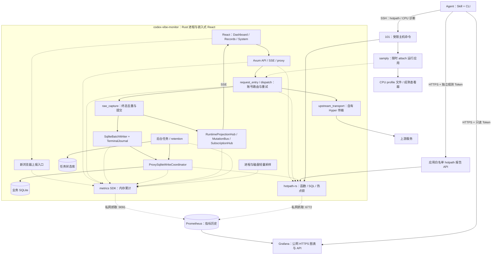

# 性能观测架构与旧系统退役

Design status: Accepted

Implementation status: Not started

本设计是应用集成与外部监控配合的锁定基线，依据 [ADR 0025](../adr/0025-external-performance-observability.md)。目标是让 Agent 定位数据库竞争、异常 CPU 和响应慢，同时退役本项目的旧性能采集、SQLite 历史存储和自研性能图表。实现和上线需要另外授权；本文件不表示已部署，也不是临时执行计划。

## 设计边界

| 数据 / 能力                           | 唯一职责方                | 边界                                                          |
| ------------------------------------- | ------------------------- | ------------------------------------------------------------- |
| 聚合性能指标历史                      | Prometheus                | 应用不保存第二份指标历史，不查询它来完成业务请求              |
| 请求诊断链路历史                      | 共享 Tempo                | 保存有界个体区间和关联关系，CVM 留存 24 小时                  |
| 性能图表与告警                        | Grafana                   | 正式图表、变量、数据源和规则由仓库 provisioning 管理          |
| 函数、规范化 SQL、路由、选定锁诊断    | 进程内 hotpath-rs         | 提供实时归因及私网 Prometheus 导出，不承担历史数据库          |
| CPU 调用栈与火焰图                    | 按需 samply + 成熟查看器  | SSH 对运行实例限时 attach，文件短期保存，无常驻 profiler 服务 |
| 调用、费用、token、终态与任务执行记录 | 现有业务持久化            | 主库、任务库、TerminalJournal、raw/archive 不属于退役的性能库 |
| 浏览器体验                            | 新浏览器适配器 + 应用 SDK | 低频、固定分类、有界上报，不保存用户性能明细                  |

首期不引入 Loki、Pyroscope、独立 OTel Collector、额外 Alertmanager 或自研火焰图界面。核心外部常驻服务为 Prometheus、Grafana 和共享 Tempo；采样工具和受限 SSH 命令不增加 daemon。Grafana 的内部配置库属于其产品实现，不是本项目保留的性能 SQLite。

针对完整下游请求的资源等待归因与个体案例分析，[ADR 0033](../adr/0033-external-request-diagnostic-traces.md) 扩展上述服务数量边界，[ADR 0034](../adr/0034-shared-tempo-request-tracing.md) 选择共享 Tempo、OpenTelemetry/OTLP 与首期 SDK 有界异步批量导出，由 Grafana 展示并与 Prometheus 统计关联。CVM 为首个接入项目，链路正常容量内全量轻量记录、保留 24 小时，界面展示少量分类案例；共享平台与应用边界、容量核验见 [请求生命周期观测设计](request-lifecycle-observability.md)。该扩展保留聚合指标、业务事实与 CPU 诊断各自的职责。

## 项目内业务与采集链路

业务终态先经过现有身份和去重边界，再更新投影并进入可靠写入链路。观测不能成为其成功条件，也不能把一次 invocation 的多次 upstream attempt 算成多个 invocation。

## 应用模块与真实接入点

新增 `src/observability/`，职责限于生命周期、固定指标、HTTP body 生命周期、浏览器上报和轻量资源采样。使用 `metrics`、`metrics-exporter-prometheus`，显式建立 Counter、Gauge、Histogram；不开发持久化队列、时间桶、rollup、存储 schema、图表或历史查询引擎。运行时持有观测句柄，测试实例使用独立 recorder；不能让并行 AppState 测试污染全局指标。

| 现有位置                                                                                                                                                                | 接入或退役动作                                                                                                               |
| ----------------------------------------------------------------------------------------------------------------------------------------------------------------------- | ---------------------------------------------------------------------------------------------------------------------------- |
| [runtime.rs](../../src/runtime.rs)、[app_state.rs](../../src/app_state.rs)                                                                                              | 替换旧 PerformanceTelemetryRuntime 和 field；管理 SDK、采样器与 exporter 生命周期                                            |
| [hourly_rollups.rs](../../src/maintenance/hourly_rollups.rs) 的最终 router 装配                                                                                         | 移除旧 middleware；安装完整请求观测和一次 hotpath Axum layer；避免遗漏后装配路由或重复计数                                   |
| [request_entry.rs](../../src/proxy/request_entry.rs)、[dispatch.rs](../../src/proxy/dispatch.rs)                                                                        | 观测准入、阶段、attempt、重试与最终结果；保留已有业务阶段口径                                                                |
| [upstream_transport.rs](../../src/proxy/upstream_transport.rs)                                                                                                          | 在自有 Hyper 路径接入连接、响应与传输观测；reqwest adapter 不能代替该接入                                                    |
| [http_stream_tracking.rs](../../src/http_stream_tracking.rs)、[raw_capture.rs](../../src/proxy/raw_capture.rs)                                                          | 跟踪响应 body 完成、失败、取消及规范终态去重，覆盖 HTTP stream 与 SSE；已退役 WS upgrade 仅返回 HTTP 501，不创建代理生命周期 |
| [sqlite_batch_writer.rs](../../src/sqlite_batch_writer.rs)                                                                                                              | 区分队列等待、批次准入、执行/ACK；复用真实 pending accounting，记录 source event                                             |
| [proxy_sqlite_write_coordinator.rs](../../src/proxy_sqlite_write_coordinator.rs)、[db_pressure.rs](../../src/db_pressure.rs)                                            | 每次实际准入记录等待/占用；busy、locked、pool timeout 和 defer 在来源处累计一次                                              |
| [dashboard_live_projection.rs](../../src/api/slices/error_distribution_and_sse/dashboard_live_projection.rs)、[subscriptions.rs](../../src/api/slices/subscriptions.rs) | 将投影、发布、reconcile、订阅和发送信号迁入 SDK；合并重复 publish 计时                                                       |
| [retention.rs](../../src/maintenance/retention.rs)、runtime 的 task dispatcher                                                                                          | 迁移维护积压、执行结果、处理量；保留实际任务执行记录                                                                         |
| [system_routes_and_tasks.rs](../../src/api/slices/system_routes_and_tasks.rs)、[maintenance_store.rs](../../src/maintenance_store.rs)                                   | 移除旧库派生 performance summary；任务页面提供 Grafana task_key 深链接                                                       |
| [App.tsx](../../web/src/App.tsx)、[导航](../../web/src/features/app-shell/navigation.ts)、[浏览器采集器](../../web/src/lib/browserPerformanceTelemetry.tsx)             | 删除旧性能页及旧 collector；接入新上报协议与外部 Grafana 入口                                                                |

原生产镜像运行 Rust 二进制和已构建前端，不新增 Node/Vite 服务。集成以主线 Axum 0.8 为基线。hotpath 的 `axum-0-8`、SQLx 和 Prometheus 能力与锁定依赖一并验证。

## 指标合同

应用指标统一前缀 `cvm_`，时间用 `_seconds`，容量用 `_bytes`，事件累计用 `_total`。Counter 自进程启动累计，使用 `rate`/`increase` 查询；进程重启是 Counter reset。当前 revision 水位是 Gauge，实际 revision 递增事件数单独用 Counter；两者不能互相替代。

标签按指标族分别白名单，不把所有标签附到每条指标：抓取侧统一 `service`、`environment`、`instance`；应用侧仅允许路由模板、method、status_class、固定 phase/outcome、task_key、队列/写入类别和页面分类。禁止 account、model、用户、IP、请求 ID、conversation、原始 URL、SQL 参数及其 hash。revision/编译信息只放 build-info 指标；不把每次启动 ID 放入所有系列。

hotpath 可以使用被测函数名和规范化 SQL，关闭 raw SQL logs；规范化不等于无限基数。动态条目用 `HOTPATH_ENTRIES_LIMIT=100` 控制，溢出归并；展示 limit 不能代替运行时 limit。应用 exporter 枚举计算与代表性流量必须证明条目/系列有界。首期 Prometheus 导出白名单排除不必要的函数×路由交叉指标；单实例 5,000 条系列作为初始容量预算，超出时先收窄导出范围，不能自动放宽。

应用耗时显式使用 classic Histogram，禁止 exporter 默认 Summary。短操作 buckets 为 `[0.00001, 0.00005, 0.0001, 0.0005, 0.001, 0.005, 0.01, 0.025, 0.05, 0.1, 0.25, 0.5, 1, 2.5, 5, 10]` 秒；请求/任务 buckets 为 `[0.005, 0.01, 0.025, 0.05, 0.1, 0.25, 0.5, 1, 2.5, 5, 10, 30, 60, 120, 300, 600]` 秒；均包含 `+Inf`。hotpath job 使用 native Histogram，不同时储存重复的 classic 副本，两个 exporter 的 PromQL 不能混用后缀。

核心计时和计数按真实 source event 更新。hotpath 函数计时默认 10% sampling，SQL/锁与应用关键 Histogram 保持完整观测；报告同时显示采样率和样本数，不能用总调用次数作为抽样耗时的分母。资源 CPU 读数每 5 秒更新，内存/文件 metadata 每 30 秒更新；采集不触发主库扫描、raw/archive 遍历或读模型重建。

以下口径必须分开：

- response-head duration：进入 middleware 到返回响应头；hotpath Axum layer 使用此窗口。
- full-response duration / inflight：进入请求到 body 完成、失败或取消，不能在返回响应头时提前结束。
- invocation：规范终态边界去重后计数一次；upstream attempt 和重试分别累计。
- coordinator wait、pool acquire wait、queue wait、SQL execution、batch ACK、terminal enqueue-to-commit：分别记录真实起止。旧 batch ACK 不包括入队等待，旧窗口平均准入等待不能转换成实际等待 Histogram。
- 进程 CPU：累计 user/system CPU 秒，`100 * sum(rate(...))` 表示相对单核百分比，允许超过 100%；quota 使用率另列，不能沿用旧系统 tick 分母。

现有 77 个指标 ID 的逐项动作见 [迁移映射](performance-observability-metrics.md)。业务主库中的调用阶段和明细继续是单次请求事实；新指标只聚合实际观测，不回扫旧业务记录制造历史。

## hotpath 与应用 API

`init_tracing` 使用 registry + `hotpath::sqlx_tracing_layer()`；日志 EnvFilter 仅附到日志层，保证 SQLx query events 不被全局过滤。选择性标注请求分派、Hyper 发送、终态提交、批次写入、投影构建和维护函数；热点锁只按受支持类型包装，保留现有锁顺序、优先级、超时和释放语义。SQL tracing 不证明 pool acquire 或 coordinator 等待，spawn/body 生命周期的 source/route 归因要显式验证。

| 应用接口                                          | 权限与行为                                                                                                                  |
| ------------------------------------------------- | --------------------------------------------------------------------------------------------------------------------------- |
| `GET /api/system/observability`                   | 现有系统页面权限；仅返回本地能力、enabled 状态、Grafana public URL、固定 dashboard UID 和变量合同，不返回凭据，不查外部历史 |
| `POST /api/system/observability/browser`          | 现有用户/同源写入校验；固定样本协议，有界校验后直接累计 SDK                                                                 |
| `GET /api/system/observability/hotpath/server`    | 独立只读观测 Token；仅固定服务报告                                                                                          |
| `GET /api/system/observability/hotpath/sql`       | 同上；仅规范化 SQL 报告，不包含 raw logs 或 bind 参数                                                                       |
| `GET /api/system/observability/hotpath/functions` | 同上；仅函数报告                                                                                                            |

三个报告接口读取本进程固定 loopback 端点，禁止传入任意路径、URL、PID 或控制命令。返回白名单类型字段、采集时间、进程起点、build revision、样本/采样说明和有界 rows；最多 100 rows、响应 1 MiB、内部请求 timeout 2 秒，接口全局最多 30 次/分钟。不可用时返回明确 `503 profiler_unavailable`，不能返回看起来健康的空报告。报告读取不读取业务 payload，不开放 reset、启动采样或其他修改操作；SSH 用于额外 hotpath 报告和 CPU 诊断。

新增配置职责限定为 enabled、metrics bind、Grafana public URL 和 scrape/read token 文件。开发默认 metrics bind 为 loopback；容器部署在监控网络监听 `0.0.0.0:9091`。scrape 与 read token 分离，由 secret 文件提供；桥接 hotpath 原生 Token 配置时不得打印值。非 loopback exporter 或公网诊断没有所需鉴权配置时不能启用。合法配置下 exporter/sampler 的运行故障只使观测 degraded，不改变业务健康。

## 浏览器与应用页面

新适配器面向 `dashboard`、`records`、`system`；渲染类按 `mobile`/`desktop` 细分，其他事件只按固定页面族/结果分类。缓存最多 8 个样本，每页约 60 秒最多发一批，body 最多 2 KiB；服务端沿用固定 60 秒窗口内全局 120 次、单客户端 30 次的有界限流，客户端地址不得成为存储标签。现有反向代理覆盖客户端传入的 `X-Real-IP`，应用端口禁止公网直达；101 上线前验证该入口边界。校验枚举、有限数值、允许范围、同源与 Fetch Metadata；失败不进行持久重试或扩容。

data-ready 接实际页面数据就绪点，update-to-paint 接对应绘制点；API resource 统计排除所有 observability 上报/报告，SSE 接真实连接生命周期区分正常结束、错误与未知原因。报告 accepted/dropped/rejected/unsupported/hidden 等质量信号；浏览器未上报不能解释成零，也不能把采样用户当全部访客覆盖率。

删除 SystemPerformancePage、旧 collector、旧 API client/types、图表状态、demo handlers、测试和翻译。旧 `/system/performance` 仅轻量跳转 Grafana；未配置时显示配置缺失，不能挂回旧图表。任务详情删除“性能库”摘要，保留任务实时运行和持久历史，并提供按 task_key 的 Grafana 链接。业务 ModelPerformanceDetails 及调用时间线保留，不被误当作旧系统性能页删除。

项目不 iframe Grafana、不复制 PromQL、不实现新图表组件。正式深链接采用 `/d/<uid>`、白名单 `var-<name>`、UTC `from/to`；任务详情用 `cvm-runtime` 的 `var-task_key`，值来自任务注册表并 URL 编码。能力页只说明本地观测状态；外部 Grafana 连通性未检查时保持 unknown，不能用配置存在推定 connected。

## 101 服务、访问和权限

监控 Compose 位于 `/home/ivan/srv/monitoring`，独立于业务 Compose，通过共享监控私网抓取应用。应用保留原业务/出站网络；私网接入不能使上游访问失效。Prometheus 和两个 exporter 不发布公网 host port；Grafana 接现有 HTTPS/反向代理入口。Grafana 13.x、支持 native Histogram 的 Prometheus 和 hotpath 依赖都固定经过验证的版本/镜像 digest，不使用浮动 latest。

| 访问面                                 | 用户 / 工具                        | 鉴权与可达性                                                                    |
| -------------------------------------- | ---------------------------------- | ------------------------------------------------------------------------------- |
| Grafana UI                             | 人类                               | 公网 HTTPS + 现有 Authelia 交互认证，禁止匿名访问                               |
| Grafana API                            | Agent 的官方 gcx；curl+jq 兼容路径 | 公网 HTTPS + 独立 Viewer service-account Token；不使用 SSH、不直接连 Prometheus |
| Prometheus API                         | Grafana 与监控运维                 | 仅监控私网；没有公网直连                                                        |
| 应用 `:9091/metrics`                   | Prometheus `cvm-app` job           | 私网 + scrape Token                                                             |
| hotpath `:6772/metrics`                | Prometheus `cvm-hotpath` job       | 私网 + hotpath scrape Token，开启 native Histogram                              |
| 应用 HTTPS hotpath reports             | Agent                              | 独立 read Token，固定报告白名单，不继承 Grafana Token                           |
| hotpath loopback `:6770` 与 CPU attach | Agent / 运维的 SSH 命令            | 101 主机身份与受限命令；端口不直接发布，不用于连接 Grafana                      |

Authelia 对机器 API 的必要路径跳过交互认证，Grafana 继续验证 Bearer Token；不能对整个站点无条件 bypass。明确放行固定 datasource UID 的只读 proxy query/query_range 和必要元数据 GET、仪表盘读取，以及 gcx 在锁定版本使用的查询/资源 API；POST 仅放行真正的查询入口。禁用匿名和无关基础认证路径，确保 Authorization 不被入口剥离。Grafana 组织内的数据源查询权限要按实际 OSS/RBAC 能力核对，不能假设 Viewer 自动拥有企业版逐数据源隔离；敏感非项目数据源需要组织边界隔离。

Agent Token 仅允许读 dashboard/variables 和 query datasource；修改数据源、规则、用户、dashboard 必须被拒绝。部署验收直接请求公网 URL：有效 Token 返回机器 JSON；无效/缺失 Token 被拒绝而不是进入交互登录；写操作被拒绝。UI 的 Authelia 保护保持有效。

官方 gcx 使用 Grafana URL、service-account Token、org ID 和 datasource UID；自托管查询由 Grafana API 转发，无需 Prometheus 外网地址。兼容脚本通过 `/api/datasources/proxy/uid/<uid>/api/v1/query[_range]` 使用成熟 API。项目 Skill 保存固定 UTC 窗口、指标口径、低样本提示和排查顺序，默认 30 分钟窗口，按需扩展到保留范围；凭据不进入文档、截图、profile manifest 或输出日志。

## 仪表盘、告警和留存

| 固定 UID       | 内容                                                 |
| -------------- | ---------------------------------------------------- |
| `cvm-overview` | 流量、错误、延迟、CPU、内存、采集健康                |
| `cvm-proxy`    | 准入、attempt/重试、TTFB、TTFT、完整流、取消、传输量 |
| `cvm-sqlite`   | 准入/池/队列等待、busy/locked、批次执行/ACK、WAL     |
| `cvm-runtime`  | projection、SSE、任务结果/耗时、积压、归档和清理     |
| `cvm-web`      | 数据就绪、绘制、long task、API/SSE 与采集质量        |

datasource UID 固定为 `cvm-prometheus`。仪表盘 JSON、变量、Prometheus recording rules 与 Grafana alert provisioning 一起版本控制；Prometheus 负责其 recording rules，Grafana 负责 dashboard/alert provisioning。正式 UID 不允许 UI 保存产生漂移，临时排查 dashboard 可另存到独立文件夹，Agent 仍只读。

所有图表展示时间窗口、单位和数据新鲜度；Histogram 分位数同时展示样本数，无样本的 p95/p99 为空。`up=0` 是抓取失败的真实信号，不能把被抓取指标缺失补成业务零；浏览器和平台不支持的指标保留 unknown。使用当前适用的内存诊断估算说明，不能将 managed/unattributed 估算当精确分配量。

### 仪表盘布局与查询合同

五个固定页面按“发现异常 → 分类 → 定位原因 → 查看证据”组织，保留 `cvm-overview`、
`cvm-proxy`、`cvm-sqlite`、`cvm-runtime`、`cvm-web` UID 与 `cvm-prometheus` 数据源。
24 列布局中，总览首行使用六个 4 列 Stat，详情页首行使用四个 6 列 Stat；趋势通常占
12 列、归因表格占 24 列，面板顺序在窄屏纵向折叠时不改变。高级说明与不常用诊断内容
放进折叠行，页面导航使用 dashboard links 保留变量、UTC 时间和实例；runtime 任务表
保留 `var-task_key` 深链接。

- `cvm-overview` 顶部展示业务调用/分钟、终态失败率、TTFT p95、CPU 核数、SQLite
  准入等待 p95 与 RSS；默认 endpoint 是 `responses|chat_completions`。中部比较 TTFT
  p50/p95、CPU、业务 success/error/cancelled 每分钟堆叠柱和四类 coordinator wait。
- `cvm-proxy` 区分 invocation、upstream attempt、retry、TTFB、TTFT、上游 stream
  lifetime 与 HTTP body lifetime；endpoint 表和 HTTP route 表同时列结果、分位数与样本数。
- `cvm-sqlite` 分开 coordinator wait/hold、pool acquire、queue wait、batch execute、
  ACK 和 enqueue-to-commit；`queue=all` 只表示总 pending，不与子队列相加。SQL 表最多
  展示 10 个已导出的模板，默认按累计采样耗时排序。
- `cvm-runtime` 用上下对齐的 CPU 与业务调用率图，函数耗时表明确 10% 计时抽样且包含
  等待，不称 CPU 排名；任务表保留 `task_key` 深链接。managed/unattributed 内存与 RSS
  分开，火焰图状态未配置时明确说明继续使用 samply。
- `cvm-web` 的 `device` 变量只来自实际具有该标签的 data-ready 指标；API/SSE 查询不套
  device 过滤。data-ready 无上报样本显示未知，其他已有样本的图继续展示；批次、事件、
  节流样本和访问量不混为同一分母。

查询口径固定为：当前资源使用最新有效 Gauge；窗口事件/排名使用 `increase(...[$__range])`，
速率使用 `rate(...[$__rate_interval])`；经典 Histogram 从 `_bucket` 合并后计算 p50/p95，
hotpath native Histogram 使用原生 histogram 表达式，不平均各实例或各维度的 p95。表格和
排名查询整个所选窗口而不是最后瞬时值，分位数旁必须有对应 `_count` 或 native sample count。
空序列是 unknown，真实零值保留为 0，采样年龄用于识别过期；不因阈值把所有大读数标红，
沿用现有告警规则且不新增 SLO。

抓取 15 秒，在线保留默认 30 天；Prometheus 的 size retention 与时间条件先满足者触发清理。实际容量由部署档位固定，并预留 WAL/head/compaction 空间，size retention 不能当严格卷容量上限。当前设计明确失去旧方案选定指标的 13 个月在线图表，不通过另建本地 rollup 弥补。

初期告警覆盖抓取失联、持续高 CPU、SQLite 竞争/积压、错误率、任务积压和磁盘不足，使用 Grafana 内置能力。静态阈值和正常负载基线在规则中声明；未定义 SLO 时不伪装为 SLO 告警。通知渠道属于平台配置，设计锁定不授权向任何人发送通知。

## CPU 采样与 SSH 运维合同

默认对当前应用实例采样 100 Hz、30 秒，硬上限 60 秒、同实例一个并发；采用 samply attach，save-only 生成文件，不开启常驻采样或上传。hotpath CPU/allocation profiling 默认关闭；hotpath 其他诊断不因关闭 CPU feature 而退出。主机 SSH 只用于 hotpath 与 CPU 诊断，不是 Grafana/Prometheus 查询的依赖。

由运维安装受限命令，目标从绑定的 codex-vibe-monitor 容器解析，禁止任意 PID、shell、任意输出路径或扩散到其他容器。主机 perf 权限按实际 kernel/tool 验证，不能假设单一 capability 一定够用，也不授予 Agent 通用 root shell或为了采样添加公网控制 API。samply 和 curl 是命令工具；受限脚本不是新常驻服务。

生产发布生成与运行二进制同 build ID/revision 的优化构建符号产物；采样不能靠重启为另一个 profiling binary。验收验证 host/container PID、原二进制与符号匹配及已知热点函数解析。CPU Profile 只能证明 on-CPU cost；锁/SQL 等待由对应 Histogram 与 hotpath timing 分析。

profile 位于监控目录的项目隔离子目录，manifest 记录 UTC 起止、PID/实例、revision/build ID、频率和文件校验和。权限只给相应运维身份，保留 7 天、总量 512 MiB，容量不足时拒绝新采样或按明确生命周期删除本项目到期产物。Agent 经 SSH 取回 profile，用 samply/Firefox Profiler 成熟界面查看；不在 Grafana 内开发火焰图、不公开文件下载站。

## 旧系统一次性退役与恢复

| 旧能力                                                       | 退役合同                                                                          |
| ------------------------------------------------------------ | --------------------------------------------------------------------------------- |
| `performance_telemetry.rs`、Runtime、sampler、writer queue   | 移除整个旧采集框架；只迁移基础读数和有价值信号，不保留旧模块兜底                  |
| 旧 SQLite 的 schema、epoch、bucket、health、rollup/prune     | 从应用运行时完全移除，旧文件仅离线归档                                            |
| `PERFORMANCE_DATABASE_PATH`、`PERFORMANCE_TELEMETRY_ENABLED` | breaking release 移除，部署先去除旧配置，不保留同名兼容行为                       |
| 三个 `/api/system/performance*` API                          | 一个迁移 major 中仅静态 `410 Gone` 和替代说明，无旧库读取；后续版本删除 tombstone |
| task detail 的旧 `performance` 摘要                          | 移除字段/类型与读取依赖；任务执行历史与业务 ModelPerformanceDetails 不退役        |
| SystemPerformancePage、浏览器旧协议、API client、demo/翻译   | 删除旧功能，替换为 Grafana 深链接与新浏览器适配                                   |
| 旧脚本、部署文档、Spec 与 ADR                                | 进入实施时按本设计更新，禁止旧合同重新引入性能库                                  |

迁移不进行长期双写或 fallback。外部 stack 和应用替换版本先完成测试环境验证，再执行受控切换：

1. 读取当前实际旧配置和部署版本，解析自定义路径/默认路径、symlink/物理文件身份；和主库、任务库、其他运行文件比对。识别 `performance_meta` schema，建立精确源文件清单。不得根据宽泛 glob 移动或删除。
2. 停止旧应用并确认旧 writer 退出，冻结源文件；用 SQLite 一致性备份包含 WAL 的已提交数据，记录 schema、版本、实际路径、校验和、完整性和 cutover 时间。不能仅复制 `.sqlite` 而遗漏 WAL。
3. 校验归档后才将原库及其明确的 WAL/SHM 关联文件移出运行目录，并移除旧环境配置/挂载。归档写入监控备份隔离目录，应用容器不再挂载；保留 90 天后按运维备份策略清理。
4. 启动替换版本，确认两个 exporter、Grafana 查询和新浏览器入口；标记 cutover。应用不会创建、打开或写入旧库，Prometheus 从此建立新历史。
5. 校验业务库、任务库、终态 journal 和 raw/archive 正常。只有这些验收与归档清单完成，才宣布旧系统退役完成。

归档是有阶段清单的可重入操作：源不存在则记录 absent；已有校验通过的同源归档不重复破坏；中断后根据源和归档身份继续，不根据部分目录猜测成功。schema 身份核验比较前一 major 的五条完整 schema-v1 DDL，保留默认值、表约束与索引等全部语义 token，仅忽略格式和注释；额外 CHECK、不同 DEFAULT 或未知索引均属于未知源。损坏的、明确属于性能库的文件保留原字节 family 并标记完整性失败，不能伪装成可恢复数据库；无法确认归属、schema 或路径安全时停止迁移动作，保留源文件。无法备份、空间不足或校验失败时不删除源，不宣布退役。

不将旧桶转换到 Prometheus：桶增量 Counter、固定分辨率聚合及窗口平均 Duration 无法还原成累计 Counter 或真实延迟样本。旧历史在离线归档中，Grafana 不挂载旧 SQLite。回滚须核对旧镜像与业务/任务 schema 兼容，恢复旧配置及一致归档后启旧版本；新 Prometheus 数据不转换回旧库。归档损坏时明确无法恢复性能历史，不能改动业务文件尝试修复。

旧 API、配置和 task 字段移除按项目 SemVer 规则归类 breaking，实施发行走 major；这次文档落盘本身不发布版本。持久状态迁移清单必须独立记录可接受源版本/状态、顺序、失败点、可重入、回滚和灾难恢复；不能只写“删旧文件”。

## 验收与实施交接

| 验收面          | 可证实的完成标准                                                                                                                                                                 |
| --------------- | -------------------------------------------------------------------------------------------------------------------------------------------------------------------------------- |
| 指标迁移        | 77 个旧 ID 均有唯一动作；单位、Counter reset、Histogram 样本和所有固定分类经过验证                                                                                               |
| 请求路径        | 自有 Hyper、代理 retry、HTTP/SSE 与 body cancellation 覆盖；退役 WS upgrade 不创建 invocation/attempt/stream 样本；一次 invocation 的终态不重复累计，inflight 不在 head 时提前减 |
| 数据库排查      | 注入 coordinator 竞争、pool timeout、queue backlog、busy/locked 和慢 SQL，能区分准入/池/队列/执行原因                                                                            |
| 代码与 CPU 归因 | SQLx tracing 不被日志过滤；热点函数/锁可读；运行实例的已知 CPU 热点通过限时 attach 解析为函数名                                                                                  |
| 浏览器          | data-ready/paint/SSE 生命周期与实际页面一致；限制、拒绝/丢弃和 unsupported 不伪装零覆盖                                                                                          |
| 外部与失败隔离  | 公网 gcx/curl 在无 SSH 情况下查询成功；坏 Token/写入被拒；监控停机不阻塞业务/ACK/任务                                                                                            |
| 图表与协议      | app classic 与 hotpath native 的分位数查询正确，正式 UID/变量/规则可重新 provision，缺数据显示 unknown/stale                                                                     |
| 退役与迁移      | 无旧库创建/读取/写入、无旧 writer/rollup；absent/custom-path/WAL/corrupt/unknown/中断/重复执行/回滚均有证据                                                                      |
| 性能与容量      | 同一候选版本观测开/关、相同非饱和负载 A/B，默认 CPU 每完成请求与 p95 延迟增加均不超过 5%；内存与系列有界，profile/Prometheus 容量验证                                            |

性能比较必须由 GitHub Actions 的 GitHub-hosted runner 完成：生产镜像构建与测量拆为不同 job，测量 job 只使用当前 Candidate 的预构建镜像，串行运行三对交替窗口。性能工作流位于默认分支控制的 `pull_request_target` 文件中，测量脚本来自 base checkout，候选 checkout 只用于确认 SHA，候选代码作为隔离镜像运行；普通 PR 事件不能启动该工作流。只有为 PR 添加一次性 `run:observability-performance` 标签时才运行；普通 PR 与 merge queue 仍保留快速功能门禁。应用固定到 runner affinity 中的一个 CPU，辅助容器保留 runner 默认 affinity，不额外设置 `cpuset`，并将布局写入运行配置供证据校验；A/B 期间只运行当前模式必需的辅助服务：off 关闭 Prometheus、Grafana、Tempo 和 entry，metrics-only 只运行 Prometheus，metrics+trace 运行 Prometheus、Tempo 和 entry，Grafana 在正式窗口始终停止。这样不会把前置功能验收的 Tempo WAL 或未使用的 Grafana 工作计入应用开销，同时仍实际测量 trace 摄入路径。固定 offered load、完成数、SSE 订阅与基线，每窗口 60 秒预热、300 秒测量；两组重复窗口 CV 各不超过 5% 后，才比较 CPU 每完成请求与 p95 的 5% 增幅预算。保留 runner 环境、原始样本、资源观察和绑定 run/attempt 的七字段证据卡，失败也上传白名单产物；性能实验属于专项验收或 Actions 辅助检查，不进入每个 PR 的必要门禁。未显式启动该专项时，功能 PR 可以凭适用的功能、集成、视觉、CI 和正式审查证据就绪，但不得宣称 5% 性能预算已验证。

初始资源准入沿用 PSI `some avg10/avg60` 的 CPU <2%、IO <5%、memory <0.1% 阈值。每轮预热后按 20 秒间隔取得连续三次安静样本，额外等待每轮最多 300 秒、全部九轮累计最多 900 秒；准入超限记为 unavailable，不自动重跑或筛选测量。正式窗口记录开关、配对编号、UTC/单调起止时间、初末边界及每 10 秒资源样本；窗口内压力超阈值保留为 `pressureExceededSamples` 和原始 PSI 证据，用于解释负载期间的资源争用，不单独伪装成采集故障。缺失/非法样本、采集错误、首个窗口样本不满足准入或采样间隔超过 20 秒仍使该次验收 unavailable，不能签发通过卡。三次窗口的 CV 超过 5% 时仍保留失败证据；仅当两项指标的中位数观测增量都在 5% 内且无 trace 丢失，才可将该次结果标为环境 unavailable，不能把它当作经验性通过。Build Artifacts 仅依赖 smoke artifact producer，不依赖性能预算或 CPU 诊断结果。预热与停启压力不直接计入正式窗口，仍受 100 分钟 job 上限约束。逐窗口判定与原始数据均在明确 artifact 白名单中，失败卡不包含凭据或数据库。

本地和共享测试机仅承担功能及集成验证，性能负载和 CPU 性能实验只在 GitHub Actions 执行，不能以其他环境证明性能预算达标。Actions 的环境干扰或主库饱和导致无法归因时结论仍是未验证，不能写成通过；也不能把其他争用归因于观测。测量超出初始预算时收窄默认计时/导出，而不是静默放宽接受条件。

实现使用仓库的 Rust fmt/check/clippy、资源分桶 backend runner，Web unit/type/lint/build 与必要 UI 证据；重型功能、Docker/Compose 集成验证在 shared-testbox，性能开销验收只由 Actions 完成。本轮只核验文档、指标映射、链接与已确认决策，不执行这些实现验证。

实施交付包括应用替换与旧代码删除、Grafana/Prometheus provisioning、Agent Skill/CLI、CPU 符号与受限命令、归档回滚流程、文档/Spec/配置迁移和验收证据。部署任务拥有监控平台；应用任务拥有埋点、前端入口、指标/仪表盘合同和旧系统退役，不能以“平台已经部署”替代应用验收。开始实施前，按 topic-spec 把现有性能主题需求及 migration contract 对齐本设计；旧 Spec 保留的是切换前实现，不能视为新设计授权。

未决产品/架构问题：无。镜像补丁版本、实际容量配额、public URL、凭据和权限配置是实施时必须验证的部署参数，不能推定线上已满足。改变数据所有权、恢复旧库、公开 Prometheus、扩大诊断权限或新增常驻组件需要重新审议 ADR。

## 官方依据

- [metrics-exporter-prometheus](https://docs.rs/metrics-exporter-prometheus/latest/metrics_exporter_prometheus/)
- [hotpath Axum 计时边界](https://hotpath.rs/axum_tracing)、[SQLx tracing](https://hotpath.rs/sql_tracing)、[Prometheus/native Histogram](https://hotpath.rs/prometheus_grafana)、[配置与条目限制](https://hotpath.rs/configuration)
- [Prometheus storage 与 retention](https://prometheus.io/docs/prometheus/latest/storage/)
- [Grafana provisioning](https://grafana.com/docs/grafana/latest/administration/provisioning/)、[HTTP API authentication](https://grafana.com/docs/grafana/latest/developer-resources/api-reference/http-api/authentication/)、[datasource API](https://grafana.com/docs/grafana/latest/developer-resources/api-reference/http-api/api-legacy/data_source/)、[datasource 权限](https://grafana.com/docs/grafana/latest/administration/data-source-management/)
- [Grafana gcx setup](https://github.com/grafana/gcx/blob/main/claude-plugin/skills/setup-gcx/SKILL.md)、[gcx client/query API 架构](https://github.com/grafana/gcx/blob/main/docs/architecture/client-api-layer.md)
- [Authelia resources 与 bypass](https://www.authelia.com/docs/configuration/access-control.html#resources)
- [samply](https://github.com/mstange/samply)
