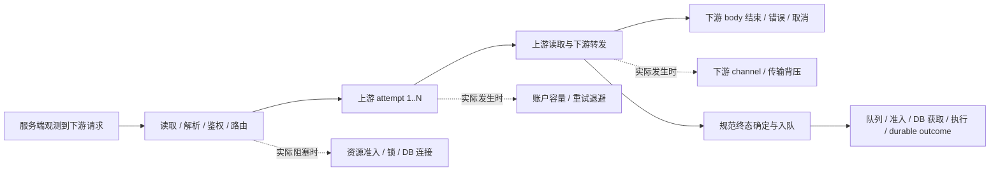
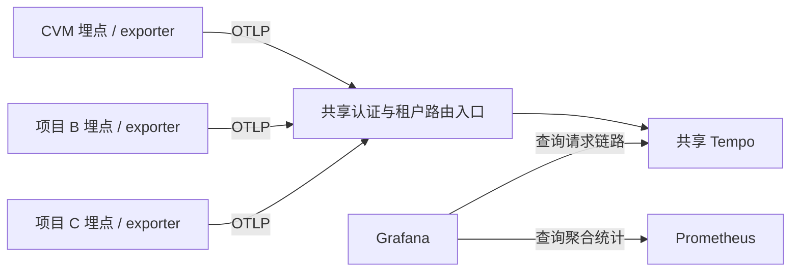

# 请求生命周期与资源等待观测

Design status: Accepted

Implementation coverage: See [the topic implementation document](../specs/performance-telemetry/IMPLEMENTATION.md)

## 目标与已确认边界

研究核心代理功能时，需要同时回答：下游请求进入服务端后，各阶段耗时如何分布；哪些本地资源等待实际阻塞了请求；某个慢、失败、取消或重试请求为什么呈现这种耗时。聚合指标用于趋势和统计，抽样个体记录用于案例和因果核验，二者不能相互替代。

主人已确认研究边界为服务端观测到下游请求进入，直到下游响应 body 结束、错误或取消；同时保留关联的终态持久化路径，并单列响应结束后继续发生的工作。当前 body 观测是框架消费边界，不证明最后一个 socket write/flush 成功或客户端实际收完。请求 TCP accept、请求头接收与解析尚未包含在当前应用入口时钟内。

主人已确认采用共享 Tempo 作为独立请求诊断链路后台，CVM 为首个接入项目，使用 OpenTelemetry 埋点与 OTLP 有界异步批量导出。Prometheus 继续承担全量聚合统计，Tempo 承担个体区间和关联检索，Grafana 提供共同入口。独立存储边界记录于 [ADR 0033](../adr/0033-external-request-diagnostic-traces.md)，共享平台与产品选择记录于 [ADR 0034](../adr/0034-shared-tempo-request-tracing.md)；具体版本、storage backend 和数值容量通过实施/部署前评估核验。

主人已确认首期全量采集有上限的轻量阶段记录，界面只展示少量分类案例。全量指正常容量内覆盖目标请求，不代表逐 chunk/token 记录所有事件，也不代表容量超限、采集失败或进程退出时仍能保证完整历史。

主人已确认请求诊断链路首期保留 24 小时，以降低存储占用，并设置存储硬上限和明确的过期/容量降级提示。Prometheus 的总体指标保持既有 30 天保留；超过链路保留窗口后，聚合分布无法重新生成个体案例。

主人已确认首期覆盖全部 HTTP 代理端点：共同入口、响应 body 结束、错误/取消以及前置拒绝均有诊断记录；已支持的 Responses、Chat Completions、Responses Compact、独立搜索、图像生成和图像编辑按真实路径补相应阶段。其他 `/v1/*` 代理路径保留共同传输生命周期；无模型 delta 等不适用信号不伪造 TTFT。普通管理 API、浏览器请求与后台任务不会仅因共用 HTTP middleware 自动纳入该代理链路的全量采集范围。

主人补充后续其他项目也会使用 Grafana 生态观测，因此选型同时考虑跨项目复用：共享存储、Grafana 查询入口、OTLP 接入规范和平台运维。当前 CVM 的全量轻量记录、24 小时留存及开销合同保持本项目范围；其他项目的接入、采集策略、权限和留存独立决定。

本文件整理已确认的设计边界、事实、建议和待决问题；实现与部署需要分别进入对应授权流程。新主题 Spec 和实施计划分别遵循仓库的专用流程。

## 现状证据

本地证据基于提交 `130c357c043a`。当前 worktree 未被 codebase-memory 索引，索引状态与覆盖查询均返回不可用，因此使用目标源码核验；没有使用其他 worktree 的图谱作为当前代码证据。

使用 ego-browser 读取线上 `cvm-proxy` dashboard、固定 Prometheus datasource 和查询结果。查询窗口为 `2026-10-07 03:55:30–04:25:30 UTC`，对应北京时间 `11:55:30–12:25:30`，变量范围为全部 service、environment、instance 和 endpoint。该窗口用于确认信号和数据源能力，不构成慢请求故障归因。`increase` 有边界外推，返回的小数不是精确的业务记录行数。

| 已有能力            | 已核验事实                                                                                                                                                      | 对需求的影响                                                   |
| ------------------- | --------------------------------------------------------------------------------------------------------------------------------------------------------------- | -------------------------------------------------------------- |
| 阶段 Histogram      | 线上存在 `request_read`、`request_parse`、`connect`、`first_byte`、`stream`、`response_parse`、`total`、`transport_connect`、`transport_head`；返回多个阶段系列 | 可以改进已有统计展示，但尚未形成完整、互斥的下游请求阶段       |
| 阶段 p95 面板       | 线上界面只呈现一条可见数值；配置按 phase 查询，标签可读性和多系列展开需要验证                                                                                   | 改面板有直接价值，不能因此认为补图表就能获得缺失的计时事实     |
| 完整 HTTP body 指标 | `/v1/responses` 已有 body lifetime 样本；完整 body 和响应头指标同起点                                                                                           | 可复用完整服务端响应边界，不能把响应头时间与完整 body 时间相加 |
| SQLite 等待         | coordinator wait、pool acquire、queue wait、batch execute、batch ACK、terminal enqueue-to-commit 均有线上样本                                                   | 全局等待分布已经存在，请求级关联仍缺失                         |
| 个体业务明细        | 已保存调用身份、基础 StageTimings 及部分 attempt/下游关闭上下文                                                                                                 | 可挑选粗粒度案例，无法还原独立资源等待瀑布图                   |
| 监控数据源          | 当前组织返回一个 `cvm-prometheus` Prometheus datasource                                                                                                         | 尚无已配置的 trace datasource                                  |

相关面板配置见 [cvm-proxy.json](../../ops/observability/grafana/dashboards/cvm-proxy.json)，领域计时见 [CONTEXT.md](../../CONTEXT.md#invocation-timing)，既有约束见 [性能观测设计](performance-observability.md) 与 [指标语义](performance-observability-metrics.md)。

## 不能直接沿用的口径

| 当前信号                               | 实际边界或覆盖限制                                                                          | 设计要求                                                                         |
| -------------------------------------- | ------------------------------------------------------------------------------------------- | -------------------------------------------------------------------------------- |
| HTTP header / body duration            | 都从 middleware 入口开始；body 在 EOF、error 或 Drop 时结束                                 | 作为累计里程碑或完整生命周期展示，不能堆叠相加；单列 HTTP status 与 body outcome |
| capture `total`                        | 从 dispatch 内开始，晚于代理入口；包含部分响应后处理，终态入队之前已记录                    | 不作为下游响应总耗时；统一新的入口基准并分别标出 body 结束、终态确定和持久化结束 |
| `connect`                              | 某些路径包含请求准备、发送及等待上游 response head                                          | 不标作纯 TCP/TLS 连接，也不通过与 TTFB 相减推定本地开销                          |
| `first_byte` / TTFB                    | 存在 attempt 起点与 invocation 入口起点的不同使用                                           | 区分 attempt 级计时与 invocation 累计里程碑，保持既有业务字段兼容性并验证语义    |
| `stream`                               | 含下游 channel send 等待、下游 body terminal 等待和 transport error 宽限工作                | 补独立上游等待、下游背压及收尾区间；现有 stream 数值不能证明上游生成独占耗时     |
| `transport_connect` / `transport_head` | 每 attempt 产生；connect 含实际连接及代理/TLS，head 含 Hyper handshake/发送到 response head | 与 terminal 的每 invocation 阶段分开 family 或明确计量单位，不能混用样本分母     |
| `persist`                              | terminal 聚合时常为 0 被跳过；落库阶段字段的时钟晚于准入和 begin，且不覆盖完整 commit       | 复用真正 enqueue-to-commit 边界，避免将既有 persist 字段解释为完整持久化延迟     |
| SQLite queue wait                      | 当前记录批次最老年龄，不是每条请求自己的等待                                                | 保留批次语义；请求案例需要每条 terminal 的 enqueue 时间与关联                    |
| pool acquire                           | 显式计时主要位于 batch writer，其他 `pool.begin()` 等路径没有同等分拆                       | 统计须说明来源覆盖；不能宣称已覆盖所有前台数据库获取等待                         |
| coordinator wait                       | 成功准入会计时；取消等候当前只移除 waiter                                                   | 补取消、超时和未完成等待的终态或开放区间，避免只统计成功者造成偏差               |

源码依据：[HTTP body](../../src/observability/http.rs)、[请求入口](../../src/proxy/request_entry.rs)、[dispatch](../../src/proxy/dispatch.rs)、[Hyper transport](../../src/proxy/upstream_transport.rs)、[raw capture](../../src/proxy/raw_capture.rs)、[metrics adapter](../../src/observability/mod.rs)、[write coordinator](../../src/proxy_sqlite_write_coordinator.rs)、[batch writer](../../src/sqlite_batch_writer.rs)。

## 建议的观测模型

一份请求观测使用共同入口基准，记录累计里程碑、具备起止点的阶段区间，以及有明确归因依据的资源等待区间。一次 Invocation 内保留各个 Upstream Attempt；请求在 Invocation ID 分配前遭到拒绝，也需要保留 HTTP 生命周期和拒绝原因，不能伪造一个业务调用。下游 body outcome、HTTP status、业务 invocation outcome 和 terminal durable outcome 分别表达。

以上为概念关系，不声明所有阶段串行，也不把终态处理固定到 body 结束之后；终态与 body 两个边界按实际时间记录。请求结束后的异步任务继续关联原始请求，但不扩大下游响应总耗时。

建议首先观测下列来源，按真实适用路径覆盖，不为不存在的等待建立虚假样本。

| 分组         | 需要回答的问题                                   | 首选观测点                                                                                                         |
| ------------ | ------------------------------------------------ | ------------------------------------------------------------------------------------------------------------------ |
| 请求准备     | 慢在客户端上传、本地准备还是路由？               | request read、语义解析、鉴权/路由和身份分配的具名区间                                                              |
| 本地资源等待 | 请求究竟等哪个资源？                             | 真实 coordinator admission、DB connection acquire、选定 mutex/semaphore、前台 journal append 的等待与执行          |
| 账户与策略   | 没有可用账户或重试是否增加了延迟？               | 账户可用性等待、retry/backoff、attempt 序号与固定 reason；账号池不是传输连接池                                     |
| 上游传输     | 连接、响应头、首字节、首个有效输出分别何时到达？ | 自有 Hyper transport，明确 DNS/TCP/TLS/代理握手是否有分拆能力；unsupported/reused 不伪造零                         |
| 流式响应     | 上游无数据、下游背压或本地解析是否拖慢流？       | 聚合每请求的 upstream read await、channel send await、parse/转发、body terminal；避免每 token/chunk 创建无界 spans |
| 终态持久化   | 响应已结束但业务事实何时 durable？               | terminal admission/journal、逐条 enqueue-to-commit，以及与实际批次的关联                                           |

“await 的 elapsed”并不自动证明底层资源争用。channel send 等待可以说明应用转发通道背压，不能单独证明客户端网络慢；SQL wall time 可以包含锁、I/O 和调度，不能称为 SQL CPU time。Tokio 调度延迟、OS run queue、真正 off-CPU 等待需要专门证据，首期以明确 unsupported/未归因为准。CPU attribution 继续使用按需 samply，不从 wall time 减去其他阶段推算 CPU。

每个个体区间记录相对于同一入口的开始和结束、分类、结果、attempt 归属和是否阻塞对应响应路径。嵌套与并行区间在瀑布图中保留；确需请求等待占比时，计算响应窗口内有效区间的去重并集，并预先规定重叠归属。未归因区间明确展示，不能自动标成 CPU。不同请求、不同阶段的 p95 不能相加成总耗时。

## 统计与 Grafana 展示需求

建议在现有代理 dashboard 增加以下可独立验收的能力。

1. **完整服务端响应概览**：到 response head、上游首字节、首个有效 model delta、下游 body 结束的 p50/p95/p99 与样本数；terminal durability 单列。累计里程碑不呈现为互斥阶段。
2. **阶段与资源等待分布**：按 endpoint/phase/resource 的 Histogram 或 heatmap，以及 p50/p95/p99、平均值、超阈值比例。桶精度按短等待和长 stream 分别配置；不得为了毫秒等待复用全部秒级请求桶。
3. **等待影响范围**：被该等待影响的请求数/比例、每请求累计等待分布、等待事件数与事件耗时分布分开；一个请求等待三次不能算三个受影响请求。
4. **上下文与覆盖**：并发、waiters、队列深度、CPU/quota、BUSY/LOCKED、pool timeout、retry reason 与相同时间窗并列。关联压力是线索，不能代替请求因果。
5. **案例入口**：在同一服务、环境、实例、endpoint 和时间窗口中列出少量请求；可展开区间，返回原时间窗口的总体分布与资源状态。

瞬时/滚动窗口 quantile 与所选完整窗口统计应清楚区分，样本数必须与对应 quantile 使用同一过滤条件和窗口。当前 TTFT 趋势/p95 使用 `$__rate_interval`，样本数使用 `$__range`，不宜直接拿整窗样本数证明最后一个滚动 p95 的可靠性。请求总数、body 终态、invocation、attempt、batch 各用自己的分母，missing/unsupported 不替换为 0。

指标仍采用固定标签，遵守现有每实例系列预算。request ID、trace ID、account、model、原始 URL 或它们的 hash 不进入普通 Prometheus metric labels。新计时不会悄悄重定义已持久化的 StageTimings 字段。

## 抽样案例需求

建议案例至少包含随机正常请求、完整响应慢请求、本地资源等待高请求、发生重试的请求、错误/取消请求，按可用样本展示，不保证每个窗口所有分类都有案例。总响应长可能来自正常模型生成；“本地等待高”必须独立选样，避免只选总耗时最高而掩盖服务端问题。

| 案例内容   | 必需信息                                                                       |
| ---------- | ------------------------------------------------------------------------------ |
| 概览       | 可访问的诊断 ID、服务/实例、endpoint、开始时间、HTTP 与 body outcome、是否截断 |
| 里程碑     | head、TTFB、TTFT、body end、terminal admission 与 durable outcome              |
| 资源等待   | 具体来源、起止、累计等待、所属 attempt/响应或异步路径、未观测字段              |
| 尝试与重试 | 每个 attempt 的时间区间、结果、固定 retry reason/backoff                       |
| 选样说明   | 随机/慢/资源等待/错误/取消的选择理由、概率或限额、采集与留存质量               |
| 对照       | 原窗口与同 endpoint 的总体分布，便于判断样本是否异常                           |

随机基线与异常优先展示的案例保留不同选择来源说明。异常案例用于研究，不能直接计算总体发生率。正常容量内已选择全量轻量采集，案例筛选在已留存链路中进行；如果后续收窄采集，纯入口概率采样无法事后保证保留未被选中的错误和慢请求，按结束结果保留病例还需要有界结束后选样或 tail sampling。长流、永不完成的等待、断连、进程重启和落盘延迟都要能显示 incomplete/expired，而不是无限占用缓冲。

跨队列异步 context 要显式传递。共享批次关联多个请求时保留关系，不能把完整 batch 执行成本重复宣称为每个请求自己的独占成本。诊断身份优先与业务身份解耦，是否提供访问受控的 Invocation ID 映射另作决策；不导出 payload、headers、凭据、用户/IP、SQL 参数或动态账号信息。

## 存储方案的真实取舍

既有 [性能观测设计](performance-observability.md) 禁止重新开发应用内性能历史数据库；完整请求案例的存储交由独立外部平台。ADR 0033/0034 明确这一存储边界及 Tempo 选择，新增链路采集、容量和平台维护属于明确设计责任，不能作为加一个面板的附带动作。

从使用者角度，目标是“看总体分布，再点开几个请求看原因”。Prometheus 保存统计，已选定的 Tempo 保存个体过程，Grafana 是共同查看入口；OpenTelemetry/OTLP 是应用记录和发送过程信息的标准。采用 Tempo 增加共享平台维护和应用计时/导出工作，以换取可复用的链路检索与研究能力。

| 方案                                      | 能解决什么                                                       | 成本与限制                                                                                                    |
| ----------------------------------------- | ---------------------------------------------------------------- | ------------------------------------------------------------------------------------------------------------- |
| 改已有聚合面板 + 复用业务明细             | 分布展示、基础阶段的个体参考，维持现有外部服务数量               | 业务字段不足以解释独立资源等待；在主库扩展诊断写入会增加正在研究的压力；Grafana 不能从 Histogram 还原单次请求 |
| Prometheus 全量统计 + 独立轻量 trace 存储 | Grafana 中按时间/耗时/属性检索案例，展示关联区间，统计与案例分工 | 新增 trace exporter、存储、留存/容量、权限和长流治理；是否需要 Collector 取决于选样与运维方案                 |
| 应用内有界诊断缓存                        | 短期单实例探索可控制容量                                         | 重启丢失、历史受限、多实例检索复杂；若要求应用开发案例查询/展示引擎，则偏离既有外部观测边界                   |

已选择共享 Tempo，Prometheus 仍承担完整统计；已有业务明细用于关联和交叉核验。Grafana 同时支持 Tempo 和 Jaeger datasource，产品取舍同时考虑查询能力、平台复用和部署依赖。metrics exemplar 到 trace 的跳转是可选增强，需要另验 exporter、Prometheus 和 Grafana 实际支持；trace ID 不能因此被当作普通指标标签。

采集形态采用 OpenTelemetry/OTLP：Rust SDK 使用有界 batch exporter，向共享 Tempo 的认证私网接收入口异步发送完成的 spans，保持埋点与存储产品解耦。首期不单独部署 Collector，也不为“界面展示抽样”加入 tail-sampling Collector。OpenTelemetry 的通用生产建议采用 Collector；本项目无结束后选样需求时，选择 SDK 批量导出以减少独立组件。需要集中处理、更多接入服务或独立重试缓冲时重新评估 Collector/Alloy。

| 产品形态                  | 已核验能力                                                                                                                                         | 与本次需求有关的取舍                                                                                                                                                                                                     |
| ------------------------- | -------------------------------------------------------------------------------------------------------------------------------------------------- | ------------------------------------------------------------------------------------------------------------------------------------------------------------------------------------------------------------------------ |
| Tempo 单体                | 原生 Grafana Tempo datasource；TraceQL 支持 span 属性数值、耗时、多个 span 条件和结构查询；单体不需要 Kafka                                        | 适合反复改变研究条件，例如查特定资源等待超过阈值且有重试的请求。官方单节点评估指南给出 4 CPU、4–8 GB 内存起点，并明确不是硬最小值或生产定额；本地磁盘示例用于开发/评估，生产推荐对象存储，部署成本不能只按一个小容器计算 |
| Jaeger v2 单进程 + Badger | 内嵌持久化本地数据库，无外部数据库依赖；Grafana 内置 datasource 可按 service、operation、tags、trace duration 检索并展开；官方配置支持 `ttl.spans` | 与首期单实例、24 小时留存和少量分类案例更贴近，可设 `ttl.spans: 24h`。Badger 不能横向扩展；基本标签/总耗时筛选不等价于 TraceQL 的跨 span 数值与结构查询，资源等待高等案例须写出可查询分类，并核验查询语义                |
| VictoriaTraces 单节点     | 本地磁盘，无外部数据库/对象存储；直接接收 OTLP；可用 Grafana Jaeger datasource，也提供 Tempo API 兼容                                              | 单节点运维简单，但 Tempo/TraceQL/Traces Drilldown 兼容明确为 experimental，不宜承诺与原生 Tempo 等价；`retentionPeriod=1d` 按日分区清理，容量清理仍至少保留最近两个日期的数据，不能将配置阈值视为磁盘硬上限              |

如果目标仅限单项目、分类案例和最少外部依赖，Jaeger v2 单进程 + Badger 是合理替代；它能用本地持久化提供基本案例检索。主人已选择 Tempo，取舍依据是多个项目长期使用 Grafana 生态：原生查询/关联能力、统一 TraceQL 和平台接入规范可跨项目复用；临时组合阶段数值、多个 span 条件和结构关系也更适合性能研究。Jaeger 同样可以承载多服务，共享能力并非 Tempo 独有。

上述判断比较能力和外部依赖，没有实测任一产品在本项目的 CPU、内存或磁盘占用，不宣称 Jaeger 或 VictoriaTraces 实际更省资源。最终产品需用代表性负载验证：正常/长流、重试、错误/取消、本地等待、响应后持久化均可检索；24 小时数据、写入与查询并发满足资源上限；诊断存储异常不阻塞业务。

选定产品的具体版本、storage backend 和容量在部署设计时按官方版本合同固定并验证。容量包含索引、WAL、live data、缓存、压缩/清理临时空间与批量缓冲，不仅是序列化 spans；TTL/retention 不等于存储硬上限，也不保证物理文件在满 24 小时的瞬间删除，需要独立的容量限制、清理延迟和超限降级合同。Tempo 对间隔较长的 spans 可能分散存储于不同 blocks，TraceQL 搜索命中部分 trace 与按 trace ID 展开完整记录的结果可能不同；长流及延后持久化的完整性应单独验证，不能以普通短请求证明全部链路完整。

“采集留存抽样”与“案例展示抽样”是两个独立决定。当前核查窗口约有 1,190 个 Responses 阶段样本，折合约 0.7 个请求／秒，仅说明该窗口的量级而非容量上限。已选择全量轻量阶段记录：限定每请求/attempt 的区间与属性数量，流式等待采用有界汇总和选定区间，不逐 token/chunk 创建记录，界面从可用链路中展示少量分类案例。这样可以避免提前丢掉罕见等待，也不需要仅为了结束后选样引入长流 tail buffer；代价是更多记录的采集与存储，必须以代表性负载和容量实测评估。

若选择限制留存量，建议使用随机基线与异常优先的结束后选样，并记录概率、优先原因、限额和丢弃；不能将少量入口概率抽样描述为可以保证保留所有异常。无论选择哪一种，流量、记录数、内存和存储都有硬上限，超限降级与不完整链路须可见，不能让“全量”变成无限容量承诺。

## Tempo 的角色与多项目共享

应用使用 OpenTelemetry 等采集机制记录阶段，OTLP 负责发送，Tempo 负责接收、持久化和检索请求链路，Grafana 负责查询与瀑布图展示。Trace 表示一次请求或动作的关联过程；span 表示其中具备起止时间、操作名、属性和父子/关联关系的工作区间。一个服务内的资源等待同样可建 span，不要求先拆成微服务。Tempo 不会自动发现未埋点的锁、DB 准入等待或 CPU 原因。

Prometheus 的聚合分布回答总体变化；Tempo 的个体区间用于解释某次请求，并可通过 TraceQL 检索同类请求。Grafana 支持将 trace 关联到已有 Prometheus 指标；日志和 profile 关联需要对应数据源与采集配置，不因增加 Tempo 自动具备，也不要求首期同时增加 Loki、Pyroscope 或其他存储。

多个项目把 OTLP 数据发往同一 Tempo 服务。Tempo 由监控平台维护，CVM 为首个接入方，各项目通过标准协议接入。首期采用单体 Tempo 与 SDK 有界异步导出，下图是共享入口的逻辑示意；主机、进程资源、端口和 storage backend 由部署事实核验。

共享分为两个层次：使用 `service.namespace`、`service.name`、环境和实例属性区分项目/服务；共享平台通过多租户提供独立读写范围、留存和摄入限制，CVM 使用独立 tenant 保留 24 小时，其他项目接入时按项目或实际信任边界分配 tenant。分类属性和 dashboard 变量用于检索，不构成访问隔离。多租户支持 scoped reads/writes，以及按租户覆盖 block retention、ingestion limits 等配置；这不代表每租户具有独立硬件或硬磁盘配额。

Tempo 本身不提供用户认证，租户 header `X-Scope-OrgID` 也不是凭据。共享入口必须验证身份并授权/确定其 tenant，Grafana datasource 查询带对应 tenant；不能允许不可信调用方任意声明租户。部署时核验是否复用既有认证反向代理、CVM 的实际 tenant ID、身份授权映射和 Grafana 读权限；其他项目的租户边界在接入时确定。

共享后台不会自动串联不同服务的请求。跨服务、HTTP 或任务队列路径需要传播 OpenTelemetry/W3C trace context；span 身份与父子关系由应用/采集端建立。存在跨项目调用时，租户边界和关联查询必须一起评估，不能仅按仓库机械拆分租户后承诺一键获得完整跨项目链路。

可以复用的是存储、留存/限制机制、查询方式、Grafana 关联和接入模板，各项目仍需自己的有界埋点与 exporter。容量按所有接入方的 span 数量、大小、活跃链路和查询合计核验，单项目的约 0.7 请求/秒窗口不能证明共享平台的容量。单体内的查询与写入共用资源；按租户限流可降低相互影响，不消除共享进程故障或查询峰值影响。首期单体的数值容量与 storage backend 由部署评估确定；后续 Collector/Alloy 或扩展部署按实际接入要求评估。

## Tempo 开销与容量估算

开销分为应用埋点与 exporter 的增量、Tempo 自身进程、链路传输与存储，以及查询/压缩/清理峰值。当前没有本项目的 Tempo 或 exporter 实测；不能把官方资源评估起点称为实际常驻占用，也不能据单个低流量窗口承诺 CPU/内存成本。

以核查窗口的 Responses 约 0.7 请求/秒全天持续为假设，约为 60,480 条请求/天。以下整条请求链路的平均序列化大小均为假设，KB/GB 使用十进制；尚未实现 schema、未测压缩率，并不表示实际 trace 大小或磁盘容量承诺。全部 HTTP 代理端点、重试、流量高峰须另计。

| 假设每请求完整 trace 的平均原始大小 | 平均原始传输量 | 一天原始数据量 |
| ----------------------------------- | -------------- | -------------- |
| 5 KB                                | 3.5 KB/s       | 0.30 GB        |
| 10 KB                               | 7 KB/s         | 0.60 GB        |
| 20 KB                               | 14 KB/s        | 1.21 GB        |
| 50 KB                               | 35 KB/s        | 3.02 GB        |

原始数据量可用 `平均请求数/秒 × 86400 × 平均原始 trace 字节数` 计算；它不等于实际网络流量或物理磁盘占用。OTLP 批量与压缩改变传输量，Parquet 压缩改变 blocks 大小，WAL、live store、metadata、缓存及合并/清理延迟另占空间。不采用未经本项目验证的压缩倍数，也不把 24 小时 TTL 当硬磁盘配额。缩短留存主要减少历史数据量，内存不会随保留天数等比例下降。

官方单节点指南的 4 CPU、4–8 GB 内存是评估起点，明确不是硬最小值或生产资源定额；4 CPU 也不表示进程持续消耗 4 个 CPU 核。单体进程的内存同时服务于 live trace buffer、并发查询和 block merging，实际占用与版本、span 数量/属性、长流、query window/concurrency 和配置相关。集群 sizing 文档的大流量组件配置不能直接按流量比例缩放成这个单实例的常驻开销。

首期使用单体与有界 OTLP 异步批量导出；聚合统计继续由 Prometheus 提供，不为既有统计重复启用 metrics-generator 或 service graphs，不逐 token/chunk 创建 spans，并限制查询时间窗与并发。这些是减少额外工作的配置方向，不是资源实测结论。应用开销包括计时、属性构建、context 传播、队列和序列化；异步发送仅避免同步等待网络，不会消除 CPU/内存成本。下文 5% 仍是完整观测的验收预算，不能解释为已测得 trace 的开销。

资源评估至少区分无查询稳定摄入、案例查询、宽窗口搜索、block merge/retention 和 exporter 故障等情景，记录 Tempo CPU/RSS/存储峰值与应用 trace 开/关差值。对象存储若新增部署，其资源和维护成本单列。容量验证之前，Tempo 与 Jaeger 的资源节省比较保持未知。

## 决策树

- **研究边界**：已确认服务端完整下游响应生命周期，并单列关联 terminal persistence。
- **病例存储边界**：已确认扩展现有监控架构，采用独立共享 Tempo 保存请求诊断链路；Prometheus 保留聚合统计职责。
- **采集与展示抽样**：已确认正常容量内全量轻量记录，界面展示少量分类案例；由开销和容量实测决定是否需要提出收窄采集的设计变更。
- **留存窗口**：已确认请求诊断链路保留 24 小时，设置存储硬上限与覆盖提示；Prometheus 保留既有 30 天总体指标。
- **endpoint 覆盖**：已确认全部 HTTP 代理端点的共同生命周期与拒绝记录，详细阶段按已支持路径适配；普通管理 API 和后台任务不在该代理采集范围。
- **长期复用**：已确认共享链路后台与接入规范，CVM 为首个接入项目并使用独立 tenant；其他项目的实际接入、租户/权限、留存和容量独立确定。
- **技术形态**：已确认 Tempo 单体、OpenTelemetry/OTLP 和 Rust SDK 有界异步 batch exporter；共享入口处理认证与租户授权，首期不单独部署 Collector。
- **实施评估责任**：具体版本、storage backend、各级容量数值与部署资源由实施/部署前评估核验；不以未验证的小流量外推替代开销和容量合同。
- **本轮收敛结果**：需求边界与技术形态已确认，架构决定保存于 ADR 0033/0034；长期主题需求进入 topic Spec，实施另行授权。

## 建议的验收条件

- 相同请求的入口、body end 和 terminal durable outcome 使用可核验的共同时间关系；案例中响应后持久化不会扩大响应时间。
- 构造资源准入、DB 获取、下游转发背压、上游慢和重试情景时，对应具名等待增加，其他归因不会被误填；unsupported 保持显式。
- 失败、取消、超时、请求前置拒绝及长流 incomplete 不被成功样本过滤掉；同一 invocation 的多次 attempt 和同一 batch 的多个请求不重复计数。
- quantile、count 和受影响请求比例的时间窗口/过滤一致；可以从总体统计进入带选样说明的个体案例。
- exporter 或存储失效、采样缓冲满、异常流量和观察查询不会阻塞代理、终态可靠性或数据库准入；容量、丢弃和覆盖有观测。
- 开销比较沿用 [性能观测设计的验收合同](performance-observability.md#验收与实施交接)，验证内存、CPU、吞吐、响应 p95 和主库写入压力。完整观测开启/关闭的 CPU 每完成请求与 p95 增幅均不超过既有 5% 预算，不能为链路采集叠加一个额外 5%；另比较现有聚合观测开启且 trace 开/关，以识别增量成本。性能预算证据依照既有合同由 GitHub Actions 产生，不以当前流量窗口或源码推断达标。

## 官方依据

- [Prometheus Histogram](https://prometheus.io/docs/practices/histograms/)：Histogram 存储桶分布、count 与 sum，quantile 为聚合估计；它不保存请求个体时间线。
- [Grafana Tempo trace visualization](https://grafana.com/docs/tempo/latest/visualize-traces/)：按时间、耗时和属性检索 trace，将 trace 搜索与可视化用于 dashboard；默认搜索是非确定的 first-match，不能直接当作稳定的代表性抽样。
- [OpenTelemetry sampling](https://opentelemetry.io/docs/concepts/sampling/)：head sampling 不依据完整请求结果；tail sampling 可以按错误/耗时选择，但需要状态、缓冲和运行资源。案例的随机基线与异常选择必须显式区分。
- [Rust exporters](https://opentelemetry.io/docs/languages/rust/exporters/)：Rust SDK 支持 OTLP exporter 与 batch exporter；通用生产建议使用 Collector，项目若选择直连需明确取舍。
- [Tempo distributor](https://grafana.com/docs/tempo/latest/reference-tempo-architecture/components/distributor/)：单体模式在进程内直接推送，不要求 Kafka；支持 OTLP 接收及 ingestion limits。
- [Tempo single-node reference](https://grafana.com/docs/tempo/latest/set-up-for-tracing/setup-tempo/deploy/locally/linux/)：单体资源起点不是硬最小值，需要按负载核验；本地存储示例用于评估，生产 storage backend、留存和容量需另行验证。
- [Tempo deployment resource considerations](https://grafana.com/docs/tempo/latest/reference-tempo-architecture/deployment-modes/) 与 [cluster sizing](https://grafana.com/docs/tempo/latest/set-up-for-tracing/setup-tempo/plan/size/)：单体的 live buffer、并发查询和 block merging 共用资源；容量同时受 ingest、span 大小、查询和留存影响，集群示例不代表低流量单体的占用。
- [Tempo introduction](https://grafana.com/docs/tempo/latest/introduction/) 与 [Grafana Tempo datasource](https://grafana.com/docs/grafana/latest/datasources/tempo/)：请求链路由具备起止和关系的 spans 组成，Tempo 提供存储/检索，Grafana 提供查询、瀑布展示和配置后的多信号关联。
- [Tempo multi-tenancy](https://grafana.com/docs/tempo/latest/operations/manage-advanced-systems/multitenancy/) 与 [authentication](https://grafana.com/docs/tempo/latest/operations/authentication/)：租户读写与留存/摄入限制可独立配置；认证需由受信任入口实现，租户 header 不能代替身份认证。
- [OpenTelemetry service conventions](https://opentelemetry.io/docs/specs/semconv/resource/service/) 与 [context propagation](https://opentelemetry.io/docs/concepts/context-propagation/)：项目/服务身份属性用于区分来源，跨服务链路依赖显式 context 传播，而不是仅共享存储。
- [TraceQL query construction](https://grafana.com/docs/tempo/latest/traceql/construct-traceql-queries/)：支持 span 条件、数值比较、多个 span 集合条件与聚合，不等价于基本标签筛选。
- [Tempo long-running traces](https://grafana.com/docs/tempo/latest/troubleshooting/querying/long-running-traces/)：时间间隔较长的 spans 可能分布于不同 blocks，搜索与完整 trace ID 查询的完整性边界不同。
- [Jaeger Badger storage](https://www.jaegertracing.io/docs/2.21/storage/badger/) 与 [官方持久化配置](https://github.com/jaegertracing/jaeger/blob/v2.21.0/cmd/jaeger/config-badger.yaml)：嵌入本地持久化存储，无外部依赖，支持 span TTL，但不能横向扩展。
- [Grafana Jaeger query editor](https://grafana.com/docs/grafana/latest/datasources/jaeger/query-editor/)：支持 service、operation、tags、trace duration 和 trace ID 查询。
- [VictoriaTraces Grafana integration](https://docs.victoriametrics.com/victoriatraces/querying/grafana/) 与 [留存及容量策略](https://docs.victoriametrics.com/victoriatraces/)：Jaeger datasource 可用，Tempo/TraceQL/Drilldown 兼容仍为 experimental；日分区留存与容量阈值均不能解释为物理硬上限。
