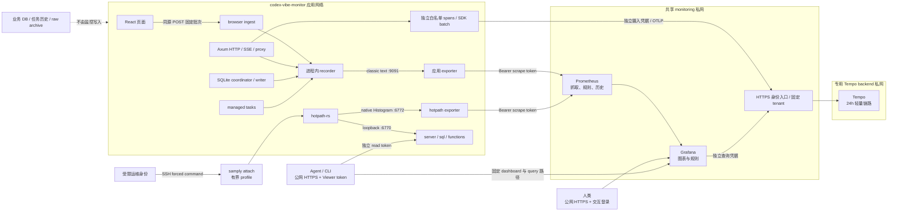

# Prometheus 与 Grafana Compose 集成

这篇 solution 是本项目把性能观测接入 Prometheus、Grafana，并通过 Docker Compose 部署监控组件时的可复用操作合同。它面向后续开发者和运维人员，解释职责、配置入口、鉴权边界、验证顺序和诊断工具。示例只适用于本地或 CI 隔离环境；其中的域名、路径、凭据和镜像身份均为占位符或运行时生成值，不代表任何部署实例。

## Context

项目需要同时回答三类问题：请求为什么慢、进程为什么消耗异常 CPU、SQLite 为什么出现竞争或积压。应用不再把性能历史写入第二个 SQLite，而是在进程内维护有界的累计指标和诊断快照；Prometheus 负责抓取和保留指标历史，Grafana 负责图表、查询入口和告警。业务数据库、任务历史、终态记录、raw/archive 和调用明细仍由原有业务持久化负责。

职责边界如下：

| 组件                      | 唯一职责                                                                   | 不应承担的职责                                                   |
| ------------------------- | -------------------------------------------------------------------------- | ---------------------------------------------------------------- |
| 应用 `src/observability/` | 从真实事件更新有界 Counter、Gauge、classic Histogram，提供固定能力接口     | 不保存指标历史、不提供图表、不让观测故障改变业务成功语义         |
| 应用 hotpath-rs           | 提供函数、规范化 SQL、路由和选定锁的实时归因，并导出 native Histogram      | 不替代 CPU profiler，不保存第二份历史数据库，不暴露 raw SQL 参数 |
| Prometheus                | 私网抓取、时间序列历史、recording rules、样本和新鲜度                      | 不直接面向公网 Agent，不承载业务请求或业务终态                   |
| Tempo                     | 保存和检索有界轻量请求链路，按认证入口确定租户                             | 不保存业务终态、不作为业务健康依赖                               |
| Grafana                   | 查询 Prometheus/Tempo、展示固定统计、案例和瀑布图、执行已 provision 的规则 | 不写业务库，不作为应用成功条件，不由 UI 保存仓库管理的 dashboard |
| 浏览器上报入口            | 以固定页面、设备和事件类别补充体验指标                                     | 不保存用户性能明细，不把客户端身份写入指标标签                   |
| samply 与受限 SSH 命令    | 按需对运行实例做有界 CPU attach                                            | 不做常驻服务，不提供任意 PID、shell 或 Grafana SSH 入口          |
| 业务持久化                | 调用、费用、token、终态、任务执行和审计事实                                | 不被 Grafana 查询替代，也不从 Prometheus 反向补造业务记录        |

指标历史和业务记录不是同一类数据：指标是跨请求聚合的时间序列，允许按 scrape、保留期和采样率变化；业务记录是单次调用或任务的事实，需要遵守现有事务、审计和保留合同。不能把 `cvm_task_runs_total` 当作任务历史，也不能把业务表中的一次调用阶段当作 Prometheus 的 raw latency sample。

## Symptoms

先按故障面区分症状，再选择信号：

| 症状               | 第一组检查                                                                                 | 需要避免的误判                                                           |
| ------------------ | ------------------------------------------------------------------------------------------ | ------------------------------------------------------------------------ |
| 图表突然为空       | `up`、抓取错误、freshness、样本数和时间窗口                                                | 把缺测当成零，或用单个空分位数证明没有延迟                               |
| 请求响应慢         | classic body/header Histogram、样本数、upstream attempt、TTFB、SQLite 等待                 | 把 response-head、完整 body 生命周期和 upstream retry 合成一个数字       |
| CPU 异常           | `cvm_process_cpu_seconds_total`、资源 sampler、新鲜度；需要归因时再看 hotpath 和 samply    | 把 hotpath wall time 当 CPU 成本，或用 profiler 的一次短窗口证明长期趋势 |
| SQLite 竞争        | coordinator wait、pool acquire、queue wait、SQL execution、ACK、enqueue-to-commit 分开查询 | 只增大 busy timeout，或把所有等待归为一个“数据库慢”                      |
| hotpath 报告失败   | 独立 read token、固定报告名、报告限流和 `503 profiler_unavailable`                         | 用 scrape token 访问报告，或把空报告当成健康                             |
| Grafana 访问被拒绝 | 人类交互登录、Viewer service account、入口是否保留 `Authorization`                         | 用 SSH 连接 Grafana，或对整站关闭交互认证                                |

## Root cause

这类集成最常见的根因是边界混淆：

- 业务应用、Prometheus 和 Grafana 被放进不同网络，却忘记应用在监控私网中的固定 alias，导致 target 解析失败。
- exporter 使用非 loopback bind，却没有配置 scrape token；或者把 scrape、hotpath report、Grafana Viewer 和管理员密码复用成一个凭据。
- 直接复制一份 Compose、datasource 或 dashboard 配置到另一个目录，随后 UID、查询路径和告警规则漂移，排障时不知道哪一份是真相。
- classic Histogram 用 native Histogram 的查询，或把 `le` 留在 native 聚合中；查询表面成功但没有样本或结果语义错误。
- 把 `up == 1` 当成“有足够业务流量”，忽略样本数、进程重启 reset、窗口新鲜度和低样本分位数的不确定性。
- 把 Grafana notification contact point 写进公共仓库 provisioning，造成通知目标和敏感信息进入代码；仓库只应负责规则和标签，平台负责通知渠道。
- 让监控停机、报告读取或 profiler attach 阻塞代理请求、terminal ACK、任务执行或数据库 admission，形成观测反向影响业务的故障环。

## Resolution

### 1. 集成架构与故障隔离



应用 exporter 和 hotpath exporter 是两个抓取目标：

- `cvm-app` 抓取应用的 classic Prometheus text 指标，目标是 `codex-vibe-monitor:9091`。
- `cvm-hotpath` 抓取 hotpath native Histogram，目标是 `codex-vibe-monitor:6772`，启用 Prometheus native Histogram 协议，不再额外保留重复的 classic bucket。
- `:6770` 是应用内部的 hotpath 报告 server，不是 Prometheus target。应用的 `/api/system/observability/hotpath/{server,sql,functions}` 使用独立的 read token 读取并清洗报告，固定行数、响应大小、超时和频率。
- 浏览器只向应用同源的 `/api/system/observability/browser` 上报固定批次。上报数据先进入 recorder，不进入业务库，也不计入应用 HTTP 请求或 hotpath server 指标。

监控故障隔离的可验证含义是：Prometheus 或 Grafana 停止时，应用仍可处理代理、终态 ACK、任务和业务写入；exporter、sampler 或报告 server 故障只使观测状态变成 degraded 或 unknown。这个隔离不等于 Compose 单实例天然零中断，也不等于每一次新镜像更新都无需考虑入口切换。

### 请求案例与共享租户

聚合分位数回答总体慢在哪里，个体 trace 回答一条请求发生了什么。新增请求阶段/等待契约见 [指标语义](../../specs/performance-telemetry/METRICS.md)，当前响应 root 到 body EOF/error/cancel 即关闭，关联 enqueue-to-commit 可晚到；shared batch 工作通过 links 关联，不能把 batch 执行复制为每条请求的独占成本。入口前传输、客户端收全数据和未归因 CPU/调度等待不由这些 spans 证明。

复用 [Tempo 接入说明](../../../ops/observability/README.md#tempo-共享接入与隔离配置) 与现有 HTTPS 入口。Tempo 本身不提供认证：摄入与查询使用不同私密文件身份，入口校验后覆盖 cvm tenant，不接受调用者选择租户。Tempo 只加入专用 backend 私网，Grafana/Prometheus 的 monitoring 私网不能直达；gateway 的网络成员资格由平台 ACL 管理。Grafana platform query 身份与公网机器 Viewer 也有不同职责；organization 及固定机器路径白名单仍需保留。多个项目可以共享同一 Tempo 基础设施，各自定义 tenant、凭据、留存及容量，不因此自动获得跨租户 trace 拼接。

原生 Grafana 案例页同一窗口会发起五种分类查询。Tempo frontend 的 `max_outstanding_per_tenant` 是待处理任务容量，不是执行并发；将它误设为执行上限会产生 429。隔离配置保留有界 16 个待处理任务，querier 执行并发 2、frontend 每搜索并发 jobs 2、5 秒超时、24h 窗口及 3 条结果上限；不增大实际执行并发来修复排队。最新响应允许立即搜索并明确显示未完整状态，不能把默认 recent-window cutoff 引起的延迟当作导出丢失。

单体本地 filesystem 和所有路径共用的 512MiB tmpfs 只提供隔离验证硬上限，普通 named volume 和 24h retention 不是正式磁盘配额。正式存储、查询峰值、block merge/清理延迟及总项目容量必须由后续部署验证。本轮不安装 Collector，不导出日志/正文/业务身份，不改终态 journal；采集或查询失败都不能改变业务成功和 SQLite 准入。

### 2. 仓库配置地图

下面的文件是当前仓库的配置真相。部署文档应引用它们，不要在 solution 或私有部署目录复制整套内容。

| 文件                                                                  | 职责                                                                                            | 关键合同                                                                                                      |
| --------------------------------------------------------------------- | ----------------------------------------------------------------------------------------------- | ------------------------------------------------------------------------------------------------------------- |
| `ops/observability/compose.yml`                                       | Prometheus/Grafana/Tempo 服务、镜像、资源、只读挂载、named volume、monitoring 与专用 Tempo 网络 | Prometheus 无 host port；Grafana 只绑定 host loopback；Tempo 不加入 monitoring；admin password 使用单文件挂载 |
| `ops/observability/prometheus.yml`                                    | global scrape/evaluation、两个 job、授权、协议、样本和 label 上限、metric allowlist             | 15 秒抓取；应用 classic；hotpath native；目标使用 `codex-vibe-monitor` alias                                  |
| `ops/observability/recording-rules.yml`                               | 常用请求 rate、p95、CPU、SQLite wait 和 hotpath p95 的 recording rules                          | 规则按 service/environment/instance 聚合，保留真实标签语义                                                    |
| `ops/observability/grafana/provisioning/datasources/prometheus.yml`   | Grafana datasource provisioning                                                                 | 固定 datasource UID `cvm-prometheus`，地址为 Compose 私网中的 `http://prometheus:9090`                        |
| `ops/observability/grafana/provisioning/dashboards/cvm.yml`           | file provider                                                                                   | 读取 `/etc/grafana/dashboards`；`disableDeletion: true`；`allowUiUpdates: false`                              |
| `ops/observability/grafana/dashboards/cvm-*.json`                     | dashboard 面板、查询、变量和 UID                                                                | UID 为 `cvm-overview`、`cvm-proxy`、`cvm-sqlite`、`cvm-runtime`、`cvm-web`                                    |
| `ops/observability/grafana/provisioning/alerting/cvm.json`            | Grafana unified alert rule provisioning                                                         | 规则和标签入库；contact point 与通知策略由平台配置                                                            |
| `src/observability/{config,http,browser,sampler,reports,registry}.rs` | 应用配置、计时边界、浏览器接入、资源采样、报告适配和指标映射                                    | token 不序列化；查询和报告保持固定白名单                                                                      |
| `.agents/skills/performance-investigation/SKILL.md`                   | 排障顺序和证据语义                                                                              | Grafana 用 HTTPS；SSH 仅用于 hotpath/CPU 诊断                                                                 |
| `scripts/cvm-observe`                                                 | 通过 Grafana fixed proxy path 查询指标或读取固定报告                                            | 读取私有 token 文件，禁止把 token 放命令行                                                                    |
| `scripts/cvm-hotpath-cpu`                                             | 受限 CPU attach                                                                                 | 只接受 `capture [1..60]`，绑定指定容器、符号和容量边界                                                        |
| `scripts/export-observability-symbols.py`                             | 从精确二进制导出 build ID、hash 和符号 manifest                                                 | profile 必须使用与运行二进制相同的 build ID 和 SHA256                                                         |

### 3. 应用接入合同

应用在启动线程和 Tokio runtime 之前读取 `.env` 与 `.env.local`，再初始化 hotpath。实际运行环境应把以下参数注入应用服务，不应把 token 内容写在环境变量中：

| 变量                            | 作用与约束                                                                                                                        |
| ------------------------------- | --------------------------------------------------------------------------------------------------------------------------------- |
| `OBSERVABILITY_ENABLED`         | 外部性能观测开关，`from_env` 默认启用；关闭只关闭观测，不改变业务请求合同                                                         |
| `METRICS_BIND`                  | 应用 exporter bind，默认 `127.0.0.1:9091`；容器加入 monitoring 私网时使用 `0.0.0.0:9091`                                          |
| `METRICS_TOKEN_FILE`            | 应用与 hotpath exporter 使用的 scrape token 文件；非 loopback bind 时必须配置，token 至少 16 个字符、最多 4096 bytes 且不得含空白 |
| `OBSERVABILITY_READ_TOKEN_FILE` | 三个 hotpath 报告 API 的独立只读 token 文件；必须不同于 scrape token                                                              |
| `OBSERVABILITY_TEMPO_NETWORK`   | Tempo 专用 external backend 网络名；只允许 Tempo 与已认证 gateway 加入，不与 monitoring 网络复用                                  |
| `GRAFANA_PUBLIC_URL`            | 应用生成 Grafana 深链接的无凭据 HTTPS 基址；不得带 username、password、query 或 fragment                                          |
| `HTTP_BIND`                     | 应用业务 HTTP/SSE 监听地址；按现有应用部署合同配置，与 exporter bind 分开                                                         |

容器接入 monitoring 私网时，应用保留原有业务/出站网络，并额外加入外部 network，服务 alias 固定为 `codex-vibe-monitor`。不要发布 `9091`、`6772` 或 `6770` 的 host port：Prometheus 通过私网抓取 exporter，报告 API 通过既有 HTTPS 应用入口读取，CPU 诊断才使用受限 SSH。

应用服务至少需要如下结构。它是叠加到现有应用 Compose service 的合同片段，不是第二份应用 Compose 真相；保留应用原有镜像、业务卷、数据库卷和网络。

```yaml
services:
  app:
    environment:
      OBSERVABILITY_ENABLED: "true"
      METRICS_BIND: 0.0.0.0:9091
      METRICS_TOKEN_FILE: /run/secrets/metrics-token
      OBSERVABILITY_READ_TOKEN_FILE: /run/secrets/observability-read-token
      GRAFANA_PUBLIC_URL: https://grafana.example.test
    group_add:
      - "${OBSERVABILITY_SECRET_GID:?set secret file read group}"
    volumes:
      - ./ops/observability/.local/private/metrics-token:/run/secrets/metrics-token:ro
      - ./ops/observability/.local/private/observability-read-token:/run/secrets/observability-read-token:ro
    networks:
      monitoring:
        aliases:
          - codex-vibe-monitor

networks:
  monitoring:
    external: true
    name: ${OBSERVABILITY_NETWORK:-cvm-monitoring}
```

secret 目录应为仅运维身份可进入的 `0700`，文件使用 `0640` 并把 group 设为专用读取组。应用、Prometheus 和 Grafana 保留各自默认 UID/GID，只通过 `group_add` 读取需要的单个文件；不要把整个 secret 目录挂进容器，不要为了绕过权限把文件改成 world-readable，也不要假设容器必须以 root 运行。

四类凭据必须分开：

| 凭据                                 | 使用者                                       | 允许的用途                                                          |
| ------------------------------------ | -------------------------------------------- | ------------------------------------------------------------------- |
| scrape token                         | Prometheus 到应用 `:9091` 与 hotpath `:6772` | 只读抓取 exporter                                                   |
| observability read token             | Agent 到应用 hotpath 报告 API                | 只读 `server`、`sql`、`functions` 报告                              |
| Grafana Viewer service-account token | Agent/CLI 到 Grafana 公网 HTTPS              | 固定 dashboard、datasource proxy query/query_range 和必要只读元数据 |
| Grafana admin password               | Grafana 初始化或管理员                       | bootstrap、组织/service account、配置维护；不用于日常 Agent 查询    |

### 4. 脱敏的最小 Compose 部署示例

下面的例子只启动监控侧，依赖一个已经按上一节接入 alias 和 token mount 的应用服务。它从仓库相对目录执行，凭据由本地生成，未声明任何真实主机、容量、容器或组织身份。示例假设 Linux/CI Docker Engine 能够按文件 group 传递只读权限；Docker Desktop 的文件共享权限需要先按其运行时规则验证。

#### 4.1 准备本地测试凭据与参数模板

```bash
cd ops/observability

install -d -m 0700 .local/private
umask 077
openssl rand -hex 32 > .local/private/metrics-token
openssl rand -hex 32 > .local/private/observability-read-token
openssl rand -hex 32 > .local/private/grafana-admin-password
chgrp "$(id -g)" .local/private/*
chmod 0640 .local/private/*

cat > .local/.env <<'EOF'
OBSERVABILITY_NETWORK=cvm-monitoring-local
OBSERVABILITY_TEMPO_NETWORK=cvm-tempo-backend-local
GRAFANA_PUBLIC_URL=https://grafana.example.test
GRAFANA_PORT=3000
PROMETHEUS_RETENTION_SIZE=1GB
METRICS_TOKEN_FILE=./.local/private/metrics-token
GRAFANA_ADMIN_PASSWORD_FILE=./.local/private/grafana-admin-password
EOF

export OBSERVABILITY_SECRET_GID="$(id -g)"
```

`OBSERVABILITY_READ_TOKEN_FILE` 是应用服务的参数，不是监控 Compose service 需要的参数；应用容器内路径应为 `/run/secrets/observability-read-token`。`GRAFANA_PUBLIC_URL` 使用保留域名只是为了通过应用 URL 校验和生成示例链接；完整人类访问仍需要 HTTPS 反向代理。本地示例中的 retention size 只是隔离测试参数，不是任何部署容量建议。

#### 4.2 创建私网并解析 Compose

```bash
docker network inspect "$OBSERVABILITY_NETWORK" >/dev/null 2>&1 \
  || docker network create "$OBSERVABILITY_NETWORK"
docker network inspect "$OBSERVABILITY_TEMPO_NETWORK" >/dev/null 2>&1 \
  || docker network create "$OBSERVABILITY_TEMPO_NETWORK"

docker compose --env-file .local/.env -f compose.yml config -q
docker compose --env-file .local/.env -f compose.yml config --environment
docker compose --env-file .local/.env -f compose.yml config --images
prometheus_config="/etc/prometheus/prometheus.yml"
docker compose --env-file .local/.env -f compose.yml run --rm --no-deps \
  --entrypoint promtool prometheus \
  check config "$prometheus_config"
docker compose --env-file .local/.env -f compose.yml run --rm --no-deps \
  --entrypoint promtool prometheus \
  check rules /etc/prometheus/recording-rules.yml
```

`docker compose config -q` 只验证解析和一致性，`config --environment` 用于核对插值来源，`config --images` 用于确认实际使用的镜像身份。命令输出可以写入本地审计日志，但不要上传包含 secret 内容的完整环境或 Compose 输出。路径都以首个 Compose 文件 `compose.yml` 所在目录为基准；合并其它 Compose 文件时，遵守 Docker Compose 的路径基准，避免把 `prometheus.yml` 解析到错误目录。

#### 4.3 启动、查看状态和健康检查

```bash
docker compose --profile traces-isolation --env-file .local/.env -f compose.yml up -d prometheus grafana tempo
docker compose --env-file .local/.env -f compose.yml ps

docker compose --env-file .local/.env -f compose.yml logs --no-color prometheus grafana

# Prometheus 和 Grafana 镜像中的 HTTP client 命令以实际固定镜像为准；
# 没有 client 时，从同一 monitoring network 的临时测试容器执行以下检查。
curl --fail --silent --show-error \
  http://127.0.0.1:3000/api/health
```

Compose 文件只把 Grafana 绑定到 host loopback；Prometheus 不发布 host port。如果直接从宿主机访问 Grafana，得到的只是本地监听结果，不代表公网 HTTPS 入口、交互认证或机器路径例外已经正确。应用服务应按自身合同单独启动，然后从 Prometheus 容器内或同一 monitoring network 的临时工具容器验证 `codex-vibe-monitor:9091` 与 `codex-vibe-monitor:6772`。

#### 4.4 接入应用服务

应用 Compose 的实际文件可能包含业务网络、数据库、上游和卷，不能在此 solution 重写。将上一节的 service 片段叠加到现有 app service 后，执行其正常启动命令，并确认最终模型包含：

```bash
docker compose --env-file ops/observability/.local/.env \
  -f <existing-app-compose-file> config -q
docker compose --env-file ops/observability/.local/.env \
  -f <existing-app-compose-file> up -d app
docker compose --env-file ops/observability/.local/.env \
  -f <existing-app-compose-file> ps app
```

上面带尖括号的值必须替换为当前应用 Compose 的相对文件名；这是需要按部署仓库填写的模板命令，不应被当作已执行结果。应用更新继续使用项目正常的新镜像重建流程，不额外安排停机窗口；单实例 Compose 本身不能承诺零中断，旧性能库归档也不是正常应用更新的前置条件。

### 5. Prometheus 抓取与 Grafana 初始化

#### Prometheus

`prometheus.yml` 规定 15 秒 scrape/evaluation、scrape timeout、样本/label/body 上限和 allowlist。两个 job 都通过 `credentials_file` 发送 Bearer scrape token：

```yaml
scrape_configs:
  - job_name: cvm-app
    authorization:
      type: Bearer
      credentials_file: /run/secrets/metrics-token
    static_configs:
      - targets: [codex-vibe-monitor:9091]

  - job_name: cvm-hotpath
    scrape_native_histograms: true
    always_scrape_classic_histograms: false
    scrape_protocols: [PrometheusProto]
    authorization:
      type: Bearer
      credentials_file: /run/secrets/metrics-token
    static_configs:
      - targets: [codex-vibe-monitor:6772]
```

这是理解现有配置的完整关键片段，不是新增配置副本。应用指标 classic Histogram 使用 `_bucket`、`_count`、`_sum`；hotpath native Histogram 使用无后缀的 histogram family。`metric_relabel_configs` 继续限制导出名称，不能为了排查临时删除 allowlist 后永久扩大 cardinality。

`recording-rules.yml` 把常用 rate、p95、CPU、SQLite coordinator wait 和 hotpath p95 预计算为 `cvm:*` series。recording rule 不是新的事实源，也不会把缺测补成零。应用 restart 会让 Counter reset；查询应使用 `rate`/`increase` 并在图表或报告中保留 reset 和 freshness 语义。

#### Grafana provisioning

Grafana 启动时从只读 provisioning mount 加载：

1. `datasources/prometheus.yml` 创建不可编辑的 Prometheus datasource，UID 固定为 `cvm-prometheus`，私网 URL 为 `http://prometheus:9090`。
2. `dashboards/cvm.yml` 注册 file provider，读取 `/etc/grafana/dashboards`，禁止删除并关闭 UI 更新，防止运行时修改漂移出 Git。
3. `dashboards/cvm-*.json` 提供五个固定 UID：`cvm-overview`、`cvm-proxy`、 `cvm-sqlite`、`cvm-runtime`、`cvm-web`。每张 dashboard 使用 `service`、`environment`、`instance`、`task_key` 变量，默认时间窗口为 UTC 的最近 30 分钟并按 15 秒刷新。
4. `alerting/cvm.json` 提供 exporter availability、CPU、SQLite wait、response、 sampler freshness、backlog、error rate 和磁盘等规则。规则的 label、for、 no-data 和 error 语义由仓库管理；contact point、通知策略和接收人由平台管理，不将 webhook、邮件或真实组织信息写入仓库。

Compose 中关闭 Grafana legacy alerting，同时启用 unified alerting。不要因为 `cvm.json` 中没有 contact point 就认为告警规则无效；先确认平台是否为对应组织配置了通知渠道。Viewer 只能读取 dashboard/query，不应获得修改 datasource、 dashboard、rule、user 或组织的权限。

任务深链接由应用严格生成，不能把任意外部 URL 或参数直接拼接进页面：

```text
https://grafana.example.test/d/cvm-runtime?from=now-30m&to=now&timezone=utc&var-task_key=<url-encoded-task-key>
```

只有固定 dashboard UID 会被接受；`task_key` 用 `URLSearchParams` 编码。应用能力接口只返回 public URL、固定 UID、datasource UID 和变量，不查询外部历史，也不返回任何 token。Grafana 连通性未由应用检查时保持 `unknown`。

### 6. 安全加固

#### 入口与人类访问

- Grafana 容器只绑定 host loopback，由已有反向代理提供公网 HTTPS、正确的 `Host`/origin、TLS 和人类交互认证；Grafana 禁用 anonymous access 和 sign-up。
- 人类入口继续使用交互身份验证。机器例外只覆盖必要的固定 GET 路径： `GET /api/datasources/uid/cvm-prometheus`、 `GET /api/datasources/proxy/uid/cvm-prometheus/api/v1/query`、 `GET /api/datasources/proxy/uid/cvm-prometheus/api/v1/query_range`，以及五个 `GET /api/dashboards/uid/cvm-*`。实际 gcx 版本需要其它只读元数据时，按锁定版本的请求清单逐条加入。
- 入口不能剥离 `Authorization`，不能对整站 bypass，不能把 Prometheus API 或 exporter port 暴露到公网。POST 只在确实需要的查询入口逐条审核，默认拒绝 dashboard、datasource、rule、user 和组织写请求。

#### 凭据与文件

- 应用 scrape token、应用 read token、Grafana Viewer token 和 admin password 分离存储、分离轮换、分离日志权限。环境变量只存文件路径，不存 token 内容。
- Prometheus 只挂载 `metrics-token`；Grafana 只挂载 admin password；应用只挂载它自己的两个 token。所有 secret mount 使用 `:ro`。
- 非 root 容器通过 supplemental group 读取 `0640` 文件。变更 group 或文件时先确认宿主机、容器 runtime 和备份工具的权限结果，不用 `chmod 0644` 解决问题。
- Agent 查询通过公网 HTTPS Grafana Viewer API，不通过 SSH 连接 Grafana，也不直接把 Prometheus 公网化。SSH 只作为额外 hotpath/CPU 诊断入口。

#### 镜像、网络和容量

- Compose 中的 Prometheus/Grafana 使用经过验证的固定 tag 与 digest。下列形式只是通用生产加固清单的占位符，实际值必须由发布/平台验证后填入：

  ```text
  prom/prometheus:<verified-prometheus-tag>@sha256:<verified-prometheus-digest>
  grafana/grafana:<verified-grafana-tag>@sha256:<verified-grafana-digest>
  ```

- `latest` 仅可作为临时开发实验，不是加固部署默认值。镜像升级应先用 `docker compose config --images`、配置检查、provisioning 检查和隔离验收验证，再更新固定身份；不要在文档中记录任何实际生产 digest。
- monitoring network 使用外部私网名并由应用 alias 连接；Tempo 使用独立的 `OBSERVABILITY_TEMPO_NETWORK`，只有 Tempo 与已认证 gateway 加入。业务网络和出站网络不应被 monitoring network 或 Tempo backend 替换，避免抓取接入改变上游可达性。
- Prometheus retention 同时受时间和 size 约束，先满足者清理；size 不是物理 volume 容量上限，WAL、head block、compaction 和文件系统余量必须另外预算。仓库合同默认在线历史为 30 天，不把旧性能库的历史回填到 Prometheus。

### 7. 验证与排障

验证必须分成配置解析、采集正常、查询成功、图表样本和鉴权边界五层，不能只看 `docker compose ps`。

#### 7.1 配置解析层

```bash
docker compose --env-file .local/.env -f compose.yml config -q
docker compose --env-file .local/.env -f compose.yml config --images
docker compose --env-file .local/.env -f compose.yml run --rm --no-deps \
  --entrypoint promtool prometheus \
  check config /etc/prometheus/prometheus.yml
docker compose --env-file .local/.env -f compose.yml run --rm --no-deps \
  --entrypoint promtool prometheus \
  check rules /etc/prometheus/recording-rules.yml
```

失败时先修 interpolation、文件路径、YAML、rule expression、镜像 digest 和 secret mount；不要先重启业务应用。Grafana provisioning 未加载时查看其启动日志中的 datasource/dashboard/alert provisioning 错误，并检查只读 mount 的实际路径和容器内权限。

#### 7.2 采集正常层

在 Prometheus UI 或私网 API 查询：

```promql
up{job=~"cvm-app|cvm-hotpath"}
```

期望是两个 job 各有对应 target；缺少 series、`up == 0` 和 query error 要分别记录。按顺序检查：

1. 应用是否在 monitoring network 上，alias 是否精确为 `codex-vibe-monitor`。
2. 应用是否在容器内监听 `0.0.0.0:9091`，hotpath 是否启用 `:6772`。
3. Prometheus 是否挂载了同一个 scrape token，文件 group 是否可读。
4. `prometheus.yml` 的 job、协议、allowlist 和 sample/label limit 是否被本地 override 改写。
5. Prometheus 自身是否健康，WAL/volume 是否有空间。

`up == 1` 只表示最近一次 scrape 成功，不表示窗口内有足够请求，也不表示 dashboard 查询一定返回非空样本。

#### 7.3 查询和样本层

应用 classic Histogram 的 p95 和样本数示例：

```promql
histogram_quantile(
  0.95,
  sum by (le) (rate(cvm_http_body_duration_seconds_bucket[5m]))
)

sum(increase(cvm_http_body_duration_seconds_count[30m]))
```

hotpath native Histogram 的 p95 和样本数示例：

```promql
histogram_quantile(
  0.95,
  sum (rate(hotpath_sql_duration_seconds[5m]))
)

sum(histogram_count(increase(hotpath_sql_duration_seconds[5m])))
```

classic 查询必须保留 `le` 并聚合 `_bucket`；native 查询不使用 `_bucket` 和 `le`。native Histogram 的 `histogram_quantile()` 仍可使用，但聚合方式不同； `histogram_count()` 只从 native Histogram 得到观察数量。对函数耗时还要同时看 `sampled_calls`，因为函数默认按 10% 抽样，不能用 total calls 当 duration 分母。

freshness 和质量信号示例：

```promql
time() - cvm_observability_sampler_last_success_timestamp_seconds

count({service="codex-vibe-monitor"})

sum(increase(cvm_browser_ingest_total[30m]))
```

缺测、过期、unsupported platform 和低样本都保持 unknown 或在报告中说明；不能补成业务零。Counter 在进程重启后 reset，rate 窗口要与 restart 和 scrape 新鲜度一起判断。

#### 7.4 鉴权和负例层

用保留域名和测试凭据做隔离验证，不在 shell history、日志或 artifact 中展开真实 token。以下请求只展示边界，`<...>` 必须由测试环境变量替换：

```bash
# 应用 exporter：无 token、坏 token、read token 都应被拒绝；scrape token 才能抓取。
curl -sS -o /dev/null -w '%{http_code}\n' \
  https://app.example.test/metrics
curl -sS -o /dev/null -w '%{http_code}\n' \
  -H 'Authorization: Bearer invalid-test-token' \
  https://app.example.test/metrics

# Grafana Viewer：固定 query 可读，dashboard 写请求必须拒绝。
curl --fail --get --silent --show-error \
  -H "Authorization: Bearer <viewer-token-from-private-file>" \
  --data-urlencode 'query=up{job="cvm-app"}' \
  https://grafana.example.test/api/datasources/proxy/uid/cvm-prometheus/api/v1/query
curl -sS -o /dev/null -w '%{http_code}\n' \
  -X POST -H "Authorization: Bearer <viewer-token-from-private-file>" \
  https://grafana.example.test/api/dashboards/db

# 应用 hotpath 报告：read token 与 scrape token 不可互换。
curl -sS -o /dev/null -w '%{http_code}\n' \
  -H 'Authorization: Bearer invalid-test-token' \
  https://app.example.test/api/system/observability/hotpath/functions
```

预期结果应记录为状态类别而不是把真实响应写进 solution：exporter 缺失/错误凭据为 `401`，报告坏 token 为 `401`，合法 read token 为 `200` 或在 profiler 不可用时为明确 `503 profiler_unavailable`，不支持的报告名为 `404`，Viewer 的写请求为 `403` 或 `405`。人类 Grafana 根路径仍应经过交互认证；机器例外路径不应扩大成整站匿名访问。

#### 7.5 常见故障定位顺序

| 现象                | 检查顺序                                                                                    | 结论边界                                               |
| ------------------- | ------------------------------------------------------------------------------------------- | ------------------------------------------------------ |
| target down         | `up`、network alias、容器内 bind、token 文件、Prometheus logs                               | 不能只凭应用 `/health` 证明 exporter 可抓取            |
| 空图                | datasource UID、dashboard UID、变量值、UTC 窗口、样本数、freshness、流量                    | 空结果可能是缺测、无流量、过滤过窄或低样本，不是零     |
| 鉴权失败            | 入口是否保留 `Authorization`、token 文件、组织和 Viewer role、固定 path                     | 不用 SSH 绕过，也不把 Grafana admin token 下发给 Agent |
| provisioning 未加载 | 容器内只读路径、文件权限、Grafana provisioning logs、UID 冲突                               | UI 临时创建的 dashboard 不是仓库真相                   |
| 图表过期            | sampler last-success、Prometheus target health、WAL/volume、抓取时间                        | old sample 要标 stale/unknown，不当作当前值            |
| native 查询报错     | Prometheus 版本/协议、`scrape_native_histograms`、`PrometheusProto`、查询是否误用 `_bucket` | 不能把 hotpath 改成 classic 查询来掩盖抓取协议问题     |
| p95 不稳定          | 同一时间窗的 count/sample、rate、重启、标签聚合                                             | 低样本分位数只作提示，不能作性能预算结论               |

### 8. 日常维护与独立升级

- **留存与容量**：按流量、series 数和 scrape 间隔重新估算 retention；同时检查 WAL、head、compaction 和文件系统余量。在线历史默认是有限窗口，旧性能库不导入 Prometheus。容量和实际部署保留期属于运维决策，不记录到这篇 canonical solution。
- **备份与恢复**：Prometheus named volume、Grafana data volume、Git 中的 provisioning 和 secret 轮换材料分别备份。恢复前先做临时副本、校验卷和文件身份，再按服务合同恢复；不要只备份 Grafana SQLite 而丢掉 Prometheus history，也不要把 token 放进普通日志或公开 artifact。至少在隔离环境演练一次恢复和 target/provisioning 检查。
- **Token 轮换**：分别生成新的 scrape/read/Viewer token，更新对应文件和入口，按正常服务重建/重载流程验证新 token，再撤销旧 token。轮换不改变 token 的角色边界，也不把管理员密码变成 Agent 凭据。
- **Dashboard 更新**：dashboard JSON、变量、UID 和查询一起通过 Git 评审。由于 `allowUiUpdates: false`，不要依赖 Grafana UI 保存永久改动；修改后重新跑 `promtool`/Compose 解析、query 和固定 UID 检查。
- **规则和通知**：规则文件可以随仓库版本更新，contact point、通知策略和收件人由平台独立维护。规则变更先验证 no-data/error 行为，避免把 exporter down 直接误报成业务零。
- **监控独立升级**：Prometheus/Grafana 可在验证 provisioning、query API 和 native Histogram 兼容后独立升级。应用更新继续走正常新镜像重建，不安排额外应用停机维护窗口；不要把旧性能库归档设为应用更新前置条件，也不要把单实例 Compose 描述成天然零中断。

### 9. 配套诊断合同

诊断固定按“范围、可用性、归因、CPU”顺序进行。完整语义见 `.agents/skills/performance-investigation/SKILL.md`。

#### Grafana 指标与 hotpath 报告

`scripts/cvm-observe` 通过公网 HTTPS Grafana Viewer API 查询指标，通过应用 HTTPS 固定白名单读取报告。它读取 token 文件，不接受把 token 写入 URL 或普通命令行参数：

```bash
export GRAFANA_URL=https://grafana.example.test
export GRAFANA_TOKEN_FILE=.local/private/grafana-viewer-token
export GRAFANA_ORG_ID=<numeric-org-id>
export CVM_URL=https://app.example.test
export CVM_READ_TOKEN_FILE=.local/private/observability-read-token

scripts/cvm-observe health
scripts/cvm-observe freshness
scripts/cvm-observe latency --minutes 30
scripts/cvm-observe samples --minutes 30
scripts/cvm-observe sqlite --minutes 30
scripts/cvm-observe proxy --minutes 30
scripts/cvm-observe cpu --minutes 30
scripts/cvm-observe tasks --minutes 30
scripts/cvm-observe server
scripts/cvm-observe sql
scripts/cvm-observe functions
```

命令示例中的 `<numeric-org-id>` 是必须由实际平台配置填写的占位符，不能把真实组织 ID 写入仓库。先固定 UTC incident window、service、environment 和 instance，再运行 `health` 与 `freshness`；之后才比较 latency、samples、proxy、cpu、sqlite、 pool、queue、errors 和 tasks。查询结果需要带窗口、样本数和缺测说明。

数据库竞争要拆开 coordinator wait、pool acquisition、queue wait、SQL execution、 batch ACK 和 enqueue-to-commit。慢请求要拆开 response-head、完整 body、TTFB、 TTFT、upstream attempts/retries 和 cancellation。`hotpath functions` 的 timing 包含等待，不能直接当 CPU 成本。

#### 受限 SSH、samply 和符号

需要 CPU 归因时才调用运维安装的受限命令：

```bash
ssh <diagnostic-user>@<diagnostic-host> 'cvm-hotpath-cpu capture'
ssh <diagnostic-user>@<diagnostic-host> 'cvm-hotpath-cpu capture 45'
samply load <profile.json.gz> --symbol-dir <matching-symbol-directory>
```

这些是参数占位符命令，不包含任何主机身份或执行结果。SSH key 应绑定 forced command，只接受 `capture [1..60]`；脚本根据固定绑定解析原实例 PID，不接受任意 PID、shell、output 路径或 Grafana 操作。Agent 使用 Grafana Viewer API 和应用 read token，不通过 SSH 连接 Grafana。

CPU profile 必须与运行二进制匹配：

1. 从精确运行镜像导出未剥离二进制和 ELF build ID，使用 `scripts/export-observability-symbols.py` 生成 revision/build ID/hash manifest。
2. 由固定版本 samply 对原实例做一次有界 attach；profile、symbols、容器 identity、 PID、sample count 和 build ID 都要互相核对。
3. 只读取该次 capture 返回的 profile 和 sidecar，使用 `samply load` 查看；空 profile、symbol mismatch、无 sample 或超容量都记为 unavailable/failed，不能记为 CPU 正常。

按需 profiler 不增加常驻 daemon，不挂 Docker socket 给应用，不给应用容器增加 `PERFMON`/`IPC_LOCK` 等能力。CPU attach 的短暂停顿、memlock、权限和产物保留都属于运维验证边界，不由 Grafana 图表替代。

### 10. 复用限制与常见踩坑

- 需要新增指标时，先更新 `docs/specs/performance-telemetry/SPEC.md`、指标映射和应用 registry，再更新 Prometheus allowlist、recording rules、dashboard 和相关验证；不要只在 Grafana 里写一个无法抓取的查询。
- 需要新增 dashboard 时，复用固定 datasource UID、变量和 file provider；不要在 solution 中复制完整 JSON，也不要改变既有 UID 来绕开 provisioning 冲突。
- 需要新增机器 API 路径时，先更新入口 allowlist、Agent CLI 和负例测试；固定 datasource proxy path 是安全边界，不是可以无限扩展的通配符。
- 业务主库、任务历史和 Prometheus history 的生命周期独立。观测缺测不能触发业务重试、ACK 失败或业务数据补写；业务记录也不能被 PromQL 结果覆盖。
- classic/native Histogram 查询、Counter reset、样本数和 freshness 必须一起解释。没有样本的 quantile 是 unknown，不是 0。
- 不把 hotpath 函数或 SQL timing 当作 CPU profile；不把 CPU profile 当作时间序列历史；不把一次 profile 的热点排序当作性能预算证明。
- 不在公开文档、PR 描述、CI artifact 或聊天中保存真实 host、IP、域名、容器 ID、组织 ID、凭据、镜像 digest、容量、运行结果或私有 Compose 内容。命令中的 `<...>` 只在受控环境替换，执行输出按白名单脱敏。
- 外部工具或镜像版本变化时，优先阅读其官方文档和当前锁定版本的 `--help`，再修改仓库合同。不要因为某个新版本支持某功能，就直接写成当前部署已验证。

## Guardrails / Reuse notes

复用这篇 solution 的最小流程是：

1. 从仓库现有 `ops/observability` 文件确认当前 UID、网络 alias、端点、协议和 token 文件路径。
2. 在隔离环境生成本地测试凭据，创建 external monitoring network，执行 `docker compose config -q`、Prometheus config/rules check，再启动监控组件。
3. 验证两个 target 的 `up`、Grafana datasource/dashboard provisioning、固定 query path、样本数和 freshness。
4. 运行坏 token、错误 token、scrape/read token 互换、Viewer 写请求和报告不支持路径等负例，确认鉴权边界没有被入口代理吞掉。
5. 只有当指标证据不足时，才进入 hotpath report；只有需要 CPU 归因时，才进入受限 SSH/samply 路径，并核对符号匹配。

该 solution 解释如何复用现有架构和文件，不承诺任意部署已经上线、通过公网验收或拥有某个容量。任何具体部署的域名、网络名、镜像 digest、volume 大小、组织权限和通知渠道都应留在受控运维系统，并在文档外按其权限策略维护。

## References

### 仓库合同

- [性能观测主题 Spec](../../specs/performance-telemetry/SPEC.md)
- [性能观测架构与旧系统边界](../../design/performance-observability.md)
- [性能指标合同与迁移映射](../../design/performance-observability-metrics.md)
- [ADR 0025：External Performance Observability](../../adr/0025-external-performance-observability.md)
- [现有外部性能观测部署合同](../../../ops/observability/README.md)
- [`ops/observability/compose.yml`](../../../ops/observability/compose.yml)
- [`ops/observability/prometheus.yml`](../../../ops/observability/prometheus.yml)
- [`ops/observability/recording-rules.yml`](../../../ops/observability/recording-rules.yml)
- [Grafana provisioning 文件](../../../ops/observability/grafana/provisioning/)
- [Grafana dashboard 文件](../../../ops/observability/grafana/dashboards/)
- [性能调查 Skill](../../../.agents/skills/performance-investigation/SKILL.md)
- [`scripts/cvm-observe`](../../../scripts/cvm-observe)
- [`scripts/cvm-hotpath-cpu`](../../../scripts/cvm-hotpath-cpu)
- [`scripts/export-observability-symbols.py`](../../../scripts/export-observability-symbols.py)
- [`scripts/observability-acceptance/`](../../../scripts/observability-acceptance/)

### 官方资料

- [Prometheus configuration reference](https://prometheus.io/docs/prometheus/latest/configuration/configuration/)
- [Prometheus storage](https://prometheus.io/docs/prometheus/latest/storage/)
- [Prometheus native histograms](https://prometheus.io/docs/specs/native_histograms/)
- [Prometheus querying basics](https://prometheus.io/docs/prometheus/latest/querying/basics/)
- [Grafana provisioning](https://grafana.com/docs/grafana/latest/administration/provisioning/)
- [Grafana service accounts](https://grafana.com/docs/grafana/latest/administration/service-accounts/)
- [Grafana HTTP API authentication](https://grafana.com/docs/grafana/latest/developer-resources/api-reference/http-api/authentication/)
- [Docker Compose config](https://docs.docker.com/reference/cli/docker/compose/config/)
- [Docker Compose variable interpolation](https://docs.docker.com/compose/how-tos/environment-variables/variable-interpolation/)
