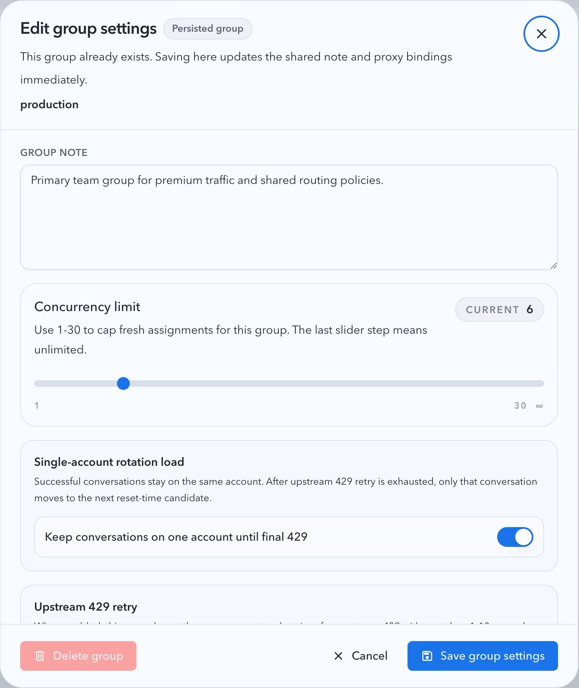

# 上游账号分组单账号轮换负载

## Background

上游账号分组需要一种更细的负载利用方式：同一对话在成功请求后继续绑定当前账号，只有该对话最终遇到 `429` 且分组级 retry 耗尽后，才转绑到下一候选账号。

## Goals

- 分组级开关默认关闭。
- 开启后，对话成功请求保持同账号绑定。
- 同一对话最终 `429` 后才转绑下一候选。
- 候选排序优先看 reset time，再落回旧 tie-breaker。
- UI、API、草稿和导入/创建路径稳定 round-trip 该配置。

## Non-goals

- 不改变未开启该开关时的既有路由语义。
- 不改变全局 `upstream429MaxRetries` 语义。
- 不把非 `429` 错误纳入切号策略。

## Contracts

- `GET /api/pool/upstream-account-groups`
- `PUT /api/pool/upstream-account-groups`
- `pool_upstream_account_group_notes.single_account_rotation_enabled`
- `pool_sticky_routes.sticky_key -> account_id`

## Runtime Rules

1. 开启分组策略后，成功请求继续保留 sticky route。
2. 该对话最终返回 `429` 且分组级 retry 预算耗尽后，清理旧 sticky route。
3. 限额快照、冷却状态或 quota-exhausted 标记不能让已有 sticky 对话主动换出；该对话没有实际遇到最终 `429` 时继续留在原账号。
4. `401`/`403` 等硬认证失效不主动删除 sticky route，但下一次解析会因为账号不可路由而选择其他可用账号。
5. 下次解析同一 sticky key 时，按 reset-time 排序选择下一候选。
6. reset-time 比较顺序：`secondary_resets_at` 先于 `primary_resets_at`。
7. 缺失 reset time 的账号排在有 reset time 的账号之后。

## Acceptance

- 后端单测覆盖 sticky 保持、`429` 后转绑、reset-time 排序。
- 前端开关可回显、可保存、可透传到创建/导入草稿。
- Storybook 和视觉证据覆盖新增开关。

## Visual Evidence

- source_type: storybook_canvas
- target_program: mock-only
- capture_scope: element
- requested_viewport: desktop story canvas
- viewport_strategy: storybook-viewport
- sensitive_exclusion: N/A
- story_id_or_title: Account Pool/Components/Upstream Account Group Settings Dialog/Single Account Rotation Enabled
- state: group settings dialog with single-account rotation and upstream 429 retry enabled
- evidence_note: verifies the new switch, checked state, and copy explaining that 429 retry is exhausted before moving only the affected conversation.

