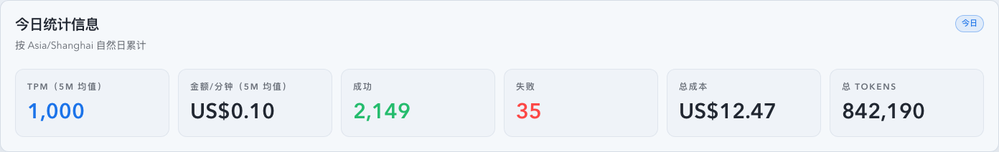
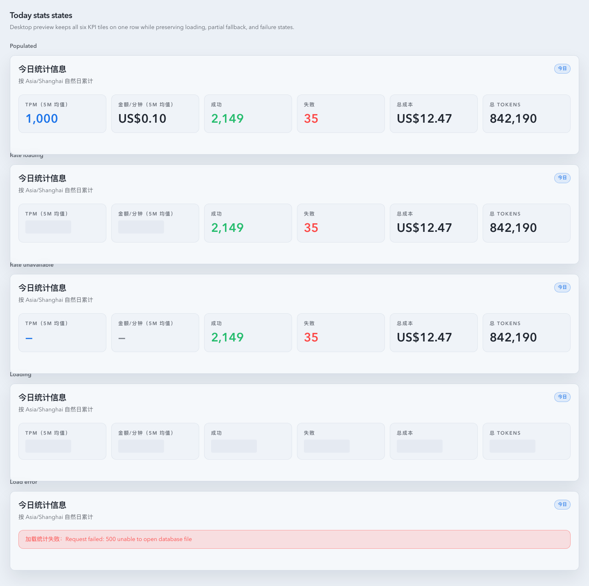

# Dashboard 今日 KPI 改成 TPM + 金额/分钟（5m 均值）（#2qsev）

## 状态

- Status: 部分完成（3/4）
- Created: 2026-04-10
- Last: 2026-04-10

## 背景 / 问题陈述

- Dashboard 今日 KPI 仍以累计总量为主，首个 tile 展示“调用总数”，缺少更贴近当前负载的实时速率视角。
- 主人要求把首个统计替换成当前每分钟 Token 数，并新增当前每分钟金额，同时继续保留成功/失败/总成本/总 Tokens 的累计视角。
- today 面板已经拉取 `useTimeseries('today', { bucket: '1m' })`，可以直接前端派生速率；如果继续只展示累计值，今天面板和分钟级图表之间会割裂，难以快速判断当前吞吐。

## 目标 / 非目标

### Goals

- 将今日 KPI 的首个 tile 改为 `TPM (5m avg)`，并新增 `Cost/min (5m avg)`。
- 速率口径固定为最近 5 个已完成分钟桶的均值：忽略当前进行中的分钟，缺失分钟按 `0` 计入。
- summary 成功但 timeseries 尚未可用时，只让两个速率 tile 进入 skeleton / `—` 降级，其余累计 tile 保持可读。
- `TodayStatsOverview` 升级成 6 个等权 tile，并在 Storybook `desktop1440` 下保持单行。
- 生成并归档 Storybook 视觉证据，供快车道 PR merge-ready 使用。

### Non-goals

- 不修改 Rust `/api/stats/*`、SSE 协议、SQLite schema 或共享 `StatsResponse` 契约。
- 不改变 Dashboard `24 小时 / 7 日 / 历史` 切换、metric toggle 和记忆行为。
- 不把 `5m avg` 伪装成严格最近 1 分钟瞬时值。

## 范围（Scope）

### In scope

- `web/src/components/DashboardActivityOverview.tsx`：新增 today 速率派生层并把 snapshot 传入 KPI 组件。
- `web/src/components/TodayStatsOverview.tsx`：重排为 6 tile，并支持速率 tile 独立 loading / unavailable。
- `web/src/components/TodayStatsOverview.stories.tsx`、`web/src/components/DashboardActivityOverview.stories.tsx`：补齐 populated / loading / error / zero-rate 等 Storybook 场景。
- `web/src/components/*.test.tsx`、`web/src/pages/Dashboard.test.tsx`：补齐速率算法、KPI 渲染与 partial fallback 回归。
- `web/src/i18n/translations.ts`：新增速率相关文案。

### Out of scope

- `src/` 下任意后端实现。
- 新增后端 rate summary API。
- Dashboard 其它卡片或图表布局的额外重构。

## 需求（Requirements）

### MUST

- 最近 5 分钟均值只统计已完成分钟桶。
- trailing window 内缺失分钟必须按 `0` 补齐，而不是缩小分母。
- 今日完整分钟数少于 5 时，按已有完整分钟数求均值；若为 `0`，显示数值 `0`。
- summary error 时保持整个 today overview 现有 alert 语义。
- timeseries error 时，仅两个速率 tile 显示 `—`。

### SHOULD

- 速率 helper 独立成可测试模块，避免把计算逻辑塞进组件 JSX。
- Storybook 直接展示 6-tile 单行桌面态和 partial fallback 态。

### COULD

- 速率 snapshot 携带 `windowMinutes`，便于后续 tooltip/文案复用。

## 功能与行为规格（Functional/Behavior Spec）

### Core flows

- Dashboard 今日视图加载成功后，KPI 行显示：`TPM (5m avg)`、`Cost/min (5m avg)`、`成功`、`失败`、`总成本`、`总 Tokens`。
- `TPM` 与 `Cost/min` 来自 today 1 分钟时序：选取最新 `5` 个已完成分钟桶（或当日可用完整分钟数），总量除以窗口分钟数得到每分钟均值。
- 当前自然分钟仍在进行中时，该分钟桶不参与显示速率。

### Edge cases / errors

- 今日尚无完整分钟时：速率显示 `0`，不是 `—`。
- timeseries 正在加载且 summary 已成功：速率 tile skeleton，其余 4 个 tile 正常显示。
- timeseries 加载失败且 summary 已成功：速率 tile 显示 `—`，其余 4 个 tile 正常显示。
- summary 失败时：整体显示现有 alert，不做混合态拼接。

## 接口契约（Interfaces & Contracts）

### 接口清单（Inventory）

| 接口（Name） | 类型（Kind） | 范围（Scope） | 变更（Change） | 契约文档（Contract Doc） | 负责人（Owner） | 使用方（Consumers） | 备注（Notes） |
| --- | --- | --- | --- | --- | --- | --- | --- |
| Dashboard today rate snapshot | ui-component-prop | internal | Modify | None | web/dashboard | `DashboardActivityOverview` -> `TodayStatsOverview` | 仅前端本地派生，不扩展 API |

### 契约文档（按 Kind 拆分）

- None

## 验收标准（Acceptance Criteria）

- Given 最近 5 个已完成分钟桶累计 `5000 tokens / US$0.50`，When 打开 Dashboard 今日视图，Then `TPM = 1000` 且 `Cost/min = US$0.10`。
- Given trailing 5 分钟内缺少某些分钟桶，When 计算速率，Then 缺失分钟按 `0` 计入窗口。
- Given 当前自然分钟尚未完成，When 计算速率，Then 当前分钟不计入 displayed rate。
- Given 今日还没有任何完整分钟桶，When timeseries 已返回，Then 两个速率 tile 显示 `0`。
- Given summary 成功但 timeseries 正在加载，When 渲染 today KPI，Then 只有两个速率 tile 显示 skeleton。
- Given summary 成功但 timeseries 失败，When 渲染 today KPI，Then 只有两个速率 tile 显示 `—`。
- Given summary 失败，When 渲染 today KPI，Then 保持现有整块 alert 语义。
- Given Storybook `desktop1440` 视口，When 查看 today KPI，Then 6 个 tile 单行展示且无横向溢出。

## 实现前置条件（Definition of Ready / Preconditions）

- 速率口径、降级态与文案已冻结。
- 不新增后端契约这一边界已确认。
- Storybook 仍是本次视觉证据的主源。

## 非功能性验收 / 质量门槛（Quality Gates）

### Testing

- Unit tests: `dashboardTodayRateSnapshot` 速率计算覆盖完整分钟、缺桶补零、忽略当前分钟、零分钟窗口。
- Integration tests: `TodayStatsOverview.test.tsx`、`DashboardActivityOverview.test.tsx`、`Dashboard.test.tsx` 覆盖 6 tile 与 partial fallback。
- E2E tests (if applicable): None。

### UI / Storybook (if applicable)

- Stories to add/update: `TodayStatsOverview.stories.tsx`、`DashboardActivityOverview.stories.tsx`
- Docs pages / state galleries to add/update: 复用 autodocs + state gallery
- `play` / interaction coverage to add/update: `DashboardActivityOverview.stories.tsx` today 视图断言速率 tile
- Visual regression baseline changes (if any): 以 spec 内 `## Visual Evidence` 为准

### Quality checks

- `cd web && bun run test -- src/components/dashboardTodayRateSnapshot.test.ts src/components/TodayStatsOverview.test.tsx src/components/DashboardActivityOverview.test.tsx src/components/DashboardTodayActivityChart.test.tsx src/pages/Dashboard.test.tsx`
- `cd web && bun run build`
- `cd web && bun run build-storybook`

## 文档更新（Docs to Update）

- `docs/specs/README.md`: 新增索引项并在实现完成后同步状态
- `docs/specs/2qsev-dashboard-tpm-cost-per-minute-kpi/SPEC.md`: 同步进度与视觉证据

## 计划资产（Plan assets）

- Directory: `docs/specs/2qsev-dashboard-tpm-cost-per-minute-kpi/assets/`
- In-plan references: ``
- Visual evidence source: maintain `## Visual Evidence` in this spec when owner-facing or PR-facing screenshots are needed.

## Visual Evidence

- source_type: storybook_canvas
  target_program: mock-only
  capture_scope: element
  sensitive_exclusion: N/A
  submission_gate: approved
  story_id_or_title: `dashboard-todaystatsoverview--desktop-single-row`
  state: desktop single row
  evidence_note: 证明 `desktop1440` 下 6 个 KPI tile 保持单行，且首两项已替换为 `TPM (5m avg)` 与 `Cost/min (5m avg)`。
  PR: include
  image:
  

- source_type: storybook_canvas
  target_program: mock-only
  capture_scope: element
  sensitive_exclusion: N/A
  submission_gate: approved
  story_id_or_title: `dashboard-todaystatsoverview--state-gallery`
  scenario: state gallery
  evidence_note: 证明 populated、rate loading、rate unavailable、summary loading 与 summary error 的分态降级行为。
  PR: include
  image:
  

## 资产晋升（Asset promotion）

- None

## 实现里程碑（Milestones / Delivery checklist）

- [x] M1: today 1 分钟时序速率 helper 落地并接入 Dashboard today KPI。
- [x] M2: `TodayStatsOverview` 升级为 6 tile，支持速率 tile 独立 loading / unavailable。
- [x] M3: Vitest 与 Storybook 场景覆盖补齐。
- [ ] M4: 视觉证据归档并推进到 PR merge-ready。

## 方案概述（Approach, high-level）

- 继续复用 today 视图现有的 `useSummary + useTimeseries` 双源模式，只在前端增加一层轻量 rate snapshot 归一化。
- 通过把 summary 与 rate 状态分离，让“累计 KPI”与“速率 KPI”按不同可用性降级，避免一边失败拖垮整排卡片。
- Storybook 继续作为最稳定的视觉证据来源，避免用真实页面随机数据截图。

## 风险 / 开放问题 / 假设（Risks, Open Questions, Assumptions）

- 风险：如果 `useTimeseries(today)` 的 `rangeEnd` 与当前分钟对齐处理不一致，可能误把进行中分钟算进窗口；需要单测锁死。
- 风险：6 tile 在较窄桌面宽度下可能压缩数值，需要继续依赖 `AdaptiveMetricValue` 的 compact fallback。
- 假设：`desktop1440` 是本次“单行 KPI”主要验收视口。

## 变更记录（Change log）

- 2026-04-10: 新建 follow-up spec，冻结 Dashboard 今日 KPI 切换为 5m-avg TPM 与 Cost/min 的范围、验收与视觉证据要求。
- 2026-04-10: 完成前端 5m-avg 速率派生、6-tile KPI 重排、Vitest/Storybook 覆盖与本地视觉证据归档，并获主人授权将截图随 PR 一起提交。

## 参考（References）

- `docs/specs/7s4kw-dashboard-usage-activity-overview/SPEC.md`
- `docs/specs/r99mz-dashboard-today-activity-overview/SPEC.md`
