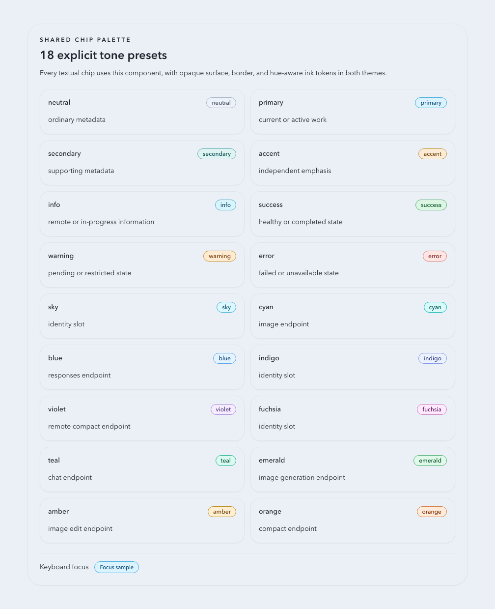
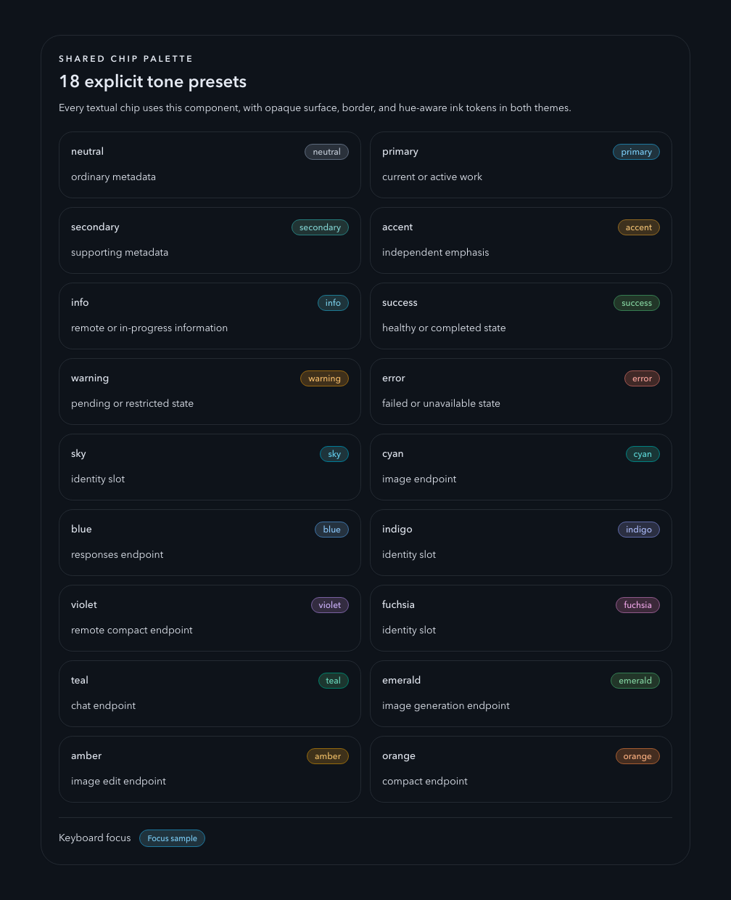
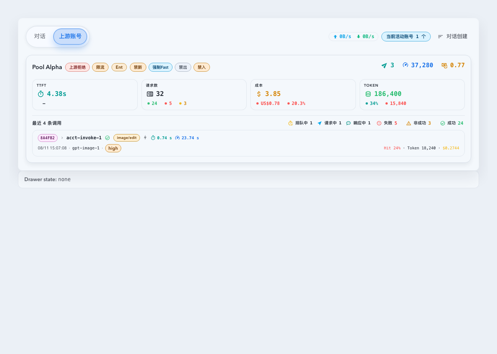
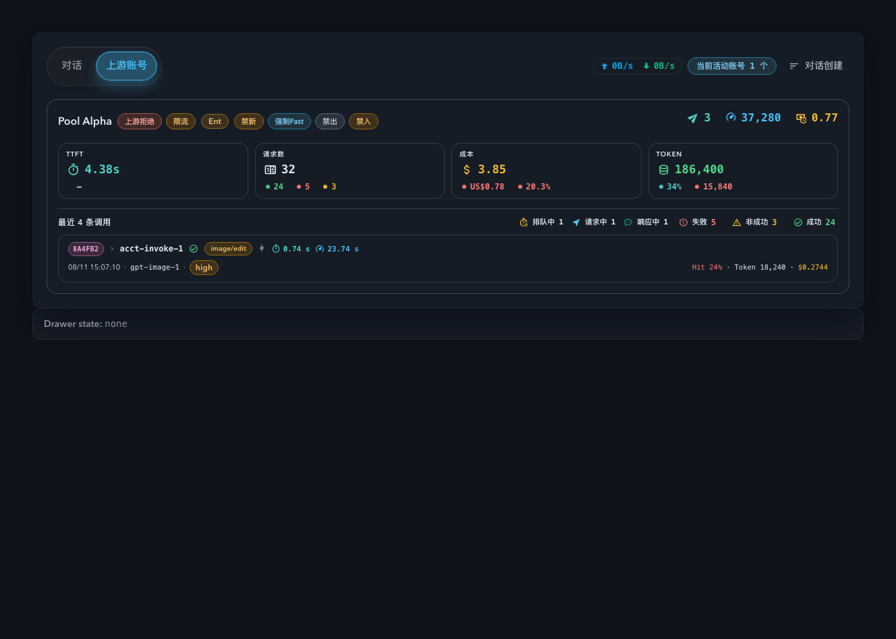

# UI semantic tone contrast contract（#37udg）

## 背景 / 问题陈述

- 现有 light/dark 主题已经区分 `primary / warning / error / ...` 与 `*-content`，但组件层缺少明确边界：`*-content` 本应服务于高填充语义底，却被继续用于低透明语义底和中性 surface 内正文。
- 调用详情暗色面板、共享 chip、PWA offline chip 与部分 app-shell 状态条因此出现同类问题：文本语义虽然“对”，视觉对比却错误，尤其 `warning-content` 与 `accent-content` 在 dark neutral surface 上几乎不可读。
- `x4v2n-ui-surface-contrast-hierarchy` 已经收口了 surface vocabulary，但显式排除了 chip 与业务状态色；因此这次需要单独 topic spec，补齐 semantic tone text contract，而不是把问题继续塞回页面私有 utility 调色。

## 目标 / 非目标

### Goals

- 为 light/dark 双主题建立明确 semantic text contract：`*-content` 只用于 filled semantic surface；低透明语义底和中性 surface 内的语义文本改走独立 tone-ink contract。
- 为所有语义文本 chip 提供唯一的 `Chip` 入口，并以 8 个语义角色与 10 个分类槽覆盖当前界面。
- 修复 `InvocationWorkflowDetailPanel`、App Shell/PWA、Dashboard、Records、Invocation、Account Pool 与 Settings 中已确认的 chip 配色误用。
- 为 Storybook 与单测补齐回归护栏，阻止新的低透明语义底再次配上 `text-*-content`，并禁止 chip 解析为黑白正文色。
- 同步 `DESIGN.md` 与 `docs/ui/foundations.md` / `components.md`，把 contract 写成后续新增规则。

### Non-goals

- 不重做 chart palette、heatmap、hero layout、页面结构或业务状态命名。
- 不改变后端 API、数据库 schema、i18n key 或 invocation detail 数据聚合逻辑。
- 不把所有现有 `text-primary` / `text-success` 全量迁移成新 utility；仅治理本 spec 定义的 shared semantic tone surface。

## 范围（Scope）

### In scope

- `web/src/index.css` 中的 semantic tone-ink token / utility class。
- `web/src/components/ui/chip.tsx` 的共享 chip contract、双主题显式 surface/border/ink token 与尺寸 preset。
- `web/src/features/invocations/InvocationWorkflowDetailPanel.tsx` 的 snapshot metric、summary row、timeline marker 与账号 action row。
- `web/src/features/app-shell/AppLayout.tsx` 的 PWA offline banner chip。
- `web/src/features/app-shell/PwaInstallControl.tsx` 的 offline chip。
- 对应 Storybook stories、contract test 与设计文档同步。

### Out of scope

- filled button / destructive CTA 这类已经正确使用 `text-*-content` 的实体语义 surface。
- page-private chart labels、heatmap cells、图例 ramp、literal color migration。
- 无明确误用证据的页面级细碎 tone 微调。

## 需求（Requirements）

### MUST

- light/dark 主题都必须提供一组 shared semantic tone-ink token，至少覆盖 `primary / info / success / warning / error / accent`。
- `primary-content / secondary-content / accent-content / info-content / success-content / warning-content / error-content` 只允许用于 filled semantic surface，包括实底 button、高填充 CTA、实底 icon-disc 或等价容器。
- 低透明 semantic background（例如 `bg-warning/12`、`bg-accent/15`、`bg-info/10`）与 neutral card surface 内的 semantic text，必须改用 tone-ink contract，而不是 `*-content`。
- `InvocationWorkflowDetailPanel` 在 dark theme 下的 `最终结果`、timeline `等待/裁定` marker、`最终账号` action row 与 summary divider 层级必须达到可读对比。
- 所有文本 chip 必须经由 `Chip` 渲染；不得保留 `Badge` 入口或通过 `className` 覆盖 chip 前景、背景、边框色。
- `SemanticChipTone` 固定为 `neutral / primary / secondary / accent / info / success / warning / error`；`CategoricalChipTone` 固定为 `sky / cyan / blue / indigo / violet / fuchsia / teal / emerald / amber / orange`。
- endpoint 分类固定映射为 `responses=blue`、`chat=teal`、`compact=orange`、`remote_v2=violet`、`image_gen=emerald`、`image_edit=amber`、`image=cyan`；`raw/unknown` 不渲染分类 chip。identity 固定使用 `sky / cyan / blue / violet / indigo / fuchsia / teal / emerald` 八个稳定槽位。
- light/dark 双主题必须为每个 tone 提供显式、不透明的 surface/border/ink；colored ink 必须有明确色相，不能是纯黑、纯白或近中性正文色，文本与 surface 对比度至少 `4.5:1`。
- 交互 Chip 的 `focus-visible` indicator 必须保留可见的 primary outline/ring，且与所在 surface 的对比度至少 `3:1`。
- `micro / compact / default / header / mailbox / square` preset 必须复刻既有尺寸；Dashboard policy 保持 `24px`，recent compact 保持 `20px` 级别，mailbox 保持 `28px`，desktop/mobile 不增加触控尺寸。
- Storybook 必须提供 light/dark 可复现入口，至少覆盖：`UI/Chip` 18-tone gallery、Dashboard policy/recent row、endpoint matrix 与 PWA/offline 状态 surface。
- 必须新增一层 source contract test，阻止低透明语义底继续搭配 `text-*-content`。

### SHOULD

- tone-ink 应保持语义可辨，同时比满饱和 semantic text 更克制，避免在 dense product UI 中压过正文。
- inline action 的 hover/focus 仍可保留更高饱和强调，但 resting state 应服从 tone-ink 层级。
- 若同一组件需要同时支持 filled surface 与 tinted surface，应显式区分 filled-content vs tone-ink，而不是靠局部 class 覆盖。

## 验收标准（Acceptance Criteria）

- Given `InvocationWorkflowDetailPanel` 处于 dark theme，When 查看 hero card 与 key metrics，Then `最终结果` 的 warning text、`最终账号` action row 与分隔线具有稳定层级，且正文/操作文本达到 WCAG AA。
- Given timeline 中出现 `routingWait` 或 `systemFinalFailure` block，When 查看 marker 与标签，Then 它们使用 tone-ink 而不是 `accent-content` / `warning-content`，并在 dark neutral rail 上清晰可读。
- Given 共享 `Chip` 渲染 semantic 或 categorical tone，When 切换到 light/dark theme，Then 文本不依赖 `*-content`，不解析成黑白，且仍保留清晰语义区分。
- Given `AppLayout` 的 PWA offline banner 或 `PwaInstallControl` 的 offline chip 处于 dark theme，When 查看状态 chip，Then 不再出现低透明 warning 背景配 `warning-content` 的低对比问题。
- Given 运行 semantic tone contract test，When 扫描前端源码，Then 不再存在“低透明语义底 + `text-*-content`”的已知违规模式。

## Visual Evidence

- source_type: storybook_canvas
  story_id_or_title: `UI/Chip / GalleryLight`
  target_program: mock-only
  capture_scope: element
  requested_viewport: desktop960
  viewport_strategy: storybook-viewport
  theme: light
  submission_gate: approved in Codex thread
  state: shared 18-tone chip palette and keyboard focus sample
  image: ./assets/chip-gallery-light.png
  PR: include
  
- source_type: storybook_canvas
  story_id_or_title: `UI/Chip / GalleryDark`
  target_program: mock-only
  capture_scope: element
  requested_viewport: desktop960
  viewport_strategy: storybook-viewport
  theme: dark
  submission_gate: approved in Codex thread
  state: shared 18-tone chip palette and keyboard focus sample
  image: ./assets/chip-gallery-dark.png
  PR: include
  
- source_type: storybook_canvas
  story_id_or_title: `Dashboard/WorkingConversationsSection / UpstreamAccountImageEditEndpoint`
  target_program: mock-only
  capture_scope: element
  requested_viewport: desktop1280
  viewport_strategy: storybook-viewport
  theme: light
  submission_gate: approved in Codex thread
  state: Dashboard recent image/edit endpoint chip without duplicate image-tool icon
  image: ./assets/dashboard-image-edit-light.png
  PR: include
  
- source_type: storybook_canvas
  story_id_or_title: `Dashboard/WorkingConversationsSection / UpstreamAccountImageEditEndpointDark`
  target_program: mock-only
  capture_scope: element
  requested_viewport: desktop1280
  viewport_strategy: storybook-viewport
  theme: dark
  submission_gate: approved in Codex thread
  state: Dashboard recent image/edit endpoint chip without duplicate image-tool icon
  image: ./assets/dashboard-image-edit-dark.png
  PR: include
  
- source_type: storybook_canvas
  story_id_or_title: `Invocations/InvocationWorkflowDetailPanel / FailedPoolWorkflowDark`
  target_program: mock-only
  capture_scope: element
  requested_viewport: desktop1280
  viewport_strategy: storybook-viewport
  theme: dark
  submission_gate: approved in Codex thread
  state: invocation detail dark final-result and final-account contrast
  image: returned in Codex thread and persisted under this spec after review
- source_type: storybook_canvas
  story_id_or_title: `Invocations/InvocationWorkflowDetailPanel / BlockedPoolWorkflowDark`
  target_program: mock-only
  capture_scope: element
  requested_viewport: desktop1280
  viewport_strategy: storybook-viewport
  theme: dark
  submission_gate: approved in Codex thread
  state: invocation detail dark summary and timeline semantic tone contrast
  image: returned in Codex thread and persisted under this spec after review
- source_type: storybook_canvas
  story_id_or_title: `UI/Chip / GalleryDark`
  target_program: mock-only
  capture_scope: element
  requested_viewport: desktop1280
  viewport_strategy: storybook-viewport
  theme: dark
  submission_gate: approved in Codex thread
  state: shared chip semantic tone gallery
  image: returned in Codex thread and persisted under this spec after review
- source_type: storybook_canvas
  story_id_or_title: `Shell/Layout/App Layout / PwaOfflineBannerDark`
  target_program: mock-only
  capture_scope: element
  requested_viewport: desktop1280
  viewport_strategy: storybook-viewport
  theme: dark
  submission_gate: approved in Codex thread
  state: app shell and PWA offline semantic chips
  image: returned in Codex thread and persisted under this spec after review
- source_type: storybook_canvas
  story_id_or_title: `Shell/PWA Install Dialog / InstalledSummaryDark`
  target_program: mock-only
  capture_scope: element
  requested_viewport: mobile430
  viewport_strategy: storybook-viewport
  theme: dark
  submission_gate: approved in Codex thread
  state: installed PWA offline chip semantic tone contrast
  image: returned in Codex thread and persisted under this spec after review

## 方案概述（Approach, high-level）

- 在 `web/src/index.css` 中引入 per-tone semantic ink token 与 utility class，让 low-opacity semantic surfaces 有独立文本入口。
- 将 `InvocationWorkflowDetailPanel`、Chip、offline chip / banner 从 `*-content` 切换到显式 tone surface/border/ink contract，并顺手下调 summary divider 对比度。
- 用 Storybook light/dark scenarios 展示 Chip gallery、Dashboard row、endpoint matrix 与 offline shell state，并用 source contract test 护住禁用模式。
- 将新规则同步到 `DESIGN.md` 与 `docs/ui/*`，把 “filled content vs tone ink” 变成明确的组件新增门禁。

## References

- `docs/specs/x4v2n-ui-surface-contrast-hierarchy/SPEC.md`
- `docs/specs/dqstf-invocation-detail-routing-payload-viewer/SPEC.md`
- `docs/specs/quhzx-ui-guidelines-system/SPEC.md`
- `DESIGN.md`
- `docs/ui/foundations.md`
- `docs/ui/components.md`
