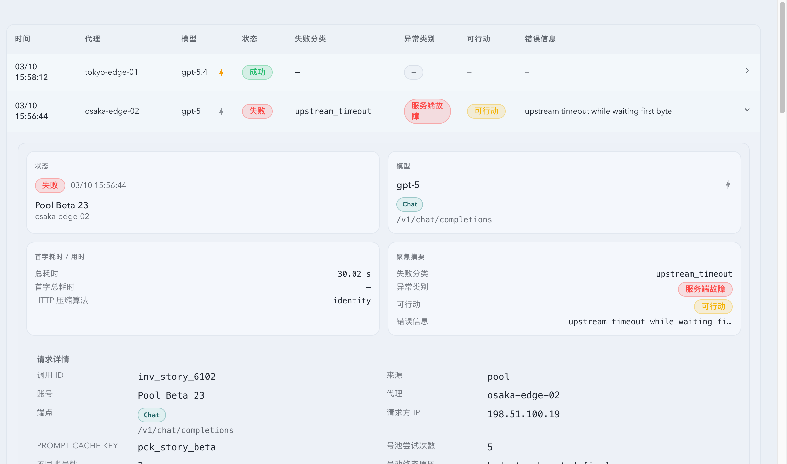
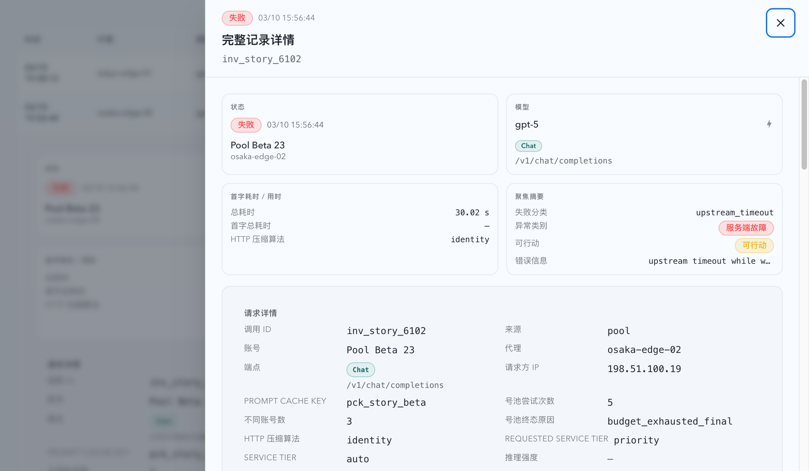
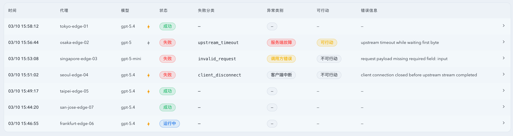

# `/records` 请求 ID 筛选与异常响应详情抽屉（#3gvtt）

## 状态

- Status: 已完成
- Created: 2026-04-04
- Last: 2026-04-04

## 背景 / 问题陈述

- `/#/records` 现有筛选仍保留“上游”字段，但该字段对实际排障帮助有限，反而占用紧张的筛选区密度。
- 用户需要按单次调用快速定位请求，但当前记录页缺少 `invokeId` 级别的精确筛选，只能依赖关键词模糊搜索。
- 行内详情虽然已经扩展为诊断面板，但失败记录仍无法直接看到非正常响应体，排障时需要来回查日志或数据库原文。
- 对于超长异常响应体，页面缺少“先看节选，再按需打开完整详情”的分层交互，导致信息密度和可读性都不理想。

## 目标 / 非目标

### Goals

- 移除 `/records` 顶部筛选中的“上游”字段，改为新增“请求 ID”精确筛选。
- 让 `requestId` 独立于 `keyword` 工作，并统一驱动列表、summary 与 new-count 的稳定快照查询。
- 为非正常记录增加行内“异常响应体”节选，并在正文过长时提供完整详情抽屉查看入口。
- 为完整详情抽屉补齐结构化诊断字段、完整异常响应体与 raw 不可用时的明确退化提示。
- 补齐对应的前后端契约、Storybook 和测试覆盖，保持 `/records` 页交互与视觉结果稳定。

### Non-goals

- 不新增独立路由级请求详情页。
- 不把 `upstreamRequestId` 暴露为新的筛选维度。
- 不把请求体全文展示加入本轮交互。
- 不改造 `Dashboard` / `Live` 现有调用记录表的交互模型。

## 范围（Scope）

### In scope

- `web/src/pages/Records.tsx` 的筛选布局、草稿状态和查询参数构建。
- `web/src/components/InvocationRecordsTable.tsx` 与共享详情组件的异常响应体展示、完整详情抽屉入口、异常类别 badge 单行收口。
- `web/src/lib/api.ts` 与 Rust `src/api/mod.rs` 的 records 查询参数和详情接口扩展。
- 记录页相关 Storybook、Vitest 与 Rust 测试覆盖。

### Out of scope

- 账号详情抽屉、Prompt Cache 历史抽屉或其它页面的记录详情交互。
- records 页之外的全局筛选字段排序或 IA 调整。
- 历史归档结构、raw 文件保留策略与数据库 schema 重构。

## 需求（Requirements）

### MUST

- `/records` 筛选区不再显示“上游”，同位置改为“请求 ID”文本输入。
- `requestId` 必须按 `invokeId` 精确匹配，且不得与 `keyword` 共用同一模糊匹配语义。
- `GET /api/invocations`、`/api/invocations/summary`、`/api/invocations/new-count` 必须共享 `requestId` 过滤口径。
- 非正常记录的行内详情必须显示异常响应体节选；成功、运行中、排队中记录不得显示该区块。
- 当异常响应体过长时，行内详情必须提供“查看完整详情”动作，并通过右侧抽屉懒加载完整正文。
- 若记录只有 `structured_only`、raw 文件缺失或正文解码失败，UI 必须显示明确的不可用原因，不得静默空白。
- 异常类别与可行动等 badge 在 records 表格和详情摘要区必须保持单行，不得因窄列自动换行。

### SHOULD

- 完整详情抽屉复用现有 drawer 交互语义，避免引入另一套关闭/返回模型。
- 行内详情继续承担“快速诊断”，完整抽屉承担“完整正文与完整字段”的信息分层。
- Storybook 应提供稳定的失败记录、长响应体抽屉和 structured-only 退化态展示。

### COULD

- 后续为请求 ID 提供复制按钮或从其它页面深链跳转（本轮不做）。

## 功能与行为规格（Functional/Behavior Spec）

### Core flows

- 用户进入 `/records` 后，可在筛选区直接输入请求 ID；点击“搜索”后，列表、统计卡与新数据计数都会基于该 `invokeId` 精确定位。
- 用户展开失败记录时，行内详情会在已有诊断字段下方显示“异常响应体”节选；若正文超出节选阈值，则同时显示“查看完整详情”入口。
- 用户点击“查看完整详情”后，右侧抽屉打开，并在保留结构化字段的同时按需加载完整异常响应体。
- 用户关闭抽屉或切换其它记录时，records 列表本身的展开态与当前筛选不被重置。

### Edge cases / errors

- 当 `requestId` 为空时，records 页行为与原有筛选完全一致。
- 当 `requestId` 命中 0 条记录时，空结果页仍保持零值 summary 与稳定分页，不出现查询错误。
- 当异常响应体不可用时，行内详情与抽屉均显示明确提示，但其余结构化详情仍可查看。
- 当响应体很长时，行内区块只显示节选，不在表格内无限扩展正文高度。
- 当表格列宽较窄时，异常类别 badge 仍强制单行显示，通过截断错误信息而不是折行 badge 来守住布局。

## 接口契约（Interfaces & Contracts）

### 接口清单（Inventory）

| 接口（Name） | 类型（Kind） | 范围（Scope） | 变更（Change） | 契约文档（Contract Doc） | 负责人（Owner） | 使用方（Consumers） | 备注（Notes） |
| --- | --- | --- | --- | --- | --- | --- | --- |
| `GET /api/invocations` | HTTP API | internal | Modify | None | backend | records page | 新增 `requestId` 精确过滤 |
| `GET /api/invocations/summary` | HTTP API | internal | Modify | None | backend | records page | 新增 `requestId` 过滤并保持 snapshot 语义 |
| `GET /api/invocations/new-count` | HTTP API | internal | Modify | None | backend | records page | 新增 `requestId` 过滤 |
| `GET /api/invocations/:id/detail` | HTTP API | internal | New | None | backend | records detail drawer | 返回结构化详情 + 异常响应体节选 |
| `GET /api/invocations/:id/response-body` | HTTP API | internal | New | None | backend | records detail drawer | 按需返回完整异常响应体或不可用原因 |

### 契约文档（按 Kind 拆分）

- None

## 验收标准（Acceptance Criteria）

- Given 用户在 `/records` 筛选区查看字段，When 页面加载完成，Then 不再出现“上游”，且同位置出现“请求 ID”输入框。
- Given 用户输入某个 `invokeId` 并点击搜索，When records 页刷新，Then 列表、summary 与 `newRecordsCount` 都只统计该请求 ID 命中的稳定快照结果。
- Given 用户展开一条失败记录，When 该记录存在异常响应体，Then 行内详情显示节选正文，并在正文过长时提供“查看完整详情”入口。
- Given 用户打开完整详情抽屉，When 完整正文可用，Then 抽屉展示完整结构化字段与完整异常响应体；When 正文不可用，Then 抽屉展示明确的 unavailable reason。
- Given 用户查看成功或运行中的记录，When 展开详情，Then 不会显示异常响应体区块，也不会触发完整正文请求。
- Given records 表格列宽受限，When 渲染“服务端故障 / 调用方错误 / 客户端中断”等异常类别 badge，Then badge 保持单行，不会换成两行。

## 实现前置条件（Definition of Ready / Preconditions）

- `/records` 页原有稳定快照语义已存在，并且 `requestId` 可以被定义为 `invokeId` 精确过滤。
- 行内详情与右侧 drawer 已有基础 UI 容器可复用，无需新增路由级详情页。
- raw response 文件的读取失败与 structured-only 退化状态已有后端语义可复用。

## 非功能性验收 / 质量门槛（Quality Gates）

### Testing

- Rust tests: `cargo test build_invocation_filters_normalizes_request_id -- --exact`
- Rust tests: `cargo test response_body_ -- --nocapture`
- Frontend tests: `cd web && bun run test src/pages/Records.test.tsx src/components/InvocationRecordsTable.test.tsx src/lib/api.test.ts src/lib/invocationRecords.test.ts`

### UI / Storybook (if applicable)

- Stories to add/update: `web/src/components/InvocationRecordsTable.stories.tsx`, `web/src/components/RecordsPage.stories.tsx`
- `play` / interaction coverage to add/update: 长异常响应体打开完整详情抽屉、structured-only 退化态
- Visual regression baseline changes (if any): records 行内详情、完整详情抽屉与异常类别 badge 单行样式

### Quality checks

- `cargo check`
- `cd web && bun run build`
- `cd web && bun run build-storybook`

## 文档更新（Docs to Update）

- `docs/specs/README.md`: 新增 follow-up spec 索引，标记该 records 增量需求已有规格落点。
- `docs/specs/3gvtt-records-request-id-response-details/SPEC.md`: 固定范围、接口、验收和视觉证据。

## 计划资产（Plan assets）

- Directory: `docs/specs/3gvtt-records-request-id-response-details/assets/`
- In-plan references: ``, ``, ``
- Visual evidence source: maintain `## Visual Evidence` in this spec when owner-facing or PR-facing screenshots are needed.

## Visual Evidence

失败记录行内详情现在会显示异常响应体节选，并保留完整诊断面板布局：

长异常响应体可从行内入口进入右侧完整详情抽屉查看全文：

异常类别 badge 在 records 表格中保持单行，不再出现“服务端故障”被压成两行的样式缺陷：

## 资产晋升（Asset promotion）

- None

## 实现里程碑（Milestones / Delivery checklist）

- [x] M1: `/records` 筛选移除“上游”并新增 `requestId=invokeId` 精确过滤。
- [x] M2: 后端补齐 records 列表 / summary / new-count 的 `requestId` 契约，并新增详情与完整响应体接口。
- [x] M3: 前端补齐异常响应体节选、完整详情抽屉与 structured-only 退化态。
- [x] M4: 补齐 Rust / Vitest / Storybook / build 验证，并固定视觉证据。

## 方案概述（Approach, high-level）

- 复用既有 records 稳定快照与 drawer 交互，不引入新的详情路由或新的筛选状态模型。
- 通过“行内节选 + 抽屉全文”分层控制信息密度，避免异常正文直接挤爆表格。
- 将 `requestId` 收口为 `invokeId` 精确匹配，避免和 `keyword` 模糊搜索语义混淆。
- 通过通用 `Badge` 基础样式加 `whitespace-nowrap + shrink-0` 统一修复 records 窄列 badge 自动换行问题。

## 风险 / 开放问题 / 假设（Risks, Open Questions, Assumptions）

- 风险：完整异常响应体可能很长，因此抽屉必须维持懒加载与滚动隔离，避免首屏卡顿。
- 风险：历史记录 raw 文件可能已经被裁剪或清理，因此 UI 需要继续接受“结构化详情可见但正文不可用”的退化态。
- 假设：当前用户所说“请求 ID”指向 `invokeId`，而不是上游返回的 request id。
- 假设：完整详情继续采用右侧 drawer 是正确的交互方向，不需要切成 modal 或独立页面。

## 变更记录（Change log）

- 2026-04-04: 创建 follow-up spec，冻结 `/records` 的请求 ID 精确筛选、异常响应体节选与完整详情抽屉范围。
- 2026-04-04: 补齐 records 页的前后端契约、Storybook、测试与本地构建验证，并将 mock visual evidence 归档到 spec 目录。

## 参考（References）

- `docs/specs/6whgx-records-stable-snapshot-analytics/SPEC.md`
- `web/src/pages/Records.tsx`
- `web/src/components/InvocationRecordsTable.tsx`
- `web/src/components/invocation-details-shared.tsx`
- `web/src/lib/api.ts`
- `src/api/mod.rs`
