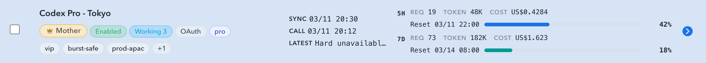
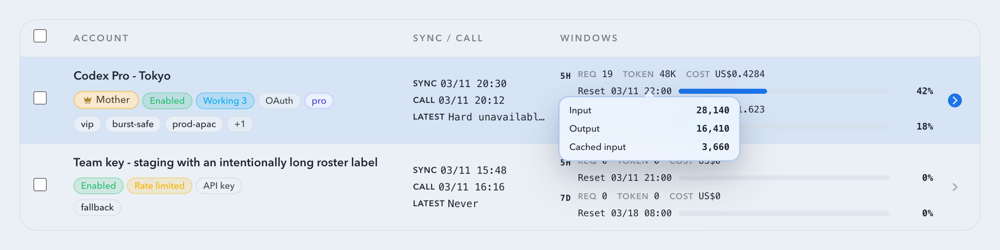
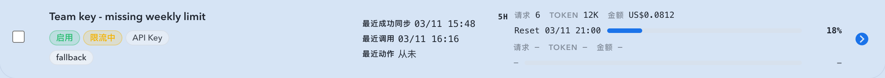

# 号池窗口实际使用量与 Token 悬浮详情（#43bpp）

## 状态

- Status: 已实现，待截图提交授权 / PR 收敛

## 背景 / 问题陈述

- 账号池列表当前在 `5h / 7d` 窗口里只突出 quota 百分比与重置时间，缺少这个周期内实际发生了多少请求、多少 Token、花了多少钱。
- 排查账号消耗时，用户需要在列表层直接看到本系统本地代理到该账号的真实调用累计，而不是再进入详情或依赖上游 usage 字段。
- Token 汇总只有单个紧凑值时，可读性不足；缺少输入、输出、缓存输入三类明细会影响定位成本来源。

## 目标 / 非目标

### Goals

- 在账号池 roster 的每个窗口块中，把主摘要切换为本地 rolling window 的 `请求数 / Tokens / 金额`。
- 保留窗口名、重置时间与 quota progress bar，让“额度窗口”语义不丢失。
- `Token` 指标支持 hover / focus tooltip，完整展示 `输入 / 输出 / 缓存输入` 三类 token 明细。
- 后端列表 / 详情接口统一为 `primaryWindow` / `secondaryWindow` 扩展 `actualUsage` 子结构。
- 通过 `/events` 的 `records` SSE 对当前页静默刷新，让实际使用量近实时更新。

### Non-goals

- 不改造上游 `/wham/usage` 解析，也不尝试对齐账号在外部场景下的总 usage。
- 不重做账号详情抽屉的 usage 卡片布局。
- 不新增窗口切换器，也不替换现有 quota 百分比、窗口文案或 reset 语义。

## 范围（Scope）

### In scope

- `src/upstream_accounts/mod.rs`
- `web/src/lib/api.ts`
- `web/src/hooks/useUpstreamAccounts.ts`
- `web/src/components/UpstreamAccountsTable.tsx`
- `web/src/components/UpstreamAccountsTable.stories.tsx`
- `web/src/components/UpstreamAccountsTable.test.tsx`
- `web/src/hooks/useUpstreamAccounts.test.tsx`
- `web/src/lib/api.test.ts`
- `web/src/pages/account-pool/UpstreamAccounts.tsx`
- `web/src/i18n/translations.ts`
- `docs/specs/43bpp-upstream-account-window-actual-usage/SPEC.md`

### Out of scope

- `UpstreamAccountUsageCard` 详情卡片重设计
- 上游 usage endpoint 字段兼容层重写
- 新增列表筛选项或新批量操作

## 接口契约

- `primaryWindow` / `secondaryWindow` 继续保留现有 `usedPercent / usedText / limitText / resetsAt / windowDurationMins` 字段。
- 新增 `actualUsage`：
  - `requestCount`
  - `totalTokens`
  - `totalCost`
  - `inputTokens`
  - `outputTokens`
  - `cacheInputTokens`
- 列表与详情接口共用同一窗口结构；缺失窗口时仍返回 `null`，不伪造零值快照。

## 聚合规则

- “实际使用量”口径固定为本系统本地 `codex_invocations` 中带 `upstreamAccountId` 的调用累计。
- 每个窗口按 trailing rolling duration 计算，即 `[now - windowDurationMins, now]`。
- `requestCount` 统计所有命中的持久化请求，即使该次调用没有 token/cost 也应计数。
- `totalTokens / totalCost / inputTokens / outputTokens / cacheInputTokens` 仅累加非空数值；缺失字段按 `0` 处理。
- 若窗口起点早于在线 retention cutoff，则需要联合读取主库 `codex_invocations` 与 `archive_batches` 中的 `codex_invocations` 归档片段。
- `resetsAt` 只用于展示 quota 信息，不参与 rolling window 聚合边界。

## 前端表现

- 每个窗口块采用双层紧凑布局：
  - 第一层：`Req / Token / Cost`
  - 第二层：`Reset / progress / percent`
- `Token` 指标保持紧凑数字展示，但 hover / focus 后的 tooltip 必须完整显示：
  - `输入`
  - `输出`
  - `缓存输入`
- 缺失窗口时，inline 指标、reset 文案、percent 与 tooltip 触发点统一显示 ASCII `-`；不能把“窗口不存在”渲染成 `0`。

## 实时刷新

- `useUpstreamAccounts` 订阅通用 `/events` SSE 的 `records` 事件。
- 收到 `records` 事件后，对当前 roster 页和当前详情账号做节流静默刷新，不打断已加载页面。
- SSE 重新连上时做一次带 cooldown 的 silent resync，避免长连接抖动后数据滞后。

## 验收标准（Acceptance Criteria）

- Given OAuth 账号同时存在 primary/secondary 窗口，When roster 渲染，Then 每个窗口都显示该 rolling window 内的 `请求数 / Tokens / 金额`，且仍保留原 reset + progress + percent。
- Given API key 账号没有上游 reset 语义，When roster 渲染，Then 仍按本地 `5h / 7d` rolling window 展示实际使用量。
- Given 某窗口缺失，When roster 渲染，Then inline 指标、reset 文案与 percent 全部保持 `-` 占位，不出现误导性的 `0`，也不出现空 tooltip。
- Given 用户 hover 或 focus `Token` 指标，When tooltip 打开，Then 能看到 `输入 / 输出 / 缓存输入` 三类完整数值。
- Given `/events` 收到新的 `records` 事件，When 页面已完成首轮加载，Then 当前可见账号在节流窗口后静默刷新实际使用量。
- Given SSE 连接重新建立，When open 事件到达，Then 当前 roster 页与当前详情账号触发一次静默 resync。

## 质量门槛（Quality Gates）

- `cargo test --lib upstream_accounts::tests::enrich_window_actual_usage`
- `cargo test --lib upstream_accounts::tests::load_upstream_account_detail_with_actual_usage`
- `cd web && bun run test web/src/lib/api.test.ts`
- `cd web && bun run test web/src/components/UpstreamAccountsTable.test.tsx`
- `cd web && bun run test web/src/hooks/useUpstreamAccounts.test.tsx`
- `cd web && bun run build`
- `cd web && bun run build-storybook`

## Visual Evidence

- source_type: storybook_canvas
  target_program: mock-only
  capture_scope: element
  sensitive_exclusion: N/A
  submission_gate: pending-owner-approval
  story_id_or_title: Account Pool/Components/Upstream Accounts Table/Default
  state: default
  evidence_note: 验证窗口主摘要已切换为本地 rolling window 的 `Req / Token / Cost`，并保留原有 `Reset + progress + percent` 额度语义。
  image:
  

- source_type: storybook_canvas
  target_program: mock-only
  capture_scope: browser-viewport
  sensitive_exclusion: N/A
  submission_gate: pending-owner-approval
  story_id_or_title: Account Pool/Components/Upstream Accounts Table/Default
  state: token-tooltip-open
  evidence_note: 验证 `Token` 指标 hover 后会展开 `输入 / 输出 / 缓存输入` 三类完整明细，同时保留 inline 紧凑 token 汇总。
  image:
  

- source_type: storybook_canvas
  target_program: mock-only
  capture_scope: element
  sensitive_exclusion: N/A
  submission_gate: pending-owner-approval
  story_id_or_title: Account Pool/Components/Upstream Accounts Table/Missing Secondary Window
  state: missing-secondary-window
  evidence_note: 验证缺失次级窗口时，列表继续显示 ASCII `-` 占位，而不是伪造 `0` 或错误显示完整周窗口使用量。
  image:
  

## 风险 / 假设

- 假设：本地 `codex_invocations.payload.upstreamAccountId` 是本次功能唯一可信的账号归属来源。
- 风险：低 retention 环境下若归档 manifest 缺少 `coverage_start_at / coverage_end_at`，需要回退靠时间过滤保证不漏算。
- 风险：`records` SSE 频繁时若刷新去抖不当，可能导致列表连续 re-fetch；因此必须使用节流与 open-resync cooldown。
