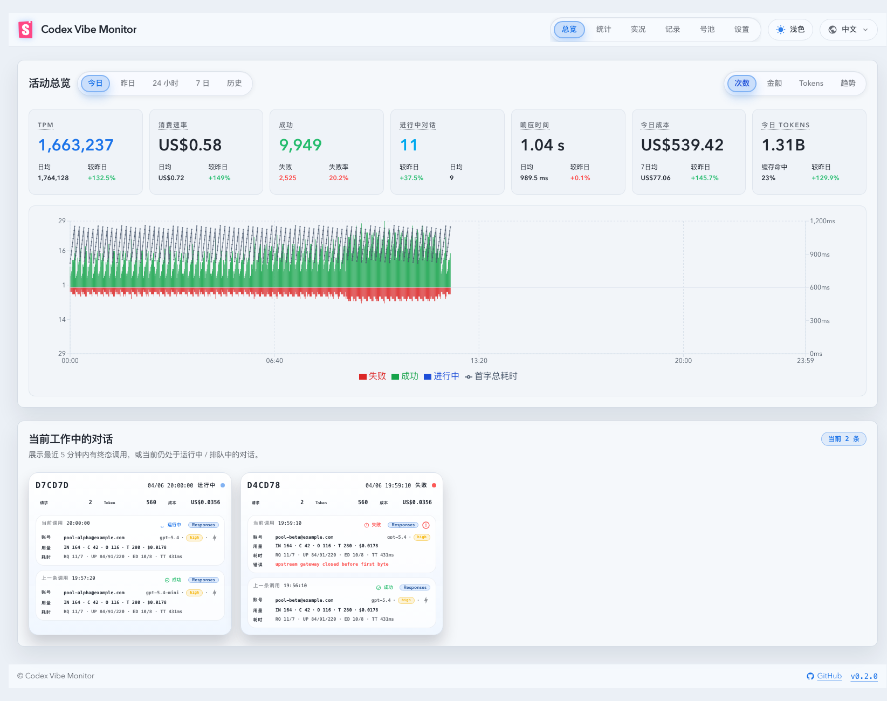

# SSE 驱动的请求记录与统计实时更新（#5932d）

## 背景 / 问题陈述

- 前端 `Dashboard` 与 `Live` 已订阅 SSE，但当前代理链路写库成功后不会即时推送 `records`/`summary`/`quota`。
- 后端 `records` 广播仅来自轮询任务，导致代理请求产生后 UI 需要等待下一轮轮询或手动刷新。
- 目标是让代理请求写库后 <1s 在 UI 可见，并且统计卡片与配额快照同步刷新。

## 目标 / 非目标

### Goals

- 代理请求写库成功后，立即广播 `records`（仅新增记录）。
- 同步广播最新 `summary`（既有窗口集合）与 `quota` 快照。
- 前端在 SSE 重连后做一次静默回源，补齐重连窗口内可能丢失的记录。
- 保持现有 HTTP API 与 SSE payload schema 不变。

### Non-goals

- 不新增 SSE event type。
- 不改动 Dashboard/Live 组件接口与页面结构。
- 不引入 schema migration。

## 范围（Scope）

### In scope

- `src/main.rs`：代理落库路径与广播逻辑抽取。
- `web/src/hooks/useInvocations.ts`：SSE open 后的静默回源补齐。
- 相关测试与验证命令更新（Rust + Web）。

### Out of scope

- 轮询任务广播策略重构。
- 新增前端轮询兜底主机制。

## 需求（Requirements）

### MUST

- 新增内部 helper 统一“代理落库后广播”流程，替换代理链路的所有落库调用点。
- `INSERT OR IGNORE` 未插入时，不广播 `records`。
- 广播 `records`、`summary`、`quota` 之间错误隔离，任何广播失败仅记录 `warn`，不影响代理响应。
- 保持 `t_total_ms`/`t_persist_ms` 的现有更新语义，不得回归。

### SHOULD

- 复用 `collect_summary_snapshots` 与 `QuotaSnapshotResponse::fetch_latest`。
- 避免在多个错误/成功分支复制广播逻辑。
- Dashboard 实时消费应拆分“用户可见轻量补丁”和“HTTP 全量 reconcile”两类节奏，避免高频 SSE 记录把整页统计与图表一起重算。

## 功能与行为规格（Functional/Behavior Spec）

### Core flows

- 代理请求落库成功且为新插入记录时：
  - 广播 `BroadcastPayload::Records { records: vec![record] }`
  - 广播全部 summary 窗口 payload
  - 广播最新 quota（存在时）
- 代理请求命中重复写入（未插入）时：
  - 不广播 `records`，并且不触发额外 summary/quota 广播。
- 前端连接 SSE 成功（open）后：
  - 对 `useInvocationStream` 执行一次静默 `fetchInvocations(...)` 回源并合并去重。
- Dashboard `today` summary:
  - SSE `summary` payload 是 KPI 数字的快速路径，匹配窗口时直接提交并保持 ≤1s 可见。
  - `records` payload 只触发 HTTP reconcile，不作为 KPI 快速路径；calendar-window HTTP reconcile 必须节流到不超过每 5 秒一次。
- Dashboard 顶部 `today`/`yesterday` 1 分钟粒度活动图：
  - 继续使用既有 Recharts 图表、tooltip、1 分钟 bucket 与交互结构。
  - `today` 图表接收的 timeseries response 允许高频到达，但提交给图表渲染的数据快照必须独立节流到不超过每 5 秒一次。
  - closed natural day（例如 `yesterday`）不需要延迟提交。
- Dashboard working conversations:
  - SSE `records` 对已加载会话的本地可见 patch 必须 1 秒合批提交，避免逐条记录触发卡片重排。
  - 新会话、排序锚点变化或 head 需要重算时，HTTP head/snapshot reconcile 必须节流到不超过每 5 秒一次。
- Proxy runtime snapshots:
  - `running` / `pending` 过程态以进程内共享 runtime store 为当前真相源，并通过 SSE `records` 立即广播。
  - HTTP current-window reconcile 必须在 DB 结果上 overlay 同一份内存 runtime store，覆盖 records、summary、timeseries、account activity 与 working conversations，避免 DB 不再常规刷新 running 行后出现短暂丢行。
  - Memory overlay 中的 `running` / `pending` 记录不受 activity window、natural-day 或 5 分钟工作集限制；只要尚未 terminal/tombstone，current summary、account activity 与 working conversations 都必须展示。历史 terminal DB 行仍按所选窗口过滤。
  - terminal success/failure 记录是 P1 观测事实，必须构造成完整 terminal record 后进入 SQLite write controller；代理业务响应不等待 SQLite 落库，入队或 flush 失败只记录结构化证据。
  - terminal record 入队后必须 tombstone/remove 对应内存 running 记录；HTTP overlay 中已存在的 terminal DB 事实始终优先于 memory running。
  - 优雅停机只尽力 drain P1 terminal/route 状态记录；P2 running snapshot 不强制逐条写回 SQLite。
- `/api/stats/parallel-work`:
  - JSON shape 与字段集合必须保持不变。
  - 服务端可以通过 ETag / `If-None-Match` / `304 Not Modified` 或等价 version 机制减少未变化 payload 传输。

### Edge cases / errors

- summary 计算失败：记录 `warn`，继续执行 quota 广播尝试。
- quota 拉取失败：记录 `warn`，不影响请求主流程。
- SSE 广播通道拥塞/lag：记录 `warn`，代理请求照常返回。
- Dashboard HTTP reconcile 失败不得清空已有 SSE 驱动 KPI、working conversations 或 parallel-work 数据；下一次 SSE/open/timer 仍可继续触发 reconcile。

## 接口契约（Interfaces & Contracts）

- HTTP API: 无变更。
- SSE schema: 保持现有 `records` / `summary` / `quota` / `version` 结构；`summary` 可扩展轻量 KPI 字段，但不得改写既有 totals 含义。
- `/api/stats/parallel-work`: response body schema 不变；成功响应应带 `ETag`，匹配 `If-None-Match` 时可返回 `304` 且不带 body。
- Dashboard 顶部 Today KPI 中的“进行中对话”必须以严格未终态 `running/pending` 的唯一 `promptCacheKey` 数量为真相源，不得复用 `/api/stats/parallel-work` 当前窗口最后一个 bucket 的 `parallelCount`。
- Stats 页 `parallel-work` 继续表示 bucket 内发生过请求的 distinct `promptCacheKey` 数量，不承担严格瞬时进行中对话语义。
- Dashboard 总览卡片若保留次级展示数据，允许继续复用 `parallel-work` 的 bucket 趋势统计作为参考项，但这些次级项不得反向决定主值，也不得改变 `/api/stats/parallel-work` 的既有接口语义。

## 验收标准（Acceptance Criteria）

- Given 代理请求构造出 running 或 terminal record，When 订阅 `/events`，Then 在 1 秒内收到包含新增 `invokeId` 的 `records` 事件，即使 SQLite 记录落库仍在 write controller 队列中。
- Given 同一代理请求，When `records` 事件发送后，Then 后续 summary/quota 通过 SSE 或 HTTP reconcile 最终补齐，且 SQLite locked 不得阻断业务响应。
- Given 命中 `INSERT OR IGNORE` 未插入，When 请求完成，Then 不重复发送 `records` 事件。
- Given SSE 发生断线并恢复，When 连接 open，Then 前端列表通过静默回源补齐，且与后端一致。
- Given Dashboard 收到 `today` 的 SSE `summary`，When payload 匹配当前窗口，Then KPI 数字不等待 HTTP reconcile 即可提交。
- Given Dashboard 高频收到 `records`，When 需要更新 calendar-window summary、顶部 today 图表或 working conversation head，Then 对应 HTTP / chart commit 不超过每 5 秒一次。
- Given working conversations 高频收到同一秒内多条 `records`，When 这些 records 命中已加载会话，Then 本地可见 patch 合并为 1 秒批次提交。
- Given parallel-work payload 未变化，When 客户端带上前次 `ETag` 请求 `/api/stats/parallel-work`，Then 服务端可返回 `304`，客户端复用既有数据且不改变 JSON shape。

### Performance & Reliability

- 代理主链路不可因广播失败、terminal 记录入队失败或 write controller flush 失败而失败；这些失败必须结构化记录并计数。
- 不新增显著阻塞路径与重复广播噪声。
- Dashboard 高频 SSE 消费不得让顶部图表、working conversation head reconcile 或 parallel-work 统计在每条记录上全量重渲染。

## 风险 / 假设

- 风险：summary/quota 查询在高频代理流量下增加读压；通过错误隔离和轻量查询控制影响。
- 假设：`invoke_id + occurred_at` 仍然可用于去重语义，不需要新增唯一键策略。

## Visual Evidence

- source_type=storybook_canvas
- target_program=mock-only
- capture_scope=browser-viewport
- requested_viewport=1660x960
- viewport_strategy=devtools-emulate
- sensitive_exclusion=N/A
- submission_gate=owner-approved
- story_id_or_title=pages-dashboardpage--full-page-desktop
- state=desktop full page
- evidence_note=验证完整桌面端总览页面在保留原布局与全部总览数据项的前提下，“进行中对话”主值取严格进行中的对话数，底部“较昨日 / 日均”仍显示 parallel-work 历史统计，且页面 shell、图表与 working conversations 区块数据完整。

PR: include

