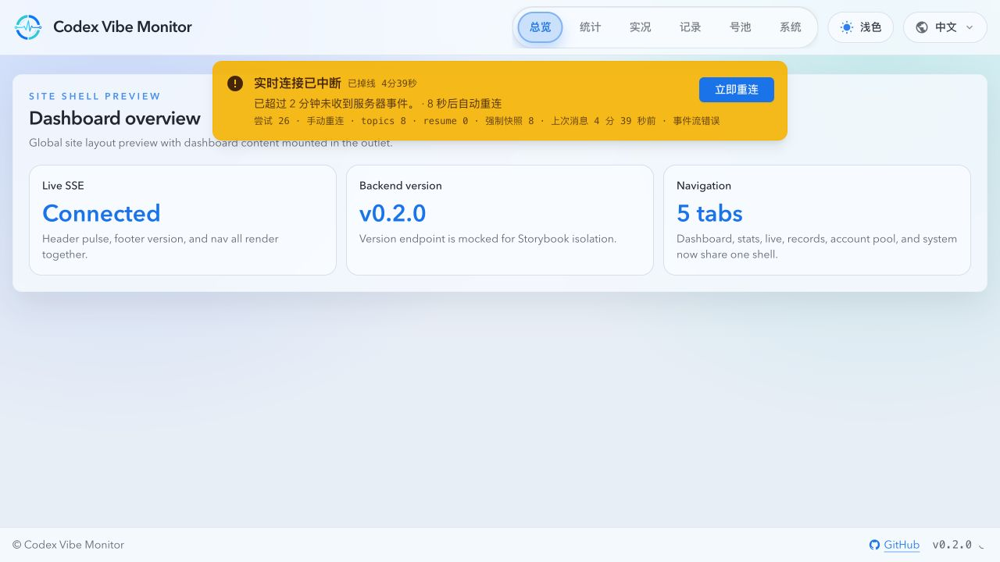
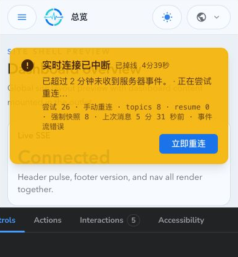

# 主应用常驻订阅纯 SSE 化与统一快照/回放基础设施（#5932d）

> 当前有效规范以本文为准；实现覆盖见 `./IMPLEMENTATION.md`，关键演进原因见 `./HISTORY.md`。

## 背景 / 问题陈述

- 主应用常驻订阅此前长期混用 `records` SSE、HTTP bootstrap、SSE `open` 后回源、定时 reconcile 与页面私有 fallback。
- 这种“推拉并存”把订阅 UI 变成了多套状态机：同一块面板既吃 SSE，又等 HTTP 校准，还要处理重连、乱序与 stale 覆盖。
- `dashboard.activity`、working conversations、prompt-cache、summary、timeseries、parallel-work、quota、forward-proxy live 这些 owner-facing 当前态，本质上都属于“订阅 topic 的权威读模型”，不该再让前端从 `records/recent/timeseries` 反推其它面板。

## 目标 / 非目标

### Goals

- 主应用常驻订阅统一收口到单 `/events`，使用显式 `topics + resume` 请求合同。
- 订阅响应统一为 `snapshot -> replay -> live` 三类 envelope；覆盖范围内不再使用 `records` 事件驱动额外 HTTP reconcile。
- 首屏 hydration 改为纯 SSE：连接建立后先收到对应 topic 的 authoritative `snapshot`，再进入增量更新。
- 恢复规则统一为“能 replay 才 replay，否则直接新 snapshot 覆盖”，不再为单个页面保留私有 fallback。
- 订阅 topic 由后端直接产出权威 payload，前端只消费 topic 数据，不再拼装二次聚合真相。

### Non-goals

- 不把导入校验、批量同步、后台任务进度等任务型专用 SSE endpoint 并入这次总线。
- 不把 `yesterday`、闭合自然日、纯历史列表、长历史 bucket 强行改成持续推送。
- 不引入 WebSocket。
- 不要求 replay 窗口跨服务重启持久化；进程重启后允许直接用新 `snapshot` 恢复。

## 范围（Scope）

### In scope

- `src/api/slices/subscriptions.rs` 与 `/events`：topic descriptor、resume cursor、snapshot/replay/live envelope、单连接多 topic fanout。
- `src/runtime.rs` / `src/app_state.rs`：主应用订阅 hub、内存 snapshot cache 与 replay ring 生命周期。
- `web/src/lib/sse.ts` 与 `web/src/hooks/useSubscriptionTopic.ts`：单连接 topic registry、cursor 持有、topic 集变更重连、统一恢复。
- 主应用当前常驻订阅消费者迁移：
  - `dashboard.activity.current`
  - `dashboard.working-conversations.current`
  - `invocations.window`
  - `prompt-cache.window`
  - `prompt-cache.sticky.window`
  - `invocation-history.window`
  - `invocation-history.overview`
  - `prompt-cache.conversation-binding.current`
  - `prompt-cache.conversation-operations.window`
  - `stats.summary.current`（仅 open-range owner-facing 当前态；`yesterday` / `previous7d` 保持 HTTP exact）
  - `stats.timeseries.open-window`
  - `stats.parallel-work.current`
  - `forward-proxy.live`
  - `quota.current`
  - `invocation.pool-attempts`
  - `app.version`

### Out of scope

- 纯历史窗口与历史分页仍通过现有 HTTP 读取。
- 非主应用实时消费者可以继续保留既有语义，后续再单独收口。

## 需求（Requirements）

### MUST

- `/events` 请求继续保留单入口，但客户端必须显式携带 `topics` 与可选 `resume`。
- `/events` 请求允许附带可选 `attempt` 与 `reason` 诊断参数；它们不得影响 snapshot/replay/live 语义，只用于前后端关联重连证据。
- 服务端对主应用 topic 只发送 `SubscriptionEventEnvelope::Snapshot | Replay | Live`；覆盖范围内不再向前端暴露 “收到 `records` 后自己回源” 这一合同。
- 覆盖范围内页面首屏不得先发 HTTP bootstrap；可见数据 hydration 必须等待 topic `snapshot` 或可恢复的 `replay` 完成。
- `stats.summary.current` 只服务 open-range owner-facing 当前态；`yesterday`、`previous7d` 等闭区间 summary 在当前应用里不得建立 pure SSE 订阅，必须继续走 HTTP exact path。
- Summary open-range topic 的当前态由 live overlay 直接更新，terminal Records 只按固定 `500ms` deadline 合并累计 totals 刷新；刷新失败保留 last-good snapshot，并按有界退避重试。
- Dashboard open-range terminal 事件必须投影为紧凑 delta，并受 `64 MiB / 10,000` 双硬限保护；持久化 ACK 只能在所有 warm selection 与 in-flight baseline cursor 安全越过对应 row id 后触发回收。触限、ACK 序列缺口或持久化状态不确定时必须进入 `dirty_last_good`，不得静默丢弃累计态。
- `dashboard.activity.current` 的 5 秒 terminal cadence 只能渲染和发布内存快照；`today / 1d / 7d` 的 SQLite baseline reconcile 每 selection 最多每 60 秒一次，且 baseline cursor、聚合读取与 pending 判定必须位于同一 read transaction。并发写入通过 cursor 后增量重放吸收，不得丢弃已完成构建并立即重试。
- rolling `1d / 7d` 必须以紧凑 expiry delta 保持半开窗口精确，`today` 在本地午夜 rollover 后重建 baseline；closed-range 继续使用 exact DB 路径。
- topic 刷新是否运行必须依据连接级 owner subscriber 引用计数；没有 owner subscriber 时只标记缓存 dirty，重新订阅时生成 fresh snapshot，不回放失去连续权威性的旧 ring。
- 健康连接状态下，覆盖范围内页面不得触发后台 HTTP reconcile、`subscribeToSseOpen` resync fetch、定时拉取校准或页面私有 fallback。
- 恢复规则只允许二选一：
  - client cursor 仍在该 topic replay 窗口内，且 `schemaEpoch` 一致、gap 连续、回放批次未超预算时，发送 `replay`
  - 否则直接发送新的 `snapshot`
- replay 保留层使用“每 topic 最近权威 snapshot + 进程内 replay ring”：
  - 最近 `60s`
  - 每 topic 最多 `512` 个事件
  - 每 topic 最多约 `1 MiB` 序列化体积
  - 单次 gap 超过 `128` 个事件或约 `256 KiB` 时直接 snapshot
- topic 参数必须 canonicalize；相同 topic + 相同参数组合必须稳定生成同一个 `topic_key`。
- 闭合历史窗口、非订阅页面和任务型专用 SSE 不得被这次纯 SSE 改造误伤。

### SHOULD

- 每个 topic revision 应只生成一个共享不可变 serialized frame；cache、replay ring、broadcaster 与 subscriber 只共享引用，subscriber 数量不得放大 builder 或 serialization 次数。
- Dashboard current-state producer 应以 `250ms` 固定 deadline 合并；revision 未变化时不发送 event 或推进 cursor。
- 健康 Dashboard live producer 不得访问 SQLite；数据库只允许用于 startup、`60s` reconcile 与明确 cold fallback。

- 后端 topic payload 尽量直接复用现有 authoritative 读路径，而不是重复实现一套只给 SSE 用的聚合逻辑。
- 结构化日志或 diagnostics 至少覆盖：replay hit/miss、miss reason、snapshot build latency、fanout receivers、cursor gap、cache pruning。
- owner-facing 离线提示应能暴露最小可判责信息：最近连接 `attempt`、触发 `reason`、active/resume/forced-snapshot topic 数量、最近消息时间与最近终态。

## 功能与行为规格（Functional/Behavior Spec）

### Core flows

- 客户端启动主应用订阅时：
  - 汇总当前需要的 topic descriptor 集合。
  - 以单条 EventSource 连接 `/events?topics=...&resume=...`。
  - 先接收每个 topic 的 `snapshot` 或 `replay`，再进入 `live`。
- 当 topic 集发生变化时：
  - 关闭旧连接。
  - 用新的去重 topic 集重连。
  - 将旧连接已持有的每 topic cursor 作为 `resume` 携带。
- 当连接短暂断开并恢复时：
  - 若 cursor 仍在 replay 窗口内，服务端发送缺口 `replay`。
  - 若服务重启、schema epoch 变化、topic 参数变化或 replay gap 超预算，则服务端直接发送新 `snapshot`。
- 当用户在离线提示中点击手动重连时：
  - 前端必须对当前 active topics 强制 fresh snapshot，不再携带这些 topic 的 `resume` cursor。
  - 前端必须保留当前路由与页面状态，不通过整页刷新恢复。
  - 新连接必须带上新的 `attempt` 与 `reason=manual`，便于和服务端初始化结果对齐。
- 当自动恢复由 `eventsource-error` 或 watchdog 失败触发时：
  - 前端必须复用统一指数退避窗口，而不是 `0ms` 立即自旋重连。
  - owner-facing diagnostics 中展示的 `attempt` 在短时间内不得失控增长到不可诊断的数量级。
- 当某个 topic 收到内部广播影响时：
  - 后端刷新该 topic 的 authoritative payload。
  - 更新 snapshot cache。
  - 在允许 replay 的场景下把该 payload 追加进 replay ring。
  - 对活动连接 fanout `live`。

### Recovery semantics

- `schemaEpoch` 是恢复边界的一部分；epoch 不一致时不得回放旧事件。
- `topic_key` 必须包含 canonicalized params；参数变化视为新订阅，不共享旧 cursor。
- 进程重启后 replay ring 为空时，不再补 HTTP，只通过新的 `snapshot` 恢复。

## 接口契约（Interfaces & Contracts）

### Shared wire types

- `SubscriptionTopicDescriptor`
  - `topic: string`
  - `params: Record<string, string>`
- `SubscriptionResumeCursor`
  - `topicKey: string`
  - `cursor: number`
  - `schemaEpoch: string`
- `SubscriptionEventEnvelope`
  - `type: "snapshot" | "replay" | "live"`
  - `topic`
  - `topicKey`
  - `schemaEpoch`
  - `cursor`
  - `payload`
- `/events` diagnostics query
  - `attempt?: number`
  - `reason?: string`

### Topic inventory

- `app.version`
- `quota.current`
- `dashboard.activity.current`
- `dashboard.working-conversations.current`
- `invocations.window`
- `prompt-cache.window`
- `prompt-cache.sticky.window`
- `invocation-history.window`
- `invocation-history.overview`
- `prompt-cache.conversation-binding.current`
- `prompt-cache.conversation-operations.window`
- `stats.summary.current`（open-range only）
- `stats.timeseries.open-window`

`invocation-history.overview` binds its summary and up to 1,000 chart samples to one SQLite snapshot plus one captured runtime overlay. All internal pages use one fixed server-accepted page width, so configured limits that do not divide the sample cap cannot cause duplicate or missing samples; its SSE-disabled HTTP fallback establishes the first page snapshot and reuses it for summary, samples, and the oldest page that preserves full-history chart bounds. A cached binding payload captured during an SSE failure is scoped to that descriptor and cannot preempt a fresh HTTP binding after the operator switches conversations.

### Open-Window Timeseries Projection

- `today` and `1d` minute windows may use a durable minute projection of exact invocation aggregate records. A missing projection is a warming fallback, not a different response contract.
- Projection entries retain exact latency samples, so P95 remains exact. A covered window reads minute entries plus a bounded post-cursor tail; it does not hydrate the full live invocation range for every topic refresh.
- `stats.parallel-work.current`
- `forward-proxy.live`
- `invocation.pool-attempts`

### HTTP coexistence

- 现有 HTTP 读取端点继续保留给：
  - 闭合历史窗口
  - 非订阅页面
  - 调试与手动读取
- Detail drawer history is intentionally hybrid: `invocation-history.window` owns only the latest 50-record head while the entire captured HTTP snapshot, including page 1, stays bound to its first `snapshotId` and is never replayed through the topic stream.
- Detail drawers subscribe only to the visible tab. `Records` invalidates scope-matching calls/overview topics; committed conversation configuration changes invalidate only scope-matching binding/operations topics.
- Prompt Cache window topics do not treat generic `Records` as a database invalidation. Active topics coalesce compact runtime/terminal deltas for 500ms and publish one shared frame; initial subscription and bounded 60-second reconcile establish exact baselines, while an inactive topic reconnects with a fresh snapshot.
- owner-facing summary 的边界固定为：`today / 1d / 7d` 等 open-range 继续走 topic，`yesterday / previous7d` 通过 `fetchSummary(...)` 走 exact HTTP。
- closed-range Summary topic 即使保留兼容请求，也不因 Records 或 live 广播触发重建；后端保留 `summary_delivery_mode` 与 closed-window misuse telemetry 以识别遗留消费者。
- 但主应用订阅类 UI 在健康态与恢复态都不能再依赖这些 HTTP 端点完成“当前态校准”。

## 验收标准（Acceptance Criteria）

- Given 主应用订阅页面首屏加载，When 建立 `/events` 连接，Then 覆盖范围内 topic 必须先收到 authoritative `snapshot` 或可恢复 `replay`，而不是先发 HTTP bootstrap。
- Given 主应用连接健康，When 观察网络请求，Then 覆盖范围内页面不会触发后台 HTTP reconcile、`subscribeToSseOpen` resync fetch 或定时拉取。
- Given `dashboard.activity`、working conversations、prompt-cache、summary、timeseries、parallel-work 收到增量，When 页面更新，Then 它们只消费自己的 topic `snapshot/replay/live`，不再通过 `records` 驱动额外重拉。
- Given 客户端断线后重连且 cursor 仍在 replay 窗口内，When 连接恢复，Then 服务端发送 `replay` 补齐 gap，而不是额外 HTTP。
- Given cursor 不可恢复、`schemaEpoch` 变化、topic 参数变化、gap 超预算或服务重启，When 连接恢复，Then 服务端直接发送新的 `snapshot` 覆盖旧状态。
- Given 页面仍响应且 owner 点击“立即重连”，When 前端发起新的 `/events` 连接，Then 该连接带新的 `attempt`、`reason=manual`，且 active topics 不再携带 `resume`，页面无需整页刷新即可等待 fresh snapshot 恢复。
- Given `/events` 连续失败，When 前端进入自动恢复，Then 新的 SSE 尝试必须按退避节奏出现，而不是在数秒内打出成百上千个 `attempt`。
- Given 关闭历史窗口或非订阅页面仍使用 HTTP，When 本轮纯 SSE 改造完成，Then 它们现有语义保持不变。
- Given a conversation detail topic cannot resume, When the client reconnects, Then the active tab adopts a fresh snapshot while its entire captured HTTP snapshot, including page 1, remains frozen and deduplicated.
- Given an `invocation-history.overview` response spans multiple pages under a non-divisor server limit, When the topic or its SSE-disabled fallback loads chart samples, Then it keeps one snapshot and fixed accepted page width so every eligible bounded sample appears at most once; the fallback reuses that snapshot for summary and full-history chart bounds.

## 验收清单（Acceptance checklist）

- [x] 主应用常驻订阅边界已冻结。
- [x] 纯 SSE topic 合同已定义。
- [x] 恢复规则已统一为 snapshot/replay 二选一。
- [x] 覆盖范围与非目标已明确写清。

## 非功能性验收 / 质量门槛（Quality Gates）

### Testing

- Rust:
  - topic descriptor canonicalization
  - replay hit / miss reason
  - schema epoch mismatch
  - replay window miss / replay budget exceeded
  - replay window pruning
- Web:
  - 单连接 topic registry
  - 首屏纯 SSE hydration
  - topic 集变化重连
  - cursor 恢复
  - 无 HTTP 健康态 fallback
  - 关键主应用订阅消费者迁移回归

### Verification

- `cargo check`
- `cargo test subscriptions -- --nocapture`
- `cd web && bun x tsc -b --pretty false`
- `cd web && bun run test -- useDashboardWorkingConversations.test.tsx useDashboardUpstreamAccountActivity.test.tsx useInvocations.test.tsx useStats.integration.test.tsx useTimeseries.integration.test.tsx`

## Visual Evidence

- 2026-07-16：主应用 `/#/live` 纯 SSE drill 的 owner-facing 页面证据已确认。
  - Immutable snapshot: `/Users/ivan/.codex/user-inline-assets/codex-vibe-monitor__d7e3b892/2026/07/16/20260716T110814Z-live-sse-drill-evidence-cac8522a.png`
  - 验证重点：页面已由 topic `snapshot` 正常完成 hydration，且在 `app.version` topic 迁移后不再依赖 `/api/version` 首屏 bootstrap。

PR: none

- 2026-07-24：主应用离线黄条的 Storybook Canvas 断线态证据。
  - source_type: `storybook_canvas`; target_program: `mock-only`; capture_scope: `browser-viewport`; viewport_strategy: `storybook-viewport`; margin_policy: `trim_only`; evidence_surface: `page`; sensitive_exclusion: `N/A`; submission_gate: `approved`
  - 桌面状态：时长作为标题旁的紧凑等宽文本呈现，不含圆角、边框、填充或独立 warning 背景；诊断信息与右侧“立即重连”操作保持可扫描。
  - 
  - 移动 `390px` 状态：标题、时长、诊断信息与横幅内右对齐的“立即重连”操作均保持可见，不发生挤压或溢出。
  - 

## References

- `docs/solutions/performance/realtime-dashboard-reconcile-budget.md`
- `docs/specs/z6ysw-dashboard-account-activity-tabs/SPEC.md`
- `src/api/slices/subscriptions.rs`
- `web/src/lib/sse.ts`
- `web/src/hooks/useSubscriptionTopic.ts`

## Terminal Projection 边界

热路径的 mutation 通过共享 typed runtime event bus 路由到投影和 SSE materializer。SSE delivery 只接收不可变共享 frame；历史/详情 topic 仅按 durable identity 执行有界 hydrate。无活跃订阅时，事件只推进投影/dirty 状态，不预处理无关 topic。

- terminal journal 的 P1 ACK 需要向共享 projection hub 发布持久 row cursor；Dashboard 和长期统计各自推进 consumer cursor，不能把长期 rollup 成功作为 P1 或 Dashboard live publish 的前置条件。
- Dashboard 5 秒 topic cadence 始终只读其内存累计态。长期统计的 60 秒物化是独立 P2 consumer，并始终受 SQLite pressure gate 约束。
