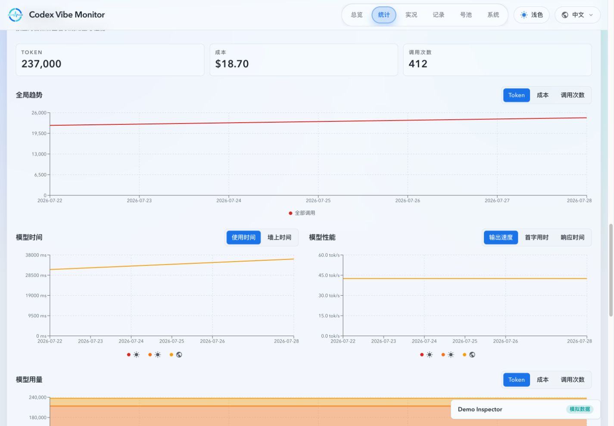
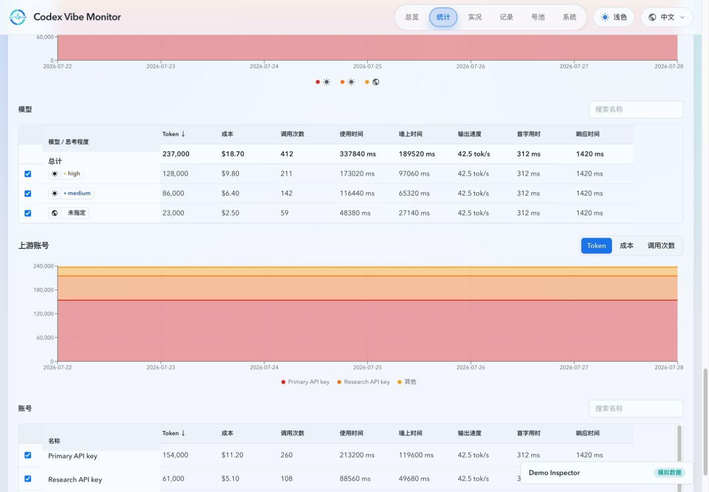
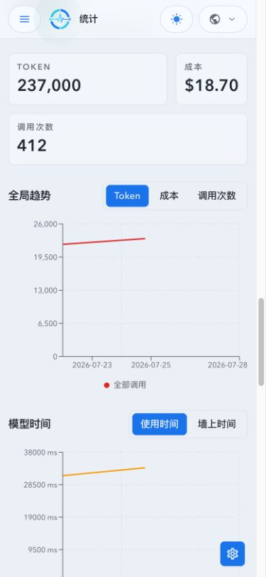
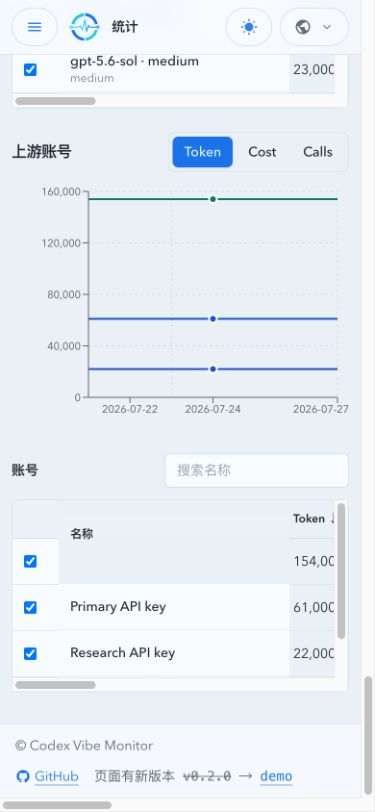

# Stats 长期用量与性能统计（#5k89c）

> 当前有效规范以本文为准；实现状态见 `./IMPLEMENTATION.md`，关键演进原因见 `./HISTORY.md`。

## 背景

现有 Stats 页面面向短窗口与实时诊断，无法在调用明细归档后继续提供长期、按自然日的用量和性能趋势。本主题新增一个与现有 Stats 状态完全隔离的长期统计区，使用独立的持久化汇总、API、hooks 和 UI 状态。

## Goals

- 永久保存上海自然日汇总，并以可配置但不低于 366 天的小时汇总承接实时尾部与历史回填。
- 以可恢复、幂等的后台任务重建旧 live/archive 数据；准备完成前只返回进度，不暴露不完整统计。
- 提供全局、模型+思考强度、API Key 上游账号三个层级的总计和每日点，固定 `Asia/Shanghai` 与 `7d/30d/180d/365d` 范围。
- 固化 Token、recorded USD 成本、调用次数、使用时间、墙上时间、输出速度、首字用时和响应时间的样本口径。
- 对 `api_key_codex` 账号实施保留历史身份的软删除；非 API Key 账号保持原删除语义。
- 在 Stats 现有内容之后提供独立长期统计区，支持图表指标切换、搜索、全列排序、最多八项选择和横纵虚拟化。

## Non-goals

- 不改变现有 Stats 范围、bucket、错误分布、并行工作统计、SSE 或既有图表行为。
- 不提供自定义日期范围、小时级前端图表、导出、调用钻取或账号与模型交叉明细。
- 不重新计算历史 recorded cost，也不展示现有模型性能的 TPM/并行数。
- 不为非 API Key 上游单独建行，不提供 API Key 回收站或恢复能力。

## 数据与统计口径

- 新增隔离表 `long_term_usage_hourly`、`long_term_usage_daily` 与回填状态表。每日汇总永久保存；小时汇总由 `LONG_TERM_STATS_HOURLY_RETENTION_DAYS` 控制，默认 400 天，配置小于 366 天时按 366 天处理。
- 每条调用分别贡献 `overall`、`model`、`upstream` 维度。模型归属优先级为 `responseModel -> legacy model -> requestModel -> 未知模型`，并继续按 reasoning effort 分组。
- 调用次数统计所有已归属调用；Token/成本只汇总存在记录值的样本；性能只统计成功且对应耗时有效的样本并携带各自样本数。
- 使用时间为有效调用耗时之和；墙上时间为同一模型+思考强度跨账号区间并集，按小时切片去重；输出速度为输出 Token 除以流式时长；首字用时为请求到首字；响应时间为首字到流结束。
- 上游维度中每个 `api_key_codex` 独立成行；OAuth、未绑定、direct、无法识别旧账号统一归入“其他”。
- 统计起始日期为能够连续重建全部请求指标的最早上海自然日；范围请求在该日期之前整体截断。

## API 合同

### `GET /api/stats/long-term/overview?range=7d|30d|180d|365d`

返回 `status`（`preparing|ready|empty|error`）、`statisticsStartDate`、`timezone=Asia/Shanghai`、规范化范围、全局总计/每日点、模型摘要和上游摘要。每个模型/账号摘要包含稳定的 `seriesKey`，并携带指标值与各自样本数；无样本指标序列化为 `null`。

### `GET /api/stats/long-term/series?range=...&dimension=model|upstream&key=...`

`key` 必须来自同一 overview 且一次最多 8 个稳定 key。返回所选对象在范围内完整每日序列，无数据日期补零；非法 range、dimension、key 或超过上限返回 `400`。读路径只使用长期汇总与当日精确 tail，不扫描全年明细或 archive。

## UI 合同

- 长期区默认 `7d`，页面可见时每 60 秒轻量刷新，拥有独立的 range、selection、排序、搜索和错误状态。
- 全局使用 KPI 与单指标折线图；模型分为时间、性能、用量三组图，账号使用 Token/成本/调用次数单图。模型用量和上游账号图在三个用量指标下均使用绝对值堆叠面积，面积层、图例和 tooltip 按 overview 业务顺序稳定排列。
- 堆叠图以 `overview.daily` 的完整后端日期窗口为规范日历；每个选中系列在每一天都输出数值，缺失 point 与已有 point 的 `null` 指标均按 `0` 绘制并计入当日总计。孤立前端状态未提供规范日历时，以系列首末日期生成连续自然日；tooltip 显示日期、各选中系列和当日总计；仍限制最多八项选择。
- 模型与账号表格支持名称搜索、所有指标排序、sticky 选择/名称列、横纵双向虚拟化；模型表表头下固定显示不受搜索和滚动影响的全量“总计”行。模型身份表头为“模型 / 思考程度”，复用 `ModelPerformanceModelIdentity`，保留左侧复选框控制图表系列，模型行约 `40px`；上游账号表身份样式与行高保持不变。
- 必须覆盖 loading、preparing、ready、empty、error、长名称、大账号集、桌面和移动端 Storybook 状态；整页视觉证据来自 mock-only `ui_demo`。

## 关联主题

- `9aucy`：数据分层保留、离线归档与长周期汇总。
- `z9h7v`：请求日志可观测性增强（IP / Cache Tokens / 分阶段耗时 / Prompt Cache Key）。

## 验收标准

- 后端 SQLite 测试覆盖自然日窗口、模型回退、reasoning 分组、“其他”、null 样本、加权速度/平均耗时、墙时跨账号跨小时去重、回填幂等与起始日期截断。
- 软删除测试证明凭据和路由状态清除、账号池隐藏、历史 ID/名称仍可统计，非 API Key 删除无回归。
- API 测试覆盖 overview/series 对账、无数据补零、八项限制、非法参数 400、一年查询不读 archive。
- 前端测试覆盖 60 秒刷新、范围选择保留、搜索/全列排序/虚拟化、堆叠图跨数据岛的连续日期域、缺失日期与 `null` 的零值语义、tooltip 总计、固定总计行、模型身份状态及 loading/preparing/empty/error/窄屏不重叠。
- 通过 Rust、Vitest、Storybook、生产构建和 demo 构建质量门禁，并在本 Spec 的 `## Visual Evidence` 记录桌面/移动视觉证据。

## Visual Evidence

- Storybook 覆盖=通过（`bun run test-storybook`：11 files / 20 tests passed）。
- 视觉证据目标源=`ui_demo`；视觉证据=存在；空白裁剪=无需裁剪（页面边缘背景不满足安全裁剪阈值）；聊天回图=待本次收口回传；证据落盘=已落盘。
- 证据绑定 SHA=`b5648597`；来源为 mock-only `demo:dev`，覆盖桌面与 `390px` 移动端。
- PR: include
- 桌面长期统计图（全局折线、模型用量与上游账号堆叠面积）：
  
- PR: include
- 桌面模型表（固定总计行、模型图标与思考程度胶囊）：
  
- PR: include
- `390px` 移动端长期统计图：
  
- PR: include
- `390px` 移动端模型表与上游堆叠图：
  
- 截图来源为 mock-only `ui_demo`，不含敏感信息；推送包含截图文件前需取得主人明确授权。
