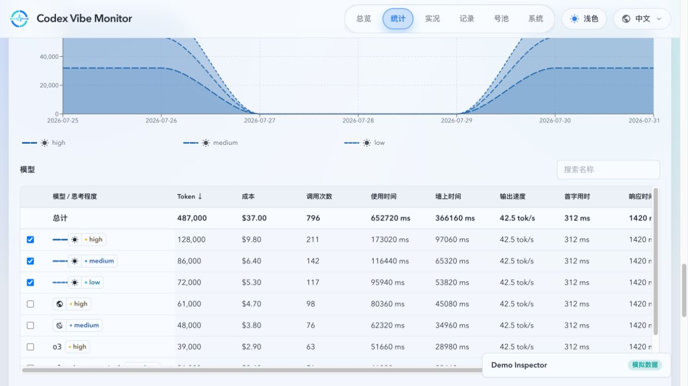
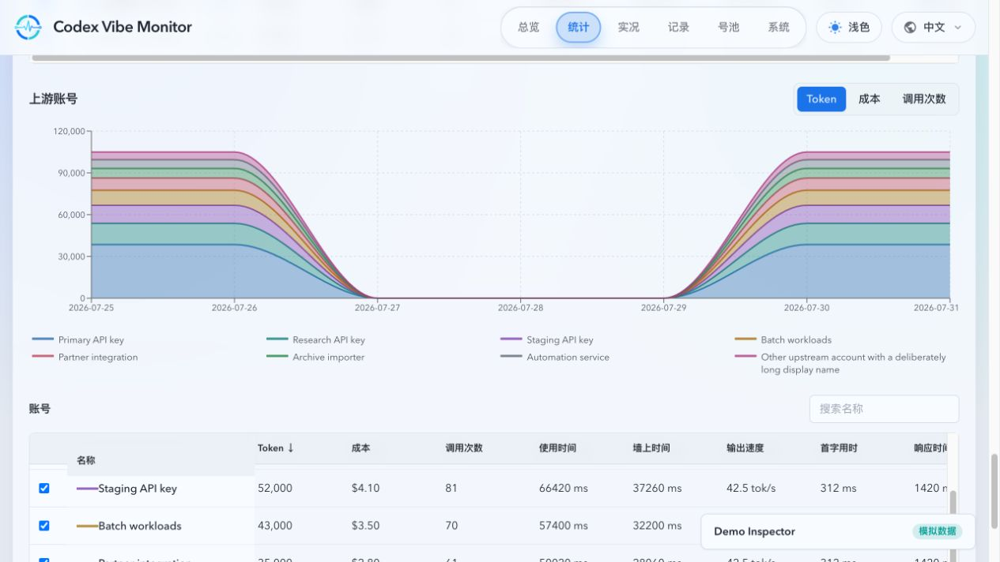
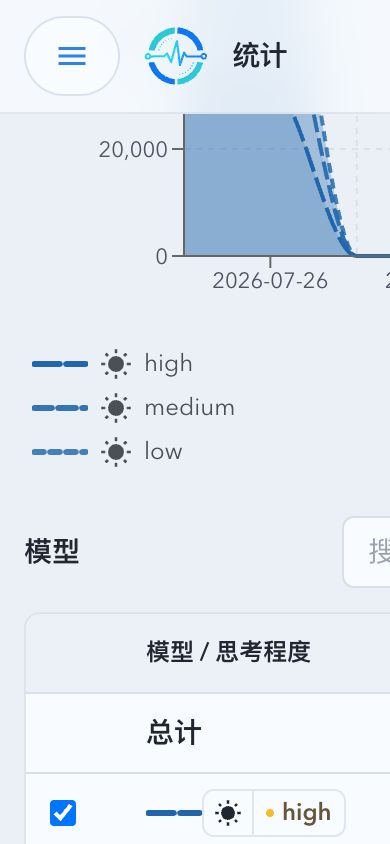
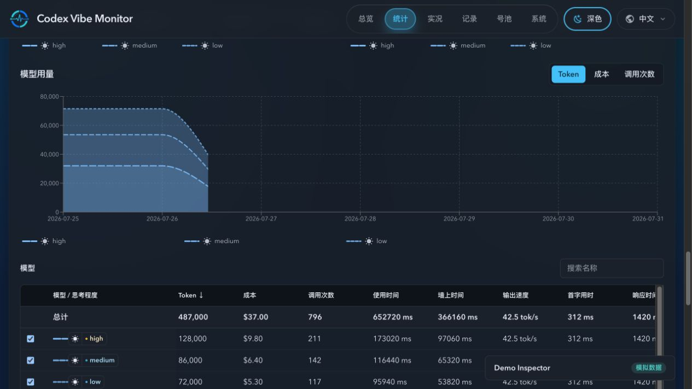
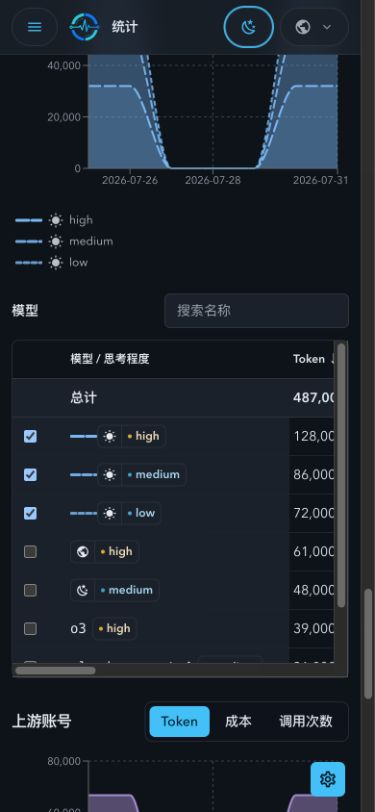

# Stats 长期用量与性能统计（#5k89c）

长期统计接收 TerminalProjectionHub 的 durable cursor mutation，不消费完整 `ApiInvocation` 广播。历史 repair/backfill 由来源恢复、归档重写和 coverage 事件唤醒；无 actionable work 时不运行周期性全窗扫描。

> 当前有效规范以本文为准；实现状态见 `./IMPLEMENTATION.md`，关键演进原因见 `./HISTORY.md`。

## 背景

现有 Stats 页面面向短窗口与实时诊断，无法在调用明细归档后继续提供长期、按自然日的用量和性能趋势。本主题新增一个与现有 Stats 状态完全隔离的长期统计区，使用独立的持久化汇总、API、hooks 和 UI 状态。

## Goals

- 永久保存上海自然日汇总，并以可配置但不低于 366 天的小时汇总承接实时尾部与历史回填。
- 以可恢复、幂等的后台任务重建旧 live/archive 数据；准备完成前只返回进度，不暴露不完整统计。
- 正常 terminal finalize 通过 projection cursor 增量更新热桶；自然日 raw rebuild 仅用于价格、归属、时间或 archive 等明确修正，并且只覆盖受影响日期。
- 已持久化的完整日/小时统计不得被部分 live 或 archive 重建覆盖；历史异常必须可自动发现、验证并原子修复。
- 提供全局、模型+思考强度、API Key 上游账号三个层级的总计和每日点，固定 `Asia/Shanghai` 与 `7d/30d/180d/365d` 范围。
- 固化 Token、recorded USD 成本、调用次数、使用时间、墙上时间、输出速度、首字用时和响应时间的样本口径。
- 对 `api_key_codex` 账号实施保留历史身份的软删除；非 API Key 账号保持原删除语义。
- 在 Stats 现有内容之后提供独立长期统计区，支持图表指标切换、搜索、全列排序、最多八项选择和横纵虚拟化。

## Non-goals

- 不改变现有 Stats 范围、bucket、错误分布、并行工作统计、SSE 或既有图表行为。
- 不提供自定义日期范围、小时级前端图表、导出、调用钻取或账号与模型交叉明细。
- 不重新计算历史 recorded cost，也不展示现有模型性能的 TPM/并行数。
- 不为非 API Key 上游单独建行，不提供 API Key 回收站或恢复能力。

## 数据与统计口径

- 新增隔离表 `long_term_usage_hourly`、`long_term_usage_daily`、回填状态表与完整性修复队列。每日汇总永久保存；小时汇总由 `LONG_TERM_STATS_HOURLY_RETENTION_DAYS` 控制，默认 400 天，配置小于 366 天时按 366 天处理。
- 每条调用分别贡献 `overall`、`model`、`upstream` 维度。模型归属优先级为 `responseModel -> legacy model -> requestModel -> 未知模型`，并继续按 reasoning effort 分组。
- 调用次数统计所有已归属调用；Token/成本只汇总存在记录值的样本；性能只统计成功且对应耗时有效的样本并携带各自样本数。
- 使用时间为有效调用耗时之和；墙上时间为同一模型+思考强度跨账号区间并集，按小时切片去重；输出速度为输出 Token 除以流式时长；首字用时为请求到首字；响应时间为首字到流结束。
- 上游维度中每个 `api_key_codex` 独立成行；OAuth、未绑定、direct、无法识别旧账号统一归入“其他”。
- 统计起始日期为能够连续重建全部请求指标的最早上海自然日；范围请求在该日期之前整体截断。
- 墙时区间的 durable state 每个调用只保存一条 canonical interval，读取或更新 rollup 时才派生 `overall`、`model`、`upstream` 的日/小时并集；不得将同一区间持久化为维度和粒度的重复展开。旧展开 state 在兼容期保持可读，且只有 canonical state 已提交后才可渐进清理。
- interval state 写入、日期重建替换、保留期删除、compatibility cleanup、publication/backup cleanup 与全量 refresh rollup 替换均按至多 `512` 行的短事务推进。每个事务开始前重新接受低优先级写入准入，并在压力或 shutdown 时停在已提交批次、保留 dirty marker 和 last-good rollup；单次 maintenance 最多提交一个写批次，剩余 legacy/retention/publication 状态由持久 backlog 在独立 ticker deadline 续跑，持续 terminal work 不得饿死它，terminal deadline 不得借此追赶历史清理。targeted date repair 与 daily verification 不属于该 maintenance backlog：它们可在独立 repair deadline 内顺序推进多个 `512` 行以下的 rebuild 事务，但每个边界都必须重新接受 pressure/cancel，且只在完整 target 发布后推进 cursor 或清除 dirty marker。单次 projection flush 内同一上海日期的 interval union 仅在首次微批从 SQLite 装载，后续微批复用并增量扩展该 cache。日期替换在首个 live daily 写入前必须原子切换到持久 last-good snapshot，直到完整新日发布。已有 `ready` 汇总的 bounded refresh 必须通过该 snapshot 继续公开完整旧日，而不是改为返回空统计；首次全量物化只由专用 refresher 执行，terminal projection worker 不得绕过该准入路径；持久 `error` 或初始 incomplete marker 即使已有部分日汇总也必须保留为可重试的首次物化。不得为了追赶积压延长写锁或推进未完成 cursor。
- 每日 verification 以持久 pending marker 和目标上海自然日只入队一次；只有该目标日对应 repair 已清除 dirty、渐进 retention 已耗尽且状态写入成功后才清除 marker 并持久化完成时间。跨日完成旧目标不得把当日标为已验证，当日必须保持 due 并独立入队。pressure 或 cancel 拒绝不会消耗该重试资格。legacy interval fallback 必须尊重日期 rebuild 写入的 suppression，不能在 canonical state 清理后重新引入已移除调用。
- 目标自然日读取对标准上海 `occurred_at` 文本使用半开范围 seek；RFC3339 与其他历史格式走独立兼容分支并按真实 epoch 校验。跨日调用仍必须进入目标日重建，且兼容分支不得改变 archive replay、Summary 或公开 API 语义。
- `invocation_rollup_hourly` 仅作为 overall 调用次数、Token 与成本的完整性证明；其中全量字段服务于运营汇总，`terminal_count`、`terminal_tokens`、`terminal_cost` 与长期统计相同地排除 `running`/`pending` 调用。每次有界 live/archive 增量写入都必须将 `terminal_proof_complete` 保持为 `0`。所有已完成调用 archive 均可读取时，完整 live/archive 扫描是可重建窗口内 canonical 的权威来源：扫描值与既有桶不一致时必须原子回写全量字段并恢复证明；扫描不再包含的既有 canonical 桶必须删除并按上海日期重建长期汇总，必要时以已验证的空结果替换。全局来源下界之前已验证但故意退役的桶不参与该删除。首次全量物化在每个 retained live/archive source 均已读完、没有不可读 archive 或 reconciliation failure、且候选日期不早于持久来源下界时，可将该完整快照作为 bootstrap evidence，即使 canonical hourly proof 尚未生成；发布后才允许为扫描期间保持稳定、且在同一写事务中仍与 manifest 匹配同一 SHA-256 的 archive 写入 replay marker 并进入既有清理门禁。除此以外，任一 archive 缺失或不可读、对账必需的源表/列缺失、或候选无法同时通过日级和小时级终态证明时，才必须撤销下界当日及之后的证明、保留已有长期统计并进入既有 `error`/repair queue；不得以剩余来源认证局部数据，也绝不能把默认零值视为真实空值。每小时审计即使所有桶当前均已认证，也必须重新核验来源；证明撤销必须先持久化为 `error`，同一轮后续读取失败不得恢复为 `ready`，并在每次后续刷新完整重试。`overall`、`model`、`upstream` 明细仍只从 live/可读 archive 调用记录重建。
- 后台刷新立即校验触及日期，并每小时扫描当前可连续重建的小时保留窗口。归档物理删除前必须扫描原始调用，按最晚实际墙时终点计算独立的完整性来源下界；每条参与边界计算的调用及请求尝试映射到的调用来源都必须解析为有效终点，任一无效、无法读取或无法匹配的行都保留归档。旧 archive 缺失可选 `invoke_id` 或来源时间列时按 `NULL` 兼容读取；canonical 终态证明重放缺失任意可选调用字段（包括全部时间列）时也必须按 `NULL` 读取，缺失 `detail_level` 时按 `full` 处理，不得把可验证的历史归档永久阻塞在清理前或误判为不可读覆盖。删除分两阶段：先在一个 SQLite 事务中将 `cleanup_state` 设为 `delete_pending`，并在 manifest 持久化候选来源下界，归档仍维持 `completed` 可读；只有文件删除成功或确认不存在后，才在最终 `BEGIN IMMEDIATE` 事务中推进全局来源下界并删除相关元数据。全局下界之前的 canonical 小时桶是已验证但不可再重建的历史证明，来源对账不得因其不再出现于 live/archive 扫描而撤销终态证明；只有下界当日及之后的桶参与缺失或矛盾失效。文件删除或元数据清理失败必须留下 `delete_pending` 供后续重试，不得丢失 manifest 或提前缩窄可重建范围。未曾进入 `delete_pending` 的已缺失调用 archive 一律视为来源丢失并保留 manifest；即使旧 replay marker 仍在也不得仅据此收尾。来源对账发现不可读 archive 时必须先清除该 archive 的长期 replay marker，以便同身份的修复文件在下一次刷新被重新读取；在来源可重新读取并完整验证前，保持 `error` 且不得从 manifest 覆盖范围猜测新的来源下界。暂时不可读的调用归档不得以覆盖日期推断时长上界：已知 `coverage_start` 时阻断该日及之后的候选 UPSERT；缺失 `coverage_start` 时从整个保留窗口下界阻断，保留现有行并进入既有 `error`/重试合同。没有任何 canonical 终态指标的日期（包括只含 `running`/`pending` 的桶）是该日应为空的完整性证明，但仅携带零调用、零 Token、零成本的墙时续段不构成残留；含未证明小时桶的日期必须跳过审计和替换。审计必须同时发现任一维度的非零日级或小时级残留，并在验证后原子清空全部维度。检测到差异后只在每轮重建一个队列日期；无法证明完整时保留旧行，若尚无旧行则保留空结果，并在可重建修复队列清空前持续维持既有 `error` 状态，以 `1m/5m/15m/60m` 持久化退避重试。
- 归档删除的阶段化和收尾都必须绑定同一个 `id`、dataset、路径、SHA-256 与 `delete_pending` 身份。收尾在 SQLite `BEGIN IMMEDIATE` 事务中再次验证文件哈希；旧月度归档写入必须在同一 `BEGIN IMMEDIATE` 区间内撤销待删除状态并替换文件。因而重写先于收尾时保留新文件和新 manifest，收尾先于重写时写入随后可安全创建新的 manifest。
- 完整性对账、targeted date repair、全量 rebuild 与请求尝试 attribution 读取 completed archive 前后都必须验证文件 SHA-256 与当前 manifest 一致；可读但哈希不一致的文件同样是不可用来源，不得更新 attribution、发布 rollup 或写入 replay marker。来源安全下界仅可跨越连续已退役前缀推进：若仍保留的调用或请求尝试 archive 可能覆盖候选日期之前，候选边界必须持久化等待，直到连续条件成立后再原子发布。

## API 合同

### `GET /api/stats/long-term/overview?range=7d|30d|180d|365d`

返回 `status`（`preparing|ready|empty|error`）、`statisticsStartDate`、`timezone=Asia/Shanghai`、规范化范围、全局总计/每日点、模型摘要和上游摘要。每个模型/账号摘要包含稳定的 `seriesKey`，并携带指标值与各自样本数；无样本指标序列化为 `null`。

### `GET /api/stats/long-term/series?range=...&dimension=model|upstream&key=...`

`key` 必须来自同一 overview 且一次最多 8 个稳定 key。返回所选对象在范围内完整每日序列，无数据日期补零；非法 range、dimension、key 或超过上限返回 `400`。读路径只使用长期汇总与当日精确 tail，不扫描全年明细或 archive。

## UI 合同

- 长期区默认 `7d`，页面可见时每 60 秒轻量刷新，拥有独立的 range、selection、排序、搜索和错误状态。
- 全局使用 KPI 与单指标折线图；模型分为时间、性能、用量三组图，账号使用 Token/成本/调用次数单图。全局图的序列名、图例和 tooltip 必须随选择指标明确显示“总 Token”“总成本”或“总调用次数”，不得以“全部调用”泛化其数值含义。模型用量和上游账号图在三个用量指标下均使用绝对值堆叠面积，面积层、图例和 tooltip 按 overview 业务顺序稳定排列。
- 堆叠图以 `overview.daily` 的完整后端日期窗口为规范日历；每个选中系列在每一天都输出数值，缺失 point 与已有 point 的 `null` 指标均按 `0` 绘制并计入当日总计。孤立前端状态未提供规范日历时，以系列首末日期生成连续自然日；tooltip 显示日期、各选中系列和当日总计；仍限制最多八项选择。
- 模型时间、性能、用量及上游账号用量四张长期多序列图共享 `seriesKey -> LongTermSeriesVisual` 映射。规范化完整模型名决定模型家族主色；同模型的思考程度通过完整文字、明暗和固定线型共同编码。上游账号按稳定账号序列独立分配主色。当前可见集合包含至多八个不同模型家族或账号时，主色不得重复；排序、数据刷新和指标切换不得改变未变更选择集合的映射。
- 长期多序列图例不使用 Recharts 默认 payload；每项必须显示线型色标及模型思考程度。可识别模型以图标取代重复的可见模型名，悬浮图例可得完整模型名和思考程度；无图标模型与上游账号继续显示完整名称，长名称换行而不以省略号替代身份。图例的色标、图标与文字垂直居中对齐。tooltip 与表中已选行使用同一映射，tooltip 的模型名同样包含思考程度。
- 模型与账号表格支持名称搜索、所有指标排序、sticky 选择/名称列、横纵双向虚拟化；模型表表头下固定显示不受搜索和滚动影响的全量“总计”行。模型身份表头为“模型 / 思考程度”，复用 `ModelPerformanceModelIdentity`，保留左侧复选框控制图表系列，模型行约 `40px`；已有图标的模型不重复显示名称，悬浮图标可得完整模型名；无图标模型显示名称。上游账号表身份样式与行高保持不变。
- 冻结选择/身份列与指标列共用同一块级行栅格；表头、总计行和虚拟数据行的文字必须在同一垂直基线上，横向滚动不得使身份列脱离对应行。
- 必须覆盖 loading、preparing、ready、empty、error、长名称、大账号集、桌面和移动端 Storybook 状态；整页视觉证据来自 mock-only `ui_demo`。

## 关联主题

- `9aucy`：数据分层保留、离线归档与长周期汇总。
- `z9h7v`：请求日志可观测性增强（IP / Cache Tokens / 分阶段耗时 / Prompt Cache Key）。

## 验收标准

- 后端 SQLite 测试覆盖自然日窗口、模型回退、reasoning 分组、“其他”、null 样本、加权速度/平均耗时、墙时跨账号跨小时去重、回填幂等与起始日期截断。
- 后端 SQLite 测试覆盖 canonical interval 行数不随三维日/小时展开而倍增、每个 interval state 写事务不超过 `512` 行、pressure 与 shutdown 在批次边界停止并保留 dirty work、兼容 state 的渐进清理、持久数据库重开后的 cursor/interval 恢复，以及生产 `occurred_at` 索引的 `EXPLAIN` 范围计划与 RFC3339 回退结果。
- 后端 SQLite 测试覆盖部分候选不能覆盖完整行、终态证明不受活跃调用污染、有界增量在完整来源对账前保持未证明、完整来源对矛盾 canonical 桶的原子回写与来源缺失桶的删除重建、首次完整 source snapshot 在 canonical hourly proof 尚未生成时的 bootstrap 发布与 archive 清理 replay marker、旧 schema 升级时 retired canonical 历史的保留及所有 `ALTER TABLE` 完成后中断的续跑、archive/live 扫描的同一 SQLite 快照、已认证 archive 随后丢失时的小时审计降级、缺失调用或请求尝试 archive 时保留 manifest 作为不可用来源证据、缺失 archive 触发 `error` 后的清理收尾、旧 archive 缺少可选时间字段时的 canonical 证明重放、覆盖起点缺失的不可读 archive 全窗口阻断、旧 canonical 桶在源数据不完整时保持未证明、历史日/小时完整性审计与自动修复、canonical 零日清空任一非零维度残留、跨午夜墙时续段、修复日期扩展至前一日后对请求尝试 archive 的完整范围验证、不可读归档阻断候选发布、归档删除失败后的持久化重试和元数据事务回滚、源数据不足时保留旧值并以持久化退避持续暴露 `error`、补齐源数据后的恢复，以及 SQLite `BUSY/LOCKED` 有界重试。
- 后端 SQLite 测试覆盖 archive 在长期扫描后、replay marker 持久化前被重写时的 SHA-256 身份绑定：扫描旧文件不得认证新 manifest，且只有与当前 manifest 匹配的扫描身份可进入清理门禁。同一覆盖也验证有效请求尝试 archive 在持有 stale manifest 时必须被拒绝，仅在 manifest 更新为实际 SHA-256 后可供 attribution 使用。
- 软删除测试证明凭据和路由状态清除、账号池隐藏、历史 ID/名称仍可统计，非 API Key 删除无回归。
- API 测试覆盖 overview/series 对账、无数据补零、八项限制、非法参数 400、一年查询不读 archive。
- 前端测试覆盖 60 秒刷新、范围选择保留、全局趋势 Token/成本/调用次数的指标化标签、搜索/全列排序/虚拟化、堆叠图跨数据岛的连续日期域、缺失日期与 `null` 的零值语义、tooltip 总计、固定总计行、模型身份状态及 loading/preparing/empty/error/窄屏不重叠，以及八个模型家族/账号的唯一主色、同模型思考程度样式和顺序无关的稳定映射。
- 通过 Rust、Vitest、Storybook、生产构建和 demo 构建质量门禁，并在本 Spec 的 `## Visual Evidence` 记录桌面/移动视觉证据。

## Visual Evidence

- Storybook 覆盖=通过（`SeriesIdentity` 高密度模型/账号状态与 play 覆盖）；视觉证据目标源=`ui_demo`；视觉证据=存在；空白裁剪=无需裁剪（页面边缘背景不满足安全裁剪阈值）；聊天回图=已回传；证据落盘=已落盘。
- 来源为 mock-only `demo:dev`，覆盖亮色/深色桌面与 `390px` 移动端的八项模型/账号多序列状态。
- 浅色桌面模型用量：已识别模型在图例和表格中仅显示色标、图标与思考程度；完整模型名通过悬浮提示提供，三者垂直居中。同模型的思考程度以固定线型区分；异模型家族使用不同主色。
  PR: include
  
- 桌面上游账号用量：八个账号的主色唯一，长账号名称换行保留身份。
  
- 浅色 `390px` 移动端模型用量：已识别模型在窄屏图例和表格中以色标、图标和思考程度持续可辨，完整模型名通过悬浮提示提供。
  PR: include
  
- 深色桌面模型用量：图、图例与已选表格行处于同一截图范围；图例和表格中的已识别模型均以图标取代重复名称，完整模型名通过悬浮提示提供，色标、图标与等级文字垂直居中。
  PR: include
  
- 深色 `390px` 移动端模型图例：已识别模型以色标、图标和思考程度纵向排列，表格延续图标优先身份显示；无图标模型与上游账号仍以长名称换行保留身份。
  PR: include
  

## Memory Attribution Boundary

- 长期统计的 interval index、flush staging 和修复操作必须提供无克隆的 retained/peak 观测；观测不得触发额外 raw scan 或改变 60 秒 projection cadence。
- `managed_bytes` 只表示已知容器的保守估算，不代表 allocator 实际 arena。`unattributed_anon_bytes` 必须保留为独立分类，用于区分 interval index、临时 flush 对象与 SQLite/allocator 的未知占用。
- 观测窗口结束前不清空长期汇总、不降低统计精度、不减少并发。只有组件 p95 常驻量达到 RSS 的 40% 且连续三个采样存在，或单次操作的 `VmHWM` 增量达到 512 MiB 且 5 分钟后 RSS 未回落至少 25%，才进入单独的无损优化计划。
