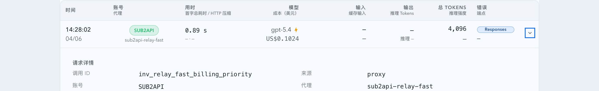
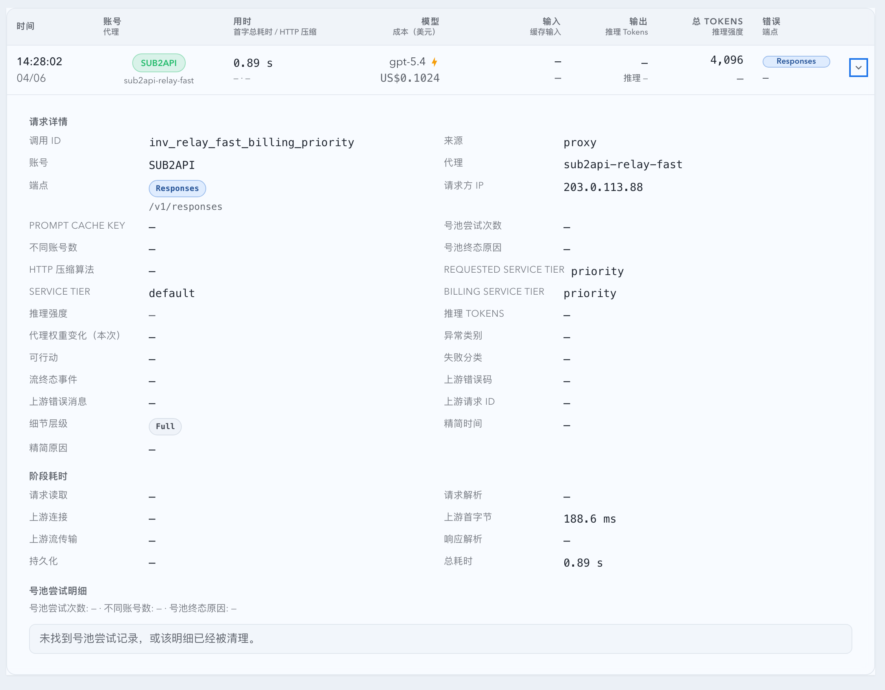

# 第三方 relay Fast 计费识别修复（#5v5yf）

## 状态

- Status: 已实现，待截图提交授权 / PR 收敛
- Created: 2026-04-06
- Last: 2026-04-06

## 背景 / 问题陈述

- 当前 proxy 请求链路已经同时采集请求侧 `requestedServiceTier` 与响应侧 `serviceTier`，但第三方 relay 存在“响应 tier 保真值不等于实际计费 tier”的情况。
- 已取证样本 `proxy-576-1775456882565` 的上游 stream 终态为 `service_tier=default`，系统却把早期 `auto` 锁死并最终按 standard 价目计费，导致列表闪电状态与金额同时错误。
- 现有成本估算只依赖模型、usage 与 catalog 版本，不会读取任何 tier 相关信息，因此无法表达 relay 家族的 fast 计费例外。

## 目标 / 非目标

### Goals

- 修正 SSE `service_tier` 解析优先级：`response.completed/failed` 的终态 tier 必须覆盖早期 `response.created/in_progress` 的 `auto`。
- 保留 `serviceTier` 继续表示“上游实际响应 tier 真值”，新增 `billingServiceTier?: string` 单独表达计费 tier。
- 为已取证 relay 家族 `api_key_codex + sub2api.nsngc.org + requestedServiceTier=priority` 导出 `billingServiceTier=priority`，并让成本估算切到 relay-aware 价目版本。
- 让 `/api/invocations`、SSE record、详情视图与 Fast 指示器统一消费 `billingServiceTier`，避免把“请求想要 Fast 但响应未命中”误显示成仅 requested-only。
- 启动回填同时修复历史 `serviceTier` 终态解析错误与 relay 样本的 `billingServiceTier / cost / priceVersion`。

### Non-goals

- 不把所有 `requestedServiceTier=priority` 全局视为 Fast 计费。
- 不改变 OAuth / OpenAI 直连语义；这些来源仍以响应 `service_tier` 为唯一 truth source。
- 不新增新的 SQLite 列；继续复用 payload JSON 与现有 `cost / price_version` 字段。
- 不接入外部账单 API，也不把 relay 例外扩散到未取证主机。

## 范围（Scope）

### In scope

- `src/proxy.rs`
- `src/maintenance/startup_backfill.rs`
- `src/api/mod.rs`
- `src/upstream_accounts/mod.rs`
- `src/tests/mod.rs`
- `web/src/lib/api.ts`
- `web/src/lib/invocation.ts`
- `web/src/lib/invocationLiveMerge.ts`
- `web/src/lib/promptCacheLive.ts`
- `web/src/components/InvocationTable.tsx`
- `web/src/components/InvocationRecordsTable.tsx`
- `web/src/components/invocation-details-shared.tsx`
- `web/src/components/InvocationTable.stories.tsx`
- `web/src/components/invocationRecordsStoryFixtures.ts`
- `web/src/components/InvocationTable.test.tsx`
- `web/src/components/InvocationRecordsTable.test.tsx`
- `web/src/i18n/translations.ts`
- `docs/specs/README.md`
- `docs/specs/5v5yf-relay-fast-billing-recognition/SPEC.md`

### Out of scope

- relay 例外规则的自动发现、配置化编辑或多主机扩展。
- 新的 tier 统计图表、筛选器或单独的数据库 schema 演进。
- 101 服务器上的手工 SQL 修补或一次性运维脚本。

## 需求（Requirements）

### MUST

- stream 事件在先返回 `auto`、后返回 `default/priority/flex` 时，最终 `serviceTier` 必须采用终态值，不得保留早期 `auto`。
- `billingServiceTier` 默认沿用响应 `serviceTier`，仅当请求满足 `requestedServiceTier=priority` 且上游账号为 `kind=api_key_codex`、`upstream_base_url.host=sub2api.nsngc.org` 时，才提升为 `priority`。
- `serviceTier` 与 `billingServiceTier` 不能混写：前者表示上游响应真值，后者表示计费真值。
- proxy 成本估算必须按 `billingServiceTier` 选择 pricing mode；命中 relay 例外时，`price_version` 必须写入新的 relay-aware 版本串，与旧 standard 记录可区分。
- `/api/invocations`、`events` SSE `records`、Prompt Cache 预览与 Sticky invocation preview 均需暴露 `billingServiceTier?: string`。
- 列表 Fast 图标判定必须改为优先依据 `billingServiceTier`：当 `billingServiceTier === 'priority'` 时视为 `effective`；仅 `requestedServiceTier === 'priority' && billingServiceTier !== 'priority'` 时才显示 `requested_only`。
- 请求详情必须同时展示 `Requested service tier`、`Service tier`、`Billing service tier`。
- 启动回填必须覆盖“缺失”与“已存在但错误”的 proxy 样本：重新解析 `serviceTier`，并在 relay 命中时重算 `billingServiceTier / cost / priceVersion`。

### SHOULD

- relay-aware 价目版本应保持 deterministic 命名，便于后续 backfill version 失效与重新估算。
- Storybook 提供稳定的 relay Fast 计费场景，并在 `play` 中断言详情区三层 tier 同时可见。
- 前端 live merge / preview merge 逻辑应把 `billingServiceTier` 视为与 `serviceTier` 同等级的重要字段，避免首屏与增量数据互相覆盖丢失。

## 接口契约

| 接口（Name）                         | 类型（Kind）         | 范围（Scope） | 变更（Change） | 负责人（Owner） | 使用方（Consumers） | 备注（Notes） |
| ------------------------------------ | -------------------- | ------------- | -------------- | --------------- | ------------------- | ------------- |
| `GET /api/invocations` record object | HTTP API             | internal      | Modify         | backend         | web dashboard/live  | 新增 `billingServiceTier?: string` |
| `events` SSE `records` payload       | Event                | internal      | Modify         | backend         | web dashboard/live  | 与 HTTP 列表同构新增 `billingServiceTier` |
| Prompt Cache invocation preview      | HTTP API             | internal      | Modify         | backend         | web prompt-cache    | 新增 `billingServiceTier?: string` |
| Sticky invocation preview            | HTTP API             | internal      | Modify         | backend         | web account detail  | 新增 `billingServiceTier?: string` |
| `ApiInvocation`                      | TypeScript interface | internal      | Modify         | web             | InvocationTable     | 新增 `billingServiceTier?: string` |

## 功能与行为规格

### Core flows

- proxy stream 写入 payload 时，会扫描每条 SSE 事件中的 `service_tier`，并使用“终态优先”规则确定最终 `serviceTier`。
- proxy 请求完成或失败后，系统会结合 `requestedServiceTier`、上游账号 kind 与 `upstream_base_url` host 推导 `billingServiceTier` 与 pricing mode。
- 当 relay 例外命中时：
  - `serviceTier` 继续保留响应真值，例如 `default`；
  - `billingServiceTier` 写为 `priority`；
  - `priceVersion` 切换为 `openai-standard-2026-02-23+relay-fast-billing-v1` 这一类 relay-aware 版本；
  - 成本估算按 relay Fast 规则而不是旧 standard 结果。
- `/api/invocations` 首屏、SSE 增量记录、Prompt Cache 预览与 Sticky preview 都会暴露 `billingServiceTier`，前端统一以该字段作为 effective Fast 的判定依据。
- 启动回填会扫描历史 proxy 记录：若 payload 中的 `serviceTier` 或 `billingServiceTier / priceVersion / cost` 与当前规则不一致，则重写为最新规则输出。

### Edge cases / errors

- 非 `sub2api.nsngc.org` 的请求即使 `requestedServiceTier=priority`，也不得因为 heuristic 被错误提升为 `billingServiceTier=priority`。
- 当 relay 上游实际响应 `serviceTier=priority` 时，`billingServiceTier` 仍可直接保留 `priority`，不会被额外改写成其它值。
- 缺失 raw 文件、非法 JSON、无法恢复 usage 的历史记录只能跳过，不得阻断启动。
- relay-aware 价格规则只影响 proxy 成本估算，不影响非 proxy 来源或不带成本的记录。

## 验收标准（Acceptance Criteria）

- Given stream 依次返回 `response.created.service_tier=auto`、`response.in_progress.service_tier=auto`、`response.completed.service_tier=default`，When 请求落库或回填，Then `serviceTier` 为 `default` 且不会残留 `auto`。
- Given `kind=api_key_codex`、`upstream_base_url.host=sub2api.nsngc.org`、`requestedServiceTier=priority` 且响应 `serviceTier=default/auto`，When 导出 invocation，Then 同时满足 `serviceTier` 保真、`billingServiceTier=priority`、`cost` 不再沿用旧 standard 结果、`priceVersion` 切到 relay-aware 版本。
- Given 非 `sub2api.nsngc.org` 的请求，When `requestedServiceTier=priority` 且响应 `serviceTier=default`，Then `billingServiceTier != priority`。
- Given 类似 `proxy-576-1775456882565` 的历史记录，When 启动回填完成，Then 列表从 `requested_only + standard cost` 变为 `effective fast + relay-aware cost`，详情同时显示 `Requested service tier=priority`、`Service tier=default`、`Billing service tier=priority`。

## 质量门槛（Quality Gates）

- `cargo test parse_target_response_payload_prefers_terminal_stream_service_tier_over_initial_auto -- --test-threads=1`
- `cargo test estimate_proxy_cost_applies_relay_fast_priority_multiplier_and_price_version_suffix -- --test-threads=1`
- `cargo test resolve_proxy_billing_service_tier_and_pricing_mode_detects_relay_fast_priority -- --test-threads=1`
- `cargo test resolve_proxy_billing_service_tier_and_pricing_mode_keeps_response_tier_for_non_relay -- --test-threads=1`
- `cargo test backfill_proxy_missing_costs_reprices_relay_fast_priority_rows -- --test-threads=1`
- `cargo test backfill_invocation_service_tiers_updates_payload_and_is_idempotent -- --test-threads=1`
- `cargo check`
- `cd web && bun x vitest run src/components/InvocationTable.test.tsx src/components/InvocationRecordsTable.test.tsx src/lib/api.test.ts`
- `cd web && bun run build`
- `cd web && bun run build-storybook`

## 里程碑（Milestones）

- [x] M1: 创建 follow-up spec 并冻结 relay Fast 计费语义。
- [x] M2: 后端修正终态 `serviceTier` 解析，补上 `billingServiceTier` / pricing mode / 回填逻辑。
- [x] M3: `/api/invocations`、Prompt Cache / Sticky preview 与前端列表 / 详情接入 `billingServiceTier`。
- [x] M4: 补齐 Rust、Vitest、Storybook 场景与本地构建验证。
- [ ] M5: 快车道推进到 merge-ready，并在获得主人授权后提交视觉证据资产。

## Visual Evidence

- 证据来源：`storybook_canvas`
- 资产目录：`./assets/`
- 目标程序声明：`mock-only`
- 提交门禁：截图文件与 PR 图片引用需在聊天回图后获得主人明确授权。
- 证据绑定要求：若后续继续修改 InvocationTable / detail tier 展示或 Fast 指示器语义，必须重新截图。

- source_type: storybook_canvas
  target_program: mock-only
  capture_scope: browser-viewport
  sensitive_exclusion: N/A
  submission_gate: pending-owner-approval
  story_id_or_title: Monitoring/InvocationTable/RelayFastBillingPriority
  state: summary-and-effective-fast-badge
  evidence_note: 验证 relay 样本在 `requestedServiceTier=priority`、`serviceTier=default` 时仍以 `billingServiceTier=priority` 呈现有效 Fast 闪电，并同步展示 relay-aware 价格版本语义。
  image:
  

- source_type: storybook_canvas
  target_program: mock-only
  capture_scope: browser-viewport
  sensitive_exclusion: N/A
  submission_gate: pending-owner-approval
  story_id_or_title: Monitoring/InvocationTable/RelayFastBillingPriority
  state: expanded-billing-tier-details
  evidence_note: 验证展开详情后同时显示 `Requested service tier=priority`、`Service tier=default` 与 `Billing service tier=priority`，不再把 relay Fast 计费误判成仅 requested-only。
  image:
  

## 风险 / 假设

- 假设：当前唯一已取证、需要 relay Fast 例外的主机是 `sub2api.nsngc.org`，其它 relay 暂不扩散。
- 假设：relay Fast 计费的本地规则以 `kind + host + requestedServiceTier` 为准，足以覆盖当前线上问题样本。
- 风险：若第三方 relay 后续改变计费语义但仍返回 `default/auto`，需要新增新的显式规则或外部账单 truth source。
- 风险：历史记录若缺少 raw 文件或 usage 信息，回填覆盖率会受限，但不应影响新记录的正确性。

## 变更记录（Change log）

- 2026-04-06: 创建 follow-up spec，冻结“响应 tier 保真 + 独立 billing tier + relay-aware 价目版本”的实现口径。
- 2026-04-06: 完成 proxy 终态 `serviceTier` 解析修复、relay Fast 计费识别、启动回填扩展与成本估算升级。
- 2026-04-06: 完成 `/api/invocations`、Prompt Cache / Sticky preview、InvocationTable / details、Storybook 与测试更新；本地 `cargo check`、目标 Rust tests、Vitest、`build`、`build-storybook` 已通过。
