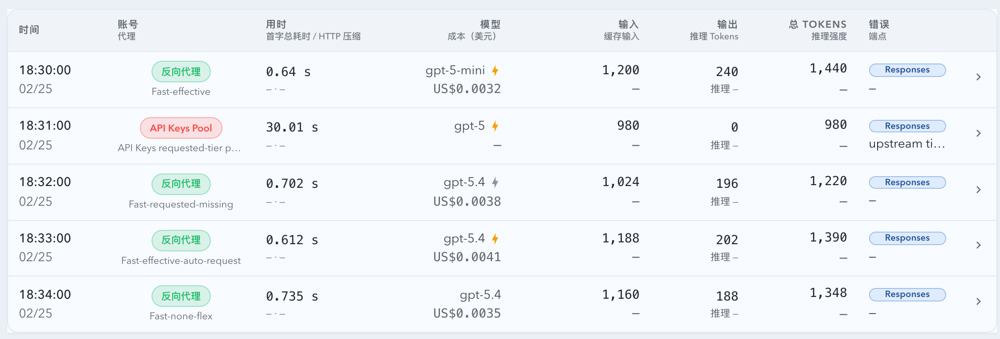
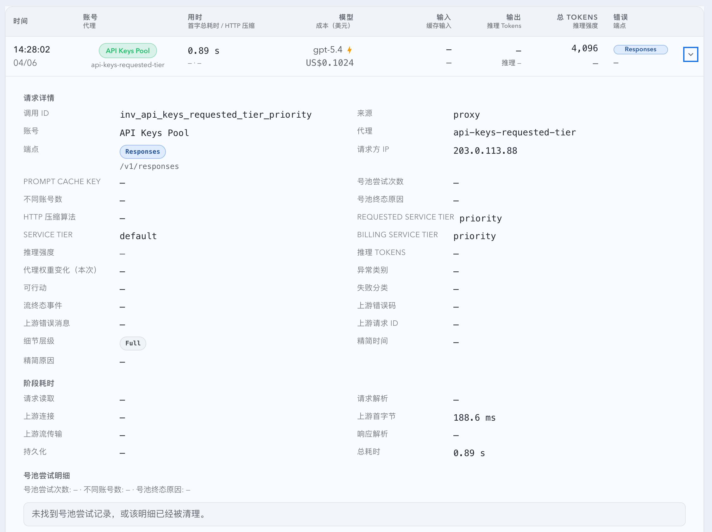

# 通用 API Keys 计费层级修复（#5v5yf）

## 状态

- Status: 已实现，待截图提交授权 / PR 收敛

## 背景

- proxy 链路同时采集 `requestedServiceTier` 与响应 `serviceTier`，但此前错误地把“实际计费层级”绑定到了特定 relay host。
- 这种 host-level heuristic 会把个别样本修对，却无法作为通用计费真相来源，也无法推广到同一通道里的其它 API Keys 上游。
- 同时，stream `service_tier` 解析曾把早期 `auto` 锁死，导致终态 `default` / `priority` 无法覆盖，进一步放大了 UI 与计费偏差。

## 目标

### Goals

- 修正 SSE `service_tier` 终态优先级：`response.completed` / `response.failed` 的 tier 必须覆盖更早的 `created` / `in_progress`。
- 保留 `serviceTier` 表示“上游响应真值”，保留 `billingServiceTier` 表示“系统计费真值”，禁止混写。
- 删除任何按单 host、单 relay、单域名判断 fast 计费的逻辑。
- 将计费层级推导收敛为通用策略模型：
  - 显式 billing metadata 优先；
  - API Keys 通道默认取 `requestedServiceTier`；
  - 非 API Keys 通道默认取响应 `serviceTier`。
- 成本估算与 `priceVersion` 必须完全由通用策略驱动，并用策略后缀表达来源：`@requested-tier`、`@response-tier`、`@explicit-billing`。
- 启动回填必须按新策略重算受影响的 proxy 历史记录，不再依赖 host 过滤。
- Web 列表、详情、SSE merge 与预览统一消费 `billingServiceTier`；effective fast 只能由该字段确认。

### Non-goals

- 不把所有 `requestedServiceTier=priority` 的请求都无差别升级为 fast；仅 API Keys 通道采用 requested-tier 默认策略。
- 不改变非 API Keys 通道的现有响应驱动语义。
- 不新增 host/relay 专属 API 字段，也不引入新的 SQLite 列。
- 不接入外部账单系统；显式 billing metadata 留作后续扩展点。

## 范围

### In scope

- `src/proxy.rs`
- `src/maintenance/startup_backfill.rs`
- `src/api/mod.rs`
- `src/tests/mod.rs`
- `web/src/lib/invocation.ts`
- `web/src/components/invocation-details-shared.tsx`
- `web/src/components/InvocationTable.tsx`
- `web/src/components/InvocationTable.stories.tsx`
- `web/src/components/InvocationTable.test.tsx`
- `web/src/components/InvocationRecordsTable.tsx`
- `web/src/components/invocationRecordsStoryFixtures.ts`
- `web/src/i18n/translations.ts`
- `docs/specs/README.md`
- `docs/specs/5v5yf-relay-fast-billing-recognition/SPEC.md`

### Out of scope

- host/relay 规则的配置化编辑或自动发现。
- 额外的 billing 仪表板、筛选器与统计图表。
- 任何依赖 101 服务器手工 SQL 的一次性修补。

## 需求

### MUST

- `serviceTier` 在 stream 终态到达后必须反映终态值，不能残留早期 `auto`。
- `billingServiceTier` 必须按统一策略推导，而不是按 host/relay 名称推导。
- API Keys 通道在没有显式 billing metadata 时，默认使用 `requestedServiceTier` 作为 billing truth。
- 非 API Keys 通道在没有显式 billing metadata 时，默认使用响应 `serviceTier` 作为 billing truth。
- `priceVersion` 必须使用策略后缀表达来源，且后缀不能包含任何 host/relay 名称。
- startup backfill 必须覆盖：
  - `cost` 缺失；
  - `billingServiceTier` 缺失或陈旧；
  - `priceVersion` 仍停留在旧 host-based 语义；
  - `status in ('success', 'failed')` 且具备 billable usage 的历史记录。
- 列表 fast 指示灯只能由 `billingServiceTier === 'priority'` 判定为 effective；`requestedServiceTier=priority` 且 `billingServiceTier` 非 `priority` 或缺失时，只能显示 requested-only。
- 详情必须同时展示 `Requested service tier`、`Service tier`、`Billing service tier`；当 billing truth 尚未确认时，明确显示“未确认 / Unresolved”。

### SHOULD

- API Keys requested-tier 与 response-tier 的回填应保持幂等，重复运行时不应产生额外更新。
- Storybook 应提供稳定的 API Keys requested-tier 场景，并在 `play` 中断言三层 tier 同时可见。
- Web mock / fixtures 应显式携带 `billingServiceTier`，避免继续依赖旧的 `serviceTier` fallback。

## 接口契约

| 接口 | 类型 | 变更 |
| --- | --- | --- |
| `GET /api/invocations` record | HTTP API | 保持 `serviceTier`，继续返回 `billingServiceTier?: string` |
| `events` SSE `records` | Event | 与 HTTP 记录同构，继续返回 `billingServiceTier?: string` |
| `ApiInvocation` | TypeScript type | 不新增 host/relay 字段，继续保留三层 tier |
| `priceVersion` | persisted string | 从通道策略后缀推导，不再包含 relay/host 专有命名 |

## 核心行为

- success / failed proxy 记录落库时，会先保真响应 `serviceTier`，再按通用 billing 策略推导 `billingServiceTier`。
- API Keys 通道若请求 `requestedServiceTier=priority` 且响应仍为 `default`，记录会保留：
  - `serviceTier=default`
  - `billingServiceTier=priority`
  - `priceVersion=...@requested-tier`
  - `cost` 使用 priority multiplier
- 非 API Keys 通道在相同请求形态下，仍保留 response-tier 计费：
  - `serviceTier=default`
  - `billingServiceTier=default`
  - `priceVersion=...@response-tier`
- 历史回填会优先使用 payload 快照中的账号 kind；仅在快照缺失且 live account 在调用发生时已存在时，才安全回退到 live kind。
- 如果未来接入显式 billing metadata，它会统一覆盖 API Keys / 非 API Keys 默认策略，并使用 `@explicit-billing` 后缀。

## 验收标准

- Given `response.created.service_tier=auto`、`response.in_progress.service_tier=auto`、`response.completed.service_tier=default`，When 记录落库或回填，Then `serviceTier=default`。
- Given API Keys 通道、`requestedServiceTier=priority`、响应 `serviceTier=default`，When 导出 invocation，Then `billingServiceTier=priority`、`priceVersion` 采用 `@requested-tier`、`cost` 使用 fast 计费。
- Given 非 API Keys 通道、`requestedServiceTier=priority`、响应 `serviceTier=default`，When 导出 invocation，Then `billingServiceTier=default`、`priceVersion` 采用 `@response-tier`。
- Given 历史记录缺失 `billingServiceTier` 或仍保留旧 host-based `priceVersion`，When startup backfill 运行，Then 记录会按当前通用策略重算且后续幂等。
- Given `billingServiceTier` 缺失，When 渲染详情，Then 页面显示“Unresolved / 未确认”，且 fast 指示灯不会被误判为 effective。

## 质量门槛

- `cargo test parse_target_response_payload_prefers_terminal_stream_service_tier_over_initial_auto -- --test-threads=1`
- `cargo test estimate_proxy_cost_applies_requested_tier_priority_multiplier_and_price_version_suffix -- --test-threads=1`
- `cargo test resolve_proxy_billing_service_tier_and_pricing_mode_prefers_requested_tier_for_api_keys -- --test-threads=1`
- `cargo test resolve_proxy_billing_service_tier_and_pricing_mode_keeps_response_tier_for_non_api_keys -- --test-threads=1`
- `cargo test backfill_proxy_missing_costs_reprices_api_keys_requested_tier_rows -- --test-threads=1`
- `cargo test backfill_proxy_missing_costs_keeps_non_api_keys_rows_on_response_tier_strategy -- --test-threads=1`
- `cargo check`
- `cd web && bun x vitest run src/components/InvocationTable.test.tsx src/components/InvocationRecordsTable.test.tsx src/lib/api.test.ts`
- `cd web && bun run build`
- `cd web && bun run build-storybook`

## Visual Evidence

- 证据来源：`storybook_canvas`
- 目标程序声明：`mock-only`
- 提交门禁：截图文件与 PR 图片引用需在聊天回图后获得主人明确授权。

- source_type: storybook_canvas
  story_id_or_title: Monitoring/InvocationTable/FastIndicatorStates
  state: fast-indicator-matrix
  image:
  

- source_type: storybook_canvas
  story_id_or_title: Monitoring/InvocationTable/ApiKeysRequestedTierPriority
  state: requested-tier-details
  image:
  

## 风险与假设

- 假设：当前 API Keys 通道的默认 billing truth 可由 `requestedServiceTier` 稳定代表；若后续出现显式 billing metadata，应无缝提升优先级。
- 风险：仍有少量历史记录可能缺失账号快照和安全 live fallback，届时只能退回 response-tier 或 unresolved，而不能猜测。
- 风险：mock / Storybook 若遗漏 `billingServiceTier`，UI 会按新规则显示 requested-only 或 unresolved；这是预期约束，不是兼容 fallback。
