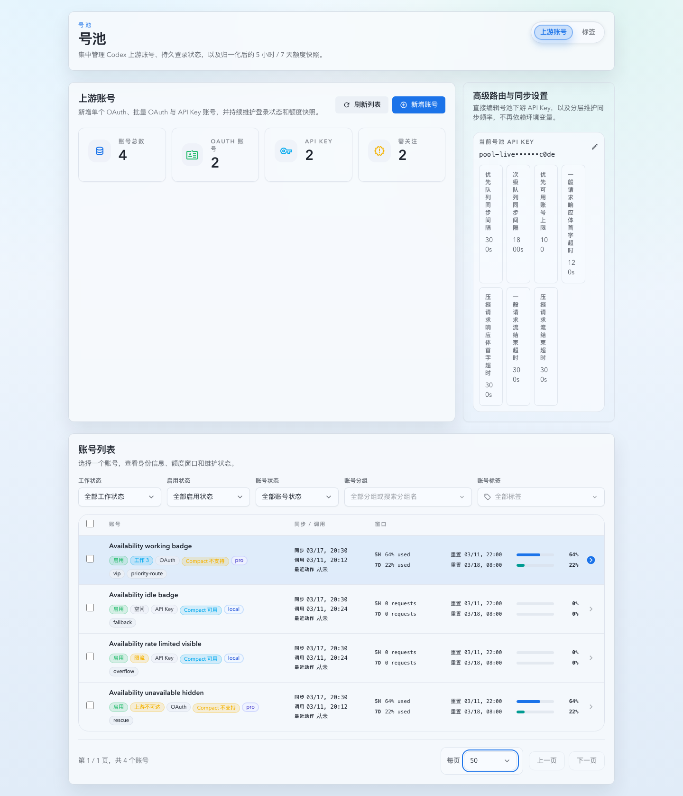
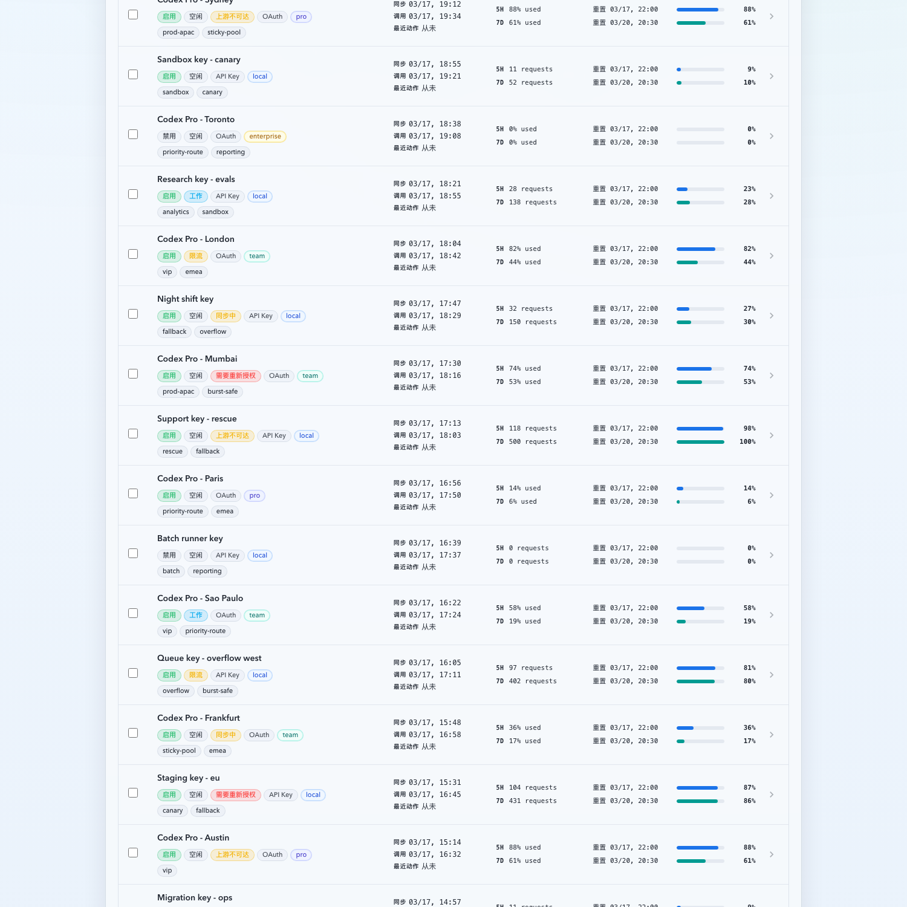
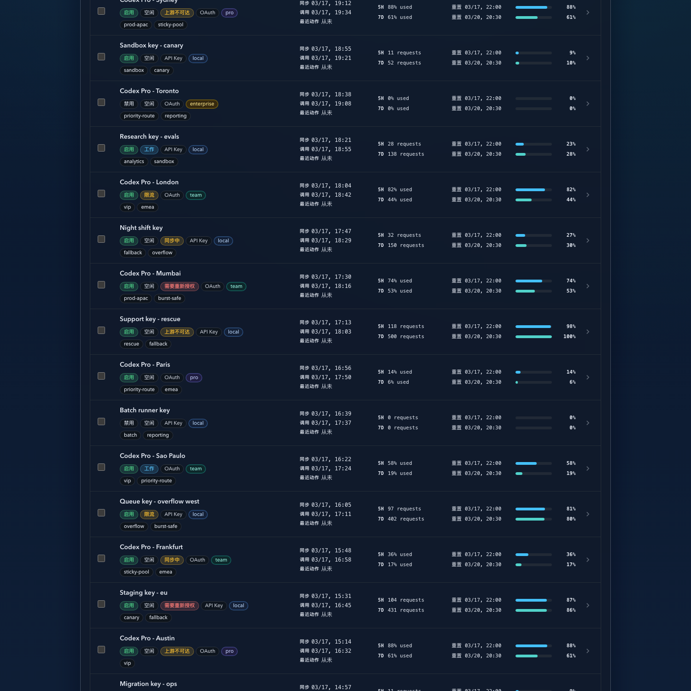

# 上游账号列表紧凑化改版（#62uhg）

## 状态

- Status: 已完成（5/5）
- Created: 2026-03-16
- Last: 2026-03-24

## 背景 / 问题陈述

- 当前上游账号列表沿用宽表格结构，把分组、状态、类型、Plan、`5 小时`、`7 天` 全部拆成独立列，导致默认桌面宽度下容易出现横向滚动条。
- 账号主信息与状态分散在多列里，浏览时需要左右来回扫，重复账号、母号、类型和标签这些判断信号也不够集中。
- 现有产品要求进一步压缩列表信息密度：账号主体最多只保留两行字段值，同时把标记与标签下沉到账号名下方，并把 `5 小时` / `7 天` 窗口合并进同一列。
- 最新界面反馈要求在同步列里同时展示“最近成功同步”和“上次调用时间”，避免列表中缺少账号最近活跃线索。

## 目标 / 非目标

### Goals

- 将列表收敛成“账号 / 同步与调用 / 窗口 / 详情入口”四段式结构，默认桌面视图不再依赖横向滚动。
- 每条记录的字段值保持单行显示：账号主体只展示 `displayName` 一行值，超长内容统一截断；分组名不再出现在列表主信息区。
- 账号名下方新增紧凑标记带，承载母号、重复账号、状态、类型、Plan 与账号标签；标签默认显示前 `3` 个，多余部分汇总为 `+N`。
- 工作态标记收口为“可调用态徽章”：只有 `enableStatus=enabled`、`healthStatus=normal`、`syncState=idle` 的账号才显示 `工作 / 空闲` 标记；`working` 必须带出活跃对话数量。
- 将 `5 小时` 与 `7 天` 合并为同一列中的双窗口摘要，每个窗口占一行，保留窗口名、使用值、下次重置与迷你进度可视化。

### Non-goals

- 不新增持久化业务字段或改造账号详情数据模型；仅允许为现有调用记录补充必要的派生字段与性能索引。
- 不改造账号详情抽屉、分组筛选、顶部统计卡片和写操作流程。
- 不新增筛选器、批量操作或新的业务字段。
- 不调整详情抽屉头部四态 badge，也不改变现有 `workStatus` 筛选 taxonomy 与兼容 query 语义。

## 范围（Scope）

### In scope

- `web/src/components/UpstreamAccountsTable.tsx`
- `web/src/pages/account-pool/UpstreamAccounts.tsx`
- `web/src/i18n/translations.ts`
- `web/src/components/UpstreamAccountsTable.stories.tsx`
- `web/src/components/UpstreamAccountsPage.stories.tsx`
- `web/src/components/UpstreamAccountsPage.story-helpers.tsx`
- `web/src/pages/account-pool/UpstreamAccounts.test.tsx`
- `web/src/components/UpstreamAccountsTable.test.tsx`
- `src/upstream_accounts/mod.rs`
- `src/main.rs`
- `src/tests/mod.rs`
- `web/src/components/ui/tooltip.tsx`

### Out of scope

- 详情抽屉 usage 卡片与趋势图
- 账号新增 / OAuth 流程 / Tag 编辑逻辑

## 需求（Requirements）

### MUST

- 列表桌面视图默认不再通过 `overflow-x-auto + min-width table` 兜底；在现有账号页容器宽度与 `1280px` 视口下，核心信息必须首屏可见。
- 账号区固定只显示 `displayName` 一行字段值；分组名不得出现在账号列表行里，避免与主信息竞争空间。
- 账号字段值下方必须显示独立的标记带，顺序固定为：母号、重复账号、状态、类型、Plan、tags；tags 最多渲染 `3` 个，剩余汇总为 `+N`。
- `+N` 必须保留可发现路径：鼠标悬浮时显示隐藏 tags，键盘聚焦同样可读取隐藏 tags 提示，不得因为整行点击逻辑而失效。
- 同步列必须同时显示最近成功同步时间与上次调用时间，两者各占一行且值不换行；没有调用记录时显示占位值。
- 账号可调用时显示 `工作 / 空闲` 标记；`working` 标记文案必须显示最近 `30` 分钟活跃 sticky route 数量，`idle` 保持纯文本；若账号因限流不可调用，则继续显示 `限流` 标记；`disabled`、`syncing` 与异常健康态不显示工作态标记。
- `5 小时` / `7 天` 必须在同一列中上下排列；每一行都要包含窗口名、当前使用文案、重置时间与百分比，且值不换行。
- 选中态、整行点击、键盘 Enter/Space 触发、右侧详情 chevron 入口必须保持现有行为。

### SHOULD

- 复用现有 `Badge` 视觉语言，不引入额外颜色体系。
- 用组件级测试覆盖“无横向滚动兜底类名”“双窗口同列”“标记带 + tags 折叠”。
- 用页面级测试与 Storybook 场景覆盖长账号名、长分组名、多 tag、重复账号、母号与空窗口数据。

## 验收标准（Acceptance Criteria）

- Given 账号页列表在默认桌面容器中渲染，When 打开页面，Then 表头只保留账号、同步与调用、窗口和详情入口，不再出现独立 `5h/7d` 列。
- Given 任一账号名、同步时间或窗口摘要过长，When 列表渲染，Then 对应值保持单行并被截断，而不是换行撑高布局。
- Given 某账号已有路由调用记录，When 列表渲染，Then 同步列第二行显示最近一次调用时间；若没有调用记录，则显示统一占位值。
- Given 某账号 `enableStatus=enabled`、`healthStatus=normal`、`syncState=idle` 且 `workStatus=working`，When 列表渲染，Then 标记带显示 `工作 {{count}}` / `Working {{count}}`，其中 `count` 来自最近 `30` 分钟活跃 sticky route 数量；若 `count <= 0`，则回退为纯文本 `工作` / `Working`。
- Given 某账号因限流不可调用，When 列表渲染，Then 标记带继续显示 `限流` 徽章；Given 某账号因禁用、同步中或异常健康态不可调用，When 列表渲染，Then 标记带不显示 `工作 / 空闲` 徽章，其它徽章与布局保持不变。
- Given 某账号同时有母号、重复账号、状态、类型、Plan 和超过 `3` 个 tags，When 列表渲染，Then 标记带按固定顺序显示，且 tag 区域以 `+N` 汇总剩余项。
- Given OAuth 与 API Key 账号都存在窗口数据，When 列表渲染，Then `5 小时` / `7 天` 统一出现在同一列的两行摘要中，仍能区分两种窗口。
- Given 现有账号列表选中逻辑与详情入口，When 点击整行或按 Enter/Space，Then 仍然选中账号并可继续打开号池详情抽屉。

## 质量门槛（Quality Gates）

- `cd web && bun run test`
- `cd web && bun run build`
- 本地浏览器 smoke：打开当前 workspace 启动的账号页，验证列表无横向滚动依赖、长文本截断稳定、详情入口可用。

## 里程碑（Milestones）

- [x] M1: 新建规格并冻结列表紧凑化目标、布局边界与验收标准。
- [x] M2: 完成账号列表组件重构与文案接线。
- [x] M3: 补齐组件/页面测试与 Storybook 场景。
- [x] M4: 完成本地验证与浏览器 smoke。
- [x] M5: 快车道收敛（spec sync、push、PR、checks、review-loop）。

## Visual Evidence

- source_type: storybook_canvas
  target_program: mock-only
  capture_scope: browser-viewport
  sensitive_exclusion: N/A
  submission_gate: pending-owner-approval
  story_id_or_title: Account Pool/Pages/Upstream Accounts/List — Availability Badges
  state: light-theme
  evidence_note: 验证工作/空闲徽章只在可调用账号上显示，`working` 行内携带活跃对话数量，限流行保留 `限流` 徽章，异常健康态行隐藏工作态徽章。
  image:
  

## Visual Evidence (PR)

- source_type: storybook_canvas
  target_program: mock-only
  capture_scope: browser-viewport
  sensitive_exclusion: N/A
  submission_gate: approved
  story_id_or_title: Account Pool/Pages/Upstream Accounts/List — DenseRoster
  state: light-theme
  evidence_note: 验证亮色主题下账号列表的紧凑布局、计划类型 badge 语义分层，以及状态/额度信息在高密度行内的可读性。
  image:
  

- source_type: storybook_canvas
  target_program: mock-only
  capture_scope: browser-viewport
  sensitive_exclusion: N/A
  submission_gate: approved
  story_id_or_title: Account Pool/Pages/Upstream Accounts/List — DenseRoster
  state: dark-theme
  evidence_note: 验证暗色主题下账号列表的紧凑布局、计划类型 badge 语义分层，以及状态/额度信息在高密度行内的可读性。
  image:
  

## 风险 / 假设

- 假设：账号下方的标记带不计入“两行字段值”限制，但自身仍保持单行紧凑展示。
- 风险：若状态 + 类型 + Plan + tags 过多，标记带可能接近账号列宽上限，需要通过 tag 数量上限与 `+N` 兜底。
- 风险：JSDOM 无法真实测量浏览器布局，需要通过类名契约 + 浏览器 smoke 共同证明无横向滚动依赖。

## 变更记录（Change log）

- 2026-03-16: 创建增量规格，冻结上游账号列表紧凑化的布局目标、信息层级与验证口径。
- 2026-03-16: 列表重构为四段式紧凑布局，账号区收敛为两行字段值 + 一行标记带，`5 小时` / `7 天` 合并为同列双窗口摘要。
- 2026-03-16: 补齐 `UpstreamAccountsTable` 组件测试、账号页集成测试以及 Storybook 长名称 / 多标签场景。
- 2026-03-16: 本地验证通过：`cd web && bun run test`、`cd web && bun run build`、`cd web && bun run lint`；浏览器 smoke 通过 Storybook `CompactLongLabels` 场景确认 `1280px` 与窄视口下均无横向溢出，详情入口可正常打开。
- 2026-03-16: 根据实际预览反馈，进一步缩短窗口行标签并上调窗口列宽占比，优先保证“使用量 + 下次重置”文本在桌面宽度下尽量完整显示。
- 2026-03-16: 根据最新界面反馈，移除账号列表行中的分组名显示，账号区仅保留账号名与下方标记带。
- 2026-03-16: 根据最新界面反馈，为同步列补充“上次调用时间”，并扩展上游账号汇总接口返回最近一次调用时间字段。
- 2026-03-16: 为最近调用时间聚合补充 `codex_invocations` 表达式索引，并将列表返回的 `lastActivityAt` 统一序列化为 UTC ISO，避免浏览器按本地时区误解析。
- 2026-03-16: 调整标记带折叠策略与 `+N` 提示交互，继续保留前 `3` 个 tags，同时让折叠提示支持悬浮与键盘聚焦读取。
- 2026-03-17: 快车道收敛完成，PR visual evidence 已同步，review-loop 对最新 PR head 收敛完成，进入直接合并阶段。
