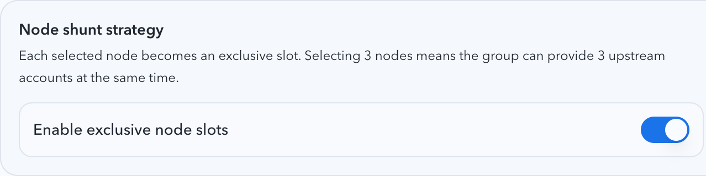
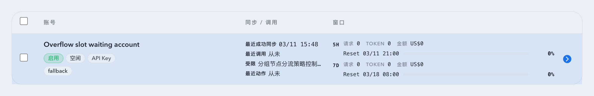

# 上游账号分组节点分流策略（#6b9ra）

## 状态

- Status: 已完成
- Created: 2026-03-31
- Last: 2026-04-01

## 背景

- `#mww8f` 与 `#gp92q` 已把账号上下文请求收敛到“按分组绑定节点走 forward proxy”，但同组账号仍共享同一组节点池。
- 当前分组绑定多个节点时，运行时语义更接近“共享硬绑定 + 网络失败切换”；它不能表达“一个节点同一时刻只能服务一个上游账号”的排班约束。
- 主人要求新增可选的“节点分流策略”：
  - 每个节点只能被一个上游账号占用。
  - 账号只要处于可调用状态（工作中 / 工作降级 / 空闲），并且排到了有效节点，就算占槽。
  - 勾选几个节点，就代表该分组同时可提供几个上游账号。
  - 未排到有效节点的账号仍显示为 `空闲`，但需要明确暴露“分组节点分流策略控制，未排节点”的阻断原因。

## 目标 / 非目标

### Goals

- 为分组 metadata 新增 `nodeShuntEnabled`，允许在“共享硬绑定”与“独占节点槽位”两种语义之间切换。
- 新增运行时节点分流分配器：以当前分组有效节点、现有账号路由优先级、以及账号可调用谓词为输入，实时派生“账号 -> 固定节点”一对一分配，不落持久化绑定表。
- 列表 / 详情导出 `routingBlockReasonCode` 与 `routingBlockReasonMessage`；未排节点账号保持 `workStatus=idle`、`healthStatus=normal`。
- 所有账号身份下的互联网调用统一遵守节点分流结果：pool live request、manual sync、maintenance sync、usage snapshot、imported OAuth validate/import、post-create sync 都不得回退 automatic/shared group node。
- 保持 `auth.openai.com` token exchange / refresh 与 MoeMail 现有例外语义，不把它们纳入节点分流约束。

### Non-goals

- 不引入新的独立分组管理页面。
- 不把账号-节点映射落库，也不做 sticky 长期保留。
- 不修改现有 `work / enable / health / sync` 四组状态枚举。
- 不改变未开启 `nodeShuntEnabled` 分组的旧语义。

## 范围

### In scope

- `src/upstream_accounts/mod.rs`
  - group metadata / login session schema 扩展
  - 节点分流分配器
  - 账号读模型阻断原因
  - manual/import/sync/runtime enforcement
- `src/forward_proxy/mod.rs`
  - 新增固定节点作用域 `PinnedProxyKey`
- `src/main.rs`
  - pool live request 复用已分配好的 `forward_proxy_scope`
- `web/src/lib/api.ts`
  - `nodeShuntEnabled`、`groupNodeShuntEnabled`、`routingBlockReason*` 契约
- `web/src/components/UpstreamAccountGroupNoteDialog*`
- `web/src/components/UpstreamAccountsTable*`
- `web/src/pages/account-pool/UpstreamAccounts*`
- `web/src/pages/account-pool/UpstreamAccountCreate*`
- `web/src/i18n/translations.ts`
- `docs/specs/README.md`
- `docs/specs/g4ek6-account-pool-upstream-accounts/contracts/http-apis.md`
- `docs/specs/g4ek6-account-pool-upstream-accounts/contracts/db.md`

### Out of scope

- 新增节点占用历史可视化或调度面板。
- 对历史无组/无节点账号做自动迁移或修复。
- 更改 OAuth exchange / refresh 的直连例外边界。

## 功能规格

### 分组 metadata

- `UpstreamAccountGroupSummary` / `UpdateUpstreamAccountGroupRequest` 新增 `nodeShuntEnabled: bool`。
- `pool_upstream_account_group_notes` 新增 `node_shunt_enabled INTEGER NOT NULL DEFAULT 0`。
- `pool_oauth_login_sessions` 新增 `group_node_shunt_enabled INTEGER NOT NULL DEFAULT 0`，用于 pending OAuth session 保留新分组草稿语义。

### 运行时分配

- 仅对 `nodeShuntEnabled=true` 的分组启用节点分流。
- 有效节点集合来源于当前分组 `boundProxyKeys`，并沿用保存顺序；`__direct__` 视为正常可选节点。
- 账号排序沿用现有 routing candidate 排序结果。
- 只有同时满足以下条件的账号才参与占槽：
  - `enableStatus=enabled`
  - `syncState=idle`
  - `healthStatus=normal`
  - `workStatus ∈ {working, degraded, idle}`
  - 非 `rate_limited`
- 分配规则：取前 `N` 个符合条件账号，与前 `N` 个有效节点一一对应；未入选账号不分配节点。

### 账号读模型

- 列表与详情新增：
  - `routingBlockReasonCode`
  - `routingBlockReasonMessage`
- 当账号属于启用节点分流的分组，且账号本身可调用、但未分配到有效节点时：
  - `workStatus` 固定导出为 `idle`
  - `healthStatus` 固定导出为 `normal`
  - `routingBlockReasonCode = group_node_shunt_unassigned`
  - `routingBlockReasonMessage = 分组节点分流策略控制，未排节点`
- 该阻断原因属于中性调度约束，不写入 `lastAction*`，也不把账号降级成 `unavailable / error / needs_reauth`。

### 账号上下文请求约束

- 对启用节点分流的分组：
  - pool `/v1/*` live upstream request
  - usage snapshot
  - manual sync
  - maintenance sync
  - imported OAuth validate/import
  - post-create sync
  都必须使用分配器给出的固定节点；若当前账号 / 当前导入批次没有可分配的有效节点，则直接失败。
- 节点分流开启时，不再使用旧的“共享 bound group 当前节点 + 连续网络失败 3 次再切下一个节点”语义。
- 节点分流关闭时，保持 `#mww8f` 的旧行为。

## 验收标准

- Given 分组未开启 `nodeShuntEnabled`，When 账号上下文请求运行，Then 保持当前共享硬绑定与网络失败切换语义。
- Given 分组开启 `nodeShuntEnabled` 且有 `N` 个有效节点，When 同组存在多于 `N` 个可调用账号，Then 只有路由优先级靠前的 `N` 个账号获得节点，其余账号返回 `routingBlockReasonCode=group_node_shunt_unassigned`。
- Given 账号未排到有效节点，When 发起 live request、manual sync、maintenance sync、usage snapshot、import validate/import 或 post-create sync，Then 请求直接失败，不得回退 automatic/shared group node。
- Given 选中的节点里只有 `__direct__` 可用或混有失效节点，When 计算分配，Then 只把当前有效节点计入槽位；无任何有效节点时，同组全部账号都导出 `idle + routingBlockReason*`。
- Given 已占槽账号进入 `syncing`、`rate_limited`、`disabled` 或异常 health，When 下次列表读取或请求解析触发，Then 它立即释放槽位，后续账号按优先级补位。

## 质量门槛

- `cargo check`
- `cargo test`
- `cd web && bunx vitest run src/components/UpstreamAccountGroupNoteDialog.test.tsx src/components/UpstreamAccountsTable.test.tsx src/pages/account-pool/UpstreamAccountCreate.test.tsx src/pages/account-pool/UpstreamAccounts.test.tsx`
- `cd web && bun run build`
- `cd web && bun run storybook:build`

## Visual Evidence

- 目标来源：Storybook mock-only canvas
- 目标故事：
  - `Account Pool/Components/Upstream Account Group Settings Dialog/Node Shunt Enabled`
  - `Account Pool/Components/Upstream Accounts Table/Node Shunt Blocked Idle`
- source_type: storybook_canvas
  target_program: mock-only
  capture_scope: element
  story_id_or_title: `account-pool-components-upstream-account-group-settings-dialog--node-shunt-enabled`
  state: 节点分流策略开关
  evidence_note: 验证分组设置弹窗新增“节点分流策略”开关与说明文案。

  

- source_type: storybook_canvas
  target_program: mock-only
  capture_scope: browser-viewport
  story_id_or_title: `account-pool-components-upstream-accounts-table--node-shunt-blocked-idle`
  state: 未排节点账号仍显示空闲
  evidence_note: 验证列表把“未排节点”账号保持为空闲，并显示“分组节点分流策略控制，未排节点”的阻断原因。

  

## 变更记录

- 2026-03-31: 创建 spec，冻结分组级 `nodeShuntEnabled`、运行时独占节点槽位分配、读模型阻断原因与 UI 收口边界。
