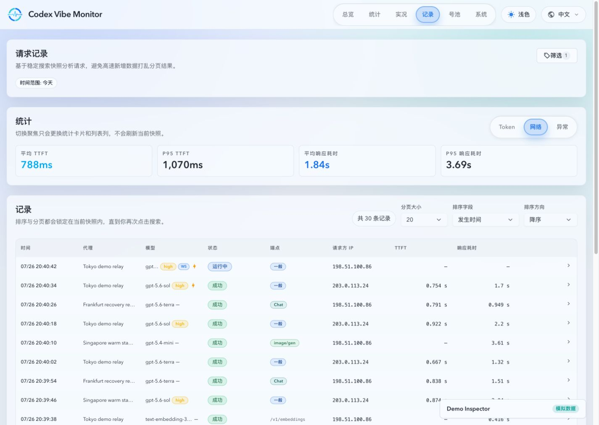
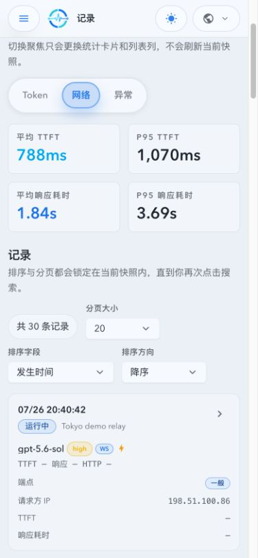

# 全项目 TTFT 口径（#6qe6u）

> 当前有效规范以本文为准；实现覆盖与当前状态见 `./IMPLEMENTATION.md`，关键演进原因见 `./HISTORY.md`。

## Related ADRs

- None

## 背景 / 问题陈述

- 项目曾把请求读取、解析、连接和 HTTP 首字节耗时的累计值作为 owner-facing “首字用时”，该值是网络阶段指标，不是模型首个 Token 的产生时间。
- HTTP SSE 与 WebSocket 缺少统一的首个模型输出识别器，调用、归档、统计与界面因此无法提供真正的 TTFT。
- 本规范以 `Wei-Shaw/sub2api@43d4bae2464387817560a1aeb0b023cd0c9b22ee` 的产品定义为参考，并消除其 HTTP/WS 实现口径分叉。

## 目标 / 非目标

### Goals

- 建立 HTTP SSE、Responses Compact、Chat Completions 与 WebSocket turn 共用的 TTFT 数据合同。
- 新调用实时采集、持久化并聚合 `firstTokenMs`，owner-facing 界面统一显示 `TTFT`。
- 调用记录主信息与网络摘要统一显示 `TTFT` 与 `响应耗时`；后者仅使用 `tUpstreamStreamMs`，不以总耗时或 TTFB 替代。
- 保留 HTTP TTFB 作为独立网络诊断指标，并明确标记为 `TTFB / 上游首字节`。

### Non-goals

- 不从 TTFB、总耗时、旧 `firstResponseByteTotal*` 或原始响应文件推算历史 TTFT。
- 不为非流式请求、图片请求或未产生 Token 的请求虚构 TTFT。
- 不改变转发内容、事件顺序、重试、计费或底层 TTFB 采集。

## 范围（Scope）

### In scope

- HTTP 与 WebSocket 首 Token 识别和计时。
- invocation、archive、分钟/小时 read-model、API、SSE live snapshot 与前端展示。
- Dashboard、账号卡、趋势、统计、调用记录、调用详情与模型性能。

### Out of scope

- 历史记录回填与旧兼容字段删除。
- 非流式响应的首个完整响应体计时。

## 需求（Requirements）

### MUST

- HTTP 计时起点是请求进入代理的最早稳定时刻；WebSocket 计时起点是每个下游 `response.create` turn。
- 计时终点是首个非空模型输出 delta 到达代理的时刻。有效输出包括 reasoning、文本内容与工具参数增量。
- `response.created`、`response.in_progress`、item 元数据、keepalive、失败事件、完成事件和空 delta 不得终止计时。
- 仅流式请求产生 TTFT。图片、非流式、历史无样本和首 Token 前失败的调用返回 `null`。
- 首 Token 已观测后发生失败、中断或客户端断开的调用仍保留 invocation 样本并进入聚合。
- `0ms` 是合法 TTFT；缺失必须用 `null` 表示，不得使用零值哨兵。
- HTTP 与 WebSocket 必须复用同一识别器，对同一事件负载得出相同结论。
- 旧 `firstResponseByteTotal*` 可兼容读取，但不得继续参与 TTFT UI 或 TTFT 聚合。
- `响应耗时` 是上游流开始持续输出到该上游流结束的 `tUpstreamStreamMs`；缺失值显示为 `—`，不得从 `tTotalMs` 反推。`tTotalMs` 只属于阶段耗时诊断。
- Dashboard 紧凑调用行可以用 section 级本地时钟暂估请求用时、首字节后暂估 TTFT 和首 Token 后暂估响应耗时，但这些值只用于实时过渡显示，不写回、不进入聚合，也不得替代严格 `firstTokenMs`/`tUpstreamStreamMs`；服务器锚点追平或终态到达时直接采用后端值，终态无有效 token 的 TTFT 保持缺失。
- 调用记录的网络摘要只消费 `avgFirstTokenMs` / `p95FirstTokenMs` 与 `avgResponseDurationMs` / `p95ResponseDurationMs`；`avgTtfbMs`、`avgTotalMs` 等旧摘要字段仅供兼容读取，不得作为该页面主指标。

### SHOULD

- SSE 分帧解析应支持跨 chunk 帧、单 chunk 多帧、注释行与 `[DONE]`。
- live snapshot 在首 Token 首次观测时最多更新一次，终态持久化保持相同值。

### COULD

- 后续版本可在兼容窗口结束后删除旧 `firstResponseByteTotal*` 字段。

## 功能与行为规格（Functional/Behavior Spec）

### Core flows

- HTTP 流式请求从代理入口开始计时；解析上游 SSE 时忽略协议与生命周期事件，首个有效 delta 设置 `firstTokenMs`，随后只转发、不覆盖该值。
- WebSocket 每次下游 `response.create` 建立独立 turn 计时状态；上游首个有效 delta 设置该 turn 的 `firstTokenMs`，终态生成独立 invocation。
- 聚合只消费持久化的非空 `first_token_ms`；分钟、小时、账号、模型和 timeseries 使用相同样本资格。

### Edge cases / errors

- 首 Token 前失败：`firstTokenMs=null`。
- 首 Token 后失败、断流或下游断开：保留已观测值。
- 同 chunk 内有多个事件：以承载首个有效 delta 的 chunk 到达时刻为计时终点。
- 历史 invocation 不含新列值：API 返回 `null`，不得 fallback。

## 接口契约（Interfaces & Contracts）

| 接口（Name）                                                    | 类型（Kind）  | 范围（Scope） | 变更（Change） | 负责人（Owner）        | 使用方（Consumers）       | 备注（Notes）                                   |
| --------------------------------------------------------------- | ------------- | ------------- | -------------- | ---------------------- | ------------------------- | ----------------------------------------------- |
| `first_token_ms`                                                | SQLite column | internal      | New            | proxy/stats            | live/archive/read-model   | nullable invocation truth                       |
| `firstTokenMs`                                                  | JSON field    | external      | New            | API/SSE                | invocation UI             | invocation sample                               |
| `firstTokenAvgMs` / `firstTokenP95Ms` / `firstTokenSampleCount` | JSON fields   | external      | New            | stats API              | dashboard/stats           | aggregate truth                                 |
| `currentFirstTokenAvgMs`                                        | JSON field    | external      | New            | dashboard activity     | realtime KPI              | rolling current value                           |
| `avgFirstTokenMs` / `p95FirstTokenMs`                           | JSON fields   | external      | New            | invocation summary     | records network summary   | TTFT aggregate only                             |
| `avgResponseDurationMs` / `p95ResponseDurationMs`               | JSON fields   | external      | New            | invocation summary     | records network summary   | aggregate of `tUpstreamStreamMs`                |
| `tUpstreamTtfbMs`                                               | JSON field    | external      | Existing       | invocation diagnostics | attempt detail            | TTFB only; never TTFT fallback                  |
| `tUpstreamStreamMs`                                             | JSON field    | external      | Existing       | invocation record      | primary response duration | response duration only; never derive from total |

## 验收标准（Acceptance Criteria）

- Given lifecycle/metadata SSE events followed by a delayed non-empty reasoning, text or tool delta, When the stream is captured, Then TTFT equals request-start-to-delta and does not equal HTTP TTFB.
- Given a frame split across chunks or multiple frames in one chunk, When the parser consumes it, Then the first valid delta is recognized exactly once.
- Given a WebSocket connection with multiple `response.create` turns, When each turn completes, Then each invocation has an independently measured TTFT.
- Given non-streaming, image, historical or tokenless failure records, When APIs and UI render them, Then TTFT is `null`/`—` and no TTFB fallback occurs.

## 验收清单（Acceptance checklist）

- [x] 核心路径的长期行为已被明确描述。
- [x] 关键边界与错误场景已被覆盖。
- [x] 接口与兼容边界已写清楚。
- [x] 验收条件可用于实现与 review 对齐。

## 非功能性验收 / 质量门槛（Quality Gates）

### Testing

- Rust unit/integration tests cover SSE chunking, empty/lifecycle events, HTTP/WS parity and terminal states.
- Frontend tests cover nullable TTFT, aggregates and explicit TTFB diagnostics.

### UI / Storybook

- Update affected component stories and the mock Web Demo with non-zero TTFT, independent TTFB and historical no-sample states.
- Produce desktop and mobile mock-only visual evidence.

### Quality checks

- `cargo fmt --check`, targeted Rust tests, `cargo check`, frontend Vitest, Storybook build/test and Web Demo build pass.

## Visual Evidence

PR: include

- source_type: ui_demo
  target_program: mock-only Codex Vibe Monitor Web Demo
  capture_scope: page
  requested_viewport: desktop (1440 x 1024)
  viewport_strategy: browser viewport override
  margin_policy: trim_only
  evidence_surface: page
  sensitive_exclusion: mock data only; no production data or credentials
  submission_gate: approved
  scenario: records network summary and table show TTFT plus response duration; TTFB and total time are absent from the primary surface

  

- source_type: ui_demo
  target_program: mock-only Codex Vibe Monitor Web Demo
  capture_scope: page
  requested_viewport: mobile (390 x 844)
  viewport_strategy: browser viewport override with `demoViewport=mobile390`
  margin_policy: trim_only
  evidence_surface: page
  sensitive_exclusion: mock data only; no production data or credentials
  submission_gate: approved
  scenario: mobile records keep the same TTFT and response-duration summary while an in-progress row clearly has no sample

  

## Related PRs

- None

## 风险 / 开放问题 / 假设（Risks, Open Questions, Assumptions）

- 风险：兼容期同时存在 TTFT 与旧首字节累计字段，所有 owner-facing 映射必须显式选择 `firstToken*`。
- 假设：上游事件格式仍属于 Responses 或 Chat Completions 已知 delta 合同；未知事件默认不计入，而不是猜测。

## 参考（References）

- `Wei-Shaw/sub2api@43d4bae2464387817560a1aeb0b023cd0c9b22ee`
- `../z9h7v-invocation-log-observability/SPEC.md`
- `../z6ysw-dashboard-account-activity-tabs/SPEC.md`
