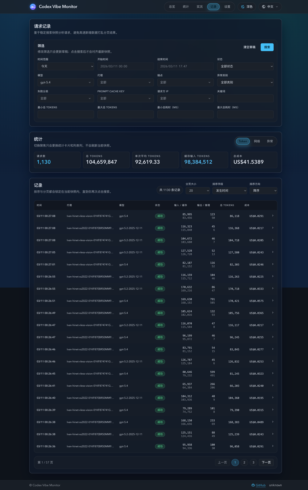
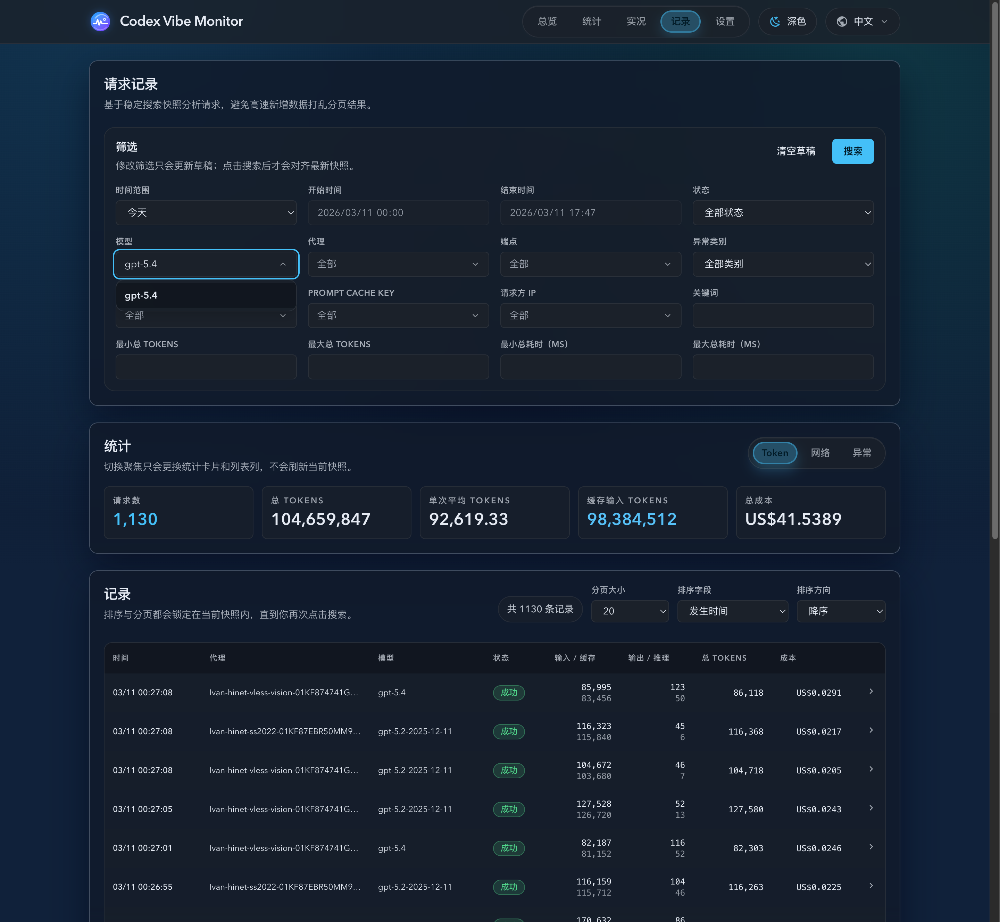

# 请求记录分析页：稳定快照 + 聚焦分析（#6whgx）

## 状态

- Status: 已完成（5/5）
- Created: 2026-03-10
- Last: 2026-03-12

## 背景 / 问题陈述

- 现有 `Dashboard` / `Live` 只能看最近一小段请求记录，缺少适合排障和分析的独立“记录”页面。
- 请求数据增长很快，直接基于实时流分页会导致翻页、排序与结果总数抖动，难以稳定对比问题。
- 当前 `/api/invocations` 仅支持 `limit + model + status`，无法支撑分析页所需的筛选、排序、稳定分页与聚焦统计。

## 目标 / 非目标

### Goals

- 新增一级 `记录` 页，布局固定为“筛选 -> 统计 -> 记录（分页）”。
- 记录页采用“点击搜索即冻结快照”的模型：仅搜索会对齐最新数据；分页、排序与聚焦都复用同一 `snapshotId`。
- 支持 `Token`（默认）、`网络`、`异常` 三种聚焦单选，切换时只变更 KPI 和表格列集，不刷新快照。
- 后端扩展请求记录 API，支持排障增强筛选、排序、分页总数、新数据计数与聚焦统计汇总。
- 页面显式提示“有 N 条新数据”，并允许直接点击该提示重新加载当前筛选下的新数据。

### Non-goals

- 不替换 `Live` 页现有“最新记录”模块。
- 不自动把新增数据并入当前结果页。
- 不新增独立请求详情页。
- 不新增数据库表或重做归档体系。

## 范围（Scope）

### In scope

- 新增前端路由 `/records`、导航项“记录”与记录页专用数据层/组件。
- 扩展 `GET /api/invocations` 的筛选、排序、分页与 `snapshotId` 语义。
- 新增 `GET /api/invocations/summary`，输出共享 totals、三类聚焦 KPI 与 `newRecordsCount`。
- 为高频筛选增加必要的 `IF NOT EXISTS` 索引。
- 补充 Rust / Vitest / 浏览器验收覆盖。

### Out of scope

- 修改 SSE 协议或把记录页改成实时流模式。
- 引入新的图表区块或导出功能。
- 重构现有 `InvocationTable` 服务 `Dashboard` / `Live` 的使用方式。

## 需求（Requirements）

### MUST

- `snapshotId` 语义固定为“本次搜索时的最大 `codex_invocations.id`”；同一快照下所有分页与排序都必须附带 `id <= snapshotId`。
- 筛选采用“草稿值 / 已应用值”双态；只有点击搜索才会刷新 `snapshotId` 与结果集。
- 分页尺寸固定支持 `20 / 50 / 100`；默认排序为 `occurredAt desc`。
- 聚焦切换不得刷新快照或重新搜索，只能切换 KPI 与表格展示列。
- `newRecordsCount` 仅统计“当前已应用筛选”下、且 `id > snapshotId` 的新记录数。
- 新数据提示默认显示数量文案与问号图标；hover/focus 时文案切换为“加载新数据”并切到主题色，点击后直接触发刷新，加载中图标切为旋转刷新图标。

### SHOULD

- 排障增强筛选首版覆盖：时间范围、状态、模型、代理、endpoint、failure class、failure kind、Prompt Cache Key、Requester IP、关键词、总 Tokens 区间、总耗时区间。
- 记录页在桌面端优先保证分析密度，在移动端保持可读性与分页可操作性。
- 统计区采用低噪音 KPI 卡片，不引入额外图表。

### COULD

- 后续补充导出或保存筛选方案（本轮不做）。

## 功能与行为规格（Functional/Behavior Spec）

### Core flows

- 用户首次进入 `记录` 页时，页面以默认筛选自动执行一次搜索，拿到首个 `snapshotId`、KPI 汇总与第 1 页结果。
- 用户修改筛选但未点击搜索时，页面继续保留旧的已应用筛选和旧快照；翻页、排序、聚焦只作用于旧快照。
- 用户点击搜索后，页面刷新为新的 `snapshotId`，并重置到第 1 页。
- 页面可见时定时检查 `newRecordsCount`；若大于 0，则显示“有 N 条新数据”刷新入口，允许直接并入当前筛选对应的新数据。
- 用户切换 `Token / 网络 / 异常` 聚焦时，统计卡与记录表列集同步切换，但请求快照不变。

### Edge cases / errors

- 若筛选结果为空，统计卡与列表都要稳定显示空态/零值，不报错。
- 若当前快照下无新数据，隐藏新数据提示。
- 若用户点击新数据提示触发刷新，请求未完成前按钮必须禁用，且不能重复发起搜索。
- 若筛选包含旧记录缺失字段，列表与统计一律按 `NULL` 兼容处理，不出现 `NaN` 或崩溃。

## 接口契约（Interfaces & Contracts）

### `GET /api/invocations`

- 新增查询参数：`page`、`pageSize`、`snapshotId`、`sortBy`、`sortOrder`、`rangePreset`、`from`、`to`、`status`、`model`、`proxy`、`endpoint`、`failureClass`、`failureKind`、`promptCacheKey`、`requesterIp`、`keyword`、`minTotalTokens`、`maxTotalTokens`、`minTotalMs`、`maxTotalMs`。
- 新增响应字段：`snapshotId`、`total`、`page`、`pageSize`、`records`。

### `GET /api/invocations/summary`

- 接受与列表一致的已应用筛选参数，允许显式传入 `snapshotId`。
- 返回：`snapshotId`、`newRecordsCount`、共享 totals、`token`、`network`、`exception` 三组 KPI。

### `GET /api/invocations/new-count`

- 接受与列表一致的已应用筛选参数，必须显式传入当前 `snapshotId`。
- 仅返回 `snapshotId` 与 `newRecordsCount`，供页面可见时轻量轮询提示使用，避免重复重算整份 summary。

### 聚焦 KPI 口径

- `token`: 请求数、总 Tokens、单次平均 Tokens、缓存输入 Tokens、总成本。
- `network`: 平均 TTFB、P95 TTFB、平均总耗时、P95 总耗时。
- `exception`: 失败数、服务端故障数、调用方错误数、客户端中断数、可行动故障数。

## 验收标准（Acceptance Criteria）

- Given 用户修改筛选但未点击搜索，When 切页、排序或切换聚焦，Then 列表与 KPI 继续基于旧快照，不会并入新数据。
- Given 用户点击搜索，When 返回新的 `snapshotId`，Then 页面回到第 1 页，列表与 KPI 同步切换到新快照，`newRecordsCount` 清零。
- Given 当前快照之后持续写入新记录，When 用户翻页或切换排序，Then 结果集与总数保持稳定，因为所有查询都限定 `id <= snapshotId`。
- Given 用户切换 `Token / 网络 / 异常`，When 聚焦变化，Then 只切换 KPI 与表格列集，不触发新快照抓取。
- Given 当前已应用筛选存在快照后的新记录，When 轮询刷新提示计数，Then 页面显示“有 N 条新数据”可点击入口；hover/focus 时切换为“加载新数据”，点击后直接刷新当前快照。

## 实现里程碑（Milestones / Delivery checklist）

- [x] M1: 新建 spec 并登记 `docs/specs/README.md`。
- [x] M2: 后端完成稳定快照列表查询、汇总接口与新索引。
- [x] M3: 前端完成记录页数据层、KPI 卡片、新数据提示与聚焦表格。
- [x] M4: 补齐 Rust / Vitest / 浏览器验收。
- [x] M5: 完成快车道 PR、checks 与 review-loop 收敛。

## 风险 / 开放问题 / 假设（Risks, Open Questions, Assumptions）

- 风险：高频数据写入下，统计汇总和分页计数可能放大 SQLite 查询压力；通过 `snapshotId` 限定和索引缓解。
- 风险：过多筛选维度可能让移动端首屏过密；通过折叠和分组布局控制。
- 假设：`codex_invocations.id` 单调递增且可作为稳定快照上界。
- 假设：`newRecordsCount` 采用页面可见时轮询即可满足提示需要，无需新增 SSE 契约。

## 变更记录（Change log）

- 2026-03-10: 新建规格，冻结稳定快照语义、接口扩展、聚焦统计与新数据提示口径。
- 2026-03-10: 完成前后端实现、Rust/Vitest 覆盖与浏览器冒烟；待 PR/checks/review-loop 收尾。
- 2026-03-10: 浏览器复查补齐记录页筛选与排序表单字段的 name 属性，清除表单字段缺少 name/id 的可访问性告警。
- 2026-03-10: 根据 review 收敛空结果 summary 零值、搜索并发失效保护、轻量 new-count 轮询接口，以及搜索后新数据提示复位。
- 2026-03-10: PR #107 已更新并通过 checks，review-loop 收敛完成；补上搜索按钮回归与 `new-count` 强制 `snapshotId` 校验后，规格状态切换为已完成。
- 2026-03-11: 补充 PR 可公开界面截图，并同步到规格固定视觉证据区与 PR 正文。
- 2026-03-12: 将新数据提示从静态数量 + tooltip 说明调整为可点击刷新入口；hover/focus 切换“加载新数据”主题态，点击后显示旋转刷新图标并防止重复触发。
- 2026-03-13: 将记录页新数据提示抽成独立 `RecordsNewDataButton` 组件，补充 Storybook 独立 stories，并新增组件三态截图作为 PR 视觉证据来源。

## Visual Evidence (PR)

- 记录页整页概览（筛选 / 统计 / 稳定分页记录）
  
- 模型筛选的可输入下拉过滤效果
  
- 记录页新数据提示组件三态（默认 / hover / loading）
  

## 参考（References）

- `src/api/mod.rs`
- `web/src/hooks/useInvocations.ts`
- `web/src/components/InvocationTable.tsx`
- `web/src/pages/Live.tsx`
