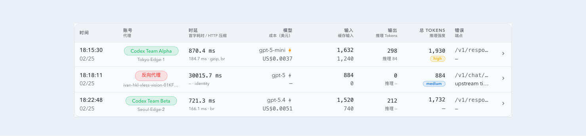
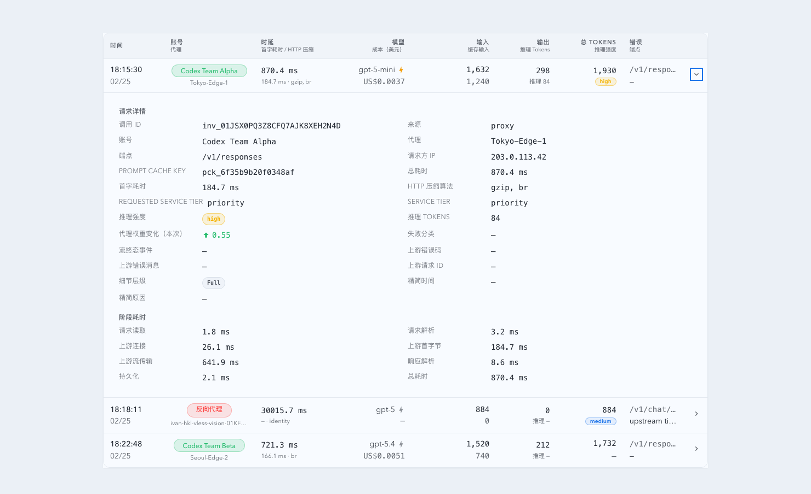
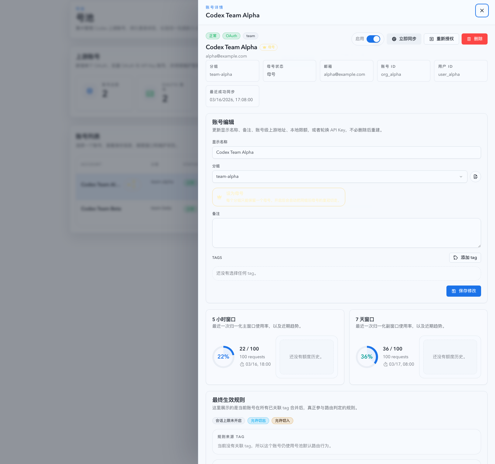

# InvocationTable 账号归因、时延压缩展示与当前页账号抽屉（#7n2ex）

## 状态

- Status: 待实现
- Created: 2026-03-16
- Last: 2026-03-16

## 背景 / 问题陈述

- 当前 InvocationTable 把“代理”和“时延”挤在同一列里，无法直接看出本次请求究竟走了反向代理还是号池中的某个账号。
- 请求详情虽然能看到部分代理上下文，但仍缺少账号归因与 HTTP 压缩算法，排查某次请求慢在哪里、是不是被某个账号拖慢时不够直接。
- 号池页面已经有成熟的账号详情抽屉，但 Dashboard / Live 里点击账号相关信息仍不能在当前页面直达详情。

## 目标 / 非目标

### Goals

- 让 InvocationTable 主列表明确区分“账号”和“代理”。
- 新增独立“时延”列，固定展示总耗时、首字耗时与 HTTP 压缩算法。
- 在展开详情里补齐账号、代理、总耗时、首字耗时、HTTP 压缩算法。
- 点击列表或详情中的号池账号名时，在当前页面打开只读账号详情抽屉。
- 保持 Dashboard / Live 共用同一套表格与抽屉行为。

### Non-goals

- 不把号池页面的编辑/删除/启停操作搬进 Dashboard / Live。
- 不为历史 invocation 做回填迁移；旧记录缺少新增字段时只做降级显示。
- 不新增独立账号详情页或请求详情页。

## 范围（Scope）

### In scope

- 扩展 proxy capture payload，写入 `routeMode`、`upstreamAccountId`、`upstreamAccountName`、`responseContentEncoding`。
- 扩展 `/api/invocations` 返回字段与前端 `ApiInvocation` 契约。
- 改造 InvocationTable 的桌面/移动摘要区与展开详情区。
- 在 Dashboard / Live 当前页新增只读账号详情抽屉，并复用现有账号详情接口拉取数据。
- 补充对应的 Rust / Vitest / Playwright / Storybook 覆盖。

### Out of scope

- 号池页面 `UpstreamAccounts` 的完整编辑抽屉。
- invocation 分析页之外的其它业务表格布局。
- 新的后端只读账号详情专用 API。

## 需求（Requirements）

### MUST

- 列表中原“代理/时延”列拆成两列：`账号 / 代理` 与 `时延`。
- `账号` 行显示 `反向代理` 或具体号池账号名；`代理` 行显示代理节点名。
- `时延` 列第一行显示总耗时，第二行显示首字耗时与 HTTP 压缩算法。
- 展开详情新增 `账号`、`总耗时`、`首字耗时`、`HTTP 压缩算法` 字段。
- 点击号池账号名时，在当前页面打开只读账号详情抽屉。
- 只读抽屉要展示账号身份、状态、额度、同步/健康信息，并提供前往号池页入口。

### SHOULD

- 账号名在窄宽度下保持单行省略，不挤爆表格。
- 无压缩响应时把算法规范展示为 `identity`。
- 历史记录缺少新增字段时显示 `—`，不影响其余字段。

### COULD

- 在只读抽屉头部复用号池页已有 duplicate / mother / plan 徽标视觉语义。

## 功能与行为规格（Functional/Behavior Spec）

### Core flows

- Dashboard / Live 渲染 InvocationTable 时，桌面表头改成独立 `账号 / 代理` 与 `时延` 列；移动卡片也同步展示账号、代理与时延摘要。
- 若 invocation `routeMode=pool` 且带 `upstreamAccountName`，账号行显示该账号名并渲染为按钮；点击后打开当前页面只读抽屉并按需拉取 `/api/pool/upstream-accounts/:id`。
- 若 invocation 不属于号池，账号行显示 `反向代理`，不可点击。
- 时延列第一行显示 `tTotalMs`，第二行显示 `tUpstreamTtfbMs · responseContentEncoding`；任一缺失单独降级为 `—`。
- 展开详情时，除了现有请求上下文与阶段耗时，还新增账号与时延相关信息；详情里的账号名点击行为与列表保持一致。
- 只读账号抽屉展示账号顶部状态徽标、基础身份信息、5h/7d 配额卡片与健康信息；不出现编辑表单、同步按钮、删除按钮。

### Edge cases / errors

- 历史 invocation 没有 `routeMode` / `upstreamAccountName` / `responseContentEncoding` 时：
  - 账号显示 `反向代理`
  - 压缩算法显示 `—`
- `routeMode=pool` 但只有 `upstreamAccountId` 没有名字时，账号显示 `账号 #<id>`，仍允许点击打开抽屉。
- 账号点击后若详情请求失败，只读抽屉内部显示错误态，不污染页面公共错误区。
- 若账号已被删除或接口返回 404，只读抽屉显示“账号不存在或已移除”空态，并保留关闭与前往号池页入口。

## 接口契约（Interfaces & Contracts）

### 接口清单（Inventory）

| 接口（Name） | 类型（Kind） | 范围（Scope） | 变更（Change） | 契约文档（Contract Doc） | 负责人（Owner） | 使用方（Consumers） | 备注（Notes） |
| --- | --- | --- | --- | --- | --- | --- | --- |
| `/api/invocations` | HTTP API | internal | Modify | None | backend | Dashboard / Live / records consumers | 新增 route/account/compression 字段 |
| `ApiInvocation` | TS + Rust types | internal | Modify | None | backend + web | InvocationTable / SSE | 前后端契约同步扩展 |
| `/api/pool/upstream-accounts/:id` | HTTP API | internal | Reuse | None | backend | Dashboard / Live read-only drawer | 只新增消费方，不改接口形状 |

### 契约文档（按 Kind 拆分）

- None

## 验收标准（Acceptance Criteria）

- Given 一条 `routeMode=pool` 且带 `upstreamAccountName=Primary` 的记录，When 渲染 InvocationTable，Then 账号行显示 `Primary`，代理行显示实际代理名，且点击 `Primary` 会在当前页打开只读账号抽屉。
- Given 一条非号池记录，When 渲染 InvocationTable，Then 账号行显示 `反向代理`，且该文本不可点击。
- Given 一条 `Content-Encoding: gzip, br` 的记录，When 渲染列表或详情，Then HTTP 压缩算法显示 `gzip, br` 的规范化结果。
- Given 一条无 `Content-Encoding` 的新记录，When 渲染列表或详情，Then HTTP 压缩算法显示 `identity`。
- Given 一条旧记录没有新增 payload 字段，When 渲染列表或详情，Then 账号降级为 `反向代理`，压缩算法显示 `—`，其它字段不受影响。
- Given 点击号池账号名后账号详情接口失败，When 抽屉加载结束，Then 错误只显示在抽屉内部，页面主体不出现新的公共错误提示。
- Given `1280x900` 与 `1440x900` 视口，When Dashboard / Live 渲染新列后的 InvocationTable，Then 表格仍满足无异常横向滚动回归断言。

## 实现前置条件（Definition of Ready / Preconditions）

- 目标、边界、验收口径已经冻结到本 spec。
- `/api/invocations` 新字段与历史降级语义已在本 spec 中明确。
- 当前页账号详情采用只读抽屉，不复用号池页编辑行为。

## 非功能性验收 / 质量门槛（Quality Gates）

### Testing

- Unit tests: Rust invocation payload / query projection tests；`web/src/components/InvocationTable.test.tsx`
- Integration tests: `/api/invocations` 返回新增字段并被前端类型消费
- E2E tests (if applicable): `web/tests/e2e/invocation-table-layout.spec.ts`

### UI / Storybook (if applicable)

- Stories to add/update: `web/src/components/InvocationTable.stories.tsx`
- Visual regression baseline changes (if any): InvocationTable 新列与账号点击触发态

### Quality checks

- `cargo test`
- `cargo check`
- `cd web && bun run test`
- `cd web && bun run build`
- `cd web && bun run test:e2e -- invocation-table-layout.spec.ts`

## 文档更新（Docs to Update）

- `docs/specs/README.md`: 登记本 spec 与进度

## 计划资产（Plan assets）

- Directory: `docs/specs/7n2ex-invocation-account-latency-drawer/assets/`
- In-plan references: ``
- PR visual evidence source: maintain `## Visual Evidence (PR)` in this spec when PR screenshots are needed.

## Visual Evidence (PR)

- source_type: storybook_canvas
  target_program: mock-only
  capture_scope: element
  sensitive_exclusion: N/A
  submission_gate: pending-owner-approval
  story_id_or_title: Monitoring / InvocationTable / Default
  state: summary
  evidence_note: 验证列表摘要区已经拆分为“账号 / 代理”与独立“时延”列，并在时延列展示总耗时、首字耗时和 HTTP 压缩算法。
  image:
  

- source_type: storybook_canvas
  target_program: mock-only
  capture_scope: element
  sensitive_exclusion: N/A
  submission_gate: pending-owner-approval
  story_id_or_title: Monitoring / InvocationTable / Expanded Details
  state: expanded request details
  evidence_note: 验证展开详情已经补齐账号、代理、总耗时、首字耗时、HTTP 压缩算法等请求上下文，并保留阶段耗时分区。
  image:
  

- source_type: storybook_canvas
  target_program: mock-only
  capture_scope: browser-viewport
  sensitive_exclusion: N/A
  submission_gate: pending-owner-approval
  story_id_or_title: Monitoring / InvocationTable / Account Pool Destination
  state: destination page with selected account detail
  evidence_note: 验证从 InvocationTable 账号抽屉点击“去号池查看完整详情”后，会进入号池页并打开对应账号的完整详情视图。
  image:
  

## 资产晋升（Asset promotion）

- None

## 实现里程碑（Milestones / Delivery checklist）

- [ ] M1: 后端 capture payload 与 `/api/invocations` 扩展出 route/account/compression 字段。
- [ ] M2: InvocationTable 完成账号/代理与时延列改造，并在详情区补齐相关字段。
- [ ] M3: Dashboard / Live 接通当前页只读账号详情抽屉与账号名点击交互。
- [ ] M4: Vitest / Playwright / Storybook / 本地构建验证通过。

## 方案概述（Approach, high-level）

- 复用现有 invocation payload JSON 承载新增可观测字段，避免额外 schema 迁移。
- 前端把账号抽屉做成 InvocationTable 的页面级附属能力，只读消费现有账号 detail 接口。
- 表格新列仍沿用当前响应式双视图约束，优先控制桌面宽度和移动端信息层级。

## 风险 / 开放问题 / 假设（Risks, Open Questions, Assumptions）

- 风险：桌面表格新增一列后可能重新引入宽度回归，需要同步更新 E2E 布局断言。
- 风险：只读抽屉如果直接复用太多号池页组件，可能把编辑态依赖一并带入，需要做清晰裁剪。
- 需要决策的问题：None
- 假设（需主人确认）：HTTP 压缩算法以响应头 `Content-Encoding` 为准，不展示请求头 `Accept-Encoding`。

## 变更记录（Change log）

- 2026-03-16: 创建 spec，冻结 InvocationTable 账号归因、时延压缩展示与当前页只读账号抽屉的范围与验收口径。

## 参考（References）

- `docs/specs/hrvtt-invocation-proxy-weight-delta/SPEC.md`
- `docs/specs/r8m3k-invocation-table-responsive-no-overflow/SPEC.md`
- `docs/specs/g4ek6-account-pool-upstream-accounts/SPEC.md`
