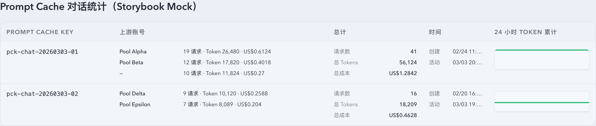

# Live Prompt Cache 对话表改成“上游账号 / 总计”双列复合展示（#7y5yf）

## 状态

- Status: 已完成（4/4）
- Created: 2026-03-21
- Last: 2026-03-21

## 背景 / 问题陈述

- Live 页 Prompt Cache Key 对话表目前把 `请求数 / 总 Tokens / 总成本` 拆成三列，信息密度低，也看不到一个对话具体关联了哪些上游账号。
- 用户当前更关心“这个对话最近主要落到了哪些上游账号，以及各账号消耗了多少请求、Tokens、成本”，而不是只看一组总数。
- 现有 Prompt Cache 对话接口只返回对话级 totals，没有按上游账号聚合的摘要，前端无法直接改造成复合展示。

## 目标 / 非目标

### Goals

- 将 Prompt Cache Key 对话表的三列 totals 收敛为两列：`上游账号` 与 `总计`。
- `上游账号` 单元格展示该对话最近使用的最多 3 个上游账号，每行包含账号名、请求数、Tokens、成本，并按 `lastActivityAt DESC` 排序。
- `总计` 单元格固定展示 3 行 label-value：请求数、Tokens、成本，保持现有 totals 口径不变。
- 后端 Prompt Cache 对话接口新增 `upstreamAccounts[]` 字段，按每个 prompt cache key 的全历史数据聚合，并只返回前 3 个账号摘要。
- 保持 Prompt Cache 对话筛选、图表、排序、缓存 TTL 与 Sticky Key 对话表行为不变。

### Non-goals

- 不修改 Sticky Key 对话表的布局或通用 `KeyedConversationTable` 契约。
- 不新增 tooltip、展开态或 “+N more” 补充信息。
- 不改变 Prompt Cache 对话接口的筛选参数、隐含过滤规则或图表时间轴算法。

## 范围（Scope）

### In scope

- `src/api/mod.rs` 与 `src/tests/mod.rs`：新增 Prompt Cache 对话的上游账号聚合字段、查询与回归测试。
- `web/src/lib/api.ts` 与 `web/src/lib/api.test.ts`：同步 `upstreamAccounts[]` 类型与 normalize。
- `web/src/components/PromptCacheConversationTable.tsx`、其测试与 Storybook：改为专用双列复合展示。
- `web/src/i18n/translations.ts`、本 spec 与 `docs/specs/README.md`。

### Out of scope

- Sticky Key 对话表与账户池页面。
- 其他页面的上游账号显示口径。
- Prompt Cache 对话 SSE/轮询刷新机制与图表交互。

## 接口契约（Interfaces & Contracts）

- `GET /api/stats/prompt-cache-conversations`
  - 现有请求参数与筛选行为保持不变。
  - 每个 `conversation` 新增：
    - `upstreamAccounts: Array<{ upstreamAccountId: number | null; upstreamAccountName: string | null; requestCount: number; totalTokens: number; totalCost: number; lastActivityAt: string }>`
- 后端聚合口径：
  - 只对当前响应内选中的 prompt cache key 集合聚合。
  - 指标按该 key 的全历史 invocation 累加，不截断到 24 小时窗口。
  - 账号排序按 `lastActivityAt DESC`；若相同，再按可展示账号名降序稳定排序。
  - 名称回退规则：
    - `upstreamAccountName.trim()` 非空时直接用名称；
    - 否则若 `upstreamAccountId` 存在，展示 `账号 #<id>`；
    - 否则展示 `—`。
  - 每个对话只返回前 3 个账号摘要。

## 验收标准（Acceptance Criteria）

- Given Live 页 Prompt Cache Key 对话表加载成功，When 桌面表头渲染，Then 旧的 `请求数 / 总 Tokens / 总成本` 三列消失，替换为 `上游账号` 与 `总计` 两列。
- Given 某个对话关联多个上游账号，When `上游账号` 列渲染，Then 最多显示 3 行，且每行都包含账号名、请求数、Tokens、成本。
- Given 某个对话关联 4 个及以上上游账号，When 表格渲染，Then 仅显示最近 3 个账号，更早账号不渲染。
- Given 某个账号缺失名称但存在 id，When 行块渲染，Then 账号标题显示 `账号 #<id>`；若名称与 id 都缺失，则显示 `—`。
- Given `总计` 列渲染，When 用户查看单元格，Then 固定显示 3 行 `请求数 / Tokens / 成本`，且值与旧 totals 完全一致。
- Given 图表列与对话筛选正常工作，When 切换数量模式或活动时间模式，Then 图表、排序、隐含过滤提示和刷新行为保持不变。

## 非功能性验收 / 质量门槛（Quality Gates）

### Testing

- Rust: `cargo test prompt_cache_conversations -- --nocapture`
- Web: `cd web && bunx vitest run src/components/PromptCacheConversationTable.test.tsx src/lib/api.test.ts src/pages/Live.test.tsx`

### Quality checks

- Rust format: `cargo fmt`
- Rust typecheck/tests: `cargo test prompt_cache_conversations -- --nocapture`
- Web type/build: `cd web && bunx tsc -b`

## 实现里程碑（Milestones / Delivery checklist）

- [x] M1: 新建 spec，冻结 Prompt Cache 对话表双列复合展示的接口与布局口径。
- [x] M2: 后端返回每个对话最近 3 个上游账号摘要，并补排序/截断/回退测试。
- [x] M3: 前端改为 Prompt Cache 专用双列布局，并补 i18n、Vitest 与 Storybook 示例。
- [x] M4: 快车道完成提交、PR、checks 与 review-loop 收敛到 merge-ready。

## Visual Evidence (PR)

- source_type: storybook_canvas
- target_program: mock-only
- capture_scope: element
- sensitive_exclusion: N/A
- submission_gate: approved
- story_id_or_title: Monitoring/PromptCacheConversationTable / Populated
- state: populated desktop table
- evidence_note: 验证 Prompt Cache 对话表在桌面端的上游账号紧凑统计、总计三行展示、时间合并列和调整后的列宽对齐效果。
- image:
  

## 变更记录（Change log）

- 2026-03-21: 新建 spec，冻结 Prompt Cache Key 对话表“上游账号 / 总计”双列复合展示方案。
- 2026-03-21: 完成后端 `upstreamAccounts[]` 聚合、前端双列布局、i18n、测试与 Storybook 示例同步，等待快车道 PR 收口。
- 2026-03-21: PR #196 已创建并收敛到 merge-ready，所需 checks 全部通过。
