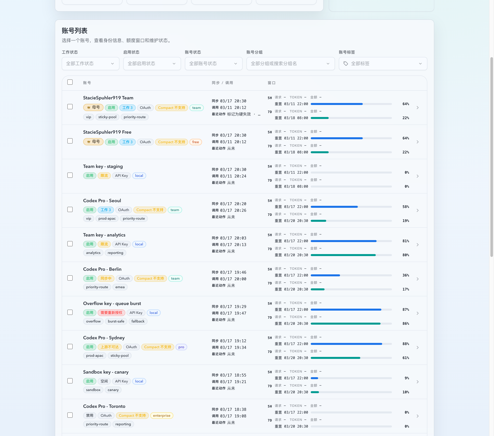
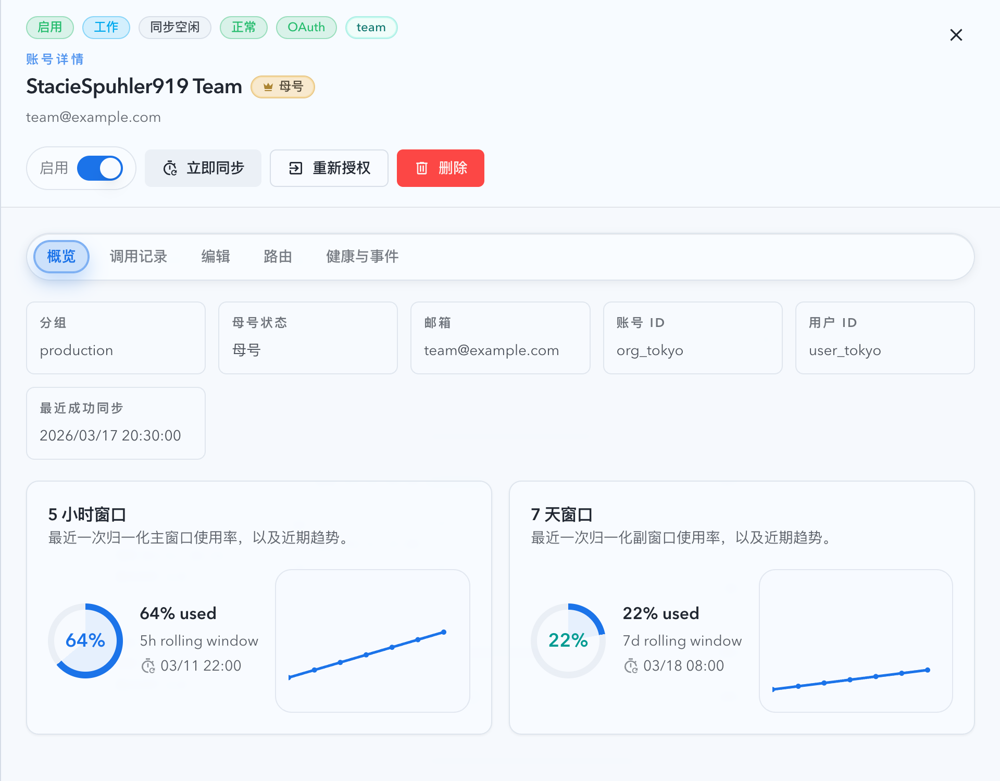

# 不同计划 OAuth 账号共存时取消重复 warning（#96qgn）

## 状态

- Status: 已实现，待截图提交授权 / PR 收敛
- Created: 2026-04-04
- Last: 2026-04-04

## 背景 / 问题陈述

- 当前 OAuth 重复账号 warning 只要命中相同 `chatgptAccountId` 或 `chatgptUserId` 就会触发，实际没有把“有效计划类型不同”的共存语义完整纳入判定。
- 现网允许个人号与团队号同时存在、独立计费；这类账号共享上游身份并不代表运营层面的“重复账号”。
- 结果是 roster、详情抽屉与创建完成态会把 `team` 与 `free/pro` 的组合误标成“重复账号”，干扰运营判断。

## 目标 / 非目标

### Goals

- 将 OAuth `duplicateInfo` 的判定收敛为“只在同有效计划类型内告警”。
- 对 `sharedChatgptAccountId` 与 `sharedChatgptUserId` 两类原因统一使用同一套计划类型口径。
- 保持 `duplicateInfo` shape、前端展示组件与文案体系不变，只修正何时返回 warning。
- 用 Rust 回归、前端测试与 Storybook 固定 mixed-plan 共存无 warning 的行为。

### Non-goals

- 不改变 API Key 账号逻辑。
- 不新增新的 duplicate reason、计划类型分类枚举或前端 heuristic。
- 不放宽计划类型未知账号的告警；未知仍按保守策略继续 warning。

## 范围（Scope）

### In scope

- `src/upstream_accounts/mod.rs`
- `web/src/components/UpstreamAccountsTable.test.tsx`
- `web/src/components/UpstreamAccountsPage.story-helpers.tsx`
- `web/src/components/UpstreamAccountsPage.list.stories.tsx`
- `web/src/pages/account-pool/UpstreamAccounts.test.tsx`
- `web/src/pages/account-pool/UpstreamAccountCreate.test.tsx`
- `docs/specs/96qgn-oauth-mixed-plan-duplicate-warning/SPEC.md`
- `docs/specs/README.md`

### Out of scope

- `displayName` 唯一性规则
- OAuth 导入阶段 `duplicate_in_input` 语义
- 数据库 schema、HTTP 字段 shape 或新筛选器

## 需求（Requirements）

### MUST

- 后端重复判定必须基于现有 effective `plan_type` 链路，比较当前账号与共享身份 peer 的有效计划类型。
- 当两条 OAuth 账号的有效计划类型都已知且不同，例如 `team` 与 `free/pro`，不得返回 `duplicateInfo`，不论命中的是 `sharedChatgptAccountId` 还是 `sharedChatgptUserId`。
- 当两条账号的有效计划类型相同，必须继续返回现有 duplicate warning。
- 当任一侧计划类型未知时，必须继续返回 duplicate warning，保持保守策略。
- roster、详情抽屉、创建完成态都必须复用同一后端结果，前端不得增加临时 mixed-plan 特判。

### SHOULD

- Storybook 提供稳定的 mixed-plan 共存场景，并在 `play` 中断言无 duplicate badge / warning。
- 页面级测试覆盖 roster、detail、create 三处 mixed-plan 无 warning 表现。

## 接口契约

- 复用现有 `GET /api/pool/upstream-accounts`、`GET /api/pool/upstream-accounts/:id` 与 `POST /api/pool/upstream-accounts/oauth/login-sessions/:loginId/complete`。
- `duplicateInfo` shape 不变：仍然只包含 `peerAccountIds` 与 `reasons`。
- 行为变更仅限于：shared identity 仅在“同有效计划类型”或“计划类型未知”的 peer 之间返回 warning。

## 验收标准（Acceptance Criteria）

- Given 两条 OAuth 账号共享 `chatgptAccountId`，且有效计划类型分别为 `team` 与 `pro`，When 读取 summary/detail，Then 两边都不返回 `duplicateInfo`。
- Given 两条 OAuth 账号共享 `chatgptUserId`，且有效计划类型分别为 `team` 与 `free`，When 完成 OAuth 创建或读取 summary/detail，Then 页面不显示 duplicate badge，也不显示 duplicate warning。
- Given 两条 OAuth 账号共享上游身份且有效计划类型相同，When 读取 summary/detail，Then 继续返回现有 `duplicateInfo`。
- Given 任一账号缺少有效计划类型，When 读取 summary/detail，Then 继续返回 duplicate warning。

## 质量门槛（Quality Gates）

- `cargo test mixed_plan_type_accounts_with_shared_account_id_are_not_flagged -- --test-threads=1`
- `cargo test mixed_plan_type_accounts_with_shared_user_id_are_not_flagged -- --test-threads=1`
- `cargo test unknown_plan_type_accounts_with_shared_account_id_remain_flagged -- --test-threads=1`
- `cd web && bun run test -- src/components/UpstreamAccountsTable.test.tsx src/pages/account-pool/UpstreamAccounts.test.tsx src/pages/account-pool/UpstreamAccountCreate.test.tsx`
- `cd web && bun run build-storybook`
- Storybook mock-only 截图 + `chrome-devtools` smoke：确认 mixed-plan 场景只显示计划 badge，不显示“重复账号”。

## 里程碑（Milestones）

- [x] M1: 创建 follow-up spec 并冻结 mixed-plan duplicate 语义。
- [x] M2: 后端按 effective `plan_type` 收敛 shared identity duplicate 判定，并补 Rust 回归。
- [x] M3: 补齐 roster/detail/create 前端回归与 Storybook mixed-plan 场景。
- [x] M4: 完成本地验证与视觉证据采集。
- [ ] M5: 快车道推进到 merge-ready，回填 spec / README 状态。

## Visual Evidence

- 证据来源：`storybook_canvas`
- 资产目录：`./assets/`
- 浏览器 smoke：`chrome-devtools` 打开当前租约 Storybook `http://127.0.0.1:30000`
- 证据绑定要求：若后续继续修改 mixed-plan 场景的列表或详情渲染面，必须重新截图后再进入 PR 路径。

- source_type: storybook_canvas
  target_program: mock-only
  capture_scope: browser-viewport
  sensitive_exclusion: N/A
  submission_gate: pending-owner-approval
  story_id_or_title: Account Pool/Pages/Upstream Accounts/List/Mixed Plan Coexistence
  state: roster
  evidence_note: 验证共享上游身份但计划类型分别为 `team` 与 `free` 的两条 OAuth 账号会并列显示计划 badge，不再渲染“重复账号” badge。
  image:
  

- source_type: storybook_canvas
  target_program: mock-only
  capture_scope: element
  sensitive_exclusion: N/A
  submission_gate: pending-owner-approval
  story_id_or_title: Account Pool/Pages/Upstream Accounts/List/Mixed Plan Coexistence
  state: detail-drawer-open
  evidence_note: 验证 mixed-plan 场景打开 `StacieSpuhler919 Team` 详情抽屉后，仅保留计划 badge 与账号元信息，不再出现 duplicate warning 或 matched reasons。
  image:
  

## 风险 / 假设

- 假设：现有 effective `plan_type` 解析链路已经足够表达“团队号 vs 个人号”判定，不需要新增 taxonomy。
- 风险：若未来同一上游身份允许更多可并存计划组合，而计划字符串语义不稳定，仍需单独扩展比较规则。
- 风险：历史账号若长期缺少有效计划类型，会继续显示 duplicate warning；这是本次刻意保守的策略。

## 变更记录（Change log）

- 2026-04-04: 创建 follow-up spec，冻结“不同有效计划类型的 OAuth 账号不再视为重复”的范围与验收标准。
- 2026-04-04: 后端 duplicate clustering 改为只在“同有效计划类型”或“任一侧计划未知”时保留 `sharedChatgptAccountId` / `sharedChatgptUserId` warning，mixed-plan 已知组合不再告警。
- 2026-04-04: 补齐 Rust mixed-plan / unknown-plan 回归，新增 roster/detail/create 前端测试与 `Mixed Plan Coexistence` Storybook 场景。
- 2026-04-04: 本地验证通过 `cargo fmt`、目标 Rust tests、`cd web && bun run test -- src/components/UpstreamAccountsTable.test.tsx src/pages/account-pool/UpstreamAccounts.test.tsx src/pages/account-pool/UpstreamAccountCreate.test.tsx` 与 `cd web && bun run build-storybook`；mock-only 视觉证据已落盘，截图提交仍待主人授权。
