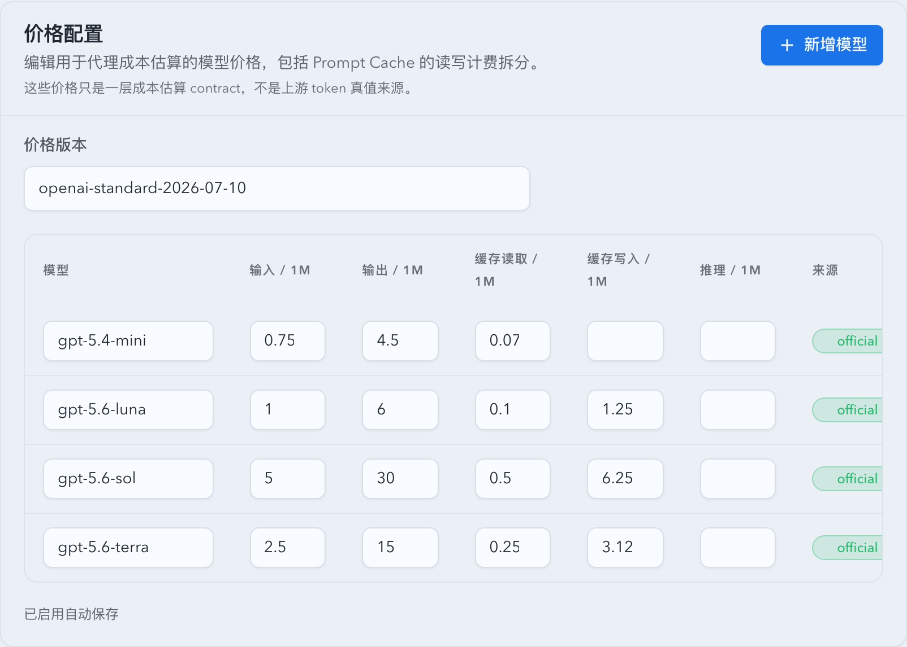
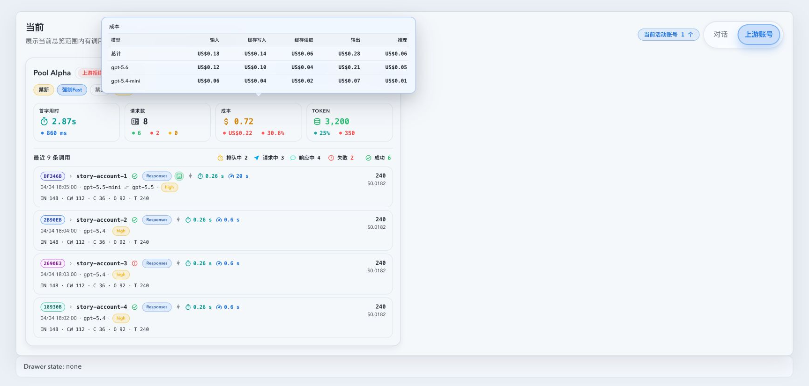
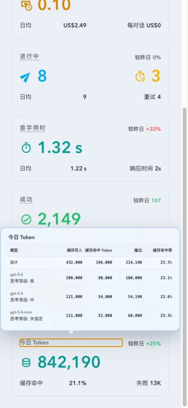
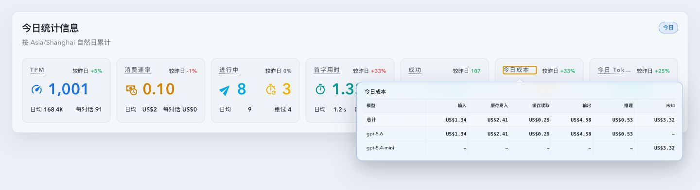
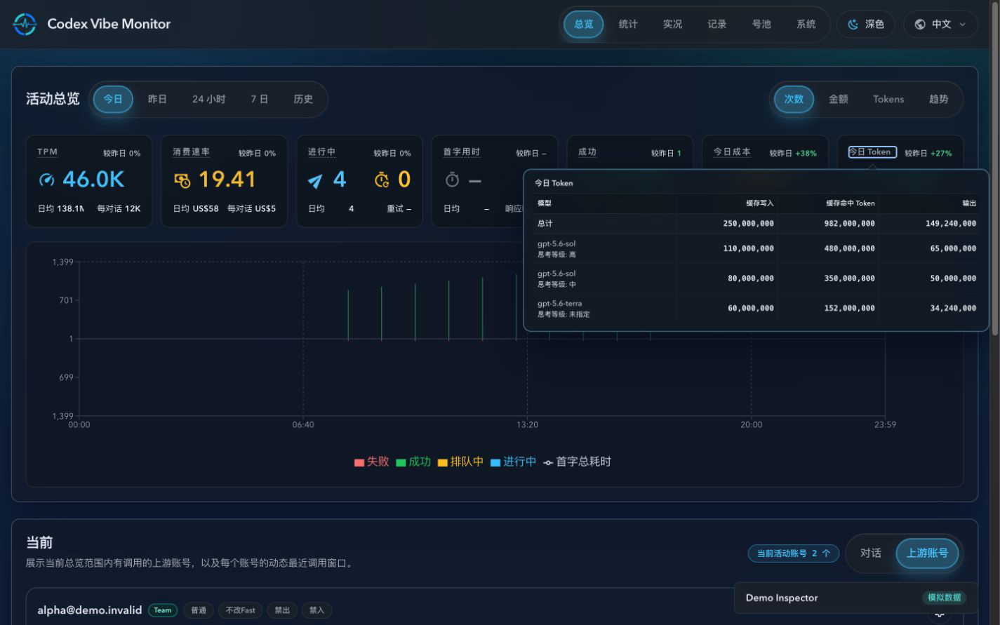
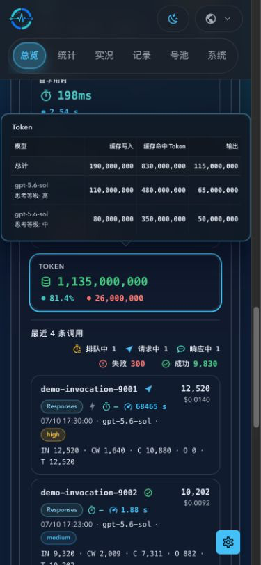

# GPT-5.6 系列定价、缓存写入计费与模型入口支持

Spec ID: 97dds

## Background

The repo-managed pricing catalog, `/v1/models` preset list, and Settings pricing contract currently stop at the GPT-5.5 generation and only model one cached-input price. GPT-5.6 introduces three first-class model ids (`gpt-5.6-sol`, `gpt-5.6-terra`, `gpt-5.6-luna`) plus an explicit cache write price that is distinct from both uncached input and cache read pricing.

The project needs a compatible upgrade that preserves existing user-defined pricing rows and existing API consumers while making GPT-5.6 cost estimation, Settings editing, and operator-facing model selection accurate.

## Goals

- Add first-class support for `gpt-5.6-sol`, `gpt-5.6-terra`, and `gpt-5.6-luna` across the default pricing catalog, proxy preset models, Settings model lists, and `/v1/models` hijack payloads.
- Upgrade the pricing contract to support explicit cache read and cache write unit prices with a compatibility bridge for legacy `cacheInputPer1m`.
- Make `estimate_proxy_cost` bill GPT-5.6 cached tokens with read pricing and uncached prompt tokens with write pricing while keeping legacy-model semantics unchanged.
- Persist the exact input, cache-write, cache-read, output, and reasoning cost buckets for new proxy records, then expose a derived cache-write Token count together with model-level usage and cost breakdowns.
- Replace the remaining `unsupported_model:gpt-5.5` UI special-case with generic `unsupported_model:<model>` handling so newer unsupported models behave correctly without new hardcoding.

## Non-goals

- Do not add online pricing sync or import the full `sub2api` pricing payload.
- Do not invent a generic `gpt-5.6` placeholder model id.
- Do not change legacy model pricing rules except where schema plumbing is required for backward compatibility.

## Requirements

- The repo-managed catalog version must advance to `openai-standard-2026-07-10`.
- The repo-managed catalog must contain:
  - `gpt-5.6-sol`: input `5.0`, output `30.0`, cache read `0.5`, cache write `6.25`
  - `gpt-5.6-terra`: input `2.5`, output `15.0`, cache read `0.25`, cache write `3.125`
  - `gpt-5.6-luna`: input `1.0`, output `6.0`, cache read `0.10`, cache write `1.25`
- `PUT /api/settings/pricing` must accept both legacy `cacheInputPer1m` and the new `cacheReadPer1m` / `cacheWritePer1m` fields.
- `GET /api/settings/pricing` must return the new fields and continue mirroring `cacheInputPer1m` from `cacheReadPer1m` during the compatibility window.
- SQLite persistence must preserve existing pricing rows and backfill read pricing from legacy data without overwriting user-defined values.
- Model resolution must match exact ids first and also map `gpt-5.6-sol|terra|luna-YYYY-MM-DD` to their base model pricing rows.
- Settings pricing UI must split cached pricing into separate cache read and cache write columns and clearly label the contract as estimation metadata rather than runtime token truth.
- New invocation rows must persist exact cost buckets. Historical rows with a known total cost must contribute that full amount to `unknown` instead of being repriced or invalidating exact realtime buckets; rows without a total cost do not fabricate an unknown amount.
- `cacheWriteTokens` must be derived as `max(inputTokens - cacheInputTokens, 0)`; `cacheInputTokens` remains the upstream cache-read count.
- Dashboard summary and upstream-account activity APIs must return total and model-plus-reasoning-effort usage breakdowns. Cost breakdowns include input, cache write, cache read, output, reasoning, and unknown cost, and every returned cost row must reconcile to its total.
- Dashboard and account-card cost/Token labels must provide keyboard-accessible detail panels; records, live cards, and dashboard call previews must display `CW` and `C` together.

## Interface Contract

### Pricing entry shape

The backend and frontend pricing entry contract supports these unit-price fields in USD per one million tokens:

- `inputPer1m`
- `outputPer1m`
- `cacheReadPer1m`
- `cacheWritePer1m`
- `reasoningPer1m`

Legacy `cacheInputPer1m` remains an accepted write alias and a read mirror for `cacheReadPer1m`.

### Storage

`pricing_settings_models` includes both the legacy compatibility column and the new explicit cache columns:

- `cache_input_per_1m REAL NULL`
- `cache_read_per_1m REAL NULL`
- `cache_write_per_1m REAL NULL`

Rows that only have legacy cached-input pricing treat `cache_input_per_1m` as the cache read price.

### Cost estimation

- For entries with explicit `cacheReadPer1m` and `cacheWritePer1m`:
  - `cached_tokens` bill at `cacheReadPer1m`
  - `input_tokens - cached_tokens` bill at `cacheWritePer1m`
- For entries without explicit cache write pricing:
  - keep the existing behavior where uncached input bills at `inputPer1m`
  - cached input bills at the legacy cache read price when present

## Acceptance Criteria

- Given a legacy pricing payload with only `cacheInputPer1m`, when the backend saves and reloads it, then `cacheReadPer1m` matches that value and `cacheInputPer1m` is still mirrored on response.
- Given an existing SQLite database with legacy pricing rows, when the schema upgrade runs, then read pricing is preserved and no existing user-defined row is overwritten.
- Given `model=gpt-5.6-sol`, `input_tokens=1000`, `cached_tokens=400`, and `output_tokens=200`, when cost is estimated, then 600 prompt tokens bill at `6.25 / 1M`, 400 cached tokens bill at `0.5 / 1M`, and 200 output tokens bill at `30 / 1M`.
- Given `gpt-5.6-sol-2026-07-08`, `gpt-5.6-terra-2026-07-08`, or `gpt-5.6-luna-2026-07-08`, when cost is estimated, then the base GPT-5.6 pricing row is used rather than `unknown`.
- Given a legacy model entry that only has cached-input pricing, when cost is estimated, then existing legacy tests continue to use the pre-upgrade uncached-input semantics.
- Given default proxy model settings, when repo-managed defaults are normalized, then the GPT-5.6 model ids appear in preset lists and are appended only for legacy default enabled-model lists.
- Given account tags containing `unsupported_model:gpt-5.6-sol`, when the roster and routing UI render, then the tag behaves like other system unsupported-model tags without GPT-5.5-specific special casing.
- Given a new GPT-5.6 invocation, when its usage is persisted, then its cost buckets sum to `cost`, cache write Token count is non-negative, and the total/model usage breakdowns remain reconcilable.
- Given a historical invocation without persisted cost buckets but with a known total cost, when it appears with exact realtime records, then Token derivation and exact cost buckets remain visible while the historical total is shown in `unknown`.
- Given a record without a total cost, when usage is aggregated, then it contributes no fabricated unknown cost.
- Given an exact-only range, when cost detail is rendered, then the `unknown` value is zero and the UI keeps the five known cost columns.
- Given calls for the same model with different recorded reasoning efforts, when usage is aggregated, then each model-plus-effort pair is returned separately while the total remains reconciled across all pairs.
- Given a missing or blank recorded reasoning effort, when its model row is rendered, then it is labelled as unspecified without inferring a model default.
- Given a Token detail panel, when cache-read Token usage is rendered, then its column is labelled as cache-hit Tokens while the cost panel retains the cache-read billing label.
- Given a dashboard or upstream-account cost/Token label, when it is hovered, focused, or clicked, then total and sorted model detail is readable on desktop and mobile.

## Visual Evidence

PR: include

- source_type: storybook_canvas
- target_program: mock-only
- capture_scope: element
- requested_viewport: desktop1660
- viewport_strategy: storybook-viewport
- sensitive_exclusion: N/A
- submission_gate: approved
- story_id_or_title: Settings/SettingsPage Default
- state: default pricing contract editor
- evidence_note: Verifies the Settings pricing table exposes separate cache read and cache write columns, includes the GPT-5.6 trio, and labels the table as estimation contract metadata rather than runtime token truth.

- source_type: storybook_canvas
- target_program: mock-only
- capture_scope: story canvas
- requested_viewport: desktop default
- viewport_strategy: storybook-viewport
- sensitive_exclusion: N/A
- submission_gate: approved
- story_id_or_title: Dashboard/WorkingConversationsSection Upstream Account Metric Tooltips
- state: cost detail open
- evidence_note: Verifies the cost detail uses one horizontal table with a total row followed by model rows, exposes all five billing buckets, and has no internal scrollbar.

PR: include

- source_type: storybook_canvas
- target_program: mock-only
- capture_scope: full story canvas
- requested_viewport: 390x844
- viewport_strategy: browser-resize-fallback because the direct Storybook iframe does not apply manager viewport parameters
- sensitive_exclusion: N/A
- submission_gate: approved
- story_id_or_title: Dashboard/TodayStatsOverview Usage Breakdown Details
- state: Token detail open with cache hit rate column
- evidence_note: Verifies the five-column Token detail shows cache write, cache-hit Tokens, output, and cache hit rate for total and model rows without an internal scrollbar.

PR: include

- source_type: storybook_canvas
- target_program: mock-only
- capture_scope: browser-viewport
- requested_viewport: 1440x900
- viewport_strategy: devtools-emulate with story-bound desktop viewport
- sensitive_exclusion: N/A
- submission_gate: approved
- story_id_or_title: Dashboard/TodayStatsOverview Mixed Cost Breakdown Unknown Desktop
- state: mixed exact and historical cost detail open
- evidence_note: Verifies exact input, cache-write, cache-read, output, and reasoning amounts remain visible while historical total cost is reconciled in the dynamic unknown column.

PR: include

- source_type: storybook_canvas
- target_program: mock-only
- capture_scope: browser-viewport
- requested_viewport: 390x844
- viewport_strategy: devtools-emulate with story-bound mobile viewport
- sensitive_exclusion: N/A
- submission_gate: approved
- story_id_or_title: Dashboard/TodayStatsOverview Mixed Cost Breakdown Unknown Mobile
- state: mixed exact and historical cost detail open
- evidence_note: Verifies the dynamic six-column cost table remains legible on a narrow viewport with explicit cell dividers and no internal scrollbar.

PR: include

- source_type: ui_demo
- target_program: mock-only Web Demo
- capture_scope: browser viewport
- requested_viewport: 1440x900
- viewport_strategy: browser viewport capability
- sensitive_exclusion: N/A
- submission_gate: approved
- story_id_or_title: `/#/dashboard?demoScene=operational&demoTheme=dark`
- state: Dashboard Token detail open with high, medium, and unspecified reasoning-effort rows
- evidence_note: Verifies model-plus-effort rows use a two-line first cell, the Token table calls `cacheReadTokens` cache-hit Tokens, and the full table renders without an internal scrollbar.

PR: include

- source_type: ui_demo
- target_program: mock-only Web Demo
- capture_scope: browser viewport
- requested_viewport: 390x844
- viewport_strategy: browser viewport capability
- sensitive_exclusion: N/A
- submission_gate: approved
- story_id_or_title: `/#/dashboard?demoScene=operational&demoTheme=dark`
- state: Upstream-account Token detail open with high and medium reasoning-effort rows
- evidence_note: Verifies the narrow layout preserves all Token columns and model-plus-effort rows without an internal or page-level horizontal scrollbar.

## References

- OpenAI pricing announcement and API pricing pages published on 2026-07-08.
- `docs/archive/specs/7272y-gpt-5-4-pricing/SPEC.md`
- `docs/archive/specs/47ran-pool-models-override-gpt55-pricing/SPEC.md`
