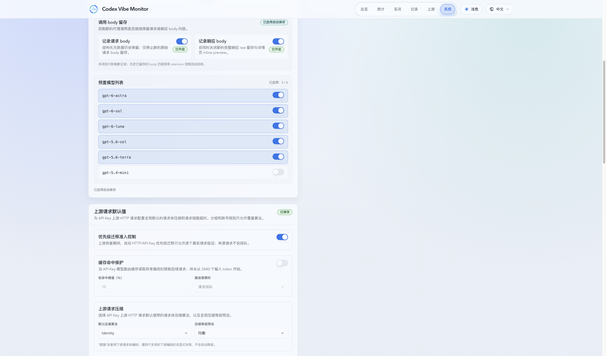
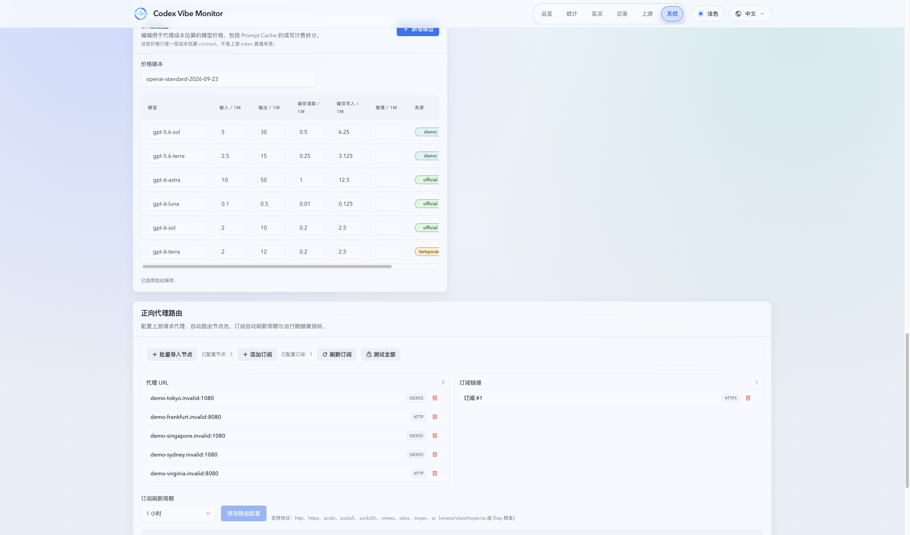
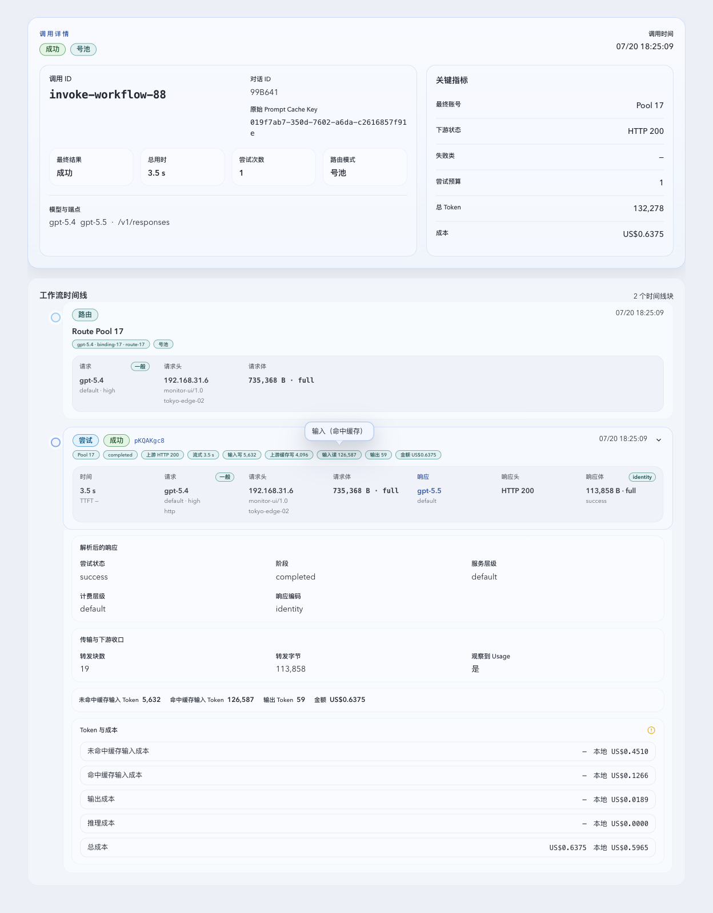
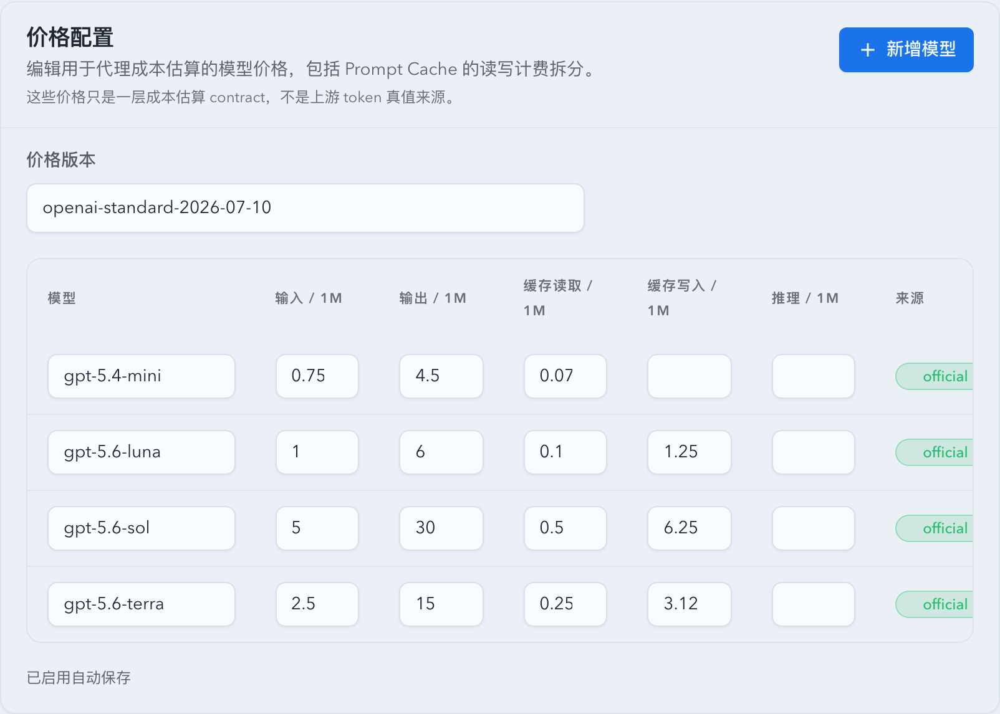
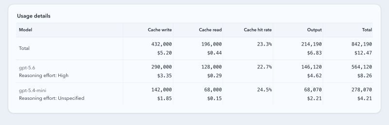
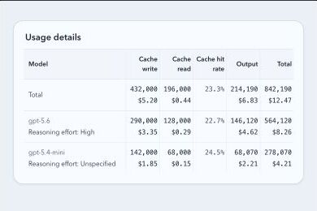

# OpenAI GPT-5.6 与 GPT-6 定价、缓存计费和模型入口支持

Spec ID: 97dds

## Context and Scope

This topic formally supports the OpenAI GPT-6 Astra, Sol, and Luna models across pricing, proxy discovery, persisted usage, invocation APIs, operator-facing identity, and usage presentation. It preserves established GPT-5.6 behavior, user-edited pricing, and historical recorded-cost truth. GPT-6 Terra remains compatibility-only. Online price synchronization, unsupported billing-tier estimation, and local request-capability validation are outside this contract.

## Background

The project already supports GPT-5.6 pricing and model surfaces, and has temporary GPT-6 Sol/Terra/Luna pricing rows copied from GPT-5.6. Those temporary rows do not represent the official GPT-6 lineup or rates. Formal GPT-6 support adds the official model IDs `gpt-6-astra`, `gpt-6-sol`, and `gpt-6-luna`, with OpenAI's Standard short- and long-context prices and its explicit cache-write usage category.

The project needs to preserve existing user-defined pricing, API compatibility, and historical cost truth while making GPT-6 cost estimation, Settings editing, routing selection, model discovery, and operator-facing model identity accurate.

## GPT-6 官方模型、定价与在线成本修复

The official GPT-6 model IDs are `gpt-6-astra`, `gpt-6-sol`, and `gpt-6-luna`.
OpenAI's Standard prices, in USD per one million Tokens, are:

| Model         | Context                     | Input | Cache read | Cache write | Output |
| ------------- | --------------------------- | ----: | ---------: | ----------: | -----: |
| `gpt-6-astra` | Up to 272K input Tokens     | 10.00 |       1.00 |       12.50 |  50.00 |
| `gpt-6-astra` | More than 272K input Tokens | 20.00 |       2.00 |       25.00 |  75.00 |
| `gpt-6-sol`   | Up to 272K input Tokens     |  2.00 |       0.20 |        2.50 |  10.00 |
| `gpt-6-sol`   | More than 272K input Tokens |  4.00 |       0.40 |        5.00 |  15.00 |
| `gpt-6-luna`  | Up to 272K input Tokens     |  0.10 |       0.01 |       0.125 |   0.50 |
| `gpt-6-luna`  | More than 272K input Tokens |  0.20 |       0.02 |        0.25 |   0.75 |

The price snapshot version is `openai-standard-2026-09-23`. OpenAI's API pricing
documentation is authoritative. Sub2API's bundled pricing JSON is a local
LiteLLM mirror/fallback, but the snapshot checked for this decision contains no
`gpt-6-astra`, `gpt-6-sol`, or `gpt-6-luna` entries. It cannot independently
cross-check these prices and is not imported or synchronized. The prior temporary
`gpt-6-terra` row remains available for compatibility and manual use, but is not
an official GPT-6 preset or discovery entry. Only unchanged temporary GPT-6
Sol/Luna seed rows may be refreshed in place; custom catalogs, edited rows,
other model rows, and historical persisted costs remain unchanged.

GPT-6 requests over 272,000 input Tokens use the listed long-context rates for
the entire request. When usage reports an explicit cache-write count, cost
estimation separates ordinary input, cache reads, and cache writes. When that
field is absent, the estimator retains the existing inference that all input
Tokens not reported as cache reads were cache writes; that inferred count is an
estimate, not upstream usage truth. Reasoning Tokens use the model's output
price, with no separate GPT-6 reasoning rate.

An absent or `standard` actual billing tier uses Standard rates. OpenAI accepts
request-level `fast` or `priority` for Fast mode and currently reports the
actual Fast mode response tier as `priority`; that actual tier uses the known
2x multiplier. Explicit Batch, Flex, regional-processing, or otherwise
unsupported actual billing tiers produce unknown cost rather than falling back
to Standard. Request-only tier hints do not change the applied price.

Exact model IDs and calendar-valid `-YYYY-MM-DD` aliases use the matching base
row. Invalid dates, preview variants, unknown variants, and IDs without a
supported pricing row remain unpriced.

Online cost repair is a bounded, resumable SQLite maintenance operation. It
selects only terminal proxy rows with billable usage and a null persisted cost,
writes only successfully estimated cost fields, and refreshes affected hourly
rollups in the same batch transaction. Existing non-null cost, price-version,
bucket, and payload values are immutable. Unpriced rows remain untouched, and
archive files and archive-derived aggregates are outside this operation.
The existing System Tasks audit records the catalog and attempt versions,
scan/update/skip counters, cursor, and drained-or-continuing state.

## Goals

- Retain existing GPT-5.6 behavior and add first-class support for `gpt-6-astra`, `gpt-6-sol`, and `gpt-6-luna` across the default pricing catalog, proxy presets, Settings and routing model lists, structured model display, and `/v1/models` payloads.
- Upgrade the pricing contract to support explicit cache read and cache write unit prices with a compatibility bridge for legacy `cacheInputPer1m`.
- Make `estimate_proxy_cost` separate ordinary input, cache-read, and cache-write Tokens when upstream reports exact cache-write usage, while retaining legacy inference when it does not.
- Persist reconciled input, cache-write, cache-read, output, and reasoning cost buckets for new proxy records, then expose cache-write Token usage and model-level usage/cost breakdowns.
- Replace the remaining `unsupported_model:gpt-5.5` UI special-case with generic `unsupported_model:<model>` handling so newer unsupported models behave correctly without new hardcoding.

## Non-goals

- Do not add online pricing sync or import the full `sub2api` pricing payload.
- Do not promote the temporary `gpt-6-terra` compatibility row into the official model list or invent a generic `gpt-6` placeholder model id.
- Do not locally validate model-specific request parameter capabilities; upstream validation errors remain authoritative.
- Do not change legacy model pricing rules except where schema plumbing is required for backward compatibility.

## Requirements

- `REQ-PRICE-CATALOG`: The repo-managed catalog version must advance to `openai-standard-2026-09-23`, with prices recorded in USD per one million Tokens and OpenAI's API pricing documentation treated as authoritative.
- The GPT-5.6 rows retain their existing rates:
  - `gpt-5.6-sol`: input `5.0`, output `30.0`, cache read `0.5`, cache write `6.25`
  - `gpt-5.6-terra`: input `2.0`, output `12.0`, cache read `0.20`, cache write `2.5`
  - `gpt-5.6-luna`: input `0.20`, output `1.20`, cache read `0.02`, cache write `0.25`
- `REQ-GPT6-PRICES`: The repo-managed catalog must contain:
  - `gpt-6-astra`: Standard short-context input `10.0`, output `50.0`, cache read `1.0`, cache write `12.5`
  - `gpt-6-sol`: Standard short-context input `2.0`, output `10.0`, cache read `0.20`, cache write `2.5`
  - `gpt-6-luna`: Standard short-context input `0.10`, output `0.50`, cache read `0.01`, cache write `0.125`
- `REQ-GPT6-BILLING`: For requests with more than `272000` input Tokens, use GPT-6 input, cache-read, and cache-write rates at `2x` short-context rates and output rates at `1.5x` short-context rates. Missing or explicit `standard` actual billing tier uses Standard rates. Actual `priority` (the current Fast mode response label) and any explicit actual `fast` tier use their supported `2x` multiplier. Explicit actual Batch, Flex, regional, or otherwise unsupported billing tier yields unknown cost; it must not silently use Standard rates. Request-only tier hints do not promote billing. GPT-6 reasoning Tokens are priced at the model output rate; no separate GPT-6 reasoning rate is added.
- `REQ-TERRA-COMPAT`: Existing temporary `gpt-6-terra` pricing remains compatibility-only and is excluded from official proxy presets, Settings/routing discovery, and `/v1/models` model listings. During this catalog revision, only unchanged repo-managed temporary `gpt-6-sol` and `gpt-6-luna` rows with `source=temporary` and all four prior unit prices intact may be refreshed in place. Add the missing `gpt-6-astra` row idempotently. Preserve edited rows, custom catalogs, all unrelated rows, and historical non-null costs.
- `REQ-PRICING-API`: `PUT /api/settings/pricing` must accept both legacy `cacheInputPer1m` and the new `cacheReadPer1m` / `cacheWritePer1m` fields. `GET /api/settings/pricing` must return the new fields and continue mirroring `cacheInputPer1m` from `cacheReadPer1m` during the compatibility window. SQLite persistence must preserve existing pricing rows and backfill read pricing from legacy data without overwriting user-defined values.
- `REQ-MODEL-ALIASES`: Model resolution must match exact supported IDs first and map calendar-valid `-YYYY-MM-DD` aliases for rows that exist to their base pricing rows. Invalid dates, unknown/preview variants, and IDs without a pricing row remain unpriced.
- `REQ-SETTINGS-PRICING`: Settings pricing UI must split cached pricing into separate cache read and cache write columns and clearly label the contract as estimation metadata rather than runtime token truth.
- `REQ-MODEL-IDENTITY`: Structured read-only model fields must recognize and distinguish the official GPT-6 IDs while retaining their complete IDs in tooltips and accessible names. Existing GPT-5.6 icon identities remain unchanged. Editors, filters, selectors, and raw payload viewers keep the original text.
- `REQ-COST-BUCKETS`: New invocation rows must persist exact cost buckets. Historical rows with a known total cost must contribute that full amount to `unknown` instead of being repriced or invalidating exact realtime buckets; rows without a total cost do not fabricate an unknown amount.
- `REQ-CACHE-WRITE-FALLBACK`: When exact upstream cache-write usage exists, retain that count (including a reported zero). Otherwise, preserve the legacy inferred value `max(inputTokens - cacheInputTokens, 0)` and identify it as inferred rather than upstream-reported. `cacheInputTokens` remains the upstream cache-read count.
- `REQ-REPORTED-CACHE-WRITE`: Read exact cache-write usage from `usage.input_tokens_details.cache_write_tokens`. Persist it separately in nullable `reported_cache_write_tokens` and expose nullable `reportedCacheWriteTokens` in invocation detail/API data. Keep existing `cacheWriteTokens` and aggregate Usage details unchanged as the total non-cache input amount. Older invocation rows and archive files do not receive fabricated exact counts.
- `REQ-COST-AUDIT`: Records-side cost truth remains the persisted `cost`. `/api/invocations` may additionally return a `costAudit` comparison object that recomputes cost from the current pricing catalog, but that local recomputation is advisory only and never rewrites the recorded amount.
- `REQ-COST-TOLERANCE`: Cost mismatch warnings use an absolute tolerance of `0.000001 USD`. Differences less than or equal to that threshold are treated as matching even if displayed rounding differs.
- `REQ-HISTORIC-BUCKETS`: When a record only has a persisted total cost and lacks persisted bucket costs, the audit may compare recorded-vs-local totals, but the recorded bucket cells must stay unavailable instead of inventing split amounts.
- `REQ-WORKFLOW-AUDIT`: Workflow attempt usage audits may expose both recorded and local bucket totals for the final successful attempt, but missing reasoning Tokens stay `null`; only an actually recorded zero may render as `0`.
- `REQ-USAGE-AGGREGATES`: Dashboard summary and upstream-account activity APIs must return total and model-plus-reasoning-effort usage breakdowns. Cost breakdowns include input, cache write, cache read, output, reasoning, and unknown cost, and every returned cost row must reconcile to its total.
- `REQ-USAGE-DETAILS`: Dashboard and account-card cost/Token labels must open the same keyboard-accessible `Usage details` table. Its fixed columns are model, cache write, cache read, cache hit rate, output, and total; cache write/read/output/total show Tokens then amount, while cache hit rate stays a single first-line value with an empty second-line placeholder. Records, live cards, and dashboard call previews must display `CW` and `C` together.

## Interface Contract

### Pricing entry shape

The backend and frontend pricing entry contract supports these unit-price fields in USD per one million tokens:

- `inputPer1m`
- `outputPer1m`
- `cacheReadPer1m`
- `cacheWritePer1m`
- `reasoningPer1m`

Legacy `cacheInputPer1m` remains an accepted write alias and a read mirror for `cacheReadPer1m`.

### Storage

`pricing_settings_models` includes both the legacy compatibility column and the new explicit cache columns:

- `cache_input_per_1m REAL NULL`
- `cache_read_per_1m REAL NULL`
- `cache_write_per_1m REAL NULL`

Rows that only have legacy cached-input pricing treat `cache_input_per_1m` as the cache read price.

### Reported cache-write usage storage

The canonical upstream usage field is `usage.input_tokens_details.cache_write_tokens`. The live `codex_invocations` table and newly written invocation archives store its exact value in nullable `reported_cache_write_tokens`; the invocation API exposes it as nullable `reportedCacheWriteTokens`. Existing `cacheWriteTokens` remains the derived total non-cache input amount used by current Usage details and aggregate projections. Existing rows and legacy archives remain `NULL` for the reported field; there is no historical exact-usage backfill.

### Cost estimation

- For a supported model with an exact upstream cache-write count:
  - ordinary input Tokens are `max(inputTokens - cacheReadTokens - cacheWriteTokens, 0)` and bill at `inputPer1m`
  - cache-read Tokens bill at `cacheReadPer1m`
  - cache-write Tokens bill at `cacheWritePer1m`
- When the upstream cache-write field is absent, including when the field is not reported at all, retain the legacy estimate `max(inputTokens - cacheReadTokens, 0)` as inferred cache-write usage and price it at `cacheWritePer1m`. This fallback is explicitly estimated; it is not reported as exact upstream usage.
- A reported cache-write value of zero is present usage and must not trigger the missing-field fallback.
- Entries without explicit cache-write pricing retain existing semantics: ordinary input bills at `inputPer1m`, and cached input bills at the legacy cache-read price when present.
- GPT-6 reasoning Tokens bill at the same output rate as other output Tokens.
- If input usage exceeds `272000` Tokens, use GPT-6 long-context input, cache-read, and cache-write rates for all corresponding Tokens in the request and the long-context output rate for output/reasoning Tokens.
- Apply `2x` to the applicable Standard rates only when actual billing metadata reports `priority` (OpenAI's current Fast mode response label) or an actual `fast` tier. Missing/`standard` tier uses Standard. Explicit unsupported actual Batch, Flex, regional, or unknown tiers produce unknown cost and retain the usage and tier metadata without a Standard fallback. Request-level `fast`/`priority` hints alone do not select a higher rate.
- If any required model price or actual billing tier is unsupported, cost is unknown rather than partially estimated with an unrelated/default price.

## Acceptance Criteria

- Given a legacy pricing payload with only `cacheInputPer1m`, when the backend saves and reloads it, then `cacheReadPer1m` matches that value and `cacheInputPer1m` is still mirrored on response.
- Given an existing SQLite database with legacy pricing rows, when the schema upgrade runs, then read pricing is preserved and no existing user-defined row is overwritten.
- Given a new SQLite database, when the default catalog is loaded, then its version is `openai-standard-2026-09-23`, the GPT-5.6 rates remain unchanged, and the three GPT-6 Standard short-context prices match the table above.
- Given a repo-managed catalog at `openai-standard-2026-09-20` with unchanged temporary official GPT-6 Sol/Luna rows, when startup loads the catalog, then only those two rows are refreshed and Astra is inserted idempotently; edited rows, the temporary Terra row, unrelated rows, and custom catalogs remain unchanged.
- Given an upstream cache-write field with the value `0`, when cost is estimated, then zero is treated as exact usage and is not replaced by the inferred fallback.
- Given `model=gpt-6-astra`, `input_tokens=1000`, `cache_read_tokens=400`, `cache_write_tokens=200`, and `output_tokens=200`, when cost is estimated at the short-context Standard tier, then 400 ordinary input Tokens bill at `10 / 1M`, 400 cache-read Tokens at `1 / 1M`, 200 cache-write Tokens at `12.5 / 1M`, and 200 output Tokens at `50 / 1M`, reconciling to `$0.0169`.
- Given `model=gpt-6-astra`, `input_tokens=1000`, and `cache_read_tokens=400` with no upstream cache-write field, when cost is estimated, then 600 Tokens are represented as inferred cache writes and no exact upstream cache-write count is claimed.
- Given a GPT-6 invocation with more than `272000` input Tokens, when cost is estimated, then input/cache rates are twice and output/reasoning rates are 1.5 times their Standard short-context rates.
- Given an absent or `standard` actual service tier, when a supported GPT-6 invocation is estimated, then Standard rates apply; given actual `priority` (OpenAI's current Fast mode response label) or an actual `fast` tier, then the known `2x` multiplier applies. Request-level `fast`/`priority` alone does not promote cost.
- Given explicit actual Batch, Flex, regional, or another unsupported billing tier, when cost is estimated, then cost remains unknown and is not silently calculated at Standard rates; request-only tier hints do not override actual or missing billing metadata.
- Given a GPT-6 invocation with reasoning Tokens, when cost is estimated, then those Tokens use the output rate without a separate reasoning-price row.
- Given `gpt-6-astra-2026-09-23`, `gpt-6-sol-2026-09-23`, or `gpt-6-luna-2026-09-23`, when cost is estimated, then the matching base pricing row is used rather than `unknown`.
- Given an invalid GPT-6 date suffix such as `gpt-6-sol-2026-99-99` or a preview variant such as `gpt-6-astra-preview`, when cost is estimated, then the model remains unpriced.
- Given a repo-managed catalog containing temporary `gpt-6-terra`, when official GPT-6 preset and `/v1/models` lists are generated, then Terra remains excluded while direct compatibility pricing remains intact.
- Given a GPT-6 model that rejects a request parameter, when the proxy forwards it, then this project does not perform model-specific capability validation and upstream validation remains authoritative.
- Given non-null historical invocation costs, custom pricing rows, or manually edited GPT-6 seed rows, when the catalog snapshot advances, then those values remain unchanged.
- Given the pricing catalog is reviewed against Sub2API, when no corresponding GPT-6 row or matching source rate exists there, then OpenAI's official price remains authoritative and no Sub2API placeholder is imported.
- Given a repo-managed prior catalog and unchanged official GPT-5.6 Terra or Luna rows, when the catalog refreshes, then the existing narrowly scoped GPT-5.6 migration rule applies only to matching rows; changed rows, non-official rows, and custom catalogs remain untouched.
- Given a new GPT-5.6 Terra or Luna invocation, when cost is estimated, then its cache read, cache write, and output buckets use the existing unit prices; existing invocation costs remain persisted truth and are never recomputed or rewritten.
- Given `model=gpt-5.6-sol`, `input_tokens=1000`, `cached_tokens=400`, no exact cache-write field, and `output_tokens=200`, when cost is estimated, then the legacy fallback treats 600 prompt Tokens as inferred cache writes at `6.25 / 1M`, 400 cached Tokens bill at `0.5 / 1M`, and 200 output Tokens at `30 / 1M`.
- Given `gpt-5.6-sol-2026-07-08`, `gpt-5.6-terra-2026-07-08`, or `gpt-5.6-luna-2026-07-08`, when cost is estimated, then the base GPT-5.6 pricing row is used rather than `unknown`.
- Given an invalid date suffix such as `gpt-6-terra-2026-99-99` or a preview variant such as `gpt-6-terra-preview`, when cost is estimated, then the model remains unpriced.
- Given a legacy model entry that only has cached-input pricing, when cost is estimated, then existing legacy tests continue to use the pre-upgrade uncached-input semantics.
- Given default proxy model settings, when repo-managed defaults are normalized, then the three official GPT-6 models and existing GPT-5.6 model IDs appear in the appropriate preset/settings/routing and `/v1/models` lists; temporary GPT-6 Terra is excluded from official discovery.
- Given account tags containing `unsupported_model:gpt-5.6-sol` or `unsupported_model:gpt-6-astra`, when the roster and routing UI render, then the tag behaves like other system unsupported-model tags without GPT-5.5-specific special casing.
- Given a new GPT-5.6 invocation, when its usage is persisted, then its cost buckets sum to `cost`, cache write Token count is non-negative, and the total/model usage breakdowns remain reconcilable.
- Given a historical invocation without persisted cost buckets but with a known total cost, when it appears with exact realtime records, then Token derivation and exact cost buckets remain visible while the historical total is shown in `unknown`.
- Given a record without a total cost, when usage is aggregated, then it contributes no fabricated unknown cost.
- Given an exact-only range, when the unified usage detail is rendered, then cache-write amount equals input plus cache-write cost, cache-read amount equals cache-read cost, output amount equals output plus reasoning cost, and the total amount includes all known cost buckets.
- Given calls for the same model with different recorded reasoning efforts, when usage is aggregated, then each model-plus-effort pair is returned separately while the total remains reconciled across all pairs.
- Given a missing or blank recorded reasoning effort, when its model row is rendered, then it is labelled as unspecified without inferring a model default.
- Given a historical invocation without cost buckets but with a known total cost, when unified usage detail is rendered, then cache write, cache read, and output amounts are unavailable while the total amount retains the known historical cost.
- Given a range without any cost, when unified usage detail is rendered, then every amount is unavailable without fabricating a cost.
- Given a dashboard or upstream-account cost/Token label, when it is hovered, focused, or clicked, then it opens the same titled table with total first and sorted model-plus-effort rows, readable at desktop and 390px without horizontal scrolling.
- Given a record with both persisted `cost` and a locally recomputed total, when their absolute difference is greater than `0.000001 USD`, then the audit flags `mismatch=true`; if the recorded and local `priceVersion` differ, the reason is `price_version_changed`, otherwise the reason is `total_mismatch`.
- Given a workflow attempt usage audit where `reasoningTokens` were never recorded, when the response audit object is rendered, then reasoning stays `null` / `—`; given a real recorded zero, when the same response audit object is rendered, then reasoning remains `0`.
- Given a structured read-only field for any supported GPT-5.6 or official GPT-6 base/date-suffixed model, when it renders, then it distinguishes the model identity and retains the complete model ID in its tooltip and accessible name; given another or unknown model, then the existing text fallback remains visible.
- Given a structured read-only GPT-5.6 invocation card with model identity, reasoning effort, and FAST metadata, when it renders, then those three values appear in one reusable grouped cluster with a fixed 20px model segment, one reasoning-effort marker, and 4px spacing between model, marker, effort, and FAST; `max` and `ultra` use the error marker tone while other levels retain their existing tones, internal vertical separators are absent, and non-GPT-5.6, routing-mismatch, editor/filter/selector, and raw payload views retain their existing rendering.
- Given a structured GPT-5.6 invocation with missing, blank, or formatted-em-dash reasoning effort, when its grouped Dashboard context renders, then the reasoning marker and effort text are omitted without displaying a placeholder, while the model identity and FAST accessible semantics remain available.

## Verification

- `VER-PRICING` covers: `REQ-PRICE-CATALOG`, `REQ-GPT6-PRICES`, `REQ-GPT6-BILLING`, `REQ-TERRA-COMPAT`, and `REQ-MODEL-ALIASES`. Fixed pricing fixtures and Rust tests verify short/long context boundaries, Standard and Fast tier handling, unsupported-tier unknown costs, seed idempotence, edit preservation, and dated aliases.
- `VER-PRICING-API` covers: `REQ-PRICING-API`. Pricing API contract and SQLite tests verify legacy aliases, explicit cache prices, and preservation of user-defined values.
- `VER-MODEL-UI` covers: `REQ-SETTINGS-PRICING` and `REQ-MODEL-IDENTITY`. Web selector/identity tests and owner-approved mock captures verify official model visibility, compatibility-only Terra behavior, accessible identity, and exact price display.
- `VER-USAGE-API` covers: `REQ-COST-BUCKETS`, `REQ-CACHE-WRITE-FALLBACK`, `REQ-REPORTED-CACHE-WRITE`, `REQ-COST-AUDIT`, `REQ-COST-TOLERANCE`, `REQ-HISTORIC-BUCKETS`, and `REQ-WORKFLOW-AUDIT`. Usage fixtures, invocation API tests, SQLite tests, and legacy archive tests verify exact nullable usage, estimates, audit immutability, historical compatibility, and cost reconciliation.
- `VER-USAGE-UI` covers: `REQ-USAGE-AGGREGATES` and `REQ-USAGE-DETAILS`. Web unit tests and deterministic mock UI evidence verify reconciled breakdowns, unchanged aggregate semantics, and exact reported cache-write presentation.

## Visual Evidence

The GPT-6 evidence below records the owner-confirmed formal-model selector, pricing table, and exact cache-write invocation detail. The remaining entries document previously completed GPT-5.6 UI work.

- source_type: ui_demo
- target_program: mock-only
- capture_scope: viewport
- requested_viewport: desktop
- viewport_strategy: ui-demo source viewport
- sensitive_exclusion: N/A
- submission_gate: approved
- story_id_or_title: System Settings model selector
- state: official Astra, Sol, and Luna choices with compatibility-only Terra excluded
- evidence_note: Owner-confirmed capture verifies that the official GPT-6 trio is selectable while GPT-6 Terra remains absent from official model choices.

- source_type: ui_demo
- target_program: mock-only
- capture_scope: viewport
- requested_viewport: desktop
- viewport_strategy: ui-demo source viewport
- sensitive_exclusion: N/A
- submission_gate: approved
- story_id_or_title: System Settings pricing table
- state: official GPT-6 rates with compatibility-only Terra pricing row
- evidence_note: Owner-confirmed capture verifies the official Astra/Sol/Luna input, output, cache-read, and cache-write prices, including the full Luna cache-write rate of 0.125, while retaining Terra only as a compatibility row.

- source_type: storybook_canvas
- target_program: mock-only
- capture_scope: story canvas
- requested_viewport: desktop
- viewport_strategy: Storybook viewport
- sensitive_exclusion: N/A
- submission_gate: approved
- story_id_or_title: Invocations/InvocationWorkflowDetailPanel SuccessfulTokenCostAudit
- state: exact upstream-reported cache-write usage alongside legacy uncached input
- evidence_note: Owner-confirmed capture shows `reportedCacheWriteTokens` separately from the existing estimated `cacheWriteTokens` semantics, with the mock upstream-reported value of 4,096 and legacy uncached-input value of 5,632.

- source_type: storybook_canvas
- target_program: mock-only
- capture_scope: element
- requested_viewport: desktop1660
- viewport_strategy: storybook-viewport
- sensitive_exclusion: N/A
- submission_gate: approved
- story_id_or_title: Settings/SettingsPage Default
- state: default pricing contract editor
- evidence_note: Verifies the Settings pricing table exposes separate cache read and cache write columns, includes the GPT-5.6 trio, and labels the table as estimation contract metadata rather than runtime token truth.

- source_type: storybook_canvas
- target_program: mock-only
- capture_scope: story canvas
- requested_viewport: desktop
- viewport_strategy: Storybook canvas
- sensitive_exclusion: N/A
- submission_gate: approved
- story_id_or_title: Dashboard/UsageBreakdownTooltip Exact Costs
- state: exact bucket costs with total and model-plus-effort rows
- evidence_note: Verifies the shared six-column table maps cache write to input plus cache-write cost, output to output plus reasoning cost, shows Tokens and amount in every applicable cell, places total after output, uses normal-weight body values with the same primary foreground for cache hit rate and Token values, and anchors cache hit rate in the first line with a blank second-line slot.

- source_type: storybook_canvas
- target_program: mock-only
- capture_scope: story canvas
- requested_viewport: 390x844
- viewport_strategy: Storybook viewport
- sensitive_exclusion: N/A
- submission_gate: approved
- story_id_or_title: Dashboard/UsageBreakdownTooltip Mobile 390
- state: exact bucket costs at narrow width
- evidence_note: Verifies the same semantic table remains within the 390px canvas without a horizontal scrollbar; model and effort wrap while Token and amount pairs remain aligned, and cache hit rate retains its first-line alignment through its blank second-line slot.

- source_type: storybook_canvas
- target_program: mock-only
- capture_scope: element
- requested_viewport: desktop
- viewport_strategy: storybook-viewport
- margin_policy: require_margin
- evidence_surface: component
- sensitive_exclusion: N/A
- submission_gate: pending-owner-approval
- story_id_or_title: Components/ModelIdentity Sol Terra Luna
- state: GPT-5.6 Sol, Terra, and Luna base model IDs
- evidence_note: Verifies the shared read-only identity renderer maps the three GPT-5.6 models to solar, earth, and lunar icons while preserving the full model IDs in accessible names and tooltips.

- source_type: storybook_canvas
- target_program: mock-only
- capture_scope: element
- requested_viewport: desktop
- viewport_strategy: storybook-viewport
- margin_policy: require_margin
- evidence_surface: component
- sensitive_exclusion: N/A
- submission_gate: pending-owner-approval
- story_id_or_title: Components/ModelIdentity Dated Variant And Fallback
- state: date-suffixed GPT-5.6 alias and unsupported model fallback
- evidence_note: Verifies a date-suffixed GPT-5.6 model inherits the Sol icon and an unsupported model remains visible as its original text.

- source_type: storybook_canvas
- target_program: mock-only
- capture_scope: element
- requested_viewport: desktop1660
- viewport_strategy: storybook-viewport
- margin_policy: require_margin
- evidence_surface: component
- sensitive_exclusion: N/A
- submission_gate: approved
- story_id_or_title: Dashboard/WorkingConversationsSection GPT56ModelContextCluster
- state: GPT-5.6 Sol `max` reasoning with FAST in the `vibe-dark` theme
- evidence_note: Owner-approved component capture. The component keeps its own low-contrast boundary, one error-tone reasoning marker, 4px sibling spacing, and centered model/FAST icons without an additional presentation frame or excess whitespace.

- source_type: storybook_canvas
- target_program: mock-only
- capture_scope: element
- requested_viewport: desktop1660
- viewport_strategy: storybook-viewport
- margin_policy: require_margin
- evidence_surface: component
- sensitive_exclusion: N/A
- submission_gate: approved
- story_id_or_title: Dashboard/WorkingConversationsSection GPT56ModelContextCluster
- state: GPT-5.6 Sol `max` reasoning with FAST in the `vibe-light` theme
- evidence_note: Owner-approved component capture of the same state as the dark-theme evidence. The light theme preserves the same geometry and semantics without a mobile-only rendering difference.

## Related ADRs

- [ADR 0018: OpenAI GPT-6 pricing and usage semantics](../../adr/0018-openai-gpt-6-pricing-and-usage-semantics.md)

## References

- [OpenAI API Pricing](https://developers.openai.com/api/docs/pricing)
- [GPT-6 Astra model](https://developers.openai.com/api/docs/models/gpt-6-astra)
- [GPT-6 Sol model](https://developers.openai.com/api/docs/models/gpt-6-sol)
- [GPT-6 Luna model](https://developers.openai.com/api/docs/models/gpt-6-luna)
- [OpenAI Prompt Caching guide](https://developers.openai.com/api/docs/guides/prompt-caching)
- [OpenAI Fast mode guide](https://developers.openai.com/api/docs/guides/fast-mode)
- [OpenAI Responses API reference](https://developers.openai.com/api/reference/resources/responses/methods/create) (actual `service_tier` response semantics)
- [Sub2API bundled pricing data README](https://github.com/Wei-Shaw/sub2api/blob/main/backend/resources/model-pricing/README.md) (secondary LiteLLM mirror/fallback)
- [Sub2API bundled model pricing JSON](https://github.com/Wei-Shaw/sub2api/blob/main/backend/resources/model-pricing/model_prices_and_context_window.json)
- [LiteLLM upstream model pricing JSON](https://raw.githubusercontent.com/BerriAI/litellm/main/model_prices_and_context_window.json)
- `docs/archive/specs/7272y-gpt-5-4-pricing/SPEC.md`
- `docs/archive/specs/47ran-pool-models-override-gpt55-pricing/SPEC.md`
